# AMPLS Multi-Region Architecture with Precise DNS Forwarding
## Complete End-to-End Design Guide
**Architecture Type:** Multi-Region AMPLS without DNS Resolver + Precise Forwarding

---

## 📚 Table of Contents

- [Executive Summary](#executive-summary)
- [Architecture Overview](#architecture-overview)
- [Complete Component Breakdown](#complete-component-breakdown)
- [DNS Resolution Flow](#dns-resolution-flow)
- [Network Traffic Flow](#network-traffic-flow)
- [Regional Design Details](#regional-design-details)
- [Security Considerations](#security-considerations)
- [Deployment Sequence](#deployment-sequence)
- [Validation and Testing](#validation-and-testing)

---

## Executive Summary

### What This Architecture Provides

```yaml
Solution Overview:
  Purpose: Multi-region Azure Monitor private access with precise DNS forwarding
  Regions: Central India (CI) and South India (SI)
  DNS Strategy: Precise forwarding based on workspace location
  Connectivity: ExpressRoute/VPN from on-premises to Azure
  
Key Components:
  - 2 Log Analytics Workspaces (LAW-CI, LAW-SI)
  - 2 Azure Monitor Private Link Scopes (AMPLS-CI, AMPLS-SI)
  - 2 Sets of Private Endpoints (one per region)
  - 2 Sets of Custom DNS VMs (one per region)
  - 2 Private DNS Zones (one per region)
  - On-premises DNS with precise forwarding rules
```

### Business Benefits

```yaml
Advantages:
  Security: ✅ No public internet access to Azure Monitor
  Performance: ✅ Optimal routing via precise DNS forwarding
  Compliance: ✅ Data stays within Azure backbone
  Cost: ✅ No Azure DNS Private Resolver costs
  Flexibility: ✅ Works with existing DNS infrastructure
```

---

## Architecture Overview

### High-Level Architecture Diagram

```mermaid
graph TB
    subgraph OnPrem["On-Premises Environment"]
        User[👤 User PC]
        OnPremDNS[On-Prem DNS Server<br/>192.168.1.10]
        User --> OnPremDNS
    end
    
    subgraph PreciseForwarding["Precise DNS Forwarding Layer"]
        OnPremDNS -->|SI Workspace Query| ForwardSI[Forward to SI DNS<br/>10.2.0.4, 10.2.0.5]
        OnPremDNS -->|CI Workspace Query| ForwardCI[Forward to CI DNS<br/>10.1.0.4, 10.1.0.5]
    end
    
    subgraph AzureSI["South India (Pune) Region"]
        SIDNS1[SI DNS VM 1<br/>10.2.0.4]
        SIDNS2[SI DNS VM 2<br/>10.2.0.5]
        SIPrivateDNS[SI Private DNS Zone<br/>privatelink.*.opinsights.azure.com]
        SIPE[SI Private Endpoint<br/>10.2.100.50]
        SIAMPLS[AMPLS-SI]
        SILAW[LAW-SI]
        
        ForwardSI --> SIDNS1
        ForwardSI --> SIDNS2
        SIDNS1 --> SIPrivateDNS
        SIDNS2 --> SIPrivateDNS
        SIPrivateDNS --> SIPE
        SIPE --> SIAMPLS
        SIAMPLS --> SILAW
    end
    
    subgraph AzureCI["Central India (Chennai) Region"]
        CIDNS1[CI DNS VM 1<br/>10.1.0.4]
        CIDNS2[CI DNS VM 2<br/>10.1.0.5]
        CIPrivateDNS[CI Private DNS Zone<br/>privatelink.*.opinsights.azure.com]
        CIPE[CI Private Endpoint<br/>10.1.100.50]
        CIAMPLS[AMPLS-CI]
        CILAW[LAW-CI]
        
        ForwardCI --> CIDNS1
        ForwardCI --> CIDNS2
        CIDNS1 --> CIPrivateDNS
        CIDNS2 --> CIPrivateDNS
        CIPrivateDNS --> CIPE
        CIPE --> CIAMPLS
        CIAMPLS --> CILAW
    end
```



### Complete Architecture Diagram (Detailed)

```mermaid
graph TB
    subgraph Internet["Internet / Public Network"]
        PublicAccess[❌ Public Access Blocked]
    end
    
    subgraph Corporate["Corporate Network / On-Premises"]
        Users[👥 Corporate Users]
        ADC[Active Directory<br/>Domain Controllers]
        CorpDNS[Corporate DNS Servers<br/>192.168.1.10-11]
        
        Users --> CorpDNS
        ADC -.DNS Role.- CorpDNS
    end
    
    subgraph Connectivity["Hybrid Connectivity"]
        ER[ExpressRoute /<br/>Site-to-Site VPN]
        CorpDNS -->|Encrypted| ER
    end
    
    subgraph HubCI["Hub VNet - Central India"]
        HubCIVNet[Hub VNet CI<br/>10.0.0.0/16]
        HubCIFW[Azure Firewall /<br/>NVA]
        HubCIGW[VPN/ER Gateway]
        
        ER --> HubCIGW
        HubCIGW --> HubCIFW
    end
    
    subgraph HubSI["Hub VNet - South India"]
        HubSIVNet[Hub VNet SI<br/>10.10.0.0/16]
        HubSIFW[Azure Firewall /<br/>NVA]
        HubSIGW[VPN/ER Gateway]
        
        ER --> HubSIGW
        HubSIGW --> HubSIFW
    end
    
    subgraph SpokeCI["Central India Spoke VNets"]
        SpokeCIVNet[Spoke VNet CI<br/>10.1.0.0/16]
        
        subgraph DNSSubnetCI["DNS Subnet CI"]
            CIDNS1[CI DNS VM 1<br/>10.1.0.4]
            CIDNS2[CI DNS VM 2<br/>10.1.0.5]
        end
        
        subgraph PESubnetCI["Private Endpoint Subnet CI"]
            CIPE[CI Private Endpoint<br/>10.1.100.50<br/>For AMPLS]
        end
        
        subgraph PrivateDNSCI["Private DNS Zones CI"]
            CIDNSZone1[privatelink.monitor.azure.com]
            CIDNSZone2[privatelink.oms.opinsights.azure.com]
            CIDNSZone3[privatelink.ods.opinsights.azure.com]
            CIDNSZone4[privatelink.agentsvc.azure-automation.net]
        end
        
        HubCIFW -->|VNet Peering| SpokeCIVNet
        CIDNS1 --> CIDNSZone1
        CIDNS2 --> CIDNSZone1
        CIDNSZone1 --> CIPE
        CIDNSZone2 --> CIPE
        CIDNSZone3 --> CIPE
        CIDNSZone4 --> CIPE
    end
    
    subgraph SpokeSI["South India Spoke VNets"]
        SpokeSIVNet[Spoke VNet SI<br/>10.2.0.0/16]
        
        subgraph DNSSubnetSI["DNS Subnet SI"]
            SIDNS1[SI DNS VM 1<br/>10.2.0.4]
            SIDNS2[SI DNS VM 2<br/>10.2.0.5]
        end
        
        subgraph PESubnetSI["Private Endpoint Subnet SI"]
            SIPE[SI Private Endpoint<br/>10.2.100.50<br/>For AMPLS]
        end
        
        subgraph PrivateDNSSI["Private DNS Zones SI"]
            SIDNSZone1[privatelink.monitor.azure.com]
            SIDNSZone2[privatelink.oms.opinsights.azure.com]
            SIDNSZone3[privatelink.ods.opinsights.azure.com]
            SIDNSZone4[privatelink.agentsvc.azure-automation.net]
        end
        
        HubSIFW -->|VNet Peering| SpokeSIVNet
        SIDNS1 --> SIDNSZone1
        SIDNS2 --> SIDNSZone1
        SIDNSZone1 --> SIPE
        SIDNSZone2 --> SIPE
        SIDNSZone3 --> SIPE
        SIDNSZone4 --> SIPE
    end
    
    subgraph MonitoringCI["Azure Monitor - Central India"]
        CIAMPLS[AMPLS - Central India]
        CILAW[Log Analytics Workspace<br/>Central India]
        CIAppInsights[Application Insights CI]
        
        CIPE --> CIAMPLS
        CIAMPLS --> CILAW
        CIAMPLS --> CIAppInsights
    end
    
    subgraph MonitoringSI["Azure Monitor - South India"]
        SIAMPLS[AMPLS - South India]
        SILAW[Log Analytics Workspace<br/>South India]
        SIAppInsights[Application Insights SI]
        
        SIPE --> SIAMPLS
        SIAMPLS --> SILAW
        SIAMPLS --> SIAppInsights
    end
    
    HubCIVNet -.Regional Peering.- HubSIVNet
```



---

## Complete Component Breakdown

### 1. On-Premises Components

#### Corporate DNS Servers
```yaml
Component: Corporate DNS Servers
Location: On-Premises Data Center
IP Range: 192.168.1.0/24 (example)
IPs: 192.168.1.10, 192.168.1.11

Purpose:
  - Primary DNS for all corporate users
  - Implements precise forwarding rules
  - Routes Azure Monitor queries to correct regional DNS

Configuration Required:
  - Conditional forwarders per workspace
  - Forward CI workspace → CI Azure DNS (10.1.0.4, 10.1.0.5)
  - Forward SI workspace → SI Azure DNS (10.2.0.4, 10.2.0.5)

High Availability:
  - Minimum 2 DNS servers
  - Active-Active configuration
  - Synchronized forwarding rules
```

#### User Workstations
```yaml
Component: Corporate User PCs
DNS Configuration: Points to 192.168.1.10, 192.168.1.11
Network: Corporate LAN

Access Pattern:
  - Users access Azure Monitor dashboards
  - Queries sent to corporate DNS
  - Corporate DNS forwards to Azure based on workspace
  - Connections made via ExpressRoute/VPN
```

### 2. Hybrid Connectivity

#### ExpressRoute / VPN
```yaml
Component: Hybrid Connectivity
Type: ExpressRoute (recommended) or Site-to-Site VPN
Bandwidth: Minimum 100 Mbps (1 Gbps recommended)

Connections:
  - On-Premises → Hub CI
  - On-Premises → Hub SI
  - Both hubs accessible from corporate network

Purpose:
  - Private connectivity to Azure
  - Carries DNS queries and data traffic
  - Enables access to private endpoints
```

### 3. Azure Hub VNets

#### Central India Hub
```yaml
VNet Name: vnet-hub-ci
Address Space: 10.0.0.0/16
Region: Central India

Subnets:
  - GatewaySubnet: 10.0.0.0/24 (for VPN/ER Gateway)
  - AzureFirewallSubnet: 10.0.1.0/24 (if using Azure Firewall)
  - ManagementSubnet: 10.0.10.0/24

Components:
  - ExpressRoute Gateway or VPN Gateway
  - Azure Firewall / Network Virtual Appliance (optional)
  - Route tables for spoke traffic

Peering:
  - Hub SI (for inter-region connectivity)
  - Spoke CI VNets
```

#### South India Hub
```yaml
VNet Name: vnet-hub-si
Address Space: 10.10.0.0/16
Region: South India

Subnets:
  - GatewaySubnet: 10.10.0.0/24
  - AzureFirewallSubnet: 10.10.1.0/24
  - ManagementSubnet: 10.10.10.0/24

Components:
  - ExpressRoute Gateway or VPN Gateway
  - Azure Firewall / NVA (optional)
  - Route tables

Peering:
  - Hub CI (for inter-region connectivity)
  - Spoke SI VNets
```

### 4. Azure Spoke VNets

#### Central India Spoke
```yaml
VNet Name: vnet-spoke-monitor-ci
Address Space: 10.1.0.0/16
Region: Central India

Subnets:
  DNS Subnet:
    Name: snet-dns-ci
    Range: 10.1.0.0/24
    Components: CI DNS VM 1 (10.1.0.4), CI DNS VM 2 (10.1.0.5)
    
  Private Endpoint Subnet:
    Name: snet-pe-monitor-ci
    Range: 10.1.100.0/24
    Components: CI AMPLS Private Endpoint (10.1.100.50)
    Settings: privateEndpointNetworkPolicies = Disabled
    
  Workload Subnet (optional):
    Name: snet-workloads-ci
    Range: 10.1.10.0/24
    Components: VMs with monitoring agents

VNet Peering:
  - Hub CI (to reach on-premises)

Custom DNS Settings:
  - VNet DNS: 10.1.0.4, 10.1.0.5 (points to own DNS VMs)
```

#### South India Spoke
```yaml
VNet Name: vnet-spoke-monitor-si
Address Space: 10.2.0.0/16
Region: South India

Subnets:
  DNS Subnet:
    Name: snet-dns-si
    Range: 10.2.0.0/24
    Components: SI DNS VM 1 (10.2.0.4), SI DNS VM 2 (10.2.0.5)
    
  Private Endpoint Subnet:
    Name: snet-pe-monitor-si
    Range: 10.2.100.0/24
    Components: SI AMPLS Private Endpoint (10.2.100.50)
    Settings: privateEndpointNetworkPolicies = Disabled
    
  Workload Subnet:
    Name: snet-workloads-si
    Range: 10.2.10.0/24
    Components: VMs with monitoring agents

VNet Peering:
  - Hub SI

Custom DNS Settings:
  - VNet DNS: 10.2.0.4, 10.2.0.5
```

### 5. Custom DNS VMs in Azure

#### Central India DNS VMs
```yaml
VM Name: vm-dns-ci-01, vm-dns-ci-02
Region: Central India
VNet/Subnet: vnet-spoke-monitor-ci / snet-dns-ci
IPs: 10.1.0.4, 10.1.0.5 (Static)
Size: Standard_B2s or Standard_D2s_v3

OS: Windows Server 2022 with DNS role
Purpose:
  - Resolve CI Private DNS Zones
  - Answer queries for CI workspace endpoints
  - NO cross-region forwarding needed (precise forwarding)

DNS Configuration:
  - Install DNS Server role
  - Forwarder: 168.63.129.16 (Azure DNS)
  - No conditional forwarders (zones linked to VNet)

High Availability:
  - 2 VMs for redundancy
  - Same configuration on both
```

#### South India DNS VMs
```yaml
VM Name: vm-dns-si-01, vm-dns-si-02
Region: South India
VNet/Subnet: vnet-spoke-monitor-si / snet-dns-si
IPs: 10.2.0.4, 10.2.0.5 (Static)
Size: Standard_B2s or Standard_D2s_v3

OS: Windows Server 2022 with DNS role
Purpose:
  - Resolve SI Private DNS Zones
  - Answer queries for SI workspace endpoints

DNS Configuration:
  - DNS Server role installed
  - Forwarder: 168.63.129.16
  - No cross-region forwarding
```

### 6. Private DNS Zones

#### Central India Private DNS Zones
```yaml
Resource Group: rg-monitor-ci
Region: Global (linked to CI VNet)

Zones Created:
  1. privatelink.monitor.azure.com
  2. privatelink.oms.opinsights.azure.com
  3. privatelink.ods.opinsights.azure.com
  4. privatelink.agentsvc.azure-automation.net

VNet Links:
  - vnet-spoke-monitor-ci (auto-registration enabled)

DNS Records (auto-created by Private Endpoint):
  - <ci-workspace-id>.oms.opinsights.azure.com → 10.1.100.50
  - <ci-workspace-id>.ods.opinsights.azure.com → 10.1.100.50
  - api.monitor.azure.com → 10.1.100.50
  - (other monitor endpoints)
```

#### South India Private DNS Zones
```yaml
Resource Group: rg-monitor-si
Region: Global (linked to SI VNet)

Zones Created:
  1. privatelink.monitor.azure.com
  2. privatelink.oms.opinsights.azure.com
  3. privatelink.ods.opinsights.azure.com
  4. privatelink.agentsvc.azure-automation.net

VNet Links:
  - vnet-spoke-monitor-si (auto-registration enabled)

DNS Records:
  - <si-workspace-id>.oms.opinsights.azure.com → 10.2.100.50
  - <si-workspace-id>.ods.opinsights.azure.com → 10.2.100.50
  - api.monitor.azure.com → 10.2.100.50
```

### 7. Private Endpoints

#### Central India Private Endpoint
```yaml
Name: pe-ampls-ci
Resource Group: rg-monitor-ci
Region: Central India
VNet/Subnet: vnet-spoke-monitor-ci / snet-pe-monitor-ci
Private IP: 10.1.100.50 (dynamically assigned)

Connected To: AMPLS-CI
Subresource: azuremonitor

Private DNS Zone Group:
  - Linked to all 4 Private DNS Zones in CI
  - Auto-creates A records in zones

Purpose:
  - Entry point for CI workspace access
  - Terminates TLS connections
  - Routes to AMPLS-CI
```

#### South India Private Endpoint
```yaml
Name: pe-ampls-si
Resource Group: rg-monitor-si
Region: South India
VNet/Subnet: vnet-spoke-monitor-si / snet-pe-monitor-si
Private IP: 10.2.100.50

Connected To: AMPLS-SI
Subresource: azuremonitor

Private DNS Zone Group:
  - Linked to all 4 SI Private DNS Zones
  - Auto-registration of A records
```

### 8. Azure Monitor Private Link Scopes (AMPLS)

#### AMPLS - Central India
```yaml
Name: ampls-ci
Resource Group: rg-monitor-ci
Region: Global

Connected Resources:
  - Log Analytics Workspace CI
  - Application Insights CI (if applicable)
  - Other monitor resources in CI

Access Mode: Open (or Private Only)

Private Endpoint: pe-ampls-ci (10.1.100.50)

Purpose:
  - Allows private access to CI monitoring resources
  - Enforces private link connectivity
```

#### AMPLS - South India
```yaml
Name: ampls-si
Resource Group: rg-monitor-si
Region: Global

Connected Resources:
  - Log Analytics Workspace SI
  - Application Insights SI

Private Endpoint: pe-ampls-si (10.2.100.50)
```

### 9. Log Analytics Workspaces

#### LAW - Central India
```yaml
Name: law-ci
Resource Group: rg-monitor-ci
Region: Central India
Workspace ID: def67890-5678-9012-3456-567890123456 (example)

Public Network Access: Disabled (private only via AMPLS)

Connected to: AMPLS-CI

Data Collection:
  - CI region workloads
  - CI application logs
  - CI infrastructure metrics
```

#### LAW - South India
```yaml
Name: law-si
Resource Group: rg-monitor-si
Region: South India
Workspace ID: abc12345-1234-5678-9012-123456789012 (example)

Public Network Access: Disabled

Connected to: AMPLS-SI

Data Collection:
  - SI region workloads
  - SI application logs
```

---

## DNS Resolution Flow

### Precise Forwarding Decision Logic

```yaml
On-Premises DNS Server Logic:

IF query matches "def67890-5678-9012-3456-567890123456.oms.opinsights.azure.com":
  FORWARD TO: 10.1.0.4, 10.1.0.5 (CI DNS VMs)
  REASON: This is CI workspace

ELSE IF query matches "abc12345-1234-5678-9012-123456789012.oms.opinsights.azure.com":
  FORWARD TO: 10.2.0.4, 10.2.0.5 (SI DNS VMs)
  REASON: This is SI workspace

ELSE:
  Use default DNS resolution
```

### DNS Query Flow - CI Workspace Example

```mermaid
sequenceDiagram
    participant User as 👤 User PC
    participant CorpDNS as Corporate DNS<br/>192.168.1.10
    participant ER as ExpressRoute
    participant CIDNS as CI DNS VM<br/>10.1.0.4
    participant PrivateDNS as CI Private DNS Zone
    participant PE as CI Private Endpoint<br/>10.1.100.50
    participant AMPLS as AMPLS-CI
    participant LAW as LAW-CI
    
    User->>CorpDNS: Query: def67890.oms.opinsights.azure.com
    CorpDNS->>CorpDNS: Check forwarding rules<br/>(def67890 = CI workspace)
    CorpDNS->>ER: Forward to 10.1.0.4
    ER->>CIDNS: DNS Query
    CIDNS->>PrivateDNS: Lookup in Private DNS Zone
    PrivateDNS-->>CIDNS: A Record: 10.1.100.50
    CIDNS-->>ER: Response: 10.1.100.50
    ER-->>CorpDNS: DNS Response
    CorpDNS-->>User: IP: 10.1.100.50
    
    User->>ER: HTTPS to 10.1.100.50
    ER->>PE: Traffic to Private Endpoint
    PE->>AMPLS: Route through AMPLS
    AMPLS->>LAW: Access LAW-CI
    LAW-->>User: Data returned
```



### DNS Query Flow - SI Workspace Example

```mermaid
sequenceDiagram
    participant User as 👤 User PC
    participant CorpDNS as Corporate DNS<br/>192.168.1.10
    participant ER as ExpressRoute
    participant SIDNS as SI DNS VM<br/>10.2.0.4
    participant PrivateDNS as SI Private DNS Zone
    participant PE as SI Private Endpoint<br/>10.2.100.50
    participant AMPLS as AMPLS-SI
    participant LAW as LAW-SI
    
    User->>CorpDNS: Query: abc12345.oms.opinsights.azure.com
    CorpDNS->>CorpDNS: Check forwarding rules<br/>(abc12345 = SI workspace)
    CorpDNS->>ER: Forward to 10.2.0.4
    ER->>SIDNS: DNS Query
    SIDNS->>PrivateDNS: Lookup in SI Private DNS Zone
    PrivateDNS-->>SIDNS: A Record: 10.2.100.50
    SIDNS-->>ER: Response: 10.2.100.50
    ER-->>CorpDNS: DNS Response
    CorpDNS-->>User: IP: 10.2.100.50
    
    User->>ER: HTTPS to 10.2.100.50
    ER->>PE: Traffic to Private Endpoint
    PE->>AMPLS: Route through AMPLS
    AMPLS->>LAW: Access LAW-SI
    LAW-->>User: Data returned
```



---

## Network Traffic Flow

### Data Ingestion Flow (Agent → LAW)


### Query Flow (User → LAW)

```mermaid
graph LR
    subgraph OnPrem["On-Premises"]
        User[👤 User Browser]
        DNS[Corporate DNS]
        User -->|1. Portal query| DNS
    end
    
    subgraph Hybrid["Connectivity"]
        DNS -->|2. DNS lookup| ER[ExpressRoute]
    end
    
    subgraph Azure["Azure"]
        ER -->|3. Resolve| AzDNS[Azure DNS VM]
        AzDNS -->|4. Return PE IP| ER
        ER -->|5. HTTPS| PE[Private Endpoint]
        PE -->|6. Route| AMPLS
        AMPLS -->|7. Query| LAW
        LAW -->|8. Results| User
    end
```



---

## Regional Design Details

### Central India Region Layout

```
Resource Group: rg-monitor-ci
Region: Central India

├── Networking
│   ├── vnet-hub-ci (10.0.0.0/16)
│   │   ├── GatewaySubnet (10.0.0.0/24)
│   │   ├── AzureFirewallSubnet (10.0.1.0/24)
│   │   └── Peering to vnet-spoke-monitor-ci
│   │
│   └── vnet-spoke-monitor-ci (10.1.0.0/16)
│       ├── snet-dns-ci (10.1.0.0/24)
│       ├── snet-pe-monitor-ci (10.1.100.0/24)
│       └── VNet Peering to vnet-hub-ci
│
├── DNS Infrastructure
│   ├── vm-dns-ci-01 (10.1.0.4)
│   ├── vm-dns-ci-02 (10.1.0.5)
│   └── Private DNS Zones
│       ├── privatelink.monitor.azure.com
│       ├── privatelink.oms.opinsights.azure.com
│       ├── privatelink.ods.opinsights.azure.com
│       └── privatelink.agentsvc.azure-automation.net
│
├── Private Link
│   ├── pe-ampls-ci (10.1.100.50)
│   ├── ampls-ci
│   └── Private DNS Zone Group
│
└── Monitoring
    ├── law-ci (workspace-id: def67890...)
    └── Application Insights CI
```

### South India Region Layout

```
Resource Group: rg-monitor-si
Region: South India

├── Networking
│   ├── vnet-hub-si (10.10.0.0/16)
│   │   ├── GatewaySubnet (10.10.0.0/24)
│   │   ├── AzureFirewallSubnet (10.10.1.0/24)
│   │   └── Peering to vnet-spoke-monitor-si
│   │
│   └── vnet-spoke-monitor-si (10.2.0.0/16)
│       ├── snet-dns-si (10.2.0.0/24)
│       ├── snet-pe-monitor-si (10.2.100.0/24)
│       └── VNet Peering to vnet-hub-si
│
├── DNS Infrastructure
│   ├── vm-dns-si-01 (10.2.0.4)
│   ├── vm-dns-si-02 (10.2.0.5)
│   └── Private DNS Zones
│       ├── privatelink.monitor.azure.com
│       ├── privatelink.oms.opinsights.azure.com
│       ├── privatelink.ods.opinsights.azure.com
│       └── privatelink.agentsvc.azure-automation.net
│
├── Private Link
│   ├── pe-ampls-si (10.2.100.50)
│   ├── ampls-si
│   └── Private DNS Zone Group
│
└── Monitoring
    ├── law-si (workspace-id: abc12345...)
    └── Application Insights SI
```

---

## Security Considerations

### Network Security

```yaml
NSG Rules for DNS Subnet:
  Inbound:
    - Allow DNS (TCP/UDP 53) from corporate ranges
    - Allow DNS from VNet address space
    - Deny all other inbound
    
  Outbound:
    - Allow HTTPS (443) to Azure services
    - Allow DNS (53) to 168.63.129.16
    - Allow outbound to VNet

NSG Rules for Private Endpoint Subnet:
  Inbound:
    - Allow HTTPS (443) from VNet
    - Allow HTTPS from on-premises ranges
    
  Outbound:
    - Allow HTTPS to Azure Monitor service tags
```

### AMPLS Security Settings

```yaml
Access Mode Options:
  1. Open: Allows private + public (not recommended)
  2. Private Only: Only via Private Endpoints (recommended)

Query Access:
  - Can be restricted per workspace
  - Separate controls for query and ingestion

Public Network Access on LAW:
  Setting: Disabled
  Effect: Forces all access via AMPLS
```

### DNS Security

```yaml
DNSSEC: Not currently supported on Azure Private DNS

DNS Query Logging:
  - Enable on corporate DNS
  - Monitor for unusual patterns
  - Alert on public IP responses for workspace queries

Conditional Forwarder Protection:
  - Use only trusted Azure DNS IPs
  - Monitor forwarding configuration changes
```

---

## Deployment Sequence

### Phase 1: Foundation (Networking)

```yaml
Step 1: Deploy Hub VNets
  - Create vnet-hub-ci (10.0.0.0/16)
  - Create vnet-hub-si (10.10.0.0/16)
  - Deploy gateways (ExpressRoute/VPN)
  - Configure hub-to-hub peering

Step 2: Deploy Spoke VNets
  - Create vnet-spoke-monitor-ci (10.1.0.0/16)
  - Create vnet-spoke-monitor-si (10.2.0.0/16)
  - Create subnets in each spoke
  - Configure spoke-to-hub peering

Step 3: Connectivity
  - Establish ExpressRoute/VPN connection
  - Test on-premises to Azure connectivity
  - Verify routing between hubs and spokes
```

### Phase 2: DNS Infrastructure

```yaml
Step 4: Deploy DNS VMs
  - Deploy vm-dns-ci-01, vm-dns-ci-02 in CI
  - Deploy vm-dns-si-01, vm-dns-si-02 in SI
  - Assign static IPs
  - Install DNS Server role
  - Configure forwarder to 168.63.129.16

Step 5: Create Private DNS Zones
  - Create 4 zones in CI region
  - Create 4 zones in SI region
  - Link zones to respective spoke VNets
  - Enable auto-registration
```

### Phase 3: Azure Monitor Setup

```yaml
Step 6: Create Log Analytics Workspaces
  - Create law-ci in Central India
  - Create law-si in South India
  - Disable public network access
  - Note workspace IDs

Step 7: Create AMPLS
  - Create ampls-ci
  - Create ampls-si
  - Link LAWs to respective AMPLS
  - Set access mode to Private Only

Step 8: Create Private Endpoints
  - Create pe-ampls-ci in snet-pe-monitor-ci
  - Create pe-ampls-si in snet-pe-monitor-si
  - Configure Private DNS Zone Groups
  - Verify A records auto-created
```

### Phase 4: DNS Configuration

```yaml
Step 9: Configure On-Premises DNS
  - Document workspace IDs
  - Create conditional forwarders:
    * CI workspace → 10.1.0.4, 10.1.0.5
    * SI workspace → 10.2.0.4, 10.2.0.5
  - Test from user workstation

Step 10: Update Azure VNet DNS Settings
  - Set vnet-spoke-monitor-ci DNS to 10.1.0.4, 10.1.0.5
  - Set vnet-spoke-monitor-si DNS to 10.2.0.4, 10.2.0.5
```

### Phase 5: Validation

```yaml
Step 11: Test DNS Resolution
  - From on-premises, resolve CI workspace URL
  - From on-premises, resolve SI workspace URL
  - Verify private IPs returned (10.1.100.50, 10.2.100.50)

Step 12: Test Data Ingestion
  - Deploy test VM in CI with monitoring agent
  - Deploy test VM in SI with monitoring agent
  - Verify data appears in respective LAWs

Step 13: Test User Access
  - User accesses Azure Portal
  - Queries CI workspace
  - Queries SI workspace
  - Verify all queries use private IPs
```

---

## Validation and Testing

### DNS Resolution Testing

```powershell
# Test from on-premises workstation

# Test CI Workspace
$ciWorkspaceId = "def67890-5678-9012-3456-567890123456"
Resolve-DnsName "$ciWorkspaceId.oms.opinsights.azure.com"
# Expected: 10.1.100.50

# Test SI Workspace
$siWorkspaceId = "abc12345-1234-5678-9012-123456789012"
Resolve-DnsName "$siWorkspaceId.oms.opinsights.azure.com"
# Expected: 10.2.100.50

# Verify no public IPs returned
```

### Network Connectivity Testing

```powershell
# Test connectivity to Private Endpoints

Test-NetConnection -ComputerName 10.1.100.50 -Port 443
# Should succeed

Test-NetConnection -ComputerName 10.2.100.50 -Port 443
# Should succeed
```

### End-to-End Data Flow Testing

```powershell
# Install monitoring agent on test VM
# Configure to use LAW-CI or LAW-SI

# Generate test data
Write-EventLog -LogName Application -Source "TestApp" -EventId 1000 -Message "Test event"

# Query LAW after 5-10 minutes
# Verify event appears in Log Analytics
```

### Monitoring DNS Queries

```powershell
# On Azure DNS VMs - Enable DNS logging
Set-DnsServerDiagnostics -All $true

# Check DNS query log
Get-DnsServerQueryResolutionLog | Select-Object -Last 20
```

---

## Appendix

### IP Address Planning Summary

| Component | Region | IP/Range | Purpose |
|-----------|--------|----------|---------|
| Hub VNet CI | CI | 10.0.0.0/16 | Hub networking |
| Hub VNet SI | SI | 10.10.0.0/16 | Hub networking |
| Spoke VNet CI | CI | 10.1.0.0/16 | Monitoring spoke |
| DNS Subnet CI | CI | 10.1.0.0/24 | DNS VMs |
| PE Subnet CI | CI | 10.1.100.0/24 | Private Endpoints |
| DNS VM CI-01 | CI | 10.1.0.4 | DNS resolution |
| DNS VM CI-02 | CI | 10.1.0.5 | DNS resolution |
| PE AMPLS CI | CI | 10.1.100.50 | AMPLS endpoint |
| Spoke VNet SI | SI | 10.2.0.0/16 | Monitoring spoke |
| DNS Subnet SI | SI | 10.2.0.0/24 | DNS VMs |
| PE Subnet SI | SI | 10.2.100.0/24 | Private Endpoints |
| DNS VM SI-01 | SI | 10.2.0.4 | DNS resolution |
| DNS VM SI-02 | SI | 10.2.0.5 | DNS resolution |
| PE AMPLS SI | SI | 10.2.100.50 | AMPLS endpoint |

### Key URLs and Endpoints

| Workspace | URL Pattern | Resolves To |
|-----------|-------------|-------------|
| LAW-CI | def67890...oms.opinsights.azure.com | 10.1.100.50 |
| LAW-CI | def67890...ods.opinsights.azure.com | 10.1.100.50 |
| LAW-SI | abc12345...oms.opinsights.azure.com | 10.2.100.50 |
| LAW-SI | abc12345...ods.opinsights.azure.com | 10.2.100.50 |

---

***End of document***
