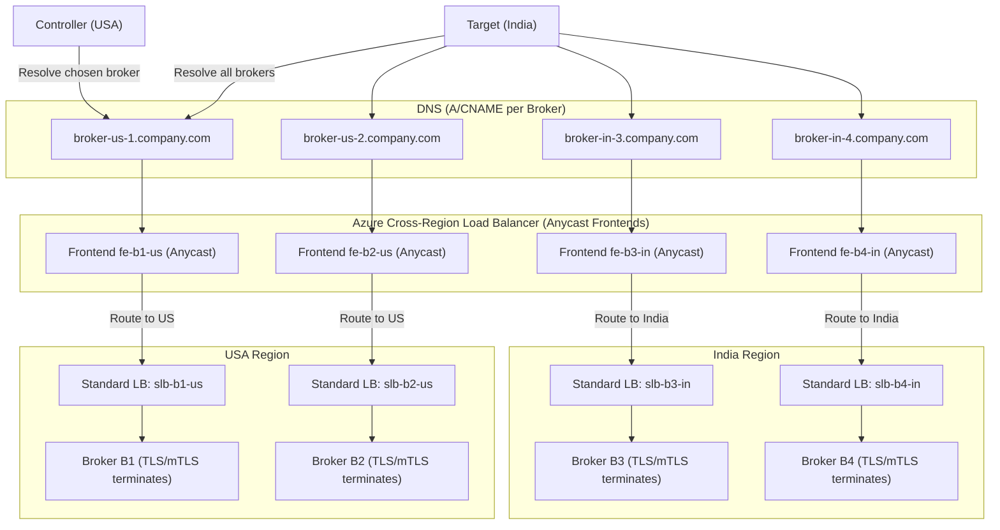
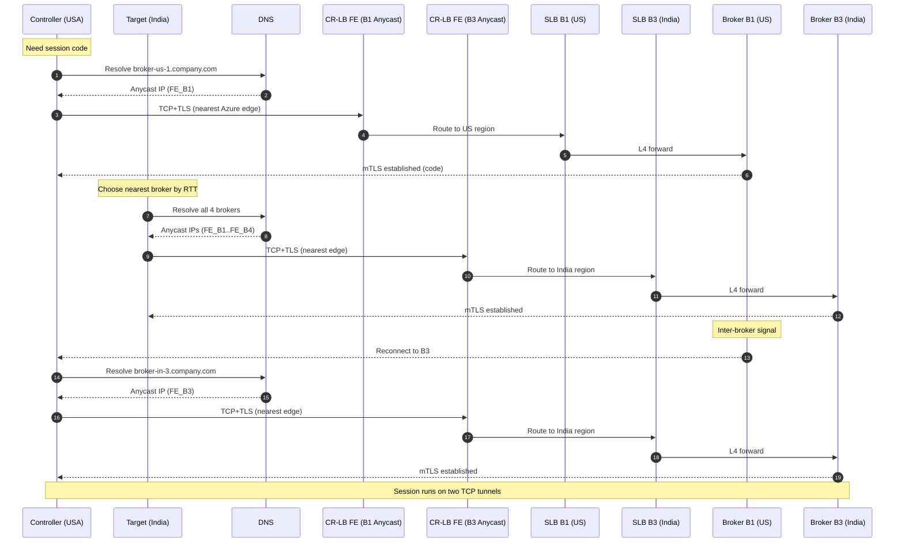

# Azure CR‑LB Architecture for RC System (Final) — **One SLB per Broker**

**Context:** Controller/Target choose a **specific Broker hostname**. Requirement: **one Standard LB per Broker** (no shared pool).  
**Goal:** Lowest‑latency global ingress via **Anycast**, L4 pass‑through, TLS termination on Brokers, and clean per‑broker isolation.

---

## High‑Level Architecture

**What changed vs earlier draft:**  
- **One Standard LB per Broker** (`slb-b1-us`, `slb-b2-us`, `slb-b3-in`, `slb-b4-in`).  
- Each Broker keeps a **unique FQDN** that maps to its **own CR‑LB Frontend** (unique Anycast IP).  
- No regional pooling; each SLB forwards only to **its** Broker instance(s).

---

## Network Flow (Controller starts on B1, Target selects B3, Controller switches to B3)

## Why this satisfies requirements

- **Per‑broker isolation:** one SLB per broker hostname meets “reach specific broker” need.  
- **Best latency globally:** Anycast ingress at nearest edge + Azure backbone.  
- **TLS/mTLS stays end‑to‑end:** no termination at Azure LBs.  
- **Simple scale‑out:** add broker → add CR‑LB frontend + SLB + DNS.  
- **Health & resiliency:** SLB health probes; client can re‑probe list to fail over.

---

##  Build Outline

1. **Region (US/India) per Broker**
   - Create **Standard LB** `slb-bX-<region>` (public).  
   - Health probe (TCP) + rule/NAT to **Broker Bx**.  
   - NSG: allow listener + probe only.  
   - Broker VM/AKS with **Managed Identity** to **Key Vault** for certs.

2. **Global**
   - Create **one Cross‑Region LB**.  
   - Create **one Frontend IP per Broker** (`fe-bX-<region>`).  
   - Backend mapping: each FE → its regional **SLB Bx**.  
   - DNS A/CNAME: `broker-<region>-<n>.company.com` → that FE IP.

3. **Ops**
   - Monitor SLB probes, Broker connection counts, cert expiry.  
   - Alerts in **Azure Monitor**/**Log Analytics**.

---
