# 🛡️ Azure Tenant Security Hardening Baseline

## Proactive Controls to Prevent Tenant-Level Compromise

### Aligned to Microsoft Cloud Adoption Framework (CAF) & Azure Well-Architected Framework (WAF)

---

## Table of Contents

- [1. Executive Summary](#1-executive-summary)
- [2. Threat Model: How Azure Tenants Get Compromised](#2-threat-model-how-azure-tenants-get-compromised)
- [3. Identity Hardening (The #1 Priority)](#3-identity-hardening-the-1-priority)
  - [3.1 Phishing-Resistant MFA](#31-phishing-resistant-mfa)
  - [3.2 Privileged Access Management](#32-privileged-access-management)
  - [3.3 Break-Glass Account Hardening](#33-break-glass-account-hardening)
  - [3.4 Conditional Access Baseline](#34-conditional-access-baseline)
  - [3.5 Legacy Authentication Elimination](#35-legacy-authentication-elimination)
- [4. Workload Identity Security (SPNs & Managed Identities)](#4-workload-identity-security-spns--managed-identities)
- [5. Detection & Monitoring](#5-detection--monitoring)
  - [5.1 Microsoft Sentinel Rules](#51-microsoft-sentinel-rules)
  - [5.2 Entra ID Protection](#52-entra-id-protection)
  - [5.3 Continuous Access Evaluation](#53-continuous-access-evaluation)
- [6. Blast Radius Containment](#6-blast-radius-containment)
  - [6.1 Administrative Units](#61-administrative-units)
  - [6.2 Protected Actions](#62-protected-actions)
  - [6.3 Restricted Management Administrative Units](#63-restricted-management-administrative-units)
- [7. Application & Consent Governance](#7-application--consent-governance)
- [8. External Attack Surface Reduction](#8-external-attack-surface-reduction)
- [9. Data Protection & Exfiltration Prevention](#9-data-protection--exfiltration-prevention)
- [10. Network Security Baseline](#10-network-security-baseline)
- [11. Supply Chain & Third-Party Risk](#11-supply-chain--third-party-risk)
- [12. Entra ID Backup & Self-Healing](#12-entra-id-backup--self-healing)
- [13. Why Active-Active Does NOT Work for Cyber-DR](#13-why-active-active-does-not-work-for-cyber-dr)
- [14. NIST CSF Alignment](#14-nist-csf-alignment)
- [15. Implementation Checklist](#15-implementation-checklist)
- [16. Implementation Roadmap](#16-implementation-roadmap)
- [17. References](#17-references)

---

## 1. Executive Summary

### Purpose

This document defines the **proactive security controls** that must be in place to prevent an Azure tenant compromise. It is the **prevention-side companion** to the [Cross-Tenant DR Architecture (final.md)](./final.md), which covers recovery after a compromise.

### How These Documents Work Together

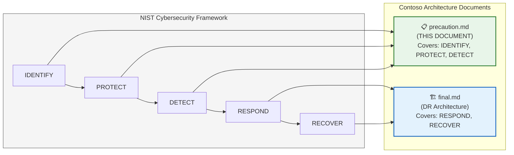

### Key Principle

> **Identity is the perimeter.** In Azure, there is no network perimeter to breach — the attacker's goal is to compromise an identity with sufficient privileges to control the tenant. Every control in this document exists to make that as difficult as possible, detect it as fast as possible, and limit the damage if it happens.

---

## 2. Threat Model: How Azure Tenants Get Compromised

Understanding the attack paths is essential to placing the right controls.

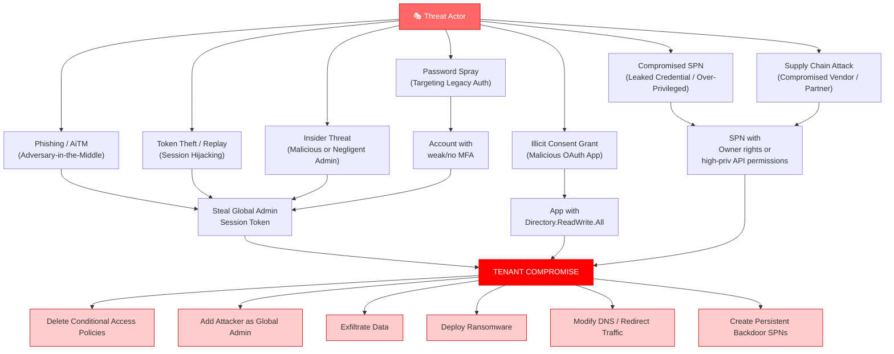

### Attack Path → Control Mapping

| Attack Path | Primary Control | Secondary Control | This Document Section |
|---|---|---|---|
| Phishing / AiTM | Phishing-Resistant MFA (FIDO2) | Token Protection, CAE | [3.1](#31-phishing-resistant-mfa) |
| Token Theft / Replay | Continuous Access Evaluation (CAE) | Conditional Access (compliant device) | [5.3](#53-continuous-access-evaluation) |
| Illicit Consent Grant | Admin Consent Workflow | App Governance, Sentinel alerts | [7](#7-application--consent-governance) |
| Compromised SPN | Workload Identity Protection | Credential rotation, least privilege | [4](#4-workload-identity-security-spns--managed-identities) |
| Supply Chain | Cross-Tenant Access Settings | Vendor access reviews | [11](#11-supply-chain--third-party-risk) |
| Insider Threat | PIM + Approval Workflows | Protected Actions, Sentinel | [3.2](#32-privileged-access-management), [6.2](#62-protected-actions) |
| Password Spray | Block Legacy Auth | Entra ID Protection risk policies | [3.5](#35-legacy-authentication-elimination) |

---

## 3. Identity Hardening (The #1 Priority)

> **WAF Pillar:** Security (SE:05 — Identity and access management)
> **CAF Phase:** Govern — Security Baseline

### 3.1 Phishing-Resistant MFA

> **This is the single most impactful control.** AiTM phishing can bypass SMS, phone call, and push-notification MFA. Only phishing-resistant methods are safe.

| MFA Method | Phishing Resistant? | Recommendation |
|---|---|---|
| **FIDO2 Security Keys** | ✅ Yes | **Required** for all Global Admins, break-glass, and Tier 0 admins |
| **Windows Hello for Business** | ✅ Yes | **Required** for all admin workstations |
| **Passkeys (device-bound)** | ✅ Yes | **Recommended** for all users (emerging) |
| **Certificate-based Auth (CBA)** | ✅ Yes | **Acceptable** alternative for smartcard environments |
| Microsoft Authenticator (push) | ❌ No — vulnerable to MFA fatigue | **Phase out** for privileged users |
| Microsoft Authenticator (number matching) | ⚠️ Partial — resists fatigue but not AiTM | **Acceptable** for non-admin users (transitional) |
| SMS / Phone call | ❌ No — SIM swap, SS7 attacks | **Block immediately** via Authentication Methods policy |

#### Conditional Access Policy: Enforce Phishing-Resistant MFA for Admins

```json
{
  "displayName": "CA-001: Require Phishing-Resistant MFA for Admins",
  "state": "enabled",
  "conditions": {
    "users": {
      "includeRoles": [
        "Global Administrator",
        "Privileged Role Administrator",
        "Security Administrator",
        "Exchange Administrator",
        "SharePoint Administrator",
        "Intune Administrator",
        "Application Administrator",
        "Cloud Application Administrator",
        "Authentication Administrator",
        "Privileged Authentication Administrator"
      ]
    },
    "applications": {
      "includeApplications": ["All"]
    }
  },
  "grantControls": {
    "operator": "AND",
    "builtInControls": ["mfa"],
    "authenticationStrength": {
      "id": "phishing-resistant-mfa"
    }
  }
}
```

---

### 3.2 Privileged Access Management

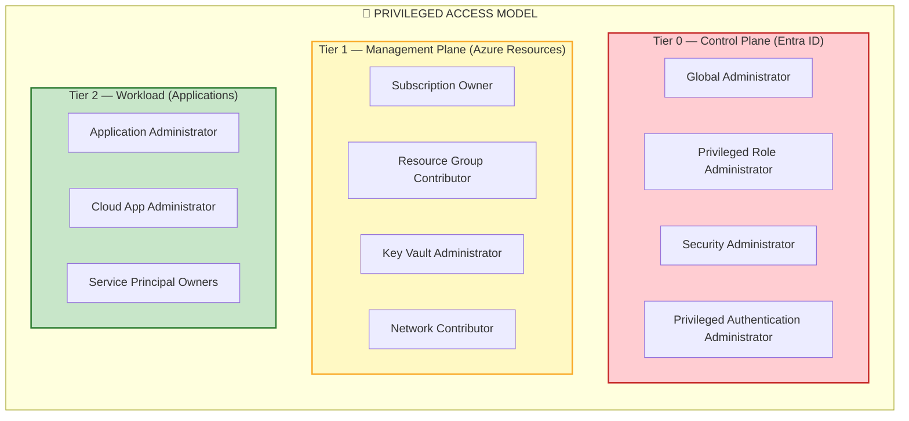

| PIM Setting | Tier 0 | Tier 1 | Tier 2 |
|---|---|---|---|
| **Maximum activation duration** | 1 hour | 4 hours | 8 hours |
| **Require approval** | ✅ Yes (2 approvers) | ✅ Yes (1 approver) | ❌ No (self-activate with justification) |
| **Require MFA on activation** | ✅ Phishing-resistant only | ✅ Any MFA | ✅ Any MFA |
| **Require justification** | ✅ Yes | ✅ Yes | ✅ Yes |
| **Require ticket number** | ✅ Yes | ✅ Yes | ❌ No |
| **Maximum eligible assignments** | 2-3 people | 5-10 people | As needed |
| **Permanent active assignments** | ❌ Never (except break-glass) | ❌ Never | ❌ Never |
| **Alert on activation** | ✅ Sentinel + email + Teams | ✅ Sentinel + email | ✅ Sentinel |
| **Access review cadence** | Monthly | Quarterly | Semi-annually |

---

### 3.3 Break-Glass Account Hardening

Break-glass accounts are the **#1 target** for attackers because they bypass PIM.

| Control | Implementation |
|---|---|
| **Count** | Exactly 2 (no more, no less) |
| **Naming** | Non-obvious names (not `admin@`, `breakglass@`, `emergency@`) |
| **MFA** | FIDO2 hardware key ONLY — no phone, no email, no Authenticator app |
| **FIDO2 key storage** | Physical safe (fireproof); 2 separate geographic locations |
| **Password** | 64+ character random; printed and sealed in tamper-evident envelope in safe |
| **Conditional Access exclusion** | Exclude from all CA policies EXCEPT: require phishing-resistant MFA |
| **Licensing** | Entra ID P2 for sign-in risk detection |
| **Monitoring** | **Sentinel alert fires on ANY sign-in attempt** (successful or failed) |
| **Usage policy** | Used ONLY for true emergencies; every use requires post-incident review |
| **Testing cadence** | Semi-annually; document the test; re-seal credentials |
| **PIM** | NOT enrolled in PIM (must be permanently active — that's the point) |
| **Group membership** | NOT a member of any group that has standing access to resources |

#### Sentinel Alert Rule: Break-Glass Sign-In

```kusto
SigninLogs
| where UserPrincipalName in ("bg-account-01@Contoso.onmicrosoft.com", "bg-account-02@Contoso.onmicrosoft.com")
| project TimeGenerated, UserPrincipalName, ResultType, IPAddress, Location, AppDisplayName, DeviceDetail
| extend AlertSeverity = "Critical"
// This should NEVER fire outside of a planned test or declared emergency
```

---

### 3.4 Conditional Access Baseline

The following is a **minimum baseline** set of Conditional Access policies:

| Policy ID | Policy Name | Target | Grant/Block | WAF Code |
|---|---|---|---|---|
| CA-001 | Require phishing-resistant MFA for admins | All admin roles | Grant: Phishing-resistant MFA | SE:05 |
| CA-002 | Require MFA for all users | All users | Grant: MFA (any method) | SE:05 |
| CA-003 | Block legacy authentication | All users | Block | SE:05 |
| CA-004 | Require compliant device for admins | All admin roles | Grant: Compliant device + MFA | SE:05, SE:08 |
| CA-005 | Block sign-in from untrusted locations (admins) | All admin roles | Block: Untrusted named locations | SE:05 |
| CA-006 | Require MFA for risky sign-ins | All users | Grant: MFA (when risk = medium/high) | SE:05 |
| CA-007 | Block high-risk users | All users | Block: When user risk = high | SE:05 |
| CA-008 | Require MFA for Azure Management | All users accessing Azure portal/CLI/PS | Grant: MFA | SE:05 |
| CA-009 | Block unknown device platforms | All users | Block: Unknown/unmanaged platforms | SE:08 |
| CA-010 | Session: Sign-in frequency for admins | All admin roles | Session: 4-hour sign-in frequency | SE:05 |
| CA-011 | Require app protection for mobile | All users on iOS/Android | Grant: Approved app + app protection policy | SE:08 |
| CA-012 | Block non-admin consent | All users | Block: Apps requesting admin-level permissions | SE:05 |

#### Conditional Access Protection: Prevent Policy Deletion

> **Critical:** An attacker's first action after gaining Global Admin is often to **delete all CA policies**. Use **Protected Actions** to prevent this.

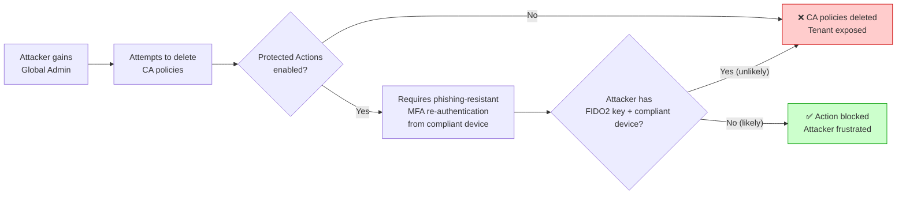

---

### 3.5 Legacy Authentication Elimination

Legacy authentication protocols (IMAP, POP3, SMTP, ActiveSync basic auth, legacy EWS) **bypass MFA entirely**.

| Action | Timeline | Owner |
|---|---|---|
| Enable CA policy to block legacy auth (report-only mode) | Week 1 | Identity Team |
| Analyze sign-in logs for legacy auth usage | Week 2-4 | Identity Team + App Owners |
| Migrate identified applications to modern auth (OAuth 2.0) | Week 4-12 | Application Teams |
| Switch CA policy to enforced mode | Week 12 | Identity Team |
| Monitor for breakage; remediate | Week 12-16 | Identity Team + Support |

#### Detection Query: Who Still Uses Legacy Auth?

```kusto
SigninLogs
| where ClientAppUsed in ("Exchange ActiveSync", "IMAP4", "MAPI Over HTTP",
    "Offline Address Book", "Other clients", "Outlook Anywhere (RPC over HTTP)",
    "POP3", "Reporting Web Services", "SMTP", "Exchange Web Services")
| summarize Count = count() by UserPrincipalName, ClientAppUsed, AppDisplayName
| sort by Count desc
```

---

## 4. Workload Identity Security (SPNs & Managed Identities)

> **This is the most overlooked attack surface.** SPNs with `Directory.ReadWrite.All` or `RoleManagement.ReadWrite.Directory` are equivalent to Global Admin.

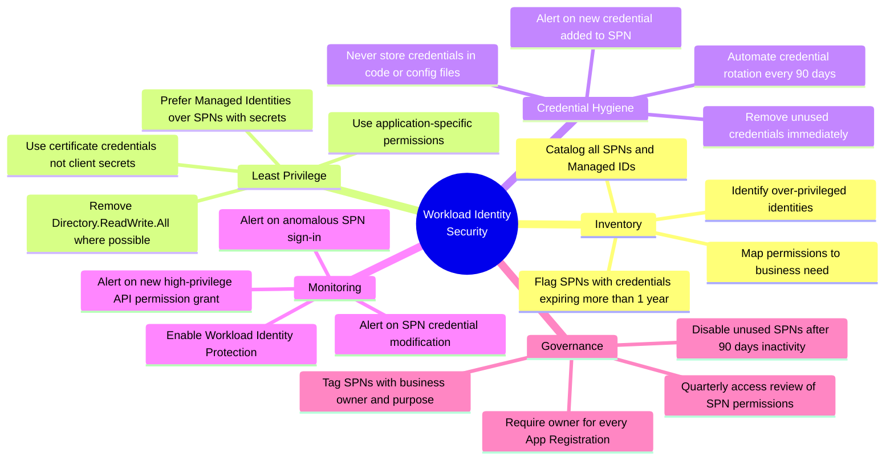

### High-Risk SPN Permissions to Audit Immediately

| Permission | Risk Level | Why It's Dangerous |
|---|---|---|
| `Directory.ReadWrite.All` | 🔴 Critical | Can modify any directory object — equivalent to Global Admin |
| `RoleManagement.ReadWrite.Directory` | 🔴 Critical | Can assign itself Global Admin role |
| `Application.ReadWrite.All` | 🔴 Critical | Can create new apps with any permissions |
| `AppRoleAssignment.ReadWrite.All` | 🟠 High | Can grant permissions to other apps |
| `Mail.ReadWrite` | 🟠 High | Can read/modify any user's email |
| `Files.ReadWrite.All` | 🟠 High | Can access any user's OneDrive/SharePoint |
| `User.ReadWrite.All` | 🟡 Medium | Can modify user properties |
| `Group.ReadWrite.All` | 🟡 Medium | Can modify group memberships including security groups |

#### Detection Query: Over-Privileged SPNs

```kusto
// Find SPNs with high-risk API permissions in Entra ID audit logs
AuditLogs
| where OperationName == "Add app role assignment to service principal"
| extend AppRoleValue = tostring(TargetResources[0].modifiedProperties[1].newValue)
| where AppRoleValue has_any ("Directory.ReadWrite.All", "RoleManagement.ReadWrite.Directory",
    "Application.ReadWrite.All", "AppRoleAssignment.ReadWrite.All")
| project TimeGenerated, InitiatedBy, TargetResources, AppRoleValue
```

---

## 5. Detection & Monitoring

> **WAF Pillar:** Security (SE:10 — Monitor and detect threats)
> **CAF Phase:** Manage

### 5.1 Microsoft Sentinel Rules

| Rule Name | Severity | What It Detects | MITRE ATT&CK |
|---|---|---|---|
| Break-glass account sign-in | Critical | Any sign-in to break-glass accounts | T1078 — Valid Accounts |
| Global Admin role activated outside PIM | Critical | GA activation without PIM workflow | T1098 — Account Manipulation |
| Conditional Access policy deleted | Critical | Attacker removing security controls | T1562 — Impair Defenses |
| New credential added to SPN | High | Attacker establishing persistence via SPN | T1098.001 — Additional Cloud Credentials |
| Bulk user/group deletion | Critical | Mass destruction of directory objects | T1485 — Data Destruction |
| New federation trust created | Critical | Attacker creating backdoor authentication path | T1484.002 — Trust Modification |
| OAuth app granted admin consent | High | Illicit consent grant attack | T1550.001 — Application Access Token |
| Impossible travel for admin account | High | Credential compromise (account used from 2 distant locations simultaneously) | T1078 — Valid Accounts |
| Legacy auth sign-in succeeded | Medium | Bypassing MFA controls | T1078 — Valid Accounts |
| PIM settings modified | High | Attacker weakening privileged access controls | T1098 — Account Manipulation |
| Custom domain added | High | Attacker preparing for phishing or tenant takeover | T1484.002 — Trust Modification |
| New SPN with high-risk permissions | High | Attacker creating persistent high-privilege identity | T1136.003 — Cloud Account |
| Mass CA policy creation/modification | High | Attacker modifying tenant security posture | T1562 — Impair Defenses |
| Azure Key Vault purge operation | Critical | Attacker destroying encryption keys | T1485 — Data Destruction |

### 5.2 Entra ID Protection

| Policy | Risk Level | Action | Notes |
|---|---|---|---|
| **Risky sign-in policy** | Medium or above | Require MFA | Catches: impossible travel, anonymous IP, malware-linked IP |
| **Risky sign-in policy** | High | Block sign-in | Catches: token replay, verified threat intelligence |
| **Risky user policy** | Medium | Require password change + MFA | Catches: leaked credentials (dark web) |
| **Risky user policy** | High | Block until admin review | Catches: confirmed compromise indicators |
| **Risky workload identity** | Any | Alert to SOC | Catches: anomalous SPN behavior |

### 5.3 Continuous Access Evaluation (CAE)

> **Traditional token lifetime:** 1 hour. An attacker who steals a token has up to 1 hour of access.
> **With CAE:** Token is revoked in **near-real-time** when risk changes.

| CAE Trigger | What Happens |
|---|---|
| User account disabled | Active sessions terminated within minutes |
| Password changed/reset | All existing tokens revoked |
| MFA enforced (new CA policy) | Current sessions challenged immediately |
| Admin revokes all refresh tokens | All sessions terminated |
| Network location changes to untrusted | Session re-evaluation triggered |
| User risk level changes | Evaluated against CA policies in real-time |

**Enable CAE:** It's on by default for supported applications (Office 365, Azure Portal). Ensure Conditional Access policies don't use "Sign-in frequency" with a short window, as this can conflict with CAE.

---

## 6. Blast Radius Containment

> **Principle:** Even if an attacker compromises a privileged identity, limit what they can do with it.

### 6.1 Administrative Units

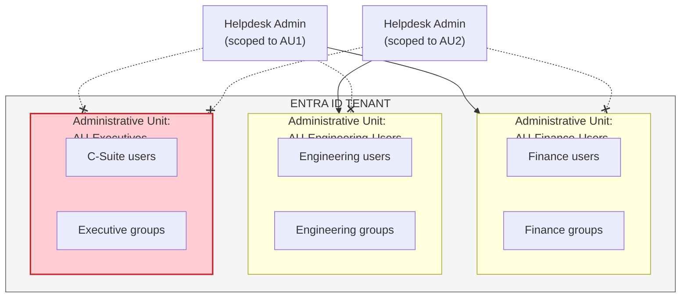

| Without Administrative Units | With Administrative Units |
|---|---|
| Helpdesk admin can reset passwords for ANY user | Helpdesk admin can only reset passwords for users in their AU |
| Compromised helpdesk admin → reset CEO password → escalation | Compromised helpdesk admin → limited to their AU → CEO is in separate AU |

### 6.2 Protected Actions

Protected Actions require **re-authentication with phishing-resistant MFA** before performing destructive operations.

| Protected Action | Why It Matters |
|---|---|
| Delete Conditional Access policy | Prevents attacker from disabling security controls |
| Modify PIM role settings | Prevents attacker from weakening privileged access |
| Delete/modify authentication methods policy | Prevents attacker from enabling weak MFA |
| Modify cross-tenant access settings | Prevents attacker from creating trust to external tenant |
| Modify authorization policy | Prevents attacker from changing tenant-wide settings |

### 6.3 Restricted Management Administrative Units

> **The strongest containment control available.** Even Global Admins cannot modify objects inside a Restricted Management AU.

| Capability | Regular AU | Restricted Management AU |
|---|---|---|
| Scoped admin can manage objects | ✅ | ✅ |
| Global Admin can manage objects | ✅ | ❌ (Blocked!) |
| Protects against compromised GA | ❌ | ✅ |
| Use case | General delegation | Protecting critical accounts (break-glass, C-suite, security team) |

**Recommendation:** Place break-glass accounts, security team accounts, and C-suite accounts in Restricted Management AUs.

---

## 7. Application & Consent Governance

> **WAF Pillar:** Security (SE:05)

| Control | Implementation | Why |
|---|---|---|
| **Disable user consent** | Entra ID → Enterprise Apps → Consent and permissions → Users can consent = No | Prevents illicit consent grant attacks |
| **Enable admin consent workflow** | Users request; admins approve/deny | Maintains productivity while preventing unauthorized app access |
| **Block risky permissions in consent** | Block apps requesting `Directory.ReadWrite.All`, `Mail.ReadWrite`, etc. without review | Prevents stealth privilege escalation |
| **App Governance (Defender for Cloud Apps)** | Enable app governance policies to detect anomalous OAuth app behavior | Detects compromised third-party apps |
| **Quarterly app access review** | Review all enterprise apps with active permissions | Removes stale/unnecessary app access |
| **Limit who can register apps** | Only allow specific roles to create app registrations | Reduces sprawl and unmanaged identities |

#### Detection: Illicit Consent Grant

```kusto
AuditLogs
| where OperationName == "Consent to application"
| extend ConsentedPermissions = tostring(TargetResources[0].modifiedProperties)
| where ConsentedPermissions has_any ("Directory.ReadWrite.All", "Mail.ReadWrite",
    "Files.ReadWrite.All", "RoleManagement.ReadWrite.Directory")
| project TimeGenerated, InitiatedBy, TargetResources, ConsentedPermissions
```

---

## 8. External Attack Surface Reduction

| Control | Implementation |
|---|---|
| **Cross-Tenant Access Settings** | Default: Block all inbound/outbound cross-tenant access. Explicitly allow only verified partner tenants |
| **External collaboration settings** | Limit guest invitations to specific admin roles only |
| **B2B direct connect** | Disable unless explicitly needed; review quarterly |
| **Domain allowlist for B2B** | Only allow invitations from verified partner domains |
| **External user access reviews** | Quarterly review; auto-remove guests not accessed in 90 days |
| **Disable email one-time passcode** for unauthorized domains | Prevent unknown external users from accessing shared resources |

---

## 9. Data Protection & Exfiltration Prevention

| Control | Implementation | WAF Code |
|---|---|---|
| **Purview Information Protection** | Classify and label sensitive data; apply encryption automatically | SE:03 |
| **DLP Policies (Data Loss Prevention)** | Block/warn when sensitive data is shared externally via Teams, SharePoint, Exchange | SE:03 |
| **Sensitivity Labels on Containers** | Apply labels to Teams, SharePoint sites, M365 Groups — enforce access controls | SE:03 |
| **Key Vault Purge Protection** | Enable purge protection on ALL Key Vaults (90-day retention) | SE:06 |
| **Key Vault Soft Delete** | Enable soft delete on ALL Key Vaults | SE:06 |
| **Storage Account Soft Delete** | Enable blob/container soft delete (14-day minimum) | RE:06 |
| **SQL Threat Detection** | Enable Advanced Threat Protection on all SQL databases | SE:10 |
| **Azure Defender for Storage** | Detect unusual access patterns, data exfiltration attempts | SE:10 |

---

## 10. Network Security Baseline

| Control | Implementation | WAF Code |
|---|---|---|
| **Private Endpoints for all PaaS** | No public endpoints for Key Vault, Storage, SQL, Cosmos DB, ACR | SE:04, SE:08 |
| **Azure Firewall / NVA** | Centralized egress filtering; TLS inspection for suspicious traffic | SE:04 |
| **NSG Flow Logs** | Enable on all subnets; feed to Sentinel for anomaly detection | SE:10 |
| **DDoS Protection Standard** | Enable on all VNets with public-facing resources | RE:05 |
| **Azure Bastion** | No RDP/SSH from public internet; all admin access via Bastion | SE:08 |
| **Just-in-Time VM access** | Require JIT for all VM RDP/SSH ports | SE:05, SE:08 |
| **DNS Private Zones** | Use private DNS resolution for all Azure PaaS services | SE:04 |
| **Web Application Firewall (WAF)** | Protect all public-facing web apps via Application Gateway or Front Door | SE:08 |

---

## 11. Supply Chain & Third-Party Risk

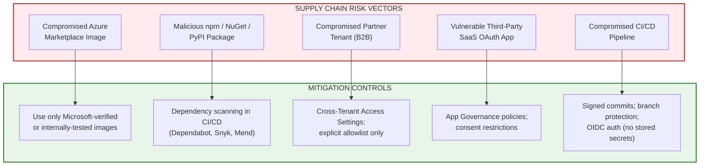

---

## 12. Entra ID Backup & Self-Healing

> **Microsoft Entra Backup & Recovery** (Preview — March 2026) provides native backup for tenant configuration objects.

| Feature | What It Protects Against |
|---|---|
| **Automatic daily backups** | Admin error (accidental CA policy deletion, user deletion) |
| **5-day point-in-time restore** | Rapid recovery from misconfiguration within same tenant |
| **Difference reports** | Compare current state vs. backup before restoring |
| **Immutable backups** | Even compromised Global Admin cannot delete backups |
| **Granular restore** | Restore specific objects without full tenant rollback |

| Configuration | Recommended Setting |
|---|---|
| **Enable** | Yes — on primary tenant AND backup tenant |
| **Monitor** | Alert when difference report shows unexpected changes |
| **Test** | Include in quarterly DR drill — practice restoring a deleted CA policy |

**⚠️ Limitation:** Entra Backup restores **within the same tenant only**. If the tenant is locked for forensics (your DR scenario), you need the cross-tenant architecture in [final.md](./final.md).

---

## 13. Why Active-Active Does NOT Work for Cyber-DR

> **This section addresses a common misconception.** Active-active multi-region/multi-site is excellent for infrastructure failure DR. It is **dangerous** for cyber-resilience DR.

```mermaid
graph TD
    subgraph SCENARIO_A["❌ ACTIVE-ACTIVE: Same Tenant, Multi-Region"]
        SA1["Region A<br/>(Active)"] <--> SA2["Region B<br/>(Active)"]
        SA3["Shared Entra ID Tenant"] --> SA1
        SA3 --> SA2
        SA4["🎭 Attacker compromises<br/>Entra ID"] --> SA3
        SA4 -.->|"Both regions<br/>compromised instantly"| SA1
        SA4 -.->|"Both regions<br/>compromised instantly"| SA2
    end

    subgraph SCENARIO_B["❌ ACTIVE-ACTIVE: Cross-Tenant with Trust"]
        SB1["Tenant A<br/>(Active)"] <-->|"Cross-tenant sync<br/>Lighthouse / Federation"| SB2["Tenant B<br/>(Active)"]
        SB3["🎭 Attacker compromises<br/>Tenant A"] --> SB1
        SB3 -.->|"Lateral movement<br/>via trust channel"| SB2
    end

    subgraph SCENARIO_C["✅ CORRECT: Air-Gapped Backup + Recovery Tenant"]
        SC1["Tenant A<br/>(Primary — Active)"]
        SC2["Tenant B<br/>(Backup — No Trust)"]
        SC3["Tenant C<br/>(Recovery — Dormant)"]
        SC4["🎭 Attacker compromises<br/>Tenant A"]
        SC4 --> SC1
        SC4 -.-x|"NO trust relationship<br/>NO sync channel<br/>NO lateral movement"| SC2
        SC4 -.-x|"Dormant — nothing<br/>to attack"| SC3
        SC2 -->|"Restore<br/>(manual activation)"| SC3
    end

    style SCENARIO_A fill:#ffebee,stroke:#c62828,stroke-width:2px
    style SCENARIO_B fill:#ffebee,stroke:#c62828,stroke-width:2px
    style SCENARIO_C fill:#e8f5e9,stroke:#2e7d32,stroke-width:2px
    style SA4 fill:#ff6666,stroke:#cc0000,color:#fff
    style SB3 fill:#ff6666,stroke:#cc0000,color:#fff
    style SC4 fill:#ff6666,stroke:#cc0000,color:#fff
```

### The Core Issue: Trust = Attack Path

| Architecture | Trust Relationship | Attacker Lateral Movement | Verdict |
|---|---|---|---|
| Active-active, same tenant | Inherent (same Entra ID) | **Guaranteed** — one compromised identity controls all regions | ❌ Useless for cyber-DR |
| Active-active, cross-tenant with sync | Federation, Lighthouse, cross-tenant SPNs | **Highly likely** — sync channel becomes attack path | ❌ Dangerous for cyber-DR |
| Active-active, air-gapped tenants | None | **Impossible** — but you lose active-active benefits (no shared identity, no seamless failover, no real-time data sync) | ⚠️ Not really active-active anymore |
| **Air-gapped backup + dormant recovery** | **None** | **Impossible** — backup tenant has no inbound trust; recovery tenant doesn't exist until activated | **✅ Correct for cyber-DR** |

### When Active-Active IS Appropriate

| Scenario | Active-Active? | Why |
|---|---|---|
| Region failure (East US goes down) | ✅ Yes | No identity compromise; both regions share healthy Entra ID |
| Hardware/infra failure | ✅ Yes | Same — Entra ID is unaffected |
| Natural disaster | ✅ Yes | Same — Entra ID is unaffected |
| **Tenant compromise (cyber attack)** | **❌ No** | **Entra ID IS the compromised component — active-active makes it worse** |

### Recommendation

> **Use active-active for infrastructure DR** (region failures, hardware failures).
> **Use air-gapped backup + dormant recovery tenant for cyber-resilience DR** (tenant compromise).
>
> These are complementary, not competing strategies. You need both.

---

## 14. NIST CSF Alignment

| NIST CSF Function | Controls in This Document | Reference Section |
|---|---|---|
| **IDENTIFY (ID)** | Threat model, attack path mapping, asset inventory (SPNs, apps, permissions) | [2](#2-threat-model-how-azure-tenants-get-compromised), [4](#4-workload-identity-security-spns--managed-identities) |
| **PROTECT (PR)** | Phishing-resistant MFA, PIM, Conditional Access, legacy auth block, network security, data protection | [3](#3-identity-hardening-the-1-priority), [9](#9-data-protection--exfiltration-prevention), [10](#10-network-security-baseline) |
| **DETECT (DE)** | Sentinel rules, Entra ID Protection, CAE, workload identity monitoring | [5](#5-detection--monitoring) |
| **RESPOND (RS)** | Covered in [final.md](./final.md) — DR declaration, break-glass activation, recovery flow | final.md Sections 5.2, 5.8 |
| **RECOVER (RC)** | Covered in [final.md](./final.md) — Cross-tenant restoration, identity reconstruction | final.md Sections 7, 7A, 9 |

---

## 15. Implementation Checklist

### Identity Hardening — Critical Priority

- [ ] FIDO2/Passkeys enforced for all admin roles via Conditional Access
- [ ] PIM enabled for ALL privileged roles (no permanent active assignments except break-glass)
- [ ] Break-glass accounts hardened (FIDO2 only, Sentinel alert, physical safe storage)
- [ ] Legacy authentication blocked tenant-wide
- [ ] All 12 baseline Conditional Access policies deployed
- [ ] Protected Actions enabled for destructive operations (CA policy deletion, PIM modification)
- [ ] SMS/Phone MFA methods disabled for admin roles
- [ ] Sign-in frequency set to 4 hours for admin sessions

### Workload Identity — Critical Priority

- [ ] Full inventory of all SPNs and App Registrations completed
- [ ] All SPNs with `Directory.ReadWrite.All` or `RoleManagement.ReadWrite.Directory` reviewed and remediated
- [ ] Managed Identities used instead of SPNs with client secrets wherever possible
- [ ] SPN credential rotation automated (90-day maximum lifetime)
- [ ] Sentinel alerts configured for new SPN credentials and high-risk permission grants
- [ ] Workload Identity Protection enabled
- [ ] Every App Registration has a documented owner

### Detection & Monitoring — High Priority

- [ ] All 14 Sentinel detection rules deployed and tested
- [ ] Entra ID Protection risk policies enabled (sign-in risk + user risk)
- [ ] Continuous Access Evaluation (CAE) verified as active
- [ ] Defender for Cloud Apps — App Governance enabled
- [ ] SOC runbook includes Entra ID compromise response playbook
- [ ] Alert response SLAs defined (Critical: 15 min, High: 1 hour)

### Blast Radius Containment — High Priority

- [ ] Administrative Units created for major business units
- [ ] Restricted Management AUs created for break-glass, C-suite, and security team accounts
- [ ] Protected Actions configured and tested
- [ ] Helpdesk admin roles scoped to Administrative Units (not tenant-wide)

### Application Governance — Medium Priority

- [ ] User consent disabled; admin consent workflow enabled
- [ ] Quarterly app access review established
- [ ] Cross-Tenant Access Settings: default block; explicit allowlist for partners
- [ ] Guest user access reviews configured (quarterly, auto-remove after 90 days)

### Data & Network — Medium Priority

- [ ] Private Endpoints for all PaaS services (Key Vault, Storage, SQL, Cosmos)
- [ ] Key Vault purge protection and soft delete enabled on ALL vaults
- [ ] Storage account soft delete enabled (14-day minimum)
- [ ] Azure Bastion deployed; no direct RDP/SSH from internet
- [ ] JIT VM access enabled for all VMs
- [ ] DLP policies configured for Teams, SharePoint, Exchange

### Backup & Self-Healing — Medium Priority

- [ ] Microsoft Entra Backup and Recovery (preview) enabled
- [ ] Backup difference report reviewed weekly
- [ ] Entra Backup restore tested in quarterly DR drill

---

## 16. Implementation Roadmap

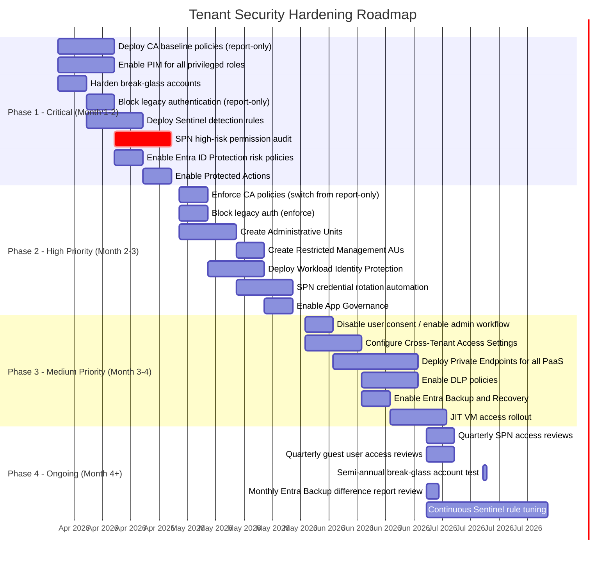

---

## 17. References

| Resource | Link |
|---|---|
| Microsoft Entra ID Security Operations Guide | [https://learn.microsoft.com/en-us/entra/architecture/security-operations-introduction](https://learn.microsoft.com/en-us/entra/architecture/security-operations-introduction) |
| Securing Privileged Access | [https://learn.microsoft.com/en-us/entra/identity/role-based-access-control/security-planning](https://learn.microsoft.com/en-us/entra/identity/role-based-access-control/security-planning) |
| Conditional Access Policies | [https://learn.microsoft.com/en-us/entra/identity/conditional-access/](https://learn.microsoft.com/en-us/entra/identity/conditional-access/) |
| Privileged Identity Management | [https://learn.microsoft.com/en-us/entra/id-governance/privileged-identity-management/](https://learn.microsoft.com/en-us/entra/id-governance/privileged-identity-management/) |
| Phishing-Resistant MFA | [https://learn.microsoft.com/en-us/entra/identity/authentication/concept-authentication-strengths](https://learn.microsoft.com/en-us/entra/identity/authentication/concept-authentication-strengths) |
| Protected Actions | [https://learn.microsoft.com/en-us/entra/identity/role-based-access-control/protected-actions-overview](https://learn.microsoft.com/en-us/entra/identity/role-based-access-control/protected-actions-overview) |
| Administrative Units | [https://learn.microsoft.com/en-us/entra/identity/role-based-access-control/administrative-units](https://learn.microsoft.com/en-us/entra/identity/role-based-access-control/administrative-units) |
| Workload Identity Protection | [https://learn.microsoft.com/en-us/entra/identity-protection/concept-workload-identity-risk](https://learn.microsoft.com/en-us/entra/identity-protection/concept-workload-identity-risk) |
| Microsoft Sentinel for Entra ID | [https://learn.microsoft.com/en-us/azure/sentinel/connect-azure-active-directory](https://learn.microsoft.com/en-us/azure/sentinel/connect-azure-active-directory) |
| Continuous Access Evaluation | [https://learn.microsoft.com/en-us/entra/identity/conditional-access/concept-continuous-access-evaluation](https://learn.microsoft.com/en-us/entra/identity/conditional-access/concept-continuous-access-evaluation) |
| Entra Backup and Recovery (Preview) | [https://techcommunity.microsoft.com/blog/microsoft-entra-blog/strengthen-identity-resilience-recover-with-confidence-using-microsoft-entra-bac/4462426](https://techcommunity.microsoft.com/blog/microsoft-entra-blog/strengthen-identity-resilience-recover-with-confidence-using-microsoft-entra-bac/4462426) |
| NIST Cybersecurity Framework | [https://www.nist.gov/cyberframework](https://www.nist.gov/cyberframework) |
| MITRE ATT&CK for Azure | [https://attack.mitre.org/matrices/enterprise/cloud/azuread/](https://attack.mitre.org/matrices/enterprise/cloud/azuread/) |
| Zero Trust Deployment Guide | [https://learn.microsoft.com/en-us/security/zero-trust/](https://learn.microsoft.com/en-us/security/zero-trust/) |

---

> **Document Owner:** Contoso Cloud Infrastructure & Security Team
> **Companion Document:** [Cross-Tenant DR Architecture (final.md)](./final.md)
> **Last Updated:** 2026-03-26
> **Review Cadence:** Quarterly
> **Classification:** Internal — Confidential
> **Version:** 1.0
> **NIST CSF Coverage:** IDENTIFY, PROTECT, DETECT (RESPOND and RECOVER covered in final.md)


---
---
---

# 🏗️ Cross-Tenant Disaster Recovery Reference Architecture — Final

## Aligned to Microsoft Cloud Adoption Framework (CAF) & Azure Well-Architected Framework (WAF)

---

## Table of Contents

- [1. Executive Summary](#1-executive-summary)
- [2. Framework Alignment Matrix](#2-framework-alignment-matrix)
- [3. CAF Alignment: Lifecycle Phases](#3-caf-alignment-lifecycle-phases)
  - [3.1 Strategy](#31-strategy)
  - [3.2 Plan](#32-plan)
  - [3.3 Ready](#33-ready)
  - [3.4 Adopt (Migrate/Innovate)](#34-adopt-migrateinnovate)
  - [3.5 Govern](#35-govern)
  - [3.6 Manage](#36-manage)
- [4. Well-Architected Framework Pillar Alignment](#4-well-architected-framework-pillar-alignment)
  - [4.1 Reliability](#41-reliability)
  - [4.2 Security](#42-security)
  - [4.3 Cost Optimization](#43-cost-optimization)
  - [4.4 Operational Excellence](#44-operational-excellence)
  - [4.5 Performance Efficiency](#45-performance-efficiency)
- [5. Reference Architecture Diagrams](#5-reference-architecture-diagrams)
  - [5.1 High-Level Architecture](#51-high-level-architecture)
  - [5.2 Recovery Flow](#52-recovery-flow)
  - [5.3 Data Protection Topology](#53-data-protection-topology)
  - [5.4 Recovery Timeline (Gantt)](#54-recovery-timeline-gantt)
  - [5.5 Network Architecture](#55-network-architecture)
  - [5.6 Cross-Tenant Pre-Requisite Configuration](#56-cross-tenant-pre-requisite-configuration)
  - [5.7 Security Model](#57-security-model)
  - [5.8 Governance State Machine](#58-governance-state-machine)
- [6. Landing Zone Design](#6-landing-zone-design)
- [7. Identity & Access Architecture](#7-identity--access-architecture)
  - [7A. Identity Recovery Deep-Dive: Solving the Tenant-Bound Identity Breakage Problem](#7a-identity-recovery-deep-dive-solving-the-tenant-bound-identity-breakage-problem)
- [8. Data Protection & Backup Strategy](#8-data-protection--backup-strategy)
- [9. Application Recovery by Tier](#9-application-recovery-by-tier)
- [10. Pre-Requisites Checklist](#10-pre-requisites-checklist)
- [11. Restore Approach Comparison](#11-restore-approach-comparison)
- [12. Target RTO/RPO Matrix](#12-target-rtorpo-matrix)
- [13. WAF Assessment Checklist](#13-waf-assessment-checklist)
- [14. Governance & Compliance](#14-governance--compliance)
- [15. Next Steps & Roadmap](#15-next-steps--roadmap)

---

## 1. Executive Summary

### Scenario

> **Trigger:** Contoso's primary Azure tenant is compromised and locked down for forensic investigation (15–30 days).
> **Constraint:** Backups reside in a **separate, isolated Azure tenant**.
> **Goal:** Restore mission-critical applications using the fastest supported approach.

### Core Design Principle

> **You do not restore a tenant — you rebuild workloads in a clean tenant.**
>
> Azure does not support tenant-level rollback. Recovery must be:
> - Workload-centric
> - Pre-designed
> - Automated
> - Identity-aware (all RBACs, SPNs, and Managed Identities will break and must be reconstructed)

### Design Principles Applied

This reference architecture is built on the intersection of two Microsoft frameworks:

| Framework | Purpose in This Architecture |
|---|---|
| **Cloud Adoption Framework (CAF)** | Provides the **organizational, governance, and operational lifecycle** for building and managing the cross-tenant DR capability |
| **Well-Architected Framework (WAF)** | Provides the **technical design principles and trade-off analysis** across Reliability, Security, Cost, Operational Excellence, and Performance |

### Key Design Decisions

| Decision | Rationale | WAF Pillar | CAF Phase |
|---|---|---|---|
| Separate recovery tenant (not backup tenant) | Maintains backup isolation during active recovery | Security, Reliability | Ready |
| Infrastructure as Code for all resources | Enables repeatable, auditable recovery | Operational Excellence | Govern |
| ASR + IaC hybrid approach | Balances RTO with cost | Cost Optimization, Reliability | Manage |
| Break-glass accounts with FIDO2 | Ensures access when primary Entra ID is unavailable | Security | Govern |
| Immutable storage (WORM) | Prevents backup tampering by compromised identities | Security, Reliability | Ready |
| Identity Mapping Registry | Solves tenant-bound SPN/RBAC/Managed Identity breakage | Security, Reliability | Govern |
| IaC uses display-name lookups (not hard-coded Object IDs) | Ensures RBAC reconstruction works with new Object IDs in recovery tenant | Operational Excellence | Govern |

---

## 2. Framework Alignment Matrix

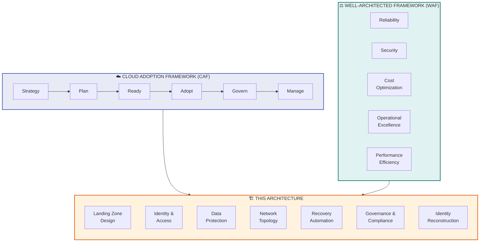

---

## 3. CAF Alignment: Lifecycle Phases

### 3.1 Strategy

> **CAF Guidance:** Define motivations, business outcomes, and financial considerations.

| Element | Application to This Architecture |
|---|---|
| **Business Motivation** | Ensure business continuity when the primary Azure tenant is inaccessible due to a security incident |
| **Business Outcome** | Mission-critical applications restored within 24 hours (RTO); data loss limited to < 1 hour (RPO) |
| **Financial Consideration** | Hybrid ASR + IaC approach reduces cost vs. full warm standby by ~60-70% while meeting RTO targets |
| **Risk Assessment** | Tenant compromise is a low-probability, high-impact event; architecture must be cost-justified against this risk profile |

#### Business Impact Analysis (BIA)

| Impact Category | Without This Architecture | With This Architecture |
|---|---|---|
| Revenue Loss | 15-30 days of downtime | < 24 hours of downtime |
| Regulatory Penalty | Potential non-compliance with DORA, SOC2, ISO 27001 | Documented, tested DR capability |
| Reputation | Severe customer trust erosion | Rapid recovery demonstrates resilience |
| Operational Cost | Unplanned, chaotic recovery effort | Automated, rehearsed recovery |

---

### 3.2 Plan

> **CAF Guidance:** Digital estate assessment, skills readiness, organizational alignment.

#### Digital Estate Assessment for DR Scope

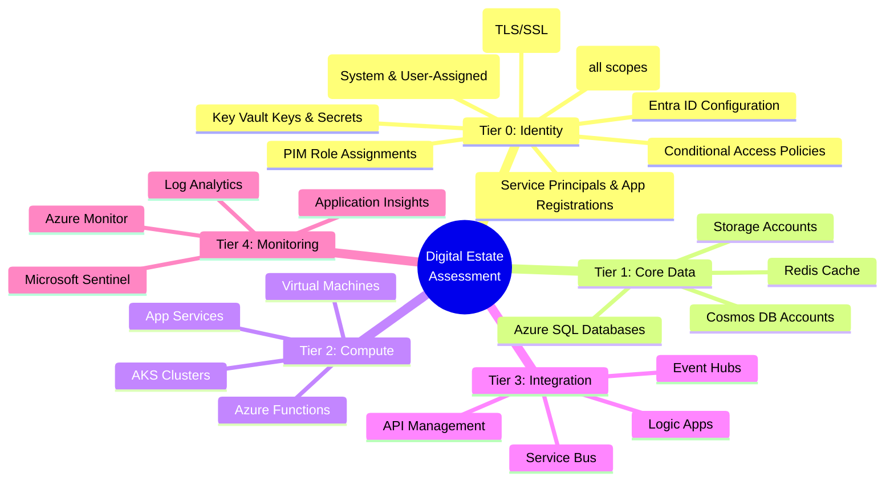

#### Skills Readiness Matrix

| Skill Area | Required Competency | Training Resource |
|---|---|---|
| Cross-Tenant Azure Backup | Advanced | [MS Learn: Azure Backup](https://learn.microsoft.com/en-us/azure/backup/) |
| Azure Site Recovery | Advanced | [MS Learn: ASR](https://learn.microsoft.com/en-us/azure/site-recovery/) |
| Terraform / Bicep | Advanced | [MS Learn: IaC](https://learn.microsoft.com/en-us/azure/developer/terraform/) |
| Entra ID Administration | Expert | [MS Learn: Entra ID](https://learn.microsoft.com/en-us/entra/identity/) |
| Incident Response | Expert | [NIST SP 800-61](https://csrc.nist.gov/publications/detail/sp/800-61/rev-2/final) |
| Azure Networking | Advanced | [MS Learn: Networking](https://learn.microsoft.com/en-us/azure/networking/) |
| Cross-Tenant Identity & SPN Management | Expert | [Azure Doctor: Cross-Tenant SPNs](https://www.azuredoctor.com/posts/how-to-share-service-principals-across-entra-tenant/) |
| Workload Identity Federation | Advanced | [MS Learn: Workload Identity](https://learn.microsoft.com/en-us/entra/workload-id/) |

---

### 3.3 Ready

> **CAF Guidance:** Azure landing zone design, foundation setup.

This maps directly to **Landing Zone Design** — see [Section 6](#6-landing-zone-design).

---

### 3.4 Adopt (Migrate/Innovate)

> **CAF Guidance:** Workload migration and modernization.

| Adopt Activity | Application |
|---|---|
| **Migrate** | Replicate existing workloads to backup tenant using ASR and cross-tenant backup |
| **Innovate** | Implement GitOps-based recovery for cloud-native workloads (AKS, serverless) |
| **Modernize** | Replace manual DR processes with automated IaC pipelines |

---

### 3.5 Govern

> **CAF Guidance:** Corporate policies, compliance, cost management, security baselines.

| Governance Discipline | Implementation |
|---|---|
| **Cost Management** | Tag all DR resources with `purpose:disaster-recovery`; monthly cost review |
| **Security Baseline** | Zero standing access; WORM storage; private endpoints; no legacy auth |
| **Resource Consistency** | All resources deployed via IaC; Azure Policy enforces compliance |
| **Identity Baseline** | Break-glass accounts with FIDO2; PIM for all privileged access; Identity Mapping Registry maintained |
| **Deployment Acceleration** | CI/CD pipelines for IaC; automated backup validation |

---

### 3.6 Manage

> **CAF Guidance:** Operations management, monitoring, business alignment.

| Management Activity | Cadence | Owner |
|---|---|---|
| DR drill (full failover) | Quarterly | Cloud Ops + Security |
| Backup integrity verification | Weekly (automated) | Cloud Ops |
| Break-glass account test | Semi-annually | Security |
| IaC drift detection | Daily (automated) | Platform Engineering |
| RTO/RPO validation | Quarterly | Cloud Ops + Business |
| Architecture review | Annually | Architecture Board |
| Identity Mapping Registry sync & validation | Weekly (automated) | Platform Engineering |
| Mirror App Registration verification | Monthly | Security + Platform Engineering |

---

## 4. Well-Architected Framework Pillar Alignment

### 4.1 Reliability

> **WAF Principle:** Design for failure; ensure self-healing and resilience.

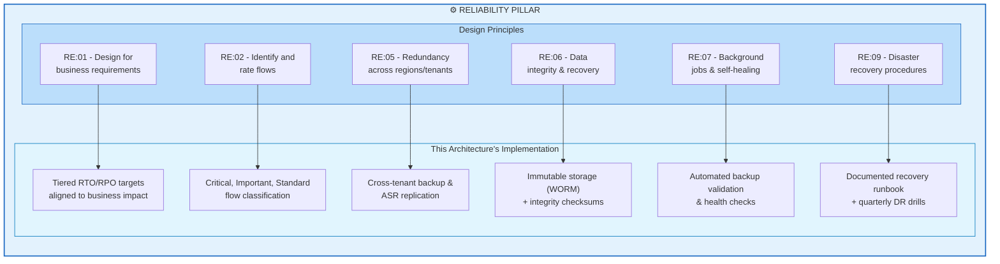

#### Reliability Recommendations

| ID | Recommendation | Priority | WAF Code |
|---|---|---|---|
| R-01 | Define tiered RTO/RPO per application based on BIA | Critical | RE:01 |
| R-02 | Use ASR for continuous replication of stateful VMs | Critical | RE:05 |
| R-03 | Implement immutable backups with WORM policy | Critical | RE:06 |
| R-04 | Automate weekly backup restoration tests | High | RE:09 |
| R-05 | Use cross-region backup (CRR) within backup tenant | High | RE:05 |
| R-06 | Design recovery flows to be idempotent and re-runnable | Medium | RE:07 |
| R-07 | Implement circuit-breaker patterns for cross-tenant operations | Medium | RE:07 |
| R-08 | Validate Identity Mapping Registry weekly to prevent stale RBAC reconstruction | Critical | RE:09 |

#### Failure Mode Analysis (FMA)

| Failure Mode | Impact | Mitigation | Detection |
|---|---|---|---|
| Backup tenant also compromised | Total data loss | Air-gapped offline backup; separate admin credentials; no trust relationship | Sentinel alerts in backup tenant |
| Backup data corrupted | Cannot restore | Immutable storage; integrity checksums; multi-version retention | Automated weekly restore tests |
| Break-glass credentials lost | Cannot access backup tenant | Multiple sealed copies in geographically separate safes | Semi-annual verification |
| IaC state drift | Recovery deploys incorrect config | Automated drift detection; state locked in immutable blob | Daily Terraform plan |
| DNS failover fails | Users cannot reach recovered apps | Pre-configured Traffic Manager with health probes; manual DNS override procedure | Synthetic monitoring |
| ExpressRoute to recovery tenant unavailable | On-prem cannot reach recovery | Pre-provisioned VPN as backup path | Network monitoring |
| **Identity Mapping Registry stale/incomplete** | **RBAC assignments fail; apps can't authenticate to Key Vault, SQL, Storage** | **Automated weekly sync of identity inventory from primary tenant; validate completeness in every DR drill** | **Pre-drill identity audit script; automated diff against live Entra ID** |
| **Managed Identity Object IDs mismatch after recreation** | **Key Vault access policies, SQL AAD auth, Storage RBAC all broken** | **Post-deployment identity re-binding automation script; never hard-code Object IDs in IaC** | **Smoke tests include identity-dependent operations (Key Vault read, SQL query, Blob access)** |
| **App Registration Client IDs change in recovery tenant** | **OAuth flows break; downstream API integrations fail** | **Pre-create mirror App Registrations in recovery tenant; maintain Client ID mapping; update redirect URIs via IaC** | **OAuth smoke tests in DR drill** |

---

### 4.2 Security

> **WAF Principle:** Assume breach; defense in depth; least privilege.

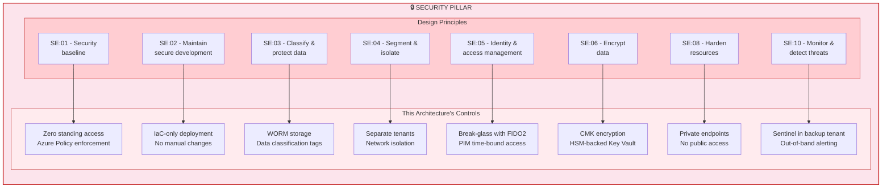

#### Zero Trust Alignment

| Zero Trust Principle | Implementation |
|---|---|
| **Verify Explicitly** | All access via Conditional Access; device compliance checks; MFA enforced |
| **Least Privilege** | PIM for all admin roles; time-bound activation with approval; no standing access |
| **Assume Breach** | Backup tenant assumes primary is fully compromised; no trust relationships; independent Sentinel instance |

---

### 4.3 Cost Optimization

> **WAF Principle:** Maximize the value of cloud spend.

| Cost Element | Approach | Monthly Estimate | WAF Code |
|---|---|---|---|
| ASR Replication | Per-VM replication fee; compute only during failover | $25/VM/month | CO:05 |
| Cross-Tenant Backup | Backup storage (LRS/GRS) in backup tenant | ~$0.05/GB/month | CO:05 |
| Immutable Blob Storage | Hot tier for recent; Cool/Archive for older | ~$0.01-0.02/GB/month | CO:07 |
| Recovery Tenant (idle) | Minimal: Entra ID, Key Vault, Storage only | ~$200-500/month | CO:05 |
| Recovery Tenant (active) | Full compute during DR event only | Pay-per-use during event | CO:02 |
| ACR Mirror | Geo-replicated registry | ~$50/month | CO:05 |
| DR Drill Costs | Quarterly spin-up/tear-down | ~$2,000-5,000/quarter | CO:02 |

#### Cost Comparison: Recovery Approaches

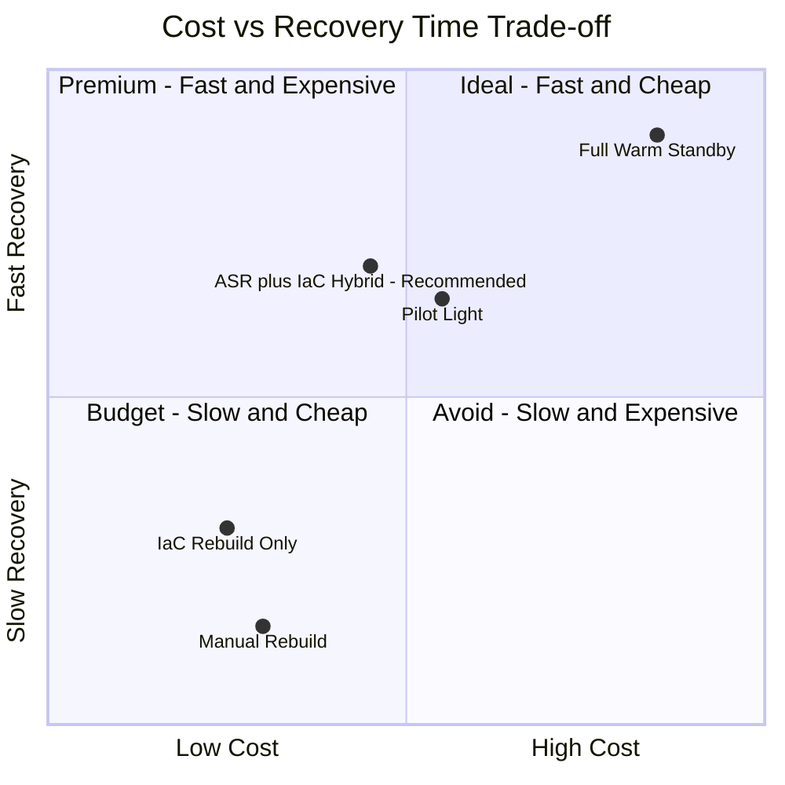

---

### 4.4 Operational Excellence

> **WAF Principle:** Streamline operations through automation, observability, and safe deployment practices.

| OE Principle | Implementation | WAF Code |
|---|---|---|
| **Automate repetitive tasks** | IaC for all infrastructure; automated backup validation | OE:05 |
| **Use safe deployment practices** | Recovery pipelines tested quarterly in non-prod | OE:06 |
| **Implement observability** | Sentinel + Monitor in both backup and recovery tenants | OE:07 |
| **Document operational procedures** | Recovery runbook version-controlled in Git | OE:02 |
| **Learn from incidents** | Post-DR-drill retrospectives; runbook updates | OE:09 |
| **Adopt DevOps practices** | GitOps for AKS recovery; CI/CD for IaC | OE:05 |

#### Operational Readiness Scoring

| Area | Score Criteria | Target |
|---|---|---|
| Automation | % of recovery steps automated via IaC/scripts | > 80% |
| Documentation | Runbook completeness and recency | Updated within 90 days |
| Testing | DR drills completed on schedule | 4 per year |
| Recovery Time | Actual RTO vs. target RTO in drills | Within 120% of target |
| Team Readiness | % of team trained on DR procedures | 100% of primary + backup |
| Identity Reconstruction | % of SPNs/RBAC auto-reconstructed in drill | 100% |

---

### 4.5 Performance Efficiency

> **WAF Principle:** Adjust to changes in demand; optimize for the workloads you have.

| PE Principle | Implementation | WAF Code |
|---|---|---|
| **Right-size resources** | Recovery VMs can be resized post-failover; start with ASR-replicated sizes | PE:02 |
| **Optimize data transfer** | Incremental replication (ASR); differential backups | PE:05 |
| **Plan for capacity** | Pre-allocate quota in recovery subscription for critical SKUs | PE:01 |
| **Test performance** | Include performance testing in quarterly DR drills | PE:04 |

#### Capacity Planning for Recovery Tenant

| Resource | Pre-Allocated Quota | Rationale |
|---|---|---|
| vCPUs (D-series) | 2x current primary usage | Headroom for recovery + testing |
| Premium SSD | Equal to primary | Database performance parity |
| Public IPs | Equal to primary | External-facing services |
| AKS Node Pools | Equal to primary | Container workload capacity |
| ExpressRoute Circuits | 1 (backup path) | On-prem connectivity |

---

## 5. Reference Architecture Diagrams

### 5.1 High-Level Architecture

```mermaid
graph TB
    subgraph PRIMARY_TENANT["🔴 PRIMARY TENANT (Contoso) — LOCKED DOWN"]
        direction TB
        PT_Apps["App Services"]
        PT_AKS["AKS Clusters"]
        PT_SQL["SQL / Cosmos DB"]
        PT_KV["Key Vaults"]
        PT_VNet["Virtual Networks"]
        PT_Entra["Entra ID (Primary)"]
        PT_Lock["🔒 INACCESSIBLE<br/>Under Forensic Investigation<br/>15-30 Days"]
    end

    subgraph BACKUP_TENANT["🟢 BACKUP TENANT (Isolated — CAF: Platform LZ)"]
        direction TB
        BT_Vault["Azure Backup Vault<br/>(Cross-Tenant)"]
        BT_ASR["Azure Site Recovery<br/>Vault"]
        BT_Blob["Immutable Blob Storage<br/>(WORM Policy)"]
        BT_KV["Isolated Key Vault<br/>(HSM-backed)"]
        BT_ACR["Mirror ACR<br/>(Container Images)"]
        BT_IaC["IaC State Files<br/>(Terraform/Bicep)"]
        BT_Entra["Entra ID<br/>(Break-Glass Accounts)"]
        BT_IDMap["Identity Mapping<br/>Registry"]
    end

    subgraph RECOVERY_TENANT["🔵 RECOVERY TENANT (CAF: Application LZ)"]
        direction TB
        RT_VMs["Restored VMs / AKS"]
        RT_DB["Restored Databases"]
        RT_KV["Restored Key Vaults"]
        RT_DNS["New/Mapped DNS"]
        RT_Entra["Emergency Entra ID<br/>(New SPNs, Managed IDs)"]
        RT_Net["Network (VNets/NSGs)"]
        RT_Mon["Monitoring & Sentinel"]
        RT_RBAC["Reconstructed RBAC<br/>(New Object IDs)"]
    end

    BACKUP_TENANT -- "🔄 Restore Data & Config" --> RECOVERY_TENANT
    PRIMARY_TENANT -. "❌ No Access During Forensics" .-> RECOVERY_TENANT

    style PRIMARY_TENANT fill:#ffcccc,stroke:#cc0000,stroke-width:2px
    style BACKUP_TENANT fill:#ccffcc,stroke:#009900,stroke-width:2px
    style RECOVERY_TENANT fill:#cce5ff,stroke:#0066cc,stroke-width:2px
    style PT_Lock fill:#ff6666,stroke:#cc0000,color:#fff
```

---

### 5.2 Recovery Flow

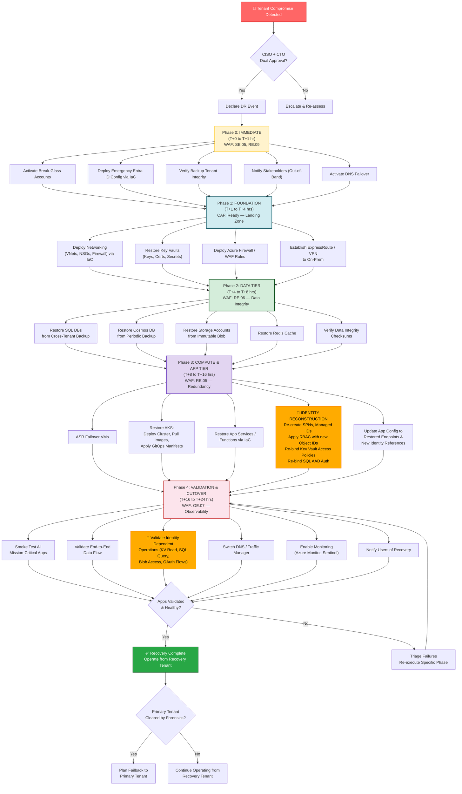

---

### 5.3 Data Protection Topology

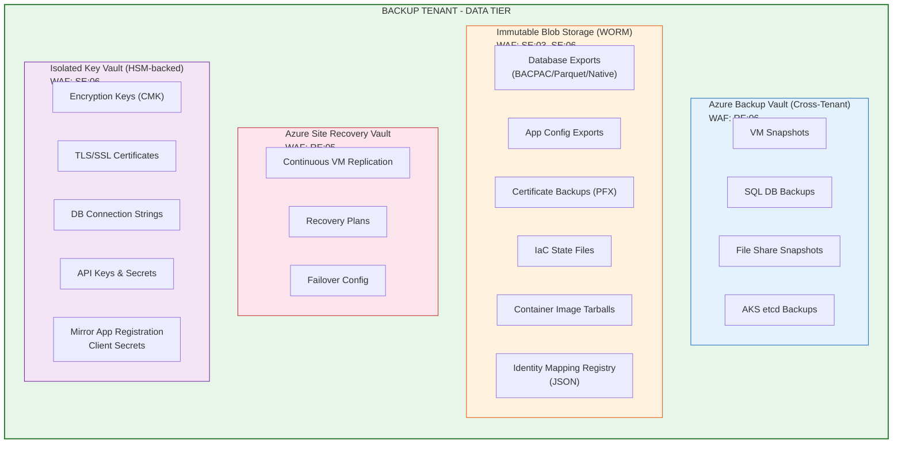

---

### 5.4 Recovery Timeline (Gantt)

```mermaid
gantt
    title Recovery Timeline — Mission Critical Application Restore
    dateFormat HH:mm
    axisFormat %H:%M

    section Phase 0 - Immediate (CAF: Manage)
    Activate Break-Glass Accounts           :p0a, 00:00, 15min
    Deploy Emergency Entra ID (IaC)         :p0b, 00:00, 45min
    Verify Backup Tenant Integrity          :p0c, 00:15, 30min
    Notify Stakeholders (Out-of-Band)       :p0d, 00:00, 15min
    Activate DNS Failover                   :p0e, 00:30, 30min

    section Phase 1 - Foundation (CAF: Ready)
    Deploy Networking (VNets/NSGs/FW)       :p1a, 01:00, 120min
    Restore Key Vaults                      :p1b, 01:00, 90min
    Deploy Azure Firewall / WAF             :p1c, 02:00, 60min
    Establish ExpressRoute / VPN            :p1d, 01:30, 150min

    section Phase 2 - Data Tier (WAF: RE:06)
    Restore SQL DBs (Cross-Tenant)          :p2a, 04:00, 180min
    Restore Cosmos DB                       :p2b, 04:00, 120min
    Restore Storage Accounts                :p2c, 04:30, 120min
    Restore Redis Cache                     :p2d, 05:00, 60min
    Verify Data Integrity                   :p2e, 07:00, 60min

    section Phase 3 - Compute & App (WAF: RE:05)
    ASR Failover VMs                        :p3a, 08:00, 120min
    Restore AKS (GitOps)                    :p3b, 08:00, 240min
    Restore App Services / Functions        :p3c, 09:00, 180min
    🔑 Re-create SPNs & App Registrations   :crit, p3d, 10:00, 120min
    🔑 Re-create Managed Identities         :crit, p3e, 10:00, 60min
    🔑 Apply RBAC with New Object IDs       :crit, p3f, 12:00, 120min
    🔑 Re-bind Key Vault Access Policies    :crit, p3g, 12:00, 60min
    🔑 Re-bind SQL AAD Auth                 :crit, p3h, 13:00, 60min
    Update App Config (endpoints + identity):p3i, 14:00, 60min

    section Phase 4 - Validation (WAF: OE:07)
    Smoke Test All Apps                     :p4a, 16:00, 120min
    🔑 Validate Identity-Dependent Ops      :crit, p4b, 16:00, 120min
    Validate E2E Data Flow                  :p4c, 16:00, 120min
    Switch DNS / Traffic Manager            :p4d, 18:00, 60min
    Enable Monitoring                       :p4e, 18:00, 120min
    Notify Users                            :p4f, 20:00, 30min
```

---

### 5.5 Network Architecture

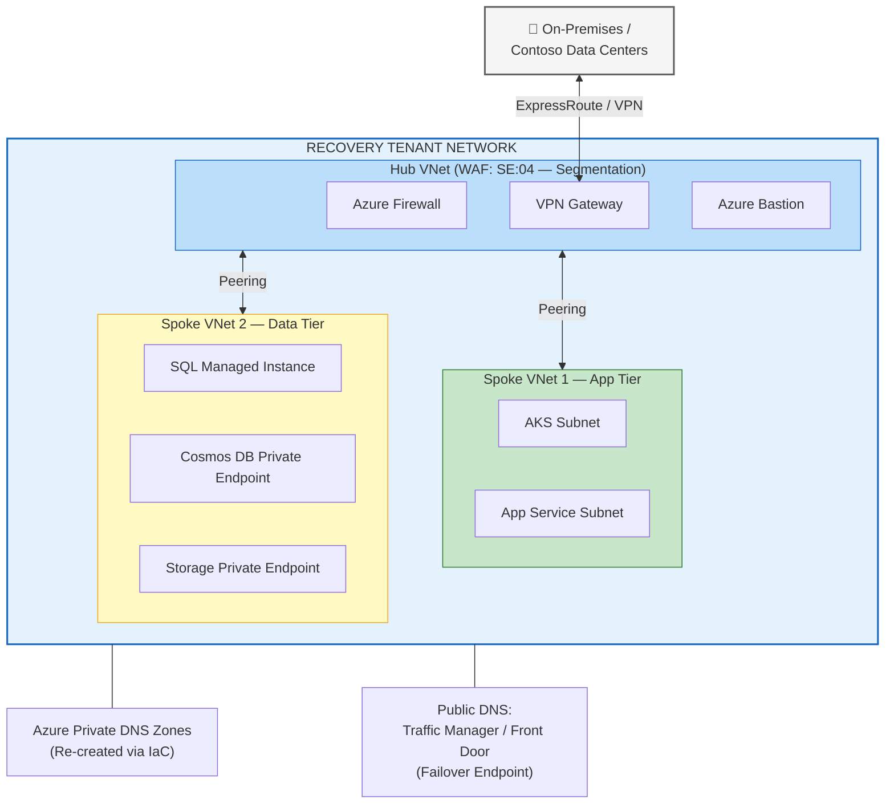

---

### 5.6 Cross-Tenant Pre-Requisite Configuration

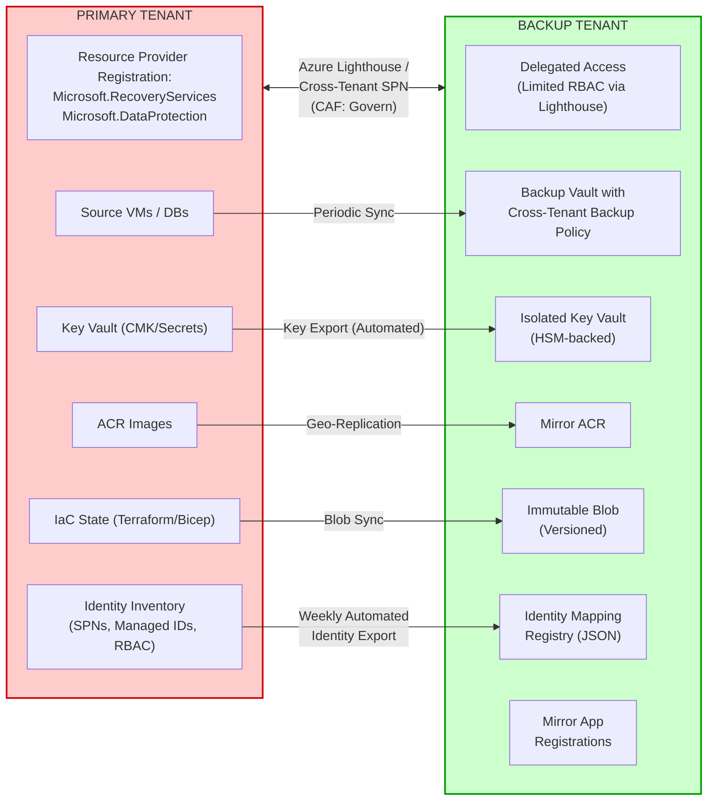

---

### 5.7 Security Model

```mermaid
mindmap
  root((🔒 Backup Tenant<br/>Security Model<br/>WAF: Security Pillar))
    Access Control — SE:05
      No day-to-day user access
      Break-glass accounts only
      FIDO2 + PIN in physical safe
      PIM with time-bound activation
      Approval workflow required
    Network Security �� SE:04
      Deny all public endpoints
      Private Endpoints for all PaaS
      No cross-tenant trust FROM backup TO primary
    Data Protection — SE:06
      Immutable storage WORM
      Resource locks CanNotDelete
      HSM-backed Key Vault
      CMK for all encryption
    Monitoring — SE:10
      Microsoft Sentinel standalone
      Audit logs forwarded externally
      Out-of-band alerting
    Isolation — SE:04
      Separate Entra ID tenant
      Separate billing and subscription
      MFA enforced everywhere
      No legacy auth protocols
    Identity Resilience — SE:05
      Identity Mapping Registry in WORM blob
      Mirror App Registrations pre-created
      IaC never hard-codes Object IDs
      Post-deploy identity re-binding automated
    Governance — CAF Govern
      Azure Policy enforcement
      Regulatory compliance DORA SOC2 ISO27001
      Quarterly access reviews
```

---

### 5.8 Governance State Machine

```mermaid
stateDiagram-v2
    [*] --> Detect: Tenant Compromise Detected

    Detect --> Declare: Security Team Validates<br/>(CAF: Manage)

    Declare --> Activate: CISO + CTO Dual Approval<br/>(CAF: Govern)

    state Activate {
        [*] --> BreakGlass: Open Physical Safe
        BreakGlass --> LoginBackup: Activate FIDO2 Keys
        LoginBackup --> VerifyIntegrity: Login to Backup Tenant
        VerifyIntegrity --> [*]: Confirm Backup Health
    }

    Activate --> Execute: Backup Tenant Verified

    state Execute {
        [*] --> Phase0: Immediate (T+0 to T+1hr)
        Phase0 --> Phase1: Foundation (T+1 to T+4hrs)
        Phase1 --> Phase2: Data Tier (T+4 to T+8hrs)
        Phase2 --> Phase3: Compute & App + Identity Reconstruction (T+8 to T+16hrs)
        Phase3 --> Phase4: Validation incl. Identity Smoke Tests (T+16 to T+24hrs)
        Phase4 --> [*]
    }

    Execute --> Validate: All Phases Complete<br/>(WAF: OE:07)

    Validate --> Operate: Apps Healthy ✅
    Validate --> Triage: Issues Found ❌
    Triage --> Execute: Re-execute Failed Phase

    Operate --> Failback: Primary Tenant Cleared<br/>by Forensics

    Failback --> [*]: Migration Complete
```

---

## 6. Landing Zone Design

> **CAF Reference:** [Azure Landing Zones](https://learn.microsoft.com/en-us/azure/cloud-adoption-framework/ready/landing-zone/)

This architecture uses a **multi-tenant landing zone** design with three distinct tenants mapped to CAF landing zone archetypes:

```mermaid
graph TB
    subgraph LZ["LANDING ZONE TOPOLOGY (CAF-Aligned)"]
        direction TB

        subgraph MGMT_GROUP["Management Group Hierarchy — Backup Tenant"]
            ROOT["Tenant Root Group"]
            PLATFORM["Platform"]
            APP["Application Landing Zones"]
            SANDBOX["Sandbox (DR Drills)"]

            ROOT --> PLATFORM
            ROOT --> APP
            ROOT --> SANDBOX

            PLATFORM --> CONN["Connectivity<br/>(Hub VNet, FW, VPN)"]
            PLATFORM --> IDENTITY["Identity<br/>(Break-Glass, PIM,<br/>Mirror App Regs)"]
            PLATFORM --> MGMT["Management<br/>(Sentinel, Monitor)"]

            APP --> TIER0["Tier 0 — Identity Recovery"]
            APP --> TIER1["Tier 1 — Data Recovery"]
            APP --> TIER2["Tier 2 — Compute Recovery"]
        end
    end

    style LZ fill:#f5f5f5,stroke:#616161,stroke-width:2px
    style MGMT_GROUP fill:#e8eaf6,stroke:#3f51b5
    style PLATFORM fill:#bbdefb,stroke:#1565c0
    style APP fill:#c8e6c9,stroke:#2e7d32
    style SANDBOX fill:#fff9c4,stroke:#f9a825
```

### Subscription Design

| Subscription | Tenant | Purpose | CAF Archetype |
|---|---|---|---|
| `sub-backup-platform` | Backup Tenant | Connectivity, Identity, Management | Platform |
| `sub-backup-storage` | Backup Tenant | Backup Vaults, Immutable Blobs, ACR Mirror, Identity Mapping Registry | Platform |
| `sub-recovery-tier0` | Recovery Tenant | Identity recovery (Entra ID, Key Vaults, SPNs, RBAC) | Application LZ |
| `sub-recovery-tier1` | Recovery Tenant | Data tier (SQL, Cosmos, Storage) | Application LZ |
| `sub-recovery-tier2` | Recovery Tenant | Compute tier (AKS, VMs, App Services) | Application LZ |
| `sub-recovery-sandbox` | Recovery Tenant | DR drill environment | Sandbox |

### Azure Policy Assignments (Backup Tenant)

| Policy | Scope | Effect | WAF Pillar |
|---|---|---|---|
| Deny public network access | All subscriptions | Deny | Security |
| Require encryption at rest (CMK) | All subscriptions | Deny | Security |
| Require resource locks on vaults | Platform subscription | Audit → Deny | Reliability |
| Require tags (`purpose`, `tier`, `rto`) | All subscriptions | Deny | Operational Excellence |
| Allowed locations (paired regions only) | All subscriptions | Deny | Reliability |
| Deny classic resources | All subscriptions | Deny | Security |
| Require Private Endpoints | All subscriptions | Deny | Security |
| Require diagnostic settings | All subscriptions | DeployIfNotExists | Operational Excellence |

---

## 7. Identity & Access Architecture

> **CAF Reference:** [Identity and access management](https://learn.microsoft.com/en-us/azure/cloud-adoption-framework/ready/landing-zone/design-area/identity-access)
> **WAF Reference:** [SE:05 — Identity and access management](https://learn.microsoft.com/en-us/azure/well-architected/security/identity-access)

| Component | Pre-Positioned in Backup Tenant | Recovery Action | WAF Code |
|---|---|---|---|
| **Break-Glass Accounts** | ✅ Pre-created Global Admin accounts (MFA with hardware FIDO2 keys stored in physical safe) | Activate immediately | SE:05 |
| **Emergency Entra ID Tenant** | ✅ Skeleton tenant with core groups, roles, Conditional Access policies as IaC | Deploy full identity config via pipeline | SE:05 |
| **Service Principals / Managed Identities** | ✅ Documented App Registrations & secrets in isolated Key Vault; **Identity Mapping Registry** maintained | Re-create via IaC using mapping registry; rotate all secrets; apply RBAC with new Object IDs | SE:05 |
| **B2B/B2C Identity** | ✅ Configuration exported as IaC | Redeploy; update redirect URIs | SE:05 |
| **Conditional Access & PIM** | ✅ Policies stored as JSON/Bicep | Apply to recovery tenant | SE:05 |
| **Identity Mapping Registry** | ✅ Automated weekly export of all SPNs, Managed IDs, RBAC assignments, Key Vault policies, SQL AAD roles | Used by recovery IaC to reconstruct all identity bindings in recovery tenant | SE:05 |
| **Mirror App Registrations** | ✅ Pre-created in recovery tenant with documented Client IDs | Activate; update redirect URIs; issue new client secrets | SE:05 |

> **Key Decision:** Use a **pre-provisioned recovery Entra ID tenant** (not the backup tenant itself) to maintain isolation of backups during recovery. This aligns with WAF SE:04 (Segmentation).

---

### 7A. Identity Recovery Deep-Dive: Solving the Tenant-Bound Identity Breakage Problem

> **⚠️ This is the #1 recovery blocker in cross-tenant DR scenarios.**
>
> When you rebuild workloads in a new tenant, **every identity object gets a new Object ID**. This breaks all RBAC role assignments, Key Vault access policies, SQL AAD authentication, Storage RBAC, and OAuth flows. This section provides the concrete patterns to solve this.

#### 7A.1 The Problem: What Breaks and Why

```mermaid
graph TD
    subgraph PROBLEM["🚨 WHAT BREAKS WHEN YOU MOVE TO A NEW TENANT"]
        direction TB

        subgraph IDENTITY["Tenant-Bound Identity Objects"]
            ID1["Service Principals (SPNs)<br/>Object ID is tenant-specific"]
            ID2["System-Assigned Managed Identities<br/>Tied to resource + tenant"]
            ID3["User-Assigned Managed Identities<br/>Object ID is tenant-specific"]
            ID4["App Registrations<br/>Application ID is tenant-bound"]
            ID5["Entra ID Groups<br/>Object ID is tenant-specific"]
        end

        subgraph DOWNSTREAM["What References These Object IDs"]
            DS1["RBAC Role Assignments<br/>(all scopes: MG, Sub, RG, Resource)"]
            DS2["Key Vault Access Policies<br/>(get/list/set secrets, keys, certs)"]
            DS3["SQL AAD Authentication<br/>(server admin + contained DB users)"]
            DS4["Storage Account RBAC<br/>(Blob/Queue/Table data roles)"]
            DS5["Cosmos DB RBAC"]
            DS6["AKS AAD Integration<br/>(cluster admin groups)"]
            DS7["App Service Auth<br/>(EasyAuth config)"]
            DS8["API Management<br/>(Managed Identity for backends)"]
            DS9["OAuth Redirect URIs<br/>(client IDs in app config)"]
        end

        ID1 --> DS1
        ID1 --> DS2
        ID1 --> DS3
        ID2 --> DS2
        ID2 --> DS4
        ID2 --> DS5
        ID3 --> DS1
        ID3 --> DS4
        ID4 --> DS9
        ID5 --> DS1
        ID5 --> DS6
    end

    style PROBLEM fill:#ffebee,stroke:#c62828,stroke-width:2px
    style IDENTITY fill:#ffcdd2,stroke:#c62828
    style DOWNSTREAM fill:#fff3e0,stroke:#e65100
```

#### 7A.2 Detailed Breakage Matrix

| Identity Object | Tenant-Bound? | What Breaks in Recovery Tenant | Recovery Complexity |
|---|---|---|---|
| **Service Principals (SPNs)** | ✅ Yes — Object ID is tenant-specific | All RBAC role assignments referencing old Object IDs → **invalid** | High — must re-create SPN, re-apply all RBAC |
| **System-Assigned Managed Identities** | ✅ Yes — tied to resource + tenant | Cannot exist in new tenant; auto-created with new resource but with **new Object ID** → Key Vault access, Storage RBAC, SQL auth all **broken** | High — must re-bind every access policy post-deploy |
| **User-Assigned Managed Identities** | ✅ Yes — Object ID is tenant-specific | Same breakage as system-assigned; new Object IDs in recovery tenant | High — same re-binding required |
| **App Registrations** | ✅ Yes — Application ID is tenant-bound | OAuth redirect URIs, client IDs in downstream configs all change; API permissions must be re-granted | Very High — affects every OAuth/OIDC integration |
| **RBAC Role Assignments** | ✅ Yes — reference principal Object IDs | Every `az role assignment` pointing to old IDs → **assignment is orphaned/invalid** | Medium — automated via Identity Mapping + IaC |
| **Key Vault Access Policies** | ✅ Yes — reference Object IDs | Apps lose access to secrets, keys, certs | High — must re-apply with new Object IDs |
| **SQL AAD Auth** | ✅ Yes — references Entra Object IDs | Database admins and contained users → **cannot authenticate** | High — must re-set AAD admin, re-create contained users |
| **Conditional Access Policies** | ✅ Yes — reference group/user Object IDs | Policies referencing old groups won't match any subjects | Medium — re-create groups first, then apply policies |
| **AKS Cluster Admin Groups** | ✅ Yes — references Entra Group Object IDs | Kubernetes RBAC bound to AAD groups breaks | Medium — update AKS AAD config with new group IDs |

#### 7A.3 Solution Architecture: Identity Reconstruction Pipeline

```mermaid
flowchart TD
    subgraph PRE["PRE-REQUISITE (Steady State — Before Incident)"]
        P1["Weekly Automated Export:<br/>All SPNs, Managed IDs, RBAC,<br/>KV Policies, SQL AAD Roles"]
        P2["Identity Mapping Registry<br/>stored in WORM Blob"]
        P3["Mirror App Registrations<br/>pre-created in Recovery Tenant"]
        P4["IaC templates use<br/>display-name lookups<br/>(NEVER hard-coded Object IDs)"]
        P1 --> P2
    end

    subgraph RECOVERY["DURING RECOVERY (Phase 3)"]
        R1["Step 1: Load Identity Mapping<br/>Registry from WORM Blob"]
        R2["Step 2: Create SPNs via IaC<br/>(same display names,<br/>new Object IDs generated)"]
        R3["Step 3: Create User-Assigned<br/>Managed Identities via IaC"]
        R4["Step 4: Deploy Resources<br/>(VMs, AKS, App Services)<br/>System-Assigned MIs auto-created"]
        R5["Step 5: Collect all new Object IDs<br/>(SPNs + System MI + User MI)"]
        R6["Step 6: Apply RBAC Role<br/>Assignments using new Object IDs"]
        R7["Step 7: Apply Key Vault<br/>Access Policies using new Object IDs"]
        R8["Step 8: Set SQL AAD Admin &<br/>re-create contained DB users"]
        R9["Step 9: Update App Config<br/>(connection strings, client IDs,<br/>redirect URIs)"]
        R10["Step 10: Activate Mirror<br/>App Registrations<br/>(issue new client secrets)"]

        R1 --> R2 --> R3 --> R4 --> R5
        R5 --> R6
        R5 --> R7
        R5 --> R8
        R6 & R7 & R8 --> R9
        R9 --> R10
    end

    subgraph VALIDATE["VALIDATION (Phase 4)"]
        V1["Smoke Test: SPN can<br/>read Key Vault secret"]
        V2["Smoke Test: Managed ID<br/>can access Storage blob"]
        V3["Smoke Test: SQL AAD auth<br/>works for app identity"]
        V4["Smoke Test: OAuth flow<br/>completes end-to-end"]
        V5["Smoke Test: AKS AAD<br/>group-based RBAC works"]
    end

    PRE --> RECOVERY --> VALIDATE

    style PRE fill:#e8f5e9,stroke:#2e7d32,stroke-width:2px
    style RECOVERY fill:#e3f2fd,stroke:#1565c0,stroke-width:2px
    style VALIDATE fill:#fff3e0,stroke:#e65100,stroke-width:2px
```

#### 7A.4 Identity Mapping Registry — Schema & Automation

The Identity Mapping Registry is the **key artifact** that enables automated identity reconstruction. It is an automated, continuously-synced JSON file that maps every identity object from the primary tenant to its planned equivalent in the recovery tenant.

**Schema:**

```json
{
  "metadata": {
    "exported_at": "2026-03-25T14:00:00Z",
    "source_tenant_id": "aaaa-bbbb-cccc-dddd",
    "recovery_tenant_id": "eeee-ffff-gggg-hhhh",
    "version": "1.0"
  },
  "service_principals": [
    {
      "display_name": "api-backend-sp",
      "primary_tenant_object_id": "11111111-aaaa-bbbb-cccc-dddddddddddd",
      "primary_tenant_app_id": "22222222-aaaa-bbbb-cccc-dddddddddddd",
      "recovery_tenant_mirror_app_id": "33333333-aaaa-bbbb-cccc-dddddddddddd",
      "type": "AppRegistration",
      "rbac_assignments": [
        {
          "scope": "/subscriptions/xxx/resourceGroups/rg-app",
          "role_definition_name": "Contributor"
        },
        {
          "scope": "/subscriptions/xxx/resourceGroups/rg-data",
          "role_definition_name": "Storage Blob Data Contributor"
        }
      ],
      "key_vault_access": [
        {
          "vault_name": "kv-prod",
          "permissions_to_secrets": ["get", "list"],
          "permissions_to_keys": ["get", "wrapKey", "unwrapKey"],
          "permissions_to_certificates": ["get", "list"]
        }
      ],
      "sql_aad_roles": [
        {
          "server": "sql-prod.database.windows.net",
          "database": "appdb",
          "roles": ["db_datareader", "db_datawriter"]
        }
      ]
    }
  ],
  "managed_identities": [
    {
      "display_name": "mi-webapp-prod",
      "type": "UserAssigned",
      "primary_tenant_object_id": "44444444-aaaa-bbbb-cccc-dddddddddddd",
      "primary_tenant_resource_id": "/subscriptions/xxx/resourceGroups/rg-identity/providers/Microsoft.ManagedIdentity/userAssignedIdentities/mi-webapp-prod",
      "rbac_assignments": [
        {
          "scope": "/subscriptions/xxx/resourceGroups/rg-data/providers/Microsoft.Storage/storageAccounts/stprod",
          "role_definition_name": "Storage Blob Data Reader"
        }
      ],
      "key_vault_access": [
        {
          "vault_name": "kv-prod",
          "permissions_to_secrets": ["get", "list"]
        }
      ]
    },
    {
      "display_name": "mi-aks-system",
      "type": "SystemAssigned",
      "primary_tenant_object_id": "55555555-aaaa-bbbb-cccc-dddddddddddd",
      "primary_tenant_resource_id": "/subscriptions/xxx/resourceGroups/rg-aks/providers/Microsoft.ContainerService/managedClusters/aks-prod",
      "note": "System-assigned MI will get new Object ID when AKS cluster is recreated; capture new ID post-deploy",
      "rbac_assignments": [
        {
          "scope": "/subscriptions/xxx/resourceGroups/rg-aks",
          "role_definition_name": "Network Contributor"
        }
      ]
    }
  ],
  "entra_groups": [
    {
      "display_name": "sg-aks-cluster-admins",
      "primary_tenant_object_id": "66666666-aaaa-bbbb-cccc-dddddddddddd",
      "members": ["user1@Contoso.com", "user2@Contoso.com"],
      "used_by": ["AKS AAD Integration — clusterAdmin group"]
    },
    {
      "display_name": "sg-sql-admins",
      "primary_tenant_object_id": "77777777-aaaa-bbbb-cccc-dddddddddddd",
      "members": ["dba1@Contoso.com", "dba2@Contoso.com"],
      "used_by": ["SQL AAD Admin group"]
    }
  ],
  "conditional_access_group_references": [
    {
      "policy_name": "CA-001-Require-MFA-Admins",
      "referenced_group": "sg-global-admins",
      "primary_tenant_group_id": "88888888-aaaa-bbbb-cccc-dddddddddddd"
    }
  ]
}
```

**Automation Script (conceptual — Azure CLI + PowerShell):**

```powershell
# Weekly Identity Export — runs as Azure Automation Runbook
# Exports all identity objects from primary tenant to WORM blob

# 1. Export all App Registrations
$apps = Get-MgApplication -All
# 2. Export all Service Principals
$spns = Get-MgServicePrincipal -All
# 3. Export all RBAC Role Assignments (all subscription scopes)
$rbac = Get-AzRoleAssignment -Scope "/subscriptions/$subId"
# 4. Export all Key Vault Access Policies
$kvPolicies = foreach ($kv in Get-AzKeyVault) {
    Get-AzKeyVault -VaultName $kv.VaultName
}
# 5. Export all Managed Identities
$managedIds = Get-AzUserAssignedIdentity -ResourceGroupName "*"
# 6. Export SQL AAD admin settings
$sqlAdmins = foreach ($server in Get-AzSqlServer) {
    Get-AzSqlServerActiveDirectoryAdministrator `
        -ServerName $server.ServerName `
        -ResourceGroupName $server.ResourceGroupName
}
# 7. Export Entra groups and memberships
$groups = Get-MgGroup -All

# Build mapping JSON and upload to WORM blob
$mapping = @{
    metadata = @{
        exported_at = (Get-Date -Format o)
        version = "1.0"
    }
    service_principals = $spns
    # ... build full schema
}
$mapping | ConvertTo-Json -Depth 10 |
    Set-AzStorageBlobContent `
        -Container "identity-registry" `
        -Blob "mapping-$(Get-Date -Format yyyy-MM-dd).json" `
        -Context $wormStorageContext
```

#### 7A.5 IaC Pattern: Display-Name Lookups (Never Hard-Code Object IDs)

**❌ Anti-Pattern (will break in cross-tenant recovery):**

```Contoso
resource "azurerm_role_assignment" "example" {
  scope                = azurerm_resource_group.app.id
  role_definition_name = "Contributor"
  principal_id         = "11111111-aaaa-bbbb-cccc-dddddddddddd"  # HARD-CODED — WILL BREAK!
}
```

**✅ Correct Pattern (works across tenants):**

```Contoso
# Lookup the SPN by display name in whichever tenant we're deploying to
data "azuread_service_principal" "api_backend" {
  display_name = "api-backend-sp"
}

resource "azurerm_role_assignment" "api_backend_contributor" {
  scope                = azurerm_resource_group.app.id
  role_definition_name = "Contributor"
  principal_id         = data.azuread_service_principal.api_backend.object_id
}
```

**✅ Key Vault Access Policy — Lookup Pattern:**

```Contoso
data "azuread_service_principal" "webapp" {
  display_name = "webapp-prod-sp"
}

resource "azurerm_key_vault_access_policy" "webapp" {
  key_vault_id = azurerm_key_vault.main.id
  tenant_id    = data.azurerm_client_config.current.tenant_id
  object_id    = data.azuread_service_principal.webapp.object_id

  secret_permissions      = ["Get", "List"]
  key_permissions         = ["Get", "WrapKey", "UnwrapKey"]
  certificate_permissions = ["Get", "List"]
}
```

**✅ Post-Deploy Managed Identity Re-binding (for System-Assigned):**

```Contoso
# System-assigned MI is auto-created when resource is deployed
# Capture the new Object ID and use it for RBAC
resource "azurerm_role_assignment" "aks_network" {
  scope                = azurerm_resource_group.aks.id
  role_definition_name = "Network Contributor"
  principal_id         = azurerm_kubernetes_cluster.main.identity[0].principal_id
}

resource "azurerm_role_assignment" "appservice_storage" {
  scope                = azurerm_storage_account.data.id
  role_definition_name = "Storage Blob Data Reader"
  principal_id         = azurerm_linux_web_app.main.identity[0].principal_id
}
```

#### 7A.6 SQL AAD Authentication Re-binding Procedure

SQL databases with AAD authentication require special handling:

```sql
-- Step 1: Set the new Entra AD admin (recovery tenant) on the SQL Server
-- (done via Terraform/Bicep or Azure CLI)
-- az sql server ad-admin create --resource-group rg-data --server sql-recovery \
--   --display-name "sg-sql-admins" --object-id <NEW-GROUP-OBJECT-ID>

-- Step 2: After DB restore, re-create contained database users
-- Connect to each restored database and execute:

-- Drop old user (if exists with old SID)
IF EXISTS (SELECT * FROM sys.database_principals WHERE name = 'api-backend-sp')
    DROP USER [api-backend-sp];

-- Create new contained user mapped to new SPN in recovery tenant
CREATE USER [api-backend-sp] FROM EXTERNAL PROVIDER;
ALTER ROLE db_datareader ADD MEMBER [api-backend-sp];
ALTER ROLE db_datawriter ADD MEMBER [api-backend-sp];

-- Repeat for Managed Identities
IF EXISTS (SELECT * FROM sys.database_principals WHERE name = 'mi-webapp-prod')
    DROP USER [mi-webapp-prod];

CREATE USER [mi-webapp-prod] FROM EXTERNAL PROVIDER;
ALTER ROLE db_datareader ADD MEMBER [mi-webapp-prod];
```

#### 7A.7 Microsoft Entra ID Backup & Recovery (Preview — March 2026)

> **Note:** Microsoft launched **Entra ID Backup & Recovery** in public preview in March 2026. This provides native automated backup of tenant configuration objects (Users, Groups, Applications, Service Principals, Conditional Access policies, etc.) with point-in-time restore capability.

| Feature | Capability | Relevance to This Architecture |
|---|---|---|
| **Automatic Daily Backups** | Backs up supported objects daily; 5-day retention | Defense-in-depth for same-tenant recovery scenarios |
| **Granular Restore** | Restore all objects, by type, or by individual Object ID (up to 100/job) | Useful if primary tenant is recovered (not locked for forensics) |
| **Difference Reports** | Compare current state to any backup snapshot before restoring | Aids forensic investigation once primary tenant is accessible |
| **Immutable & Secure** | Backups cannot be deleted or altered by any admin, including Global Admin | Protects against insider threat or compromised admin |
| **Supported Objects** | Users, Groups, Applications, Service Principals, CA Policies, Named Locations, Auth Method/Authorization Policies | Covers most identity objects needed |

**⚠️ Important Limitation:** Entra Backup & Recovery restores **within the same tenant**. It does **not** support cross-tenant identity restoration. For our scenario (primary tenant locked for forensics), the Identity Mapping Registry + IaC approach described above remains the primary recovery mechanism. Enable Entra Backup & Recovery as **defense-in-depth** — it will be invaluable when the primary tenant is eventually returned to Contoso after forensics.

**Recommendation:** Enable this preview feature on both the primary and backup tenants immediately.

#### 7A.8 Multi-Tenant Managed Identity (Emerging — 2025/2026)

Microsoft has begun enabling **cross-tenant managed identity federation**, where a user-assigned managed identity in one tenant can authenticate to resources in another tenant via federated credentials. This is relevant for:

- **Backup automation:** A managed identity in the backup tenant could access primary tenant resources for automated backup sync (without storing secrets)
- **Recovery validation:** A managed identity in the recovery tenant could validate backup integrity in the backup tenant

**Current Status:** Available for user-assigned managed identities via federated credential configuration. Monitor [Microsoft Entra Workload ID documentation](https://learn.microsoft.com/en-us/entra/workload-id/) for GA timeline and expanded support.

---

## 8. Data Protection & Backup Strategy

> **WAF Reference:** [RE:06 — Data integrity](https://learn.microsoft.com/en-us/azure/well-architected/reliability/highly-available-multi-region-design)

### Backup Mechanisms (Ranked by Recovery Speed)

| Priority | Mechanism | RPO | RTO | Best For | WAF Code |
|---|---|---|---|---|---|
| **P0** | **Azure Site Recovery (Cross-Tenant)** | ~5 min | **< 2 hours** | VMs, full environment failover | RE:05 |
| **P1** | **Cross-Tenant Azure Backup (CRR)** | ~1 hour | **4-8 hours** | VMs, SQL, File Shares | RE:06 |
| **P2** | **Immutable Blob + Geo-Replication** | ~15 min | **2-6 hours** | Unstructured data, DB exports | RE:06, SE:03 |
| **P3** | **Container Registry Geo-Replication** | ~minutes | **1-2 hours** | Container images (ACR) | RE:05 |
| **P4** | **IaC Rebuild (Terraform/Bicep)** | N/A (config) | **4-12 hours** | Stateless infrastructure | OE:05 |
| **P5** | **Identity Mapping Registry** | Weekly export | **2-4 hours** | SPN/RBAC/MI reconstruction | SE:05 |

### Data Classification & Protection Matrix

| Classification | Examples | Backup Frequency | Retention | Encryption | WAF Code |
|---|---|---|---|---|---|
| **Confidential** | Customer PII, financial data | Every 15 min (ASR) | 90 days | CMK (HSM) | SE:03, SE:06 |
| **Internal** | Application config, logs | Hourly | 30 days | CMK | SE:03 |
| **Public** | Static web content | Daily | 14 days | Platform-managed | SE:03 |
| **Identity** | SPNs, RBAC, KV policies, SQL AAD roles | Weekly (automated) | 90 days | CMK (HSM) | SE:05 |

---

## 9. Application Recovery by Tier

### Restore Sequence (Dependency-Ordered)

| Phase | Tier | Duration | Dependencies | CAF Phase | WAF Pillar |
|---|---|---|---|---|---|
| **Phase 0** | Immediate (Identity) | T+0 to T+1 hr | None | Manage | Security |
| **Phase 1** | Foundation (Network) | T+1 to T+4 hrs | Phase 0 | Ready | Reliability |
| **Phase 2** | Data Tier | T+4 to T+8 hrs | Phase 1 | Adopt | Reliability |
| **Phase 3** | Compute, App & **Identity Reconstruction** | T+8 to T+16 hrs | Phase 2 | Adopt | Reliability, Security |
| **Phase 4** | Validation, **Identity Smoke Tests** & Cutover | T+16 to T+24 hrs | Phase 3 | Manage | Op. Excellence |

---

## 10. Pre-Requisites Checklist

| # | Pre-Requisite | Azure Service | CAF Phase | WAF Pillar | Status |
|---|---|---|---|---|---|
| 1 | Cross-tenant backup configured | Azure Backup (CRR) | Ready | Reliability | ⬜ |
| 2 | ASR replication to backup tenant | Azure Site Recovery | Ready | Reliability | ⬜ |
| 3 | Immutable storage with WORM/Legal Hold | Blob Storage | Ready | Security | ⬜ |
| 4 | IaC for entire infra stored externally | Terraform/Bicep in Git + Blob | Ready | Op. Excellence | ⬜ |
| 5 | Break-glass accounts in backup tenant | Entra ID | Govern | Security | ⬜ |
| 6 | Key/Secret/Cert backup automated | Key Vault | Ready | Security | ⬜ |
| 7 | Container images mirrored | ACR Geo-Replication | Ready | Reliability | ⬜ |
| 8 | DNS failover configured | Traffic Manager / Front Door | Ready | Reliability | ⬜ |
| 9 | Network IaC with pre-planned CIDR | Terraform/Bicep | Ready | Op. Excellence | ⬜ |
| 10 | Recovery runbook tested quarterly | Internal Process | Manage | Op. Excellence | ⬜ |
| 11 | Out-of-band communication plan | Teams/Slack alt, Phone tree | Manage | Op. Excellence | ⬜ |
| 12 | Lighthouse / Cross-tenant SPN setup | Azure Lighthouse | Govern | Security | ⬜ |
| 13 | Azure Policy assignments applied | Azure Policy | Govern | Security | ⬜ |
| 14 | Management group hierarchy created | Management Groups | Ready | Op. Excellence | ⬜ |
| 15 | Subscription quota pre-allocated | Azure Subscriptions | Plan | Performance | ⬜ |
| 16 | **Identity Mapping Registry automated** | **Entra ID + Azure Automation + WORM Blob** | **Govern** | **Security** | ⬜ |
| 17 | **Mirror App Registrations pre-created in recovery tenant** | **Entra ID** | **Ready** | **Security** | ⬜ |
| 18 | **IaC uses display-name lookups (not hard-coded Object IDs)** | **Terraform/Bicep** | **Govern** | **Op. Excellence** | ⬜ |
| 19 | **Post-deployment identity re-binding scripts tested** | **Azure Automation / PowerShell / SQL Scripts** | **Manage** | **Security** | ⬜ |
| 20 | **Entra Backup & Recovery enabled (preview)** | **Entra ID** | **Govern** | **Security** | ⬜ |
| 21 | **SQL AAD contained user re-creation scripts tested** | **Azure SQL / Scripts** | **Manage** | **Security** | ⬜ |
| 22 | **Identity-dependent smoke tests included in DR drill** | **Internal Process** | **Manage** | **Op. Excellence** | ⬜ |

---

## 11. Restore Approach Comparison

| Rank | Approach | RTO | Complexity | Monthly Cost (Idle) | WAF Recommendation |
|---|---|---|---|---|---|
| 🥇 | **ASR Cross-Tenant Failover** | **1-4 hrs** | Medium | ~$25/VM | RE:05 — Preferred for stateful |
| 🥈 | **IaC Rebuild + Backup Restore** | **4-12 hrs** | High | ~$200 (storage only) | OE:05 — Preferred for stateless |
| 🥉 | **Pilot Light in Recovery Tenant** | **2-6 hrs** | Medium-High | ~$500-1,000 | CO:05 — Good balance |
| 4 | **Full Warm Standby** | **< 1 hr** | Very High (💰) | ~$10,000+ | CO:02 — Only if mandated |

### 🥇 Recommended: Hybrid ASR + IaC Approach

For Contoso's scenario, combine:

- **ASR** for stateful VMs (databases, legacy apps) → aligns with **RE:05**
- **IaC + GitOps** for cloud-native workloads (AKS, App Services) → aligns with **OE:05**
- **Immutable Blob Restore** for data-tier recovery → aligns with **RE:06 + SE:03**
- **Identity Mapping Registry + IaC display-name lookups** for identity reconstruction → aligns with **SE:05**

This balances **cost (CO:05)** vs. **recovery speed (RE:09)** and avoids the expense of a full warm standby.

---

## 12. Target RTO/RPO Matrix

| Application Tier | Example | Backup Method | Target RPO | Target RTO | WAF Code |
|---|---|---|---|---|---|
| **Tier 0 – Identity** | Entra ID, Key Vault, SPNs, RBAC | IaC + Key Backup + Identity Mapping Registry | 0 (config) / 1 week (identity inventory) | < 1 hour (base) / +2 hrs (RBAC reconstruction) | SE:05, RE:01 |
| **Tier 1 – Core Data** | SQL DB, Cosmos DB | Cross-Tenant Backup + Immutable Blob | < 1 hour | 4-8 hours | RE:06 |
| **Tier 2 – Compute** | AKS, VMs, App Services | ASR + IaC + ACR Mirror | < 5 min (ASR) | 2-8 hours | RE:05 |
| **Tier 3 – Integration** | API Management, Service Bus | IaC Rebuild + Config Restore | < 1 hour | 8-12 hours | OE:05 |
| **Tier 4 – Monitoring** | Sentinel, Monitor, Alerts | IaC Rebuild | N/A | 12-24 hours | OE:07 |

---

## 13. WAF Assessment Checklist

Use this checklist to assess the architecture against the Well-Architected Framework:

### Reliability Assessment

- [ ] RTO/RPO targets defined and documented for all tiers
- [ ] ASR replication health monitored and alerted
- [ ] Backup integrity validated weekly (automated)
- [ ] DR drills conducted quarterly with documented results
- [ ] Failure modes identified and mitigations implemented
- [ ] Recovery procedures are idempotent and re-runnable
- [ ] Cross-region backup (CRR) enabled within backup tenant

### Security Assessment

- [ ] Zero standing access enforced in backup tenant
- [ ] Break-glass accounts tested semi-annually
- [ ] All storage uses customer-managed keys (CMK) with HSM
- [ ] Private endpoints configured for all PaaS services
- [ ] No trust relationship from backup tenant to primary tenant
- [ ] Azure Policy enforces security baseline
- [ ] Sentinel deployed independently in backup tenant
- [ ] WORM/immutability policy applied to all backup storage
- [ ] Conditional Access policies enforced (no legacy auth)

### Identity Reconstruction Assessment ⚡ NEW

- [ ] Identity Mapping Registry automated and running weekly
- [ ] Identity Mapping Registry stored in WORM blob (immutable)
- [ ] Mirror App Registrations pre-created in recovery tenant
- [ ] All IaC templates use display-name lookups (no hard-coded Object IDs)
- [ ] Post-deployment identity re-binding scripts exist and are tested
- [ ] SQL AAD contained user re-creation scripts exist and are tested
- [ ] Identity-dependent smoke tests included in every DR drill
- [ ] Entra Backup & Recovery (preview) enabled on primary and backup tenants
- [ ] Multi-tenant managed identity federation evaluated for backup automation
- [ ] Identity Mapping Registry completeness validated against live Entra ID monthly

### Cost Optimization Assessment

- [ ] DR resources tagged with `purpose:disaster-recovery`
- [ ] Monthly cost review for DR infrastructure
- [ ] Right-sized ASR target VMs (can be resized post-failover)
- [ ] Archive tier used for older backups
- [ ] DR drill costs tracked and budgeted

### Operational Excellence Assessment

- [ ] All infrastructure defined as code (Terraform/Bicep)
- [ ] IaC drift detection runs daily
- [ ] Recovery runbook version-controlled and updated within 90 days
- [ ] Post-DR-drill retrospectives conducted
- [ ] Team training current (all primary + backup team members)
- [ ] Monitoring and alerting operational in backup tenant

### Performance Efficiency Assessment

- [ ] Subscription quota pre-allocated for critical SKUs
- [ ] Performance baselines documented for key applications
- [ ] Performance testing included in DR drills
- [ ] Network bandwidth assessed for recovery data transfer
- [ ] AKS node pool sizing matches production requirements

---

## 14. Governance & Compliance

> **CAF Reference:** [Govern methodology](https://learn.microsoft.com/en-us/azure/cloud-adoption-framework/govern/)

### Regulatory Alignment

| Regulation | Requirement | How This Architecture Satisfies |
|---|---|---|
| **ISO 27001** (A.17) | Business continuity planning | Documented DR procedures, quarterly testing, defined RTO/RPO |
| **SOC 2** (A1.2) | Recovery objectives defined and tested | Tiered RTO/RPO, automated backup validation, DR drills |
| **DORA** (Art. 11-12) | ICT business continuity & DR testing | Cross-tenant isolation, annual/quarterly DR exercises |
| **NIST CSF** (PR.IP-9) | Response and recovery plans tested | Recovery runbook, Gantt-charted phases, governance state machine |
| **Azure Security Benchmark** | Backup and recovery controls | ASR, cross-tenant backup, immutable storage, CMK encryption |

### RACI Matrix

| Activity | Cloud Ops | Security | Platform Eng. | Architecture | Business |
|---|---|---|---|---|---|
| DR Declaration | C | A/R | I | C | A |
| Break-Glass Activation | R | A | I | I | I |
| Infrastructure Recovery | R | C | A | C | I |
| Data Restoration | A/R | C | C | I | I |
| **Identity Reconstruction** | R | A | **A/R** | C | I |
| Application Recovery | R | C | A | C | I |
| Validation & Cutover | A/R | R | C | C | A |
| Post-Incident Review | R | A/R | R | R | C |

> **A** = Accountable, **R** = Responsible, **C** = Consulted, **I** = Informed

---

## 15. Next Steps & Roadmap

### Implementation Roadmap (CAF-Aligned)

```mermaid
gantt
    title Implementation Roadmap — Cross-Tenant DR
    dateFormat YYYY-MM-DD
    axisFormat %b %Y

    section CAF: Strategy (Month 1)
    Business Impact Analysis          :s1, 2026-04-01, 14d
    Stakeholder Alignment             :s2, 2026-04-01, 14d
    Budget Approval                   :s3, 2026-04-08, 14d

    section CAF: Plan (Month 1-2)
    Digital Estate Assessment         :p1, 2026-04-15, 21d
    Application Tiering               :p2, 2026-04-22, 14d
    Skills Gap Analysis               :p3, 2026-04-22, 14d
    Subscription & LZ Design          :p4, 2026-05-01, 14d
    Identity Inventory & Mapping      :crit, p5, 2026-04-22, 21d

    section CAF: Ready (Month 2-3)
    Backup Tenant Provisioning        :r1, 2026-05-15, 14d
    Landing Zone Deployment (IaC)     :r2, 2026-05-22, 21d
    Network & Connectivity Setup      :r3, 2026-05-29, 14d
    Key Vault & Identity Setup        :r4, 2026-06-01, 14d
    Mirror App Registrations          :crit, r5, 2026-06-01, 14d

    section CAF: Adopt (Month 3-4)
    ASR Configuration                 :a1, 2026-06-15, 14d
    Cross-Tenant Backup Setup         :a2, 2026-06-15, 21d
    ACR Geo-Replication               :a3, 2026-06-22, 7d
    IaC Pipeline Development          :a4, 2026-06-22, 21d
    Identity Mapping Registry Automation :crit, a5, 2026-06-22, 14d
    Identity Re-binding Scripts       :crit, a6, 2026-07-01, 14d

    section CAF: Govern (Month 4-5)
    Azure Policy Assignments          :g1, 2026-07-15, 14d
    Security Baseline Enforcement     :g2, 2026-07-15, 14d
    Compliance Documentation          :g3, 2026-07-22, 14d
    Break-Glass Procedure Seal        :g4, 2026-07-29, 7d
    Enable Entra Backup & Recovery    :crit, g5, 2026-07-15, 7d

    section CAF: Manage (Month 5-6)
    First DR Drill (incl. Identity)   :m1, 2026-08-15, 5d
    Runbook Finalization              :m2, 2026-08-20, 7d
    Monitoring & Alerting Setup       :m3, 2026-08-15, 14d
    Identity Smoke Test Validation    :crit, m4, 2026-08-20, 3d
    Post-Drill Retrospective          :m5, 2026-08-25, 3d
    Go-Live Readiness Review          :m6, 2026-08-28, 3d
```

### Action Items

- [ ] **Strategy:** Complete Business Impact Analysis and secure executive sponsorship
- [ ] **Plan:** Inventory all mission-critical applications and classify by tier
- [ ] **Plan:** Complete full identity inventory (SPNs, Managed IDs, RBAC, KV policies, SQL AAD roles)
- [ ] **Ready:** Provision backup tenant with CAF landing zone architecture
- [ ] **Ready:** Pre-create Mirror App Registrations in recovery tenant
- [ ] **Adopt:** Implement cross-tenant backup, ASR replication, and IaC pipelines
- [ ] **Adopt:** Implement Identity Mapping Registry automation (weekly export to WORM blob)
- [ ] **Adopt:** Develop and test identity re-binding scripts (RBAC, KV, SQL AAD)
- [ ] **Adopt:** Refactor all IaC to use display-name lookups (eliminate hard-coded Object IDs)
- [ ] **Govern:** Apply Azure Policy, security baselines, and compliance controls
- [ ] **Govern:** Enable Microsoft Entra Backup & Recovery (preview) on all tenants
- [ ] **Manage:** Conduct first DR drill **including identity reconstruction validation**
- [ ] **Manage:** Finalize runbook with identity reconstruction procedures
- [ ] **Manage:** Establish quarterly cadence with identity smoke tests as mandatory pass/fail criteria

---

## References

| Resource | Link |
|---|---|
| Microsoft Cloud Adoption Framework | [https://learn.microsoft.com/en-us/azure/cloud-adoption-framework/](https://learn.microsoft.com/en-us/azure/cloud-adoption-framework/) |
| Azure Well-Architected Framework | [https://learn.microsoft.com/en-us/azure/well-architected/](https://learn.microsoft.com/en-us/azure/well-architected/) |
| Azure Landing Zones | [https://learn.microsoft.com/en-us/azure/cloud-adoption-framework/ready/landing-zone/](https://learn.microsoft.com/en-us/azure/cloud-adoption-framework/ready/landing-zone/) |
| Azure Site Recovery | [https://learn.microsoft.com/en-us/azure/site-recovery/](https://learn.microsoft.com/en-us/azure/site-recovery/) |
| Azure Backup Cross-Tenant | [https://learn.microsoft.com/en-us/azure/backup/](https://learn.microsoft.com/en-us/azure/backup/) |
| Azure Immutable Blob Storage | [https://learn.microsoft.com/en-us/azure/storage/blobs/immutable-storage-overview](https://learn.microsoft.com/en-us/azure/storage/blobs/immutable-storage-overview) |
| Zero Trust Architecture | [https://learn.microsoft.com/en-us/security/zero-trust/](https://learn.microsoft.com/en-us/security/zero-trust/) |
| NIST SP 800-61 (Incident Response) | [https://csrc.nist.gov/publications/detail/sp/800-61/rev-2/final](https://csrc.nist.gov/publications/detail/sp/800-61/rev-2/final) |
| Cross-Tenant Service Principal Management | [https://www.azuredoctor.com/posts/how-to-share-service-principals-across-entra-tenant/](https://www.azuredoctor.com/posts/how-to-share-service-principals-across-entra-tenant/) |
| Multi-Tenant Managed Identity Federation | [https://svrooij.io/2024/12/24/multi-tenant-managed-identity-finally/](https://svrooij.io/2024/12/24/multi-tenant-managed-identity-finally/) |
| Entra Workload Identity Federation | [https://learn.microsoft.com/en-us/entra/workload-id/](https://learn.microsoft.com/en-us/entra/workload-id/) |
| Microsoft Entra Backup & Recovery (Preview) | [https://techcommunity.microsoft.com/blog/microsoft-entra-blog/strengthen-identity-resilience-recover-with-confidence-using-microsoft-entra-bac/4462426](https://techcommunity.microsoft.com/blog/microsoft-entra-blog/strengthen-identity-resilience-recover-with-confidence-using-microsoft-entra-bac/4462426) |
| Securing Service Principals in Entra ID | [https://learn.microsoft.com/en-us/entra/architecture/service-accounts-principal](https://learn.microsoft.com/en-us/entra/architecture/service-accounts-principal) |
| ASR RBAC Management | [https://learn.microsoft.com/en-us/azure/site-recovery/site-recovery-role-based-linked-access-control](https://learn.microsoft.com/en-us/azure/site-recovery/site-recovery-role-based-linked-access-control) |

---

> **Document Owner:** Contoso Cloud Infrastructure & Security Team
> **Architecture Review Board:** Microsoft CAF + WAF Aligned
> **Last Updated:** 2026-03-26
> **Review Cadence:** Quarterly
> **Classification:** Internal — Confidential
> **Version:** 3.0 (Final — CAF + WAF Aligned + Identity Recovery Deep-Dive)
> **Change from v2.0:** Added Section 7A (Identity Recovery Deep-Dive) addressing tenant-bound RBAC/SPN/Managed Identity breakage; expanded FMA, pre-requisites, timeline, checklists, and roadmap; incorporated Microsoft Entra Backup & Recovery (Preview) and multi-tenant managed identity federation references.
