# 🏗️ Cross-Tenant Disaster Recovery Reference Architecture

## Aligned to Microsoft Cloud Adoption Framework (CAF) & Azure Well-Architected Framework (WAF)

---

## Table of Contents

- [1. Executive Summary](#1-executive-summary)
- [2. Framework Alignment Matrix](#2-framework-alignment-matrix)
- [3. CAF Alignment: Lifecycle Phases](#3-caf-alignment-lifecycle-phases)
  - [3.1 Strategy](#31-strategy)
  - [3.2 Plan](#32-plan)
  - [3.3 Ready](#33-ready)
  - [3.4 Adopt (Migrate/Innovate)](#34-adopt-migrateinnovate)
  - [3.5 Govern](#35-govern)
  - [3.6 Manage](#36-manage)
- [4. Well-Architected Framework Pillar Alignment](#4-well-architected-framework-pillar-alignment)
  - [4.1 Reliability](#41-reliability)
  - [4.2 Security](#42-security)
  - [4.3 Cost Optimization](#43-cost-optimization)
  - [4.4 Operational Excellence](#44-operational-excellence)
  - [4.5 Performance Efficiency](#45-performance-efficiency)
- [5. Reference Architecture Diagrams](#5-reference-architecture-diagrams)
  - [5.1 High-Level Architecture](#51-high-level-architecture)
  - [5.2 Recovery Flow](#52-recovery-flow)
  - [5.3 Data Protection Topology](#53-data-protection-topology)
  - [5.4 Recovery Timeline (Gantt)](#54-recovery-timeline-gantt)
  - [5.5 Network Architecture](#55-network-architecture)
  - [5.6 Cross-Tenant Pre-Requisite Configuration](#56-cross-tenant-pre-requisite-configuration)
  - [5.7 Security Model](#57-security-model)
  - [5.8 Governance State Machine](#58-governance-state-machine)
- [6. Landing Zone Design](#6-landing-zone-design)
- [7. Identity & Access Architecture](#7-identity--access-architecture)
- [8. Data Protection & Backup Strategy](#8-data-protection--backup-strategy)
- [9. Application Recovery by Tier](#9-application-recovery-by-tier)
- [10. Pre-Requisites Checklist](#10-pre-requisites-checklist)
- [11. Restore Approach Comparison](#11-restore-approach-comparison)
- [12. Target RTO/RPO Matrix](#12-target-rtorpo-matrix)
- [13. WAF Assessment Checklist](#13-waf-assessment-checklist)
- [14. Governance & Compliance](#14-governance--compliance)
- [15. Next Steps & Roadmap](#15-next-steps--roadmap)

---

## 1. Executive Summary

### Scenario

> **Trigger:** HCL's primary Azure tenant is compromised and locked down for forensic investigation (15–30 days).
> **Constraint:** Backups reside in a **separate, isolated Azure tenant**.
> **Goal:** Restore mission-critical applications using the fastest supported approach.

### Design Principles Applied

This reference architecture is built on the intersection of two Microsoft frameworks:

| Framework | Purpose in This Architecture |
|---|---|
| **Cloud Adoption Framework (CAF)** | Provides the **organizational, governance, and operational lifecycle** for building and managing the cross-tenant DR capability |
| **Well-Architected Framework (WAF)** | Provides the **technical design principles and trade-off analysis** across Reliability, Security, Cost, Operational Excellence, and Performance |

### Key Design Decisions

| Decision | Rationale | WAF Pillar | CAF Phase |
|---|---|---|---|
| Separate recovery tenant (not backup tenant) | Maintains backup isolation during active recovery | Security, Reliability | Ready |
| Infrastructure as Code for all resources | Enables repeatable, auditable recovery | Operational Excellence | Govern |
| ASR + IaC hybrid approach | Balances RTO with cost | Cost Optimization, Reliability | Manage |
| Break-glass accounts with FIDO2 | Ensures access when primary Entra ID is unavailable | Security | Govern |
| Immutable storage (WORM) | Prevents backup tampering by compromised identities | Security, Reliability | Ready |

---

## 2. Framework Alignment Matrix

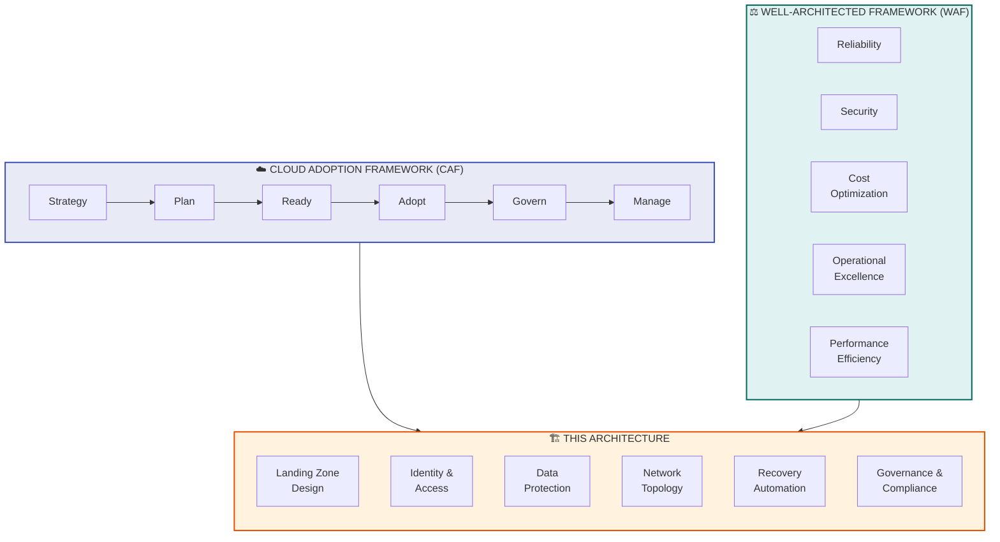

---

## 3. CAF Alignment: Lifecycle Phases

### 3.1 Strategy

> **CAF Guidance:** Define motivations, business outcomes, and financial considerations.

| Element | Application to This Architecture |
|---|---|
| **Business Motivation** | Ensure business continuity when the primary Azure tenant is inaccessible due to a security incident |
| **Business Outcome** | Mission-critical applications restored within 24 hours (RTO); data loss limited to < 1 hour (RPO) |
| **Financial Consideration** | Hybrid ASR + IaC approach reduces cost vs. full warm standby by ~60-70% while meeting RTO targets |
| **Risk Assessment** | Tenant compromise is a low-probability, high-impact event; architecture must be cost-justified against this risk profile |

#### Business Impact Analysis (BIA)

| Impact Category | Without This Architecture | With This Architecture |
|---|---|---|
| Revenue Loss | 15-30 days of downtime | < 24 hours of downtime |
| Regulatory Penalty | Potential non-compliance with DORA, SOC2, ISO 27001 | Documented, tested DR capability |
| Reputation | Severe customer trust erosion | Rapid recovery demonstrates resilience |
| Operational Cost | Unplanned, chaotic recovery effort | Automated, rehearsed recovery |

---

### 3.2 Plan

> **CAF Guidance:** Digital estate assessment, skills readiness, organizational alignment.

#### Digital Estate Assessment for DR Scope

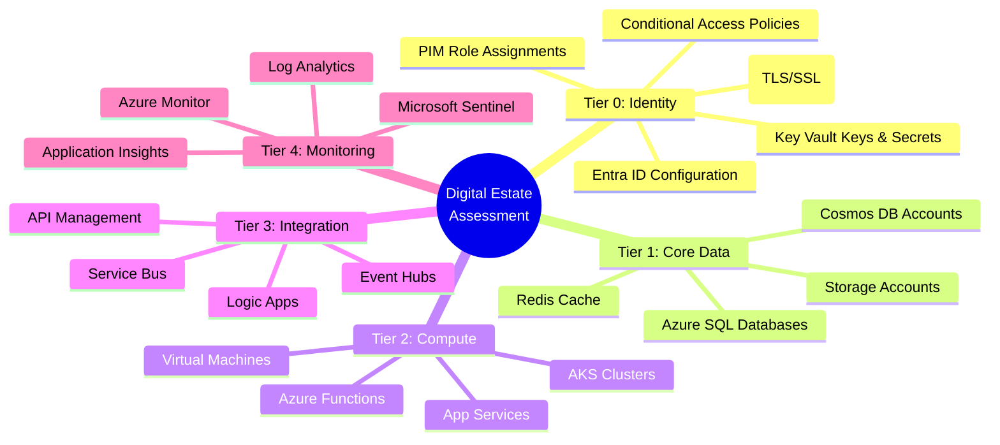

#### Skills Readiness Matrix

| Skill Area | Required Competency | Training Resource |
|---|---|---|
| Cross-Tenant Azure Backup | Advanced | [MS Learn: Azure Backup](https://learn.microsoft.com/en-us/azure/backup/) |
| Azure Site Recovery | Advanced | [MS Learn: ASR](https://learn.microsoft.com/en-us/azure/site-recovery/) |
| Terraform / Bicep | Advanced | [MS Learn: IaC](https://learn.microsoft.com/en-us/azure/developer/terraform/) |
| Entra ID Administration | Expert | [MS Learn: Entra ID](https://learn.microsoft.com/en-us/entra/identity/) |
| Incident Response | Expert | [NIST SP 800-61](https://csrc.nist.gov/publications/detail/sp/800-61/rev-2/final) |
| Azure Networking | Advanced | [MS Learn: Networking](https://learn.microsoft.com/en-us/azure/networking/) |

---

### 3.3 Ready

> **CAF Guidance:** Azure landing zone design, foundation setup.

This maps directly to **Landing Zone Design** — see [Section 6](#6-landing-zone-design).

---

### 3.4 Adopt (Migrate/Innovate)

> **CAF Guidance:** Workload migration and modernization.

| Adopt Activity | Application |
|---|---|
| **Migrate** | Replicate existing workloads to backup tenant using ASR and cross-tenant backup |
| **Innovate** | Implement GitOps-based recovery for cloud-native workloads (AKS, serverless) |
| **Modernize** | Replace manual DR processes with automated IaC pipelines |

---

### 3.5 Govern

> **CAF Guidance:** Corporate policies, compliance, cost management, security baselines.

| Governance Discipline | Implementation |
|---|---|
| **Cost Management** | Tag all DR resources with `purpose:disaster-recovery`; monthly cost review |
| **Security Baseline** | Zero standing access; WORM storage; private endpoints; no legacy auth |
| **Resource Consistency** | All resources deployed via IaC; Azure Policy enforces compliance |
| **Identity Baseline** | Break-glass accounts with FIDO2; PIM for all privileged access |
| **Deployment Acceleration** | CI/CD pipelines for IaC; automated backup validation |

---

### 3.6 Manage

> **CAF Guidance:** Operations management, monitoring, business alignment.

| Management Activity | Cadence | Owner |
|---|---|---|
| DR drill (full failover) | Quarterly | Cloud Ops + Security |
| Backup integrity verification | Weekly (automated) | Cloud Ops |
| Break-glass account test | Semi-annually | Security |
| IaC drift detection | Daily (automated) | Platform Engineering |
| RTO/RPO validation | Quarterly | Cloud Ops + Business |
| Architecture review | Annually | Architecture Board |

---

## 4. Well-Architected Framework Pillar Alignment

### 4.1 Reliability

> **WAF Principle:** Design for failure; ensure self-healing and resilience.

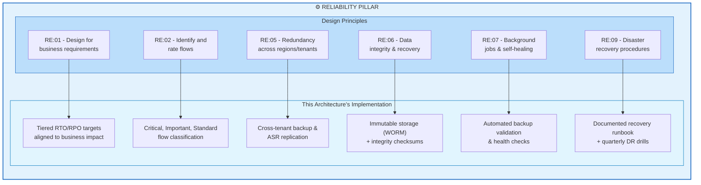

#### Reliability Recommendations

| ID | Recommendation | Priority | WAF Code |
|---|---|---|---|
| R-01 | Define tiered RTO/RPO per application based on BIA | Critical | RE:01 |
| R-02 | Use ASR for continuous replication of stateful VMs | Critical | RE:05 |
| R-03 | Implement immutable backups with WORM policy | Critical | RE:06 |
| R-04 | Automate weekly backup restoration tests | High | RE:09 |
| R-05 | Use cross-region backup (CRR) within backup tenant | High | RE:05 |
| R-06 | Design recovery flows to be idempotent and re-runnable | Medium | RE:07 |
| R-07 | Implement circuit-breaker patterns for cross-tenant operations | Medium | RE:07 |

#### Failure Mode Analysis (FMA)

| Failure Mode | Impact | Mitigation | Detection |
|---|---|---|---|
| Backup tenant also compromised | Total data loss | Air-gapped offline backup; separate admin credentials; no trust relationship | Sentinel alerts in backup tenant |
| Backup data corrupted | Cannot restore | Immutable storage; integrity checksums; multi-version retention | Automated weekly restore tests |
| Break-glass credentials lost | Cannot access backup tenant | Multiple sealed copies in geographically separate safes | Semi-annual verification |
| IaC state drift | Recovery deploys incorrect config | Automated drift detection; state locked in immutable blob | Daily Terraform plan |
| DNS failover fails | Users cannot reach recovered apps | Pre-configured Traffic Manager with health probes; manual DNS override procedure | Synthetic monitoring |
| ExpressRoute to recovery tenant unavailable | On-prem cannot reach recovery | Pre-provisioned VPN as backup path | Network monitoring |

---

### 4.2 Security

> **WAF Principle:** Assume breach; defense in depth; least privilege.

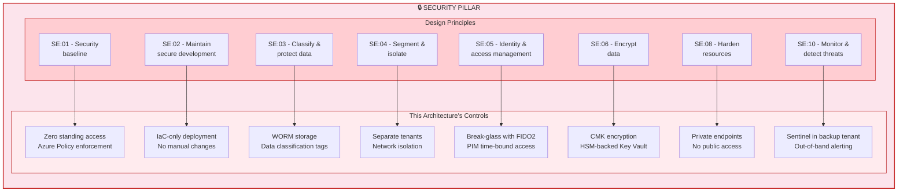

#### Zero Trust Alignment

| Zero Trust Principle | Implementation |
|---|---|
| **Verify Explicitly** | All access via Conditional Access; device compliance checks; MFA enforced |
| **Least Privilege** | PIM for all admin roles; time-bound activation with approval; no standing access |
| **Assume Breach** | Backup tenant assumes primary is fully compromised; no trust relationships; independent Sentinel instance |

---

### 4.3 Cost Optimization

> **WAF Principle:** Maximize the value of cloud spend.

| Cost Element | Approach | Monthly Estimate | WAF Code |
|---|---|---|---|
| ASR Replication | Per-VM replication fee; compute only during failover | $25/VM/month | CO:05 |
| Cross-Tenant Backup | Backup storage (LRS/GRS) in backup tenant | ~$0.05/GB/month | CO:05 |
| Immutable Blob Storage | Hot tier for recent; Cool/Archive for older | ~$0.01-0.02/GB/month | CO:07 |
| Recovery Tenant (idle) | Minimal: Entra ID, Key Vault, Storage only | ~$200-500/month | CO:05 |
| Recovery Tenant (active) | Full compute during DR event only | Pay-per-use during event | CO:02 |
| ACR Mirror | Geo-replicated registry | ~$50/month | CO:05 |
| DR Drill Costs | Quarterly spin-up/tear-down | ~$2,000-5,000/quarter | CO:02 |

#### Cost Comparison: Recovery Approaches

```mermaid
quadrantChart
    title Cost vs Recovery Time Trade-off
    x-axis Low Cost --> High Cost
    y-axis Slow Recovery --> Fast Recovery
    quadrant-1 Ideal (Fast & Cheap)
    quadrant-2 Premium (Fast & Expensive)
    quadrant-3 Budget (Slow & Cheap)
    quadrant-4 Avoid (Slow & Expensive)
    IaC Rebuild Only: [0.25, 0.3]
    ASR + IaC Hybrid (Recommended): [0.45, 0.7]
    Pilot Light: [0.55, 0.65]
    Full Warm Standby: [0.85, 0.9]
    Manual Rebuild: [0.3, 0.15]
```

---

### 4.4 Operational Excellence

> **WAF Principle:** Streamline operations through automation, observability, and safe deployment practices.

| OE Principle | Implementation | WAF Code |
|---|---|---|
| **Automate repetitive tasks** | IaC for all infrastructure; automated backup validation | OE:05 |
| **Use safe deployment practices** | Recovery pipelines tested quarterly in non-prod | OE:06 |
| **Implement observability** | Sentinel + Monitor in both backup and recovery tenants | OE:07 |
| **Document operational procedures** | Recovery runbook version-controlled in Git | OE:02 |
| **Learn from incidents** | Post-DR-drill retrospectives; runbook updates | OE:09 |
| **Adopt DevOps practices** | GitOps for AKS recovery; CI/CD for IaC | OE:05 |

#### Operational Readiness Scoring

| Area | Score Criteria | Target |
|---|---|---|
| Automation | % of recovery steps automated via IaC/scripts | > 80% |
| Documentation | Runbook completeness and recency | Updated within 90 days |
| Testing | DR drills completed on schedule | 4 per year |
| Recovery Time | Actual RTO vs. target RTO in drills | Within 120% of target |
| Team Readiness | % of team trained on DR procedures | 100% of primary + backup |

---

### 4.5 Performance Efficiency

> **WAF Principle:** Adjust to changes in demand; optimize for the workloads you have.

| PE Principle | Implementation | WAF Code |
|---|---|---|
| **Right-size resources** | Recovery VMs can be resized post-failover; start with ASR-replicated sizes | PE:02 |
| **Optimize data transfer** | Incremental replication (ASR); differential backups | PE:05 |
| **Plan for capacity** | Pre-allocate quota in recovery subscription for critical SKUs | PE:01 |
| **Test performance** | Include performance testing in quarterly DR drills | PE:04 |

#### Capacity Planning for Recovery Tenant

| Resource | Pre-Allocated Quota | Rationale |
|---|---|---|
| vCPUs (D-series) | 2x current primary usage | Headroom for recovery + testing |
| Premium SSD | Equal to primary | Database performance parity |
| Public IPs | Equal to primary | External-facing services |
| AKS Node Pools | Equal to primary | Container workload capacity |
| ExpressRoute Circuits | 1 (backup path) | On-prem connectivity |

---

## 5. Reference Architecture Diagrams

### 5.1 High-Level Architecture

```mermaid
graph TB
    subgraph PRIMARY_TENANT["🔴 PRIMARY TENANT (HCL) — LOCKED DOWN"]
        direction TB
        PT_Apps["App Services"]
        PT_AKS["AKS Clusters"]
        PT_SQL["SQL / Cosmos DB"]
        PT_KV["Key Vaults"]
        PT_VNet["Virtual Networks"]
        PT_Entra["Entra ID (Primary)"]
        PT_Lock["🔒 INACCESSIBLE<br/>Under Forensic Investigation<br/>15-30 Days"]
    end

    subgraph BACKUP_TENANT["🟢 BACKUP TENANT (Isolated — CAF: Platform LZ)"]
        direction TB
        BT_Vault["Azure Backup Vault<br/>(Cross-Tenant)"]
        BT_ASR["Azure Site Recovery<br/>Vault"]
        BT_Blob["Immutable Blob Storage<br/>(WORM Policy)"]
        BT_KV["Isolated Key Vault<br/>(HSM-backed)"]
        BT_ACR["Mirror ACR<br/>(Container Images)"]
        BT_IaC["IaC State Files<br/>(Terraform/Bicep)"]
        BT_Entra["Entra ID<br/>(Break-Glass Accounts)"]
    end

    subgraph RECOVERY_TENANT["🔵 RECOVERY TENANT (CAF: Application LZ)"]
        direction TB
        RT_VMs["Restored VMs / AKS"]
        RT_DB["Restored Databases"]
        RT_KV["Restored Key Vaults"]
        RT_DNS["New/Mapped DNS"]
        RT_Entra["Emergency Entra ID"]
        RT_Net["Network (VNets/NSGs)"]
        RT_Mon["Monitoring & Sentinel"]
    end

    BACKUP_TENANT -- "🔄 Restore Data & Config" --> RECOVERY_TENANT
    PRIMARY_TENANT -. "❌ No Access During Forensics" .-> RECOVERY_TENANT

    style PRIMARY_TENANT fill:#ffcccc,stroke:#cc0000,stroke-width:2px
    style BACKUP_TENANT fill:#ccffcc,stroke:#009900,stroke-width:2px
    style RECOVERY_TENANT fill:#cce5ff,stroke:#0066cc,stroke-width:2px
    style PT_Lock fill:#ff6666,stroke:#cc0000,color:#fff
```

---

### 5.2 Recovery Flow

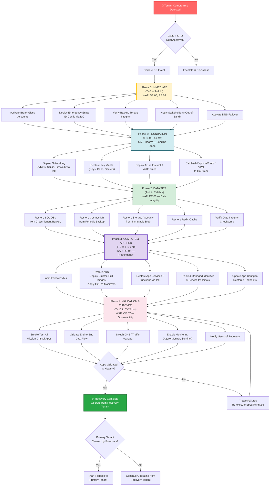

---

### 5.3 Data Protection Topology

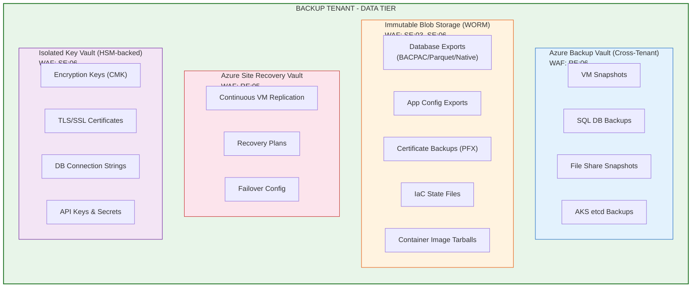

---

### 5.4 Recovery Timeline (Gantt)

```mermaid
gantt
    title Recovery Timeline — Mission Critical Application Restore
    dateFormat HH:mm
    axisFormat %H:%M

    section Phase 0 - Immediate (CAF: Manage)
    Activate Break-Glass Accounts           :p0a, 00:00, 15min
    Deploy Emergency Entra ID (IaC)         :p0b, 00:00, 45min
    Verify Backup Tenant Integrity          :p0c, 00:15, 30min
    Notify Stakeholders (Out-of-Band)       :p0d, 00:00, 15min
    Activate DNS Failover                   :p0e, 00:30, 30min

    section Phase 1 - Foundation (CAF: Ready)
    Deploy Networking (VNets/NSGs/FW)       :p1a, 01:00, 120min
    Restore Key Vaults                      :p1b, 01:00, 90min
    Deploy Azure Firewall / WAF             :p1c, 02:00, 60min
    Establish ExpressRoute / VPN            :p1d, 01:30, 150min

    section Phase 2 - Data Tier (WAF: RE:06)
    Restore SQL DBs (Cross-Tenant)          :p2a, 04:00, 180min
    Restore Cosmos DB                       :p2b, 04:00, 120min
    Restore Storage Accounts                :p2c, 04:30, 120min
    Restore Redis Cache                     :p2d, 05:00, 60min
    Verify Data Integrity                   :p2e, 07:00, 60min

    section Phase 3 - Compute & App (WAF: RE:05)
    ASR Failover VMs                        :p3a, 08:00, 120min
    Restore AKS (GitOps)                    :p3b, 08:00, 240min
    Restore App Services / Functions        :p3c, 09:00, 180min
    Re-bind Identities & SPs               :p3d, 12:00, 120min
    Update App Config                       :p3e, 14:00, 60min

    section Phase 4 - Validation (WAF: OE:07)
    Smoke Test All Apps                     :p4a, 16:00, 120min
    Validate E2E Data Flow                  :p4b, 16:00, 120min
    Switch DNS / Traffic Manager            :p4c, 18:00, 60min
    Enable Monitoring                       :p4d, 18:00, 120min
    Notify Users                            :p4e, 20:00, 30min
```

---

### 5.5 Network Architecture


---

### 5.6 Cross-Tenant Pre-Requisite Configuration

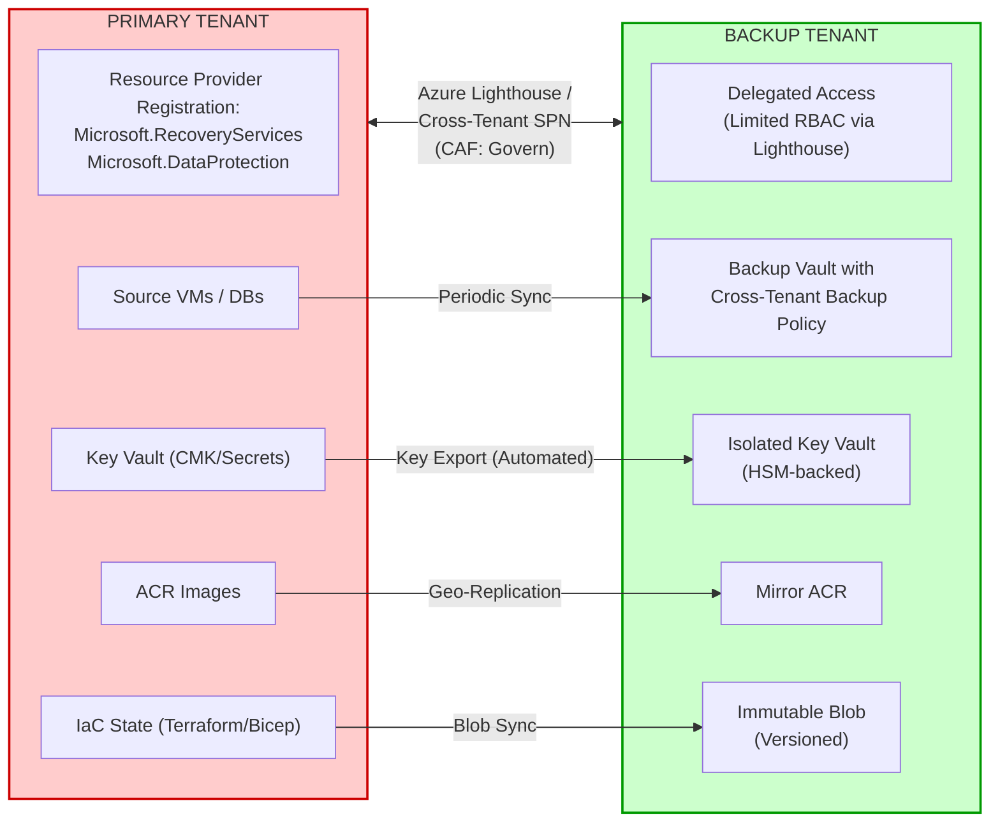

---

### 5.7 Security Model

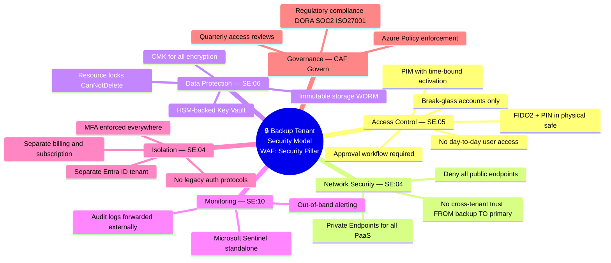

---

### 5.8 Governance State Machine

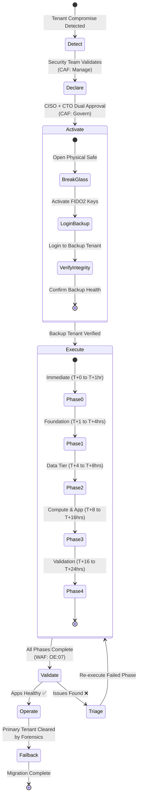

---

## 6. Landing Zone Design

> **CAF Reference:** [Azure Landing Zones](https://learn.microsoft.com/en-us/azure/cloud-adoption-framework/ready/landing-zone/)

This architecture uses a **multi-tenant landing zone** design with three distinct tenants mapped to CAF landing zone archetypes:

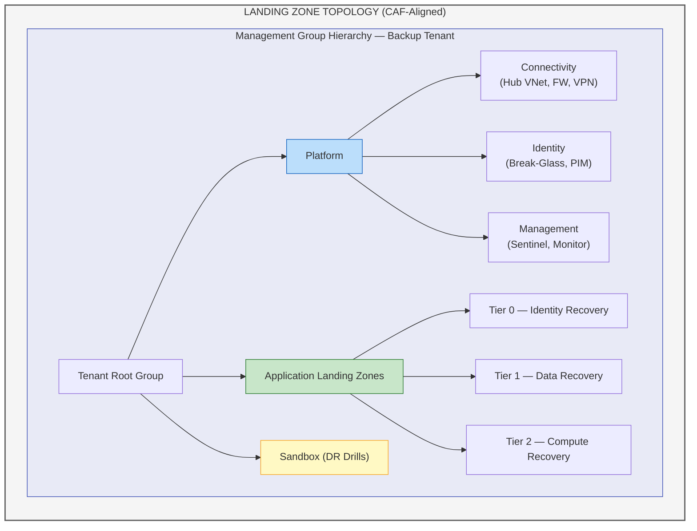

### Subscription Design

| Subscription | Tenant | Purpose | CAF Archetype |
|---|---|---|---|
| `sub-backup-platform` | Backup Tenant | Connectivity, Identity, Management | Platform |
| `sub-backup-storage` | Backup Tenant | Backup Vaults, Immutable Blobs, ACR Mirror | Platform |
| `sub-recovery-tier0` | Recovery Tenant | Identity recovery (Entra ID, Key Vaults) | Application LZ |
| `sub-recovery-tier1` | Recovery Tenant | Data tier (SQL, Cosmos, Storage) | Application LZ |
| `sub-recovery-tier2` | Recovery Tenant | Compute tier (AKS, VMs, App Services) | Application LZ |
| `sub-recovery-sandbox` | Recovery Tenant | DR drill environment | Sandbox |

### Azure Policy Assignments (Backup Tenant)

| Policy | Scope | Effect | WAF Pillar |
|---|---|---|---|
| Deny public network access | All subscriptions | Deny | Security |
| Require encryption at rest (CMK) | All subscriptions | Deny | Security |
| Require resource locks on vaults | Platform subscription | Audit → Deny | Reliability |
| Require tags (`purpose`, `tier`, `rto`) | All subscriptions | Deny | Operational Excellence |
| Allowed locations (paired regions only) | All subscriptions | Deny | Reliability |
| Deny classic resources | All subscriptions | Deny | Security |
| Require Private Endpoints | All subscriptions | Deny | Security |
| Require diagnostic settings | All subscriptions | DeployIfNotExists | Operational Excellence |

---

## 7. Identity & Access Architecture

> **CAF Reference:** [Identity and access management](https://learn.microsoft.com/en-us/azure/cloud-adoption-framework/ready/landing-zone/design-area/identity-access)
> **WAF Reference:** [SE:05 — Identity and access management](https://learn.microsoft.com/en-us/azure/well-architected/security/identity-access)

| Component | Pre-Positioned in Backup Tenant | Recovery Action | WAF Code |
|---|---|---|---|
| **Break-Glass Accounts** | ✅ Pre-created Global Admin accounts (MFA with hardware FIDO2 keys stored in physical safe) | Activate immediately | SE:05 |
| **Emergency Entra ID Tenant** | ✅ Skeleton tenant with core groups, roles, Conditional Access policies as IaC | Deploy full identity config via pipeline | SE:05 |
| **Service Principals / Managed Identities** | ✅ Documented App Registrations & secrets in isolated Key Vault | Re-create via IaC; rotate all secrets | SE:05 |
| **B2B/B2C Identity** | ✅ Configuration exported as IaC | Redeploy; update redirect URIs | SE:05 |
| **Conditional Access & PIM** | ✅ Policies stored as JSON/Bicep | Apply to recovery tenant | SE:05 |

> **Key Decision:** Use a **pre-provisioned recovery Entra ID tenant** (not the backup tenant itself) to maintain isolation of backups during recovery. This aligns with WAF SE:04 (Segmentation).

---

## 8. Data Protection & Backup Strategy

> **WAF Reference:** [RE:06 — Data integrity](https://learn.microsoft.com/en-us/azure/well-architected/reliability/highly-available-multi-region-design)

### Backup Mechanisms (Ranked by Recovery Speed)

| Priority | Mechanism | RPO | RTO | Best For | WAF Code |
|---|---|---|---|---|---|
| **P0** | **Azure Site Recovery (Cross-Tenant)** | ~5 min | **< 2 hours** | VMs, full environment failover | RE:05 |
| **P1** | **Cross-Tenant Azure Backup (CRR)** | ~1 hour | **4-8 hours** | VMs, SQL, File Shares | RE:06 |
| **P2** | **Immutable Blob + Geo-Replication** | ~15 min | **2-6 hours** | Unstructured data, DB exports | RE:06, SE:03 |
| **P3** | **Container Registry Geo-Replication** | ~minutes | **1-2 hours** | Container images (ACR) | RE:05 |
| **P4** | **IaC Rebuild (Terraform/Bicep)** | N/A (config) | **4-12 hours** | Stateless infrastructure | OE:05 |

### Data Classification & Protection Matrix

| Classification | Examples | Backup Frequency | Retention | Encryption | WAF Code |
|---|---|---|---|---|---|
| **Confidential** | Customer PII, financial data | Every 15 min (ASR) | 90 days | CMK (HSM) | SE:03, SE:06 |
| **Internal** | Application config, logs | Hourly | 30 days | CMK | SE:03 |
| **Public** | Static web content | Daily | 14 days | Platform-managed | SE:03 |

---

## 9. Application Recovery by Tier

### Restore Sequence (Dependency-Ordered)

| Phase | Tier | Duration | Dependencies | CAF Phase | WAF Pillar |
|---|---|---|---|---|---|
| **Phase 0** | Immediate (Identity) | T+0 to T+1 hr | None | Manage | Security |
| **Phase 1** | Foundation (Network) | T+1 to T+4 hrs | Phase 0 | Ready | Reliability |
| **Phase 2** | Data Tier | T+4 to T+8 hrs | Phase 1 | Adopt | Reliability |
| **Phase 3** | Compute & App | T+8 to T+16 hrs | Phase 2 | Adopt | Reliability |
| **Phase 4** | Validation & Cutover | T+16 to T+24 hrs | Phase 3 | Manage | Op. Excellence |

---

## 10. Pre-Requisites Checklist

| # | Pre-Requisite | Azure Service | CAF Phase | WAF Pillar | Status |
|---|---|---|---|---|---|
| 1 | Cross-tenant backup configured | Azure Backup (CRR) | Ready | Reliability | ⬜ |
| 2 | ASR replication to backup tenant | Azure Site Recovery | Ready | Reliability | ⬜ |
| 3 | Immutable storage with WORM/Legal Hold | Blob Storage | Ready | Security | ⬜ |
| 4 | IaC for entire infra stored externally | Terraform/Bicep in Git + Blob | Ready | Op. Excellence | ⬜ |
| 5 | Break-glass accounts in backup tenant | Entra ID | Govern | Security | ⬜ |
| 6 | Key/Secret/Cert backup automated | Key Vault | Ready | Security | ⬜ |
| 7 | Container images mirrored | ACR Geo-Replication | Ready | Reliability | ⬜ |
| 8 | DNS failover configured | Traffic Manager / Front Door | Ready | Reliability | ⬜ |
| 9 | Network IaC with pre-planned CIDR | Terraform/Bicep | Ready | Op. Excellence | ⬜ |
| 10 | Recovery runbook tested quarterly | Internal Process | Manage | Op. Excellence | ⬜ |
| 11 | Out-of-band communication plan | Teams/Slack alt, Phone tree | Manage | Op. Excellence | ⬜ |
| 12 | Lighthouse / Cross-tenant SPN setup | Azure Lighthouse | Govern | Security | ⬜ |
| 13 | Azure Policy assignments applied | Azure Policy | Govern | Security | ⬜ |
| 14 | Management group hierarchy created | Management Groups | Ready | Op. Excellence | ⬜ |
| 15 | Subscription quota pre-allocated | Azure Subscriptions | Plan | Performance | ⬜ |

---

## 11. Restore Approach Comparison

| Rank | Approach | RTO | Complexity | Monthly Cost (Idle) | WAF Recommendation |
|---|---|---|---|---|---|
| 🥇 | **ASR Cross-Tenant Failover** | **1-4 hrs** | Medium | ~$25/VM | RE:05 — Preferred for stateful |
| 🥈 | **IaC Rebuild + Backup Restore** | **4-12 hrs** | High | ~$200 (storage only) | OE:05 — Preferred for stateless |
| 🥉 | **Pilot Light in Recovery Tenant** | **2-6 hrs** | Medium-High | ~$500-1,000 | CO:05 — Good balance |
| 4 | **Full Warm Standby** | **< 1 hr** | Very High (💰) | ~$10,000+ | CO:02 — Only if mandated |

### 🥇 Recommended: Hybrid ASR + IaC Approach

For HCL's scenario, combine:

- **ASR** for stateful VMs (databases, legacy apps) → aligns with **RE:05**
- **IaC + GitOps** for cloud-native workloads (AKS, App Services) → aligns with **OE:05**
- **Immutable Blob Restore** for data-tier recovery → aligns with **RE:06 + SE:03**

This balances **cost (CO:05)** vs. **recovery speed (RE:09)** and avoids the expense of a full warm standby.

---

## 12. Target RTO/RPO Matrix

| Application Tier | Example | Backup Method | Target RPO | Target RTO | WAF Code |
|---|---|---|---|---|---|
| **Tier 0 – Identity** | Entra ID, Key Vault | IaC + Key Backup | 0 (config) | < 1 hour | SE:05, RE:01 |
| **Tier 1 – Core Data** | SQL DB, Cosmos DB | Cross-Tenant Backup + Immutable Blob | < 1 hour | 4-8 hours | RE:06 |
| **Tier 2 – Compute** | AKS, VMs, App Services | ASR + IaC + ACR Mirror | < 5 min (ASR) | 2-8 hours | RE:05 |
| **Tier 3 – Integration** | API Management, Service Bus | IaC Rebuild + Config Restore | < 1 hour | 8-12 hours | OE:05 |
| **Tier 4 – Monitoring** | Sentinel, Monitor, Alerts | IaC Rebuild | N/A | 12-24 hours | OE:07 |

---

## 13. WAF Assessment Checklist

Use this checklist to assess the architecture against the Well-Architected Framework:

### Reliability Assessment

- [ ] RTO/RPO targets defined and documented for all tiers
- [ ] ASR replication health monitored and alerted
- [ ] Backup integrity validated weekly (automated)
- [ ] DR drills conducted quarterly with documented results
- [ ] Failure modes identified and mitigations implemented
- [ ] Recovery procedures are idempotent and re-runnable
- [ ] Cross-region backup (CRR) enabled within backup tenant

### Security Assessment

- [ ] Zero standing access enforced in backup tenant
- [ ] Break-glass accounts tested semi-annually
- [ ] All storage uses customer-managed keys (CMK) with HSM
- [ ] Private endpoints configured for all PaaS services
- [ ] No trust relationship from backup tenant to primary tenant
- [ ] Azure Policy enforces security baseline
- [ ] Sentinel deployed independently in backup tenant
- [ ] WORM/immutability policy applied to all backup storage
- [ ] Conditional Access policies enforced (no legacy auth)

### Cost Optimization Assessment

- [ ] DR resources tagged with `purpose:disaster-recovery`
- [ ] Monthly cost review for DR infrastructure
- [ ] Right-sized ASR target VMs (can be resized post-failover)
- [ ] Archive tier used for older backups
- [ ] DR drill costs tracked and budgeted

### Operational Excellence Assessment

- [ ] All infrastructure defined as code (Terraform/Bicep)
- [ ] IaC drift detection runs daily
- [ ] Recovery runbook version-controlled and updated within 90 days
- [ ] Post-DR-drill retrospectives conducted
- [ ] Team training current (all primary + backup team members)
- [ ] Monitoring and alerting operational in backup tenant

### Performance Efficiency Assessment

- [ ] Subscription quota pre-allocated for critical SKUs
- [ ] Performance baselines documented for key applications
- [ ] Performance testing included in DR drills
- [ ] Network bandwidth assessed for recovery data transfer
- [ ] AKS node pool sizing matches production requirements

---

## 14. Governance & Compliance

> **CAF Reference:** [Govern methodology](https://learn.microsoft.com/en-us/azure/cloud-adoption-framework/govern/)

### Regulatory Alignment

| Regulation | Requirement | How This Architecture Satisfies |
|---|---|---|
| **ISO 27001** (A.17) | Business continuity planning | Documented DR procedures, quarterly testing, defined RTO/RPO |
| **SOC 2** (A1.2) | Recovery objectives defined and tested | Tiered RTO/RPO, automated backup validation, DR drills |
| **DORA** (Art. 11-12) | ICT business continuity & DR testing | Cross-tenant isolation, annual/quarterly DR exercises |
| **NIST CSF** (PR.IP-9) | Response and recovery plans tested | Recovery runbook, Gantt-charted phases, governance state machine |
| **Azure Security Benchmark** | Backup and recovery controls | ASR, cross-tenant backup, immutable storage, CMK encryption |

### RACI Matrix

| Activity | Cloud Ops | Security | Platform Eng. | Architecture | Business |
|---|---|---|---|---|---|
| DR Declaration | C | A/R | I | C | A |
| Break-Glass Activation | R | A | I | I | I |
| Infrastructure Recovery | R | C | A | C | I |
| Data Restoration | A/R | C | C | I | I |
| Application Recovery | R | C | A | C | I |
| Validation & Cutover | A/R | R | C | C | A |
| Post-Incident Review | R | A/R | R | R | C |

> **A** = Accountable, **R** = Responsible, **C** = Consulted, **I** = Informed

---

## 15. Next Steps & Roadmap

### Implementation Roadmap (CAF-Aligned)

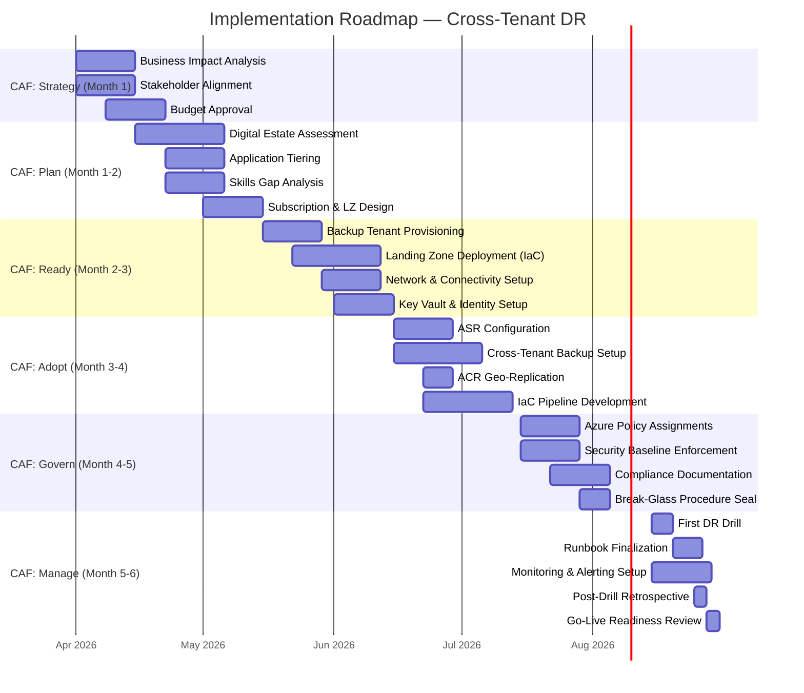

### Action Items

- [ ] **Strategy:** Complete Business Impact Analysis and secure executive sponsorship
- [ ] **Plan:** Inventory all mission-critical applications and classify by tier
- [ ] **Ready:** Provision backup tenant with CAF landing zone architecture
- [ ] **Adopt:** Implement cross-tenant backup, ASR replication, and IaC pipelines
- [ ] **Govern:** Apply Azure Policy, security baselines, and compliance controls
- [ ] **Manage:** Conduct first DR drill, finalize runbook, establish quarterly cadence

---

## References

| Resource | Link |
|---|---|
| Microsoft Cloud Adoption Framework | [https://learn.microsoft.com/en-us/azure/cloud-adoption-framework/](https://learn.microsoft.com/en-us/azure/cloud-adoption-framework/) |
| Azure Well-Architected Framework | [https://learn.microsoft.com/en-us/azure/well-architected/](https://learn.microsoft.com/en-us/azure/well-architected/) |
| Azure Landing Zones | [https://learn.microsoft.com/en-us/azure/cloud-adoption-framework/ready/landing-zone/](https://learn.microsoft.com/en-us/azure/cloud-adoption-framework/ready/landing-zone/) |
| Azure Site Recovery | [https://learn.microsoft.com/en-us/azure/site-recovery/](https://learn.microsoft.com/en-us/azure/site-recovery/) |
| Azure Backup Cross-Tenant | [https://learn.microsoft.com/en-us/azure/backup/](https://learn.microsoft.com/en-us/azure/backup/) |
| Azure Immutable Blob Storage | [https://learn.microsoft.com/en-us/azure/storage/blobs/immutable-storage-overview](https://learn.microsoft.com/en-us/azure/storage/blobs/immutable-storage-overview) |
| Zero Trust Architecture | [https://learn.microsoft.com/en-us/security/zero-trust/](https://learn.microsoft.com/en-us/security/zero-trust/) |
| NIST SP 800-61 (Incident Response) | [https://csrc.nist.gov/publications/detail/sp/800-61/rev-2/final](https://csrc.nist.gov/publications/detail/sp/800-61/rev-2/final) |

---

> **Document Owner:** HCL Cloud Infrastructure & Security Team
> **Architecture Review Board:** Microsoft CAF + WAF Aligned
> **Last Updated:** 2026-03-18
> **Review Cadence:** Quarterly
> **Classification:** Internal — Confidential
> **Version:** 2.0 (CAF + WAF Aligned)
