# AMPLS DNS - Cross-Region Forwarding in Simple Explanation


##  What We'll Cover
- [What is Cross-Region Forwarding?](#what-is-cross-region-forwarding)
- [The Post Office Analogy](#the-post-office-analogy)
- [Your Current Challenge](#your-current-challenge)
- [How Cross-Region Forwarding Works](#how-cross-region-forwarding-works)
- [Step-by-Step Setup](#step-by-step-setup)
- [Real Examples](#real-examples)
- [Pros and Cons](#pros-and-cons)

##  What is Cross-Region Forwarding?

**Cross-Region Forwarding** means: "If I don't know the answer, I'll ask someone who does"

Think of it like:
- You call Chennai office for info
- They don't know, but they know Pune might
- Chennai transfers your call to Pune
- Pune gives you the answer
- You get your answer (just took extra step)

##  The Post Office Analogy

Imagine post offices in different cities:

### Regular Mail (Without Cross-Region):
```
You → Chennai Post Office → "Not our area" →  Return to sender
```

### With Cross-Region Forwarding:
```
You → Chennai Post Office → "Not ours, let me forward" → Pune Post Office →  Delivered
```

The key: **Post offices help each other!**

##  Your Current Challenge

```yaml
The Problem:
  Chennai DNS: "I only know Chennai stuff"
  Pune DNS: "I only know Pune stuff"
  
  User asks Chennai DNS for Pune info:  Fails
  User asks Pune DNS for Chennai info:  Fails
  
The Solution:
  Teach them to help each other!
  Chennai DNS: "I don't know Pune stuff, but I'll ask Pune DNS"
  Pune DNS: "I don't know Chennai stuff, but I'll ask Chennai DNS"
```

##  How Cross-Region Forwarding Works

### The Helping Network

```mermaid
graph TB
    subgraph "Step 1: Ask Everyone"
        User[👤 User] -->|"Need any workspace"| Office[📖 Office DNS<br/>192.168.1.10]
        Office -->|"Ask all 4"| All[All Azure DNS<br/>🏢🏢🏢🏢]
    end
    
    subgraph "Step 2: DNS Help Each Other"
        All --> Chennai[Chennai DNS<br/>10.1.0.4]
        All --> Pune[Pune DNS<br/>10.2.0.4]
        Chennai -->|"Don't know?<br/>Ask Pune"| Pune
        Pune -->|"Don't know?<br/>Ask Chennai"| Chennai
    end
    
    subgraph "Step 3: Someone Knows"
        Chennai --> Answer1[✅ Answer]
        Pune --> Answer2[✅ Answer]
    end
```



### The Magic: DNS Servers Talk to Each Other!

```
Scenario 1: Lucky First Try
User → Office DNS → Chennai DNS → "I know this!" → Answer 

Scenario 2: Need Help from Friend
User → Office DNS → Pune DNS → "Not mine, asking Chennai" → Chennai DNS → Answer 

Either way: User gets answer!
```

##  Step-by-Step Setup

### Step 1: Office DNS - "Call Everyone"

On your office DNS (192.168.1.10):

```powershell
# Simple version of what you're saying:
"Dear Office DNS,
 When someone asks for Azure Monitor stuff,
 Send the question to ALL 4 DNS servers:
 - Chennai: 10.1.0.4, 10.1.0.5
 - Pune: 10.2.0.4, 10.2.0.5
 
 Someone will know the answer!"
```

Actual commands:
```powershell
# Send everything to everyone
Add-DnsServerConditionalForwarderZone `
    -Name "oms.opinsights.azure.com" `
    -MasterServers 10.1.0.4, 10.1.0.5, 10.2.0.4, 10.2.0.5

Add-DnsServerConditionalForwarderZone `
    -Name "ods.opinsights.azure.com" `
    -MasterServers 10.1.0.4, 10.1.0.5, 10.2.0.4, 10.2.0.5
```

### Step 2: Chennai DNS - "Help Pune Users"

On Chennai DNS servers (10.1.0.4, 10.1.0.5):

```powershell
# Simple version:
"Dear Chennai DNS,
 When someone asks for Pune workspace (abc12345...),
 You don't know it, so forward to Pune DNS (10.2.0.4, 10.2.0.5)"
```

Actual commands:
```powershell
$puneWorkspaceId = "abc12345-1234-5678-9012-123456789012"

# Chennai DNS forwards Pune queries to Pune
Add-DnsServerConditionalForwarderZone `
    -Name "$puneWorkspaceId.oms.opinsights.azure.com" `
    -MasterServers 10.2.0.4, 10.2.0.5
```

### Step 3: Pune DNS - "Help Chennai Users"

On Pune DNS servers (10.2.0.4, 10.2.0.5):

```powershell
# Simple version:
"Dear Pune DNS,
 When someone asks for Chennai workspace (def67890...),
 You don't know it, so forward to Chennai DNS (10.1.0.4, 10.1.0.5)"
```

Actual commands:
```powershell
$chennaiWorkspaceId = "def67890-5678-9012-3456-567890123456"

# Pune DNS forwards Chennai queries to Chennai
Add-DnsServerConditionalForwarderZone `
    -Name "$chennaiWorkspaceId.oms.opinsights.azure.com" `
    -MasterServers 10.1.0.4, 10.1.0.5
```

##  Real Examples

### Example 1: Chennai User Needs Pune Data

```
The Journey:
1. User in Chennai office needs Pune report
2. User's computer asks Office DNS
3. Office DNS asks all 4 DNS servers
4. Chennai DNS gets query first: "abc12345? Not mine!"
5. Chennai DNS forwards to Pune DNS
6. Pune DNS: "abc12345? Yes! It's at 10.2.100.50"
7. Answer goes: Pune → Chennai → Office → User
8. Report opens! 

Time taken: Maybe 50ms extra (barely noticeable)
```

### Example 2: The Race Condition

```
What Really Happens (Behind Scenes):
1. Office DNS sends query to all 4 servers
2. It's a race! Who answers first?
   - Chennai DNS 1: Checking...
   - Chennai DNS 2: Checking...
   - Pune DNS 1: "I know this!" 
   - Pune DNS 2: "I know this!" 
3. First answer wins (maybe Pune DNS 1)
4. Other answers ignored
5. User gets data!
```

##  Benefits of Cross-Region Forwarding

### Works in More Situations
```
Precise Forwarding:
- Need to know all workspace IDs 
- Need full network connectivity 

Cross-Region Forwarding:
- Works with unknown workspaces 
- Can work with limited connectivity 
```

### Automatic Backup
```
If Chennai DNS 1 is down:
- Chennai DNS 2 can answer
- Pune DNS can forward
- Multiple paths to answer!
```

### Flexibility
```
New workspace added?
- Precise: Must update DNS rules 
- Cross-Region: Just works! 
```

##  Drawbacks to Consider

### It's Slower (A Bit)
```
Precise: Query → Right DNS → Answer (10ms)
Cross-Region: Query → Wrong DNS → Right DNS → Answer (30ms)

Reality: Users won't notice 20ms difference
```

### It's More Complex
```
Troubleshooting:
Precise: "Chennai query went to Chennai DNS"  Simple
Cross-Region: "Chennai query went to... uh... checking logs" 
```

### More Network Traffic
```
Precise: 1 query to right place
Cross-Region: 4 queries + possible forwards
```

##  When to Use What?

### Use Cross-Region Forwarding When:
-  You don't know all workspace IDs
-  Workspaces change frequently
-  You want automatic failover
-  You can't maintain detailed rules
-  Resilience > Performance

### Use Precise Forwarding When:
-  You have stable workspaces
-  You want best performance
-  You need clear audit trails
-  You have full connectivity
-  Performance > Flexibility

##  Testing Your Setup

### Quick Test
```powershell
# From office computer, test both workspaces

# Test 1: Chennai workspace
nslookup def67890.oms.opinsights.azure.com
# Should work (might come from any DNS)

# Test 2: Pune workspace  
nslookup abc12345.oms.opinsights.azure.com
# Should work (might come from any DNS)

# Test 3: See the path
nslookup -debug abc12345.oms.opinsights.azure.com
# Shows which DNS servers were involved
```

### What Success Looks Like
```
 Both workspaces resolve
 Get private IPs (10.x.x.x)
 No timeouts
 Works even if one DNS is down
```

##  Simple Comparison

| Aspect | Cross-Region | Precise |
|--------|-------------|---------|
| Setup Complexity | Medium | High |
| Maintenance | Low | High |
| Performance | Good | Best |
| Flexibility | High | Low |
| Troubleshooting | Hard | Easy |
| New Workspaces | Auto | Manual |

##  The Bottom Line

**Cross-Region Forwarding = Helpful Neighbors**

Like neighbors who help each other:
- "I don't have sugar, but let me ask next door"
- Everyone helps everyone
- Takes a bit longer but always works
- No one needs to know everything

It's not the fastest, but it's the most helpful and flexible!

---

**Remember:** Cross-region forwarding is about DNS servers being good neighbors - helping each other answer questions they can't answer alone!

