# Unified Single Sign-On Strategy for ContosoApp on Azure Databricks
## Executive Summary Document

**Document Purpose**: This document outlines the technical strategy for implementing unified identity federation for Contoso's ContosoApp application on Azure Databricks, enabling seamless access for both end-customers and internal teams.

---

## 1. Business Context and Challenge

### Current Situation
Contoso's application serves two distinct user populations:
- **End-Customers**: Users who authenticate using Keycloak Identity Provider
- **Internal Teams**: Contoso employees who authenticate using Azure Entra ID (Microsoft's enterprise identity platform)

### The Challenge
Azure Databricks has **removed support for multiple SSO providers per account** due to security concerns. This creates a critical decision point: we must choose a single authentication pathway while maintaining seamless access for both user populations.

**Critical Architectural Constraint**: Azure Databricks in Azure **only accepts authentication from Azure Entra ID**. It cannot directly authenticate against Keycloak or any other third-party identity provider.

---

## 2. Recommended Solution: SAML Federation via Keycloak

### High-Level Strategy
We will implement **Identity Provider Federation** using Keycloak as the authentication broker, connecting to Azure Entra ID through industry-standard SAML 2.0 protocol. Azure Entra ID will remain the identity provider for Databricks, while Keycloak performs the actual user authentication.

**Think of it as a "trusted authentication chain"**: 
- Databricks **only trusts** Azure Entra ID for authentication tokens
- Azure Entra ID **trusts** Keycloak to verify user credentials
- Keycloak performs the actual username/password verification for end-customers
- Internal teams can authenticate through Azure Entra directly or via Keycloak as a broker

### The Trust Chain
```
Databricks ←trusts only← Azure Entra ID ←trusts← Keycloak
```

### Why SAML Federation?
- **Industry Standard**: SAML 2.0 is the gold standard for enterprise SSO
- **Security**: Mature protocol with extensive audit trails and encryption
- **Databricks Support**: Native, well-tested SAML integration with Azure Entra
- **Flexibility**: Supports complex attribute mapping for user permissions
- **Azure Integration**: Required for domain-level federation in Microsoft Entra

---

## 3. How It Works: User Experience Flow

### For End-Customers (Keycloak Users)

```
1. User navigates to ContosoApp Databricks workspace
   ↓
2. Databricks redirects to Azure Entra ID for authentication
   ↓
3. Azure Entra ID recognizes the domain (@yourcompany.com) is federated
   ↓
4. Azure Entra ID automatically redirects to Keycloak (SAML redirect)
   ↓
5. User enters Keycloak credentials 
   ↓
6. Keycloak validates credentials and generates SAML assertion
   ↓
7. Keycloak sends SAML assertion back to Azure Entra ID
   ↓
8. Azure Entra ID validates the SAML assertion and issues its own token
   ↓
9. User is redirected back to Databricks with Azure Entra token
   ↓
10. Databricks validates the Entra token and grants access based on user's roles/groups
```

**Customer Experience**: Users still use their **Keycloak username and password**. The redirect through Azure Entra ID happens automatically and quickly—they may not even notice it. **No change to their login credentials or process.**

### For Internal Teams (Azure Entra Users)

```
1. Internal employee navigates to Databricks workspace
   ↓
2. Databricks redirects to Azure Entra ID for authentication
   ↓
3. Azure Entra ID recognizes this is an internal employee domain
   ↓
   [Two possible paths - to be decided during implementation]
   
   Path A (Direct Authentication):
   4a. Employee authenticates with Microsoft credentials (seamless SSO if already logged in)
   5a. Azure Entra ID issues token directly
   6a. Employee accesses Databricks with corporate identity
   
   Path B (Via Keycloak Broker):
   4b. Azure Entra federates to Keycloak (identity broker)
   5b. Keycloak recognizes internal employee and federates back to Azure Entra
   6b. Employee authenticates with Microsoft credentials
   7b. Azure Entra sends identity to Keycloak → Keycloak sends SAML to Entra
   8b. Azure Entra issues token
   9b. Employee accesses Databricks
```

**Employee Experience**: Uses familiar Microsoft login, potentially with seamless single sign-on if already logged into Windows/Office 365.

---

## 4. Technical Architecture Flow

### Complete Authentication Chain
```
┌─────────────────┐
│   End-Customer  │
│  or Employee    │
└────────┬────────┘
         │ (1) Access Databricks workspace
         ▼
┌─────────────────────────┐
│  Azure Databricks       │◄────────────────────┐
│  (Service Provider)     │                     │
│  - Only trusts Entra    │                     │
└────────┬────────────────┘                     │
         │ (2) Redirect to Entra for auth       │
         │                                      │ (10) Return with
         ▼                                      │      Entra token
┌─────────────────────────┐                     │
│  Azure Entra ID         │─────────────────────┘
│  (Identity Provider)    │
│  - Issues final token   │
│  - Trusts Keycloak      │
└────────┬────────────────┘
         │ (3) Check if domain is federated
         │     → YES: Redirect to Keycloak
         │ (9) Receive SAML assertion
         │     Validate & issue Entra token
         ▼
┌─────────────────────────┐
│      Keycloak           │
│  (Federated IdP/Broker) │
│  - Authenticates users  │
│  - Issues SAML tokens   │
└────────┬────────────────┘
         │ (4-5) User authentication
         │ (6-8) Generate & send SAML assertion to Entra
         └─────────────────┐
                           │
                    ┌──────▼──────┐
                    │ User Login  │
                    │ Credentials │
                    └─────────────┘
```

---

### Architecture Flow


### Component Responsibilities

| Component | Role | Responsibility |
|-----------|------|----------------|
| **Keycloak** | Authentication Broker | - Authenticates end-customers with username/password<br>- Can federate with Azure Entra for internal users<br>- Issues SAML assertions **to Azure Entra** (not to Databricks)<br>- Manages user attributes and group mappings |
| **Azure Entra ID** | Primary Identity Provider | - **Only identity provider Databricks trusts**<br>- Receives SAML assertions from Keycloak<br>- Issues final authentication tokens to Databricks<br>- Enforces corporate security policies (MFA, conditional access)<br>- Manages user lifecycle and licensing |
| **Azure Databricks** | Service Provider | - Accepts authentication tokens **only from Azure Entra**<br>- Grants workspace access based on user attributes<br>- Enforces data access controls<br>- Cannot directly authenticate against Keycloak |


---

## 6. What Needs to Be Done

### Configuration Tasks

#### In Azure Entra ID:
1. **Verify domain ownership** for your custom domain (e.g., yourcompany.com)
2. **Create Enterprise Application** for Azure Databricks
3. **Configure domain-level SAML federation** to trust Keycloak as upstream IdP
4. **Upload Keycloak's SAML signing certificate** to Entra
5. **Define SAML endpoints** (from Keycloak) for authentication redirection
6. **Configure user attributes and claims** to pass to Databricks
7. **Set up conditional access policies** (MFA, device compliance, etc.)
8. **Configure SCIM provisioning** (if using Databricks Premium)

#### In Keycloak: (This needs to be consulted and confirmed from Keycloak expert)
1. **Create SAML client** for Azure Entra federation
2. **Configure SAML endpoints** for Entra (Assertion Consumer Service URLs)
3. **Set up protocol mappers** for user attributes:
   - Email address
   - Given name, surname
   - User Principal Name (UPN)
   - Groups for RBAC
4. **Configure identity brokering rules** (optional: for internal users who should authenticate via Entra)
5. **Export realm signing certificate** for Entra trust configuration
6. **Set up authentication flows** and session policies
7. **Configure realm settings** for security compliance

#### In Azure Databricks: (Databricks Experts)
1. **Configure account-level SAML SSO** to use Azure Entra
2. **Upload Azure Entra's SAML signing certificate**
3. **Configure Entity ID and ACS URL** (from Databricks, provide to Entra)
4. **Map SAML attributes** to Databricks user properties (email, name, groups)
5. **Configure workspace-level access controls** and group mappings
6. **Set up SCIM provisioning endpoints** (optional but recommended for Premium)
7. **Configure audit logging and monitoring**

---

**Key Principle**: Azure Databricks **always** consumes tokens from Azure Entra ID. Keycloak performs authentication; Entra issues authorization tokens. This separation of concerns provides security, flexibility, and compliance.

---

## Appendix B: Authentication Flow Diagram (Detailed)

```
┌──────────────┐
│ End-Customer │
│    or        │
│  Employee    │
└──────┬───────┘
       │
       │ (Step 1) Navigate to https://databricks.company.com
       ▼
┌─────────────────────────────────────────┐
│         Azure Databricks                │
│         Workspace URL                   │
└──────┬──────────────────────────────────┘
       │
       │ (Step 2) HTTP 302 Redirect
       │ Location: https://login.microsoftonline.com/...
       ▼
┌─────────────────────────────────────────┐
│         Azure Entra ID                  │
│    (login.microsoftonline.com)          │
└──────┬──────────────────────────────────┘
       │
       │ (Step 3) Check domain federation
       │ Domain: @company.com → Status: FEDERATED
       │
       │ (Step 4) HTTP 302 Redirect  
       │ Location: https://keycloak.company.com/realms/main/protocol/saml
       │ SAMLRequest: <base64 encoded request>
       ▼
┌─────────────────────────────────────────┐
│            Keycloak                     │
│   (keycloak.company.com)                │
└──────┬──────────────────────────────────┘
       │
       │ (Step 5) Present login form
       │ User enters: username + password
       │
       │ (Step 6) Validate credentials
       │ Check against Keycloak database/LDAP
       │
       │ (Step 7) Generate SAML Assertion
       │ - Subject: user@company.com
       │ - Attributes: email, name, groups
       │ - Sign with Keycloak private key
       │
       │ (Step 8) HTTP POST to Entra ACS
       │ Location: https://login.microsoftonline.com/login.srf
       │ SAMLResponse: <signed assertion>
       ▼
┌─────────────────────────────────────────┐
│         Azure Entra ID                  │
│      (Assertion Consumer)               │
└──────┬──────────────────────────────────┘
       │
       │ (Step 9) Validate SAML Assertion
       │ - Verify signature with Keycloak public cert
       │ - Check NotBefore/NotOnOrAfter
       │ - Validate Audience/Issuer
       │
       │ (Step 10) Create/Update user in Entra
       │ - Map SAML attributes to Entra user properties
       │
       │ (Step 11) Issue Azure AD Token
       │ - Access Token
       │ - ID Token  
       │ - Refresh Token
       │
       │ (Step 12) HTTP 302 Redirect to Databricks
       │ Location: https://databricks.company.com/...
       │ Token: <Azure AD access token>
       ▼
┌─────────────────────────────────────────┐
│         Azure Databricks                │
└──────┬──────────────────────────────────┘
       │
       │ (Step 13) Validate Azure AD Token
       │ - Verify signature with Azure AD public key
       │ - Check expiration and audience
       │
       │ (Step 14) Extract user claims
       │ - Email, name, groups from token
       │
       │ (Step 15) Create/Update user in Databricks
       │ - JIT provisioning or match to SCIM-provisioned user
       │
       │ (Step 16) Check authorization
       │ - User's workspace roles
       │ - Group-based permissions
       │
       ▼
┌─────────────────────────────────────────┐
│    User Logged Into Databricks          │
│    Workspace Access Granted             │
└─────────────────────────────────────────┘
```

---

<details>
  <summary> User Provisioning and Lifecycle Management</summary>
  # Appendix: User Provisioning and Lifecycle Management
## Azure Entra ID Federation - Member vs Guest Users, Security Controls, and Offboarding

**Document Purpose**: This appendix provides detailed information about what happens in Azure Entra ID during federation, user provisioning options, security controls, and critical offboarding procedures.

**Part of**: Unified Single Sign-On Strategy for MedAdvantage360 on Azure Databricks  
**Date**: 2025-11-18  
**Author**: Infocrossing Technical Architecture Team

---

## Table of Contents

1. What Happens in Azure Entra ID During Federation?
2. Option 1: Domain Federation (Recommended) - Member Users
3. Comparison: Member vs Guest Users
4. Recommended Approach: Domain Federation (Member Users)
5. Security Controls and Accessibility
6. User Provisioning Control
7. What Happens When a User Leaves the Organization?
8. Offboarding Procedures and Automation
9. Summary and Best Practices

---

## 1. What Happens in Azure Entra ID During Federation?

When you configure domain-level federation between Azure Entra ID and Keycloak, a critical question arises: **What type of user objects are created in Azure Entra ID?**

The answer depends on **which type of federation** you implement. This decision significantly impacts your security model, licensing, user management, and offboarding procedures.

### The Two Federation Options


---

## 2. Option 1: Domain Federation (Recommended) - Member Users

### What Happens in Entra: Member User Creation

When you configure **domain-level federation** using PowerShell `Set-MsolDomainAuthentication`, users are created as **Member** users, NOT Guest users.

### Authentication Flow and User Creation


### User Type Created: **MEMBER** (Not Guest!)

When a federated user logs in for the first time, Azure Entra creates the following user object:

```json
{
  "userPrincipalName": "jdoe@company.com",
  "userType": "Member",
  "accountEnabled": true,
  "mail": "jdoe@company.com",
  "displayName": "John Doe",
  "givenName": "John",
  "surname": "Doe",
  "creationType": "Federated",
  "authenticationSource": "Federated",
  "onPremisesSecurityIdentifier": null,
  "passwordProfile": null
}
```

### Key Characteristics of Member Users

| Attribute | Value | Impact |
|-----------|-------|--------|
| **userType** | `Member` | Full native user, not external |
| **UPN** | `user@company.com` | Your verified domain - clean, professional |
| **Creation Method** | JIT (Just-In-Time) on first login | User doesn't exist until first login attempt |
| **Password Stored in Entra?** | ❌ No | Password is in Keycloak only |
| **Can reset password in Entra?** | ❌ No | Must reset in Keycloak |
| **Appears in Entra Users list?** | ✅ Yes | Visible as regular user |
| **Licensing** | Same as native users | Full license assignment capabilities |
| **Dynamic Groups** | ✅ Full support | Can filter by domain, department, etc. |
| **Conditional Access** | ✅ Full support | Can target like any member |
| **Device Compliance** | ✅ Can enforce | Intune/MDM policies applicable |
| **Azure RBAC** | ✅ Full support | Standard role assignments work |

### Visual Comparison: User Object Properties

```mermaid
graph LR
    subgraph "Keycloak User Database"
        KC_User[username: jdoe<br/>email: jdoe@company.com<br/>firstName: John<br/>lastName: Doe<br/>enabled: true<br/>groups: [admins, analysts]]
    end
    
    subgraph "Azure Entra Member User"
        Entra_User[userPrincipalName: jdoe@company.com<br/>userType: Member<br/>mail: jdoe@company.com<br/>displayName: John Doe<br/>accountEnabled: true<br/>authenticationSource: Federated<br/>passwordProfile: null]
    end
    
    KC_User -->|SAML Assertion<br/>on first login| Entra_User
    
    style KC_User fill:#E8F5E9,stroke:#388E3C
    style Entra_User fill:#E3F2FD,stroke:#1976D2
```

---

## 3. Comparison: Member vs Guest Users in Your Scenario

Understanding the differences between Member and Guest users is critical for making the right architectural decision.

### Complete Comparison Table

| Feature | Domain Federation (Member) | External Identity (Guest) | Winner for MedAdvantage360 |
|---------|---------------------------|--------------------------|---------------------------|
| **User Type** | `Member` | `Guest` | **Member** - cleaner model |
| **UPN Format** | `jdoe@company.com` | `jdoe_company.com#EXT#@tenant.onmicrosoft.com` | **Member** - professional |
| **Appears as** | Native user | External collaborator | **Member** - better UX |
| **Pre-creation Required?** | ❌ No (JIT on first login) | Optional (can invite or JIT) | **Tie** |
| **Licensing** | Standard assignment | May require special licensing | **Member** - simpler |
| **Dynamic Groups** | ✅ Full support | ⚠️ Limited (can't filter by domain easily) | **Member** - better control |
| **Conditional Access** | ✅ Full support | ⚠️ Must target "All Guests" separately | **Member** - easier policies |
| **Device Compliance** | ✅ Can enforce | ❌ Very difficult for external devices | **Member** - better security |
| **Seamless SSO** | ✅ Yes, if on domain | ⚠️ Depends on configuration | **Member** |
| **Azure RBAC** | ✅ Full support | ⚠️ Limited in some scenarios | **Member** |
| **Microsoft 365 Integration** | ✅ Full | ⚠️ Limited guest access | **Member** |
| **Databricks Integration** | ✅ Native experience | ⚠️ Works but guests have limitations | **Member** |
| **Deprovisioning** | Disable in Keycloak + Entra | Disable in Keycloak + Entra | **Tie** - same complexity |
| **User Experience** | Familiar corporate email | Technical-looking EXT UPN | **Member** - professional |
| **Management Overhead** | Lower | Higher (guest-specific policies) | **Member** - simpler |

### User Object Comparison (Detailed)

```mermaid
graph TB
    subgraph "Member User Object"
        M1[userPrincipalName:<br/>jdoe@company.com]
        M2[userType: Member]
        M3[mail: jdoe@company.com]
        M4[authenticationSource:<br/>Federated]
        M5[passwordProfile: null<br/>No password in Entra]
        M6[onPremisesSecurityIdentifier:<br/>null]
    end
    
    subgraph "Guest User Object"
        G1[userPrincipalName:<br/>jdoe_company.com#EXT#<br/>@tenant.onmicrosoft.com]
        G2[userType: Guest]
        G3[mail: jdoe@company.com]
        G4[authenticationSource:<br/>ExternalIdentityProvider]
        G5[externalUserState: Accepted<br/>externalUserStateChangeDateTime]
        G6[passwordProfile: null<br/>No password in Entra]
    end
    
    Note1[Both authenticate via Keycloak<br/>Both have no password in Entra<br/>Both require dual-disable for offboarding]
    
    style M1 fill:#C8E6C9,stroke:#388E3C
    style M2 fill:#C8E6C9,stroke:#388E3C
    style G1 fill:#FFE0B2,stroke:#EF6C00
    style G2 fill:#FFE0B2,stroke:#EF6C00
    style Note1 fill:#FFF3E0,stroke:#F57C00
```

---

## 4. Recommended Approach: Domain Federation (Member Users)

### Why This is Better for Your Scenario

For the MedAdvantage360 use case with end-customers authenticating via Keycloak, we **strongly recommend Domain Federation creating Member users**.

#### ✅ **Primary Benefits**

1. **Native User Experience**
   - Users have clean UPNs matching their email: `jdoe@company.com`
   - No confusing `#EXT#` notation
   - Professional appearance in all Microsoft interfaces
   - Better for customer-facing scenarios

2. **Simplified Licensing Model**
   - Treat like any other user for license assignment
   - No special guest licensing considerations
   - Easier to automate license assignment via groups
   - No confusion about guest vs member licensing tiers

3. **Better Conditional Access Targeting**
   - Can create policies specific to the domain
   - Example: "All users with @company.com from untrusted locations"
   - No need for separate "All Guests" policies
   - Easier to implement risk-based authentication

4. **Dynamic Groups Work Seamlessly**
   - Can filter users by domain: `user.mail -contains "@company.com"`
   - Department, location, and other attribute-based groups work normally
   - Automatic group membership based on SAML claims
   - Better for role-based access control (RBAC)

5. **Cleaner User Management**
   - Users appear in standard user lists without guest indicators
   - Same management experience as internal users
   - Less confusion for IT administrators
   - Better for governance and compliance reporting

6. **Better Databricks Integration**
   - Users appear as standard users in Databricks
   - No guest-related permission limitations
   - Simpler SCIM provisioning (if implemented)
   - Better for workspace ownership and sharing

#### ⚠️ **Trade-offs to Consider**

1. **Not Reversible Without Migration**
   - Once you choose Member users, converting to Guest requires migration
   - All existing user objects would need to be recreated
   - Permissions and licenses would need to be reassigned

2. **Less Clear External/Internal Separation**
   - Members look like internal employees in Entra
   - May need additional documentation to identify customer vs employee users
   - Mitigation: Use group membership and attributes to track user type

3. **Same Offboarding Complexity**
   - Must disable in both Keycloak AND Entra
   - No automatic lifecycle synchronization
   - Requires automation or strict procedures
   - (Note: Guest users have the SAME problem!)

### When to Use Guest Users Instead

Guest users (B2B External Identity) would be better ONLY if:

- ❌ You want visual separation between external and internal users
- ❌ You need to comply with policies requiring guests for external users
- ❌ You plan to leverage guest-specific access reviews extensively
- ❌ Users will access multiple Microsoft 365 tenants (guest federation benefits)

**For MedAdvantage360**: None of these apply, so **Member users are the better choice**.

---

## 5. Security Controls and Accessibility

### Multi-Layer Security Architecture

Security and access control work through multiple layers in the federated authentication chain:

```mermaid
graph TB
    subgraph "Layer 1: Keycloak - Authentication Gate"
        KC_Auth[Keycloak Authentication<br/>✓ Valid username/password<br/>✓ MFA if configured<br/>✓ User is active<br/>✓ Group membership checked]
    end
    
    subgraph "Layer 2: Azure Entra - Federation Gate"
        Entra_Valid[Entra SAML Validation<br/>✓ Signature valid<br/>✓ Timestamps valid<br/>✓ Issuer trusted<br/>✓ Audience correct]
        
        Entra_CA[Conditional Access Policies<br/>✓ MFA satisfied<br/>✓ Location allowed<br/>✓ Device compliant<br/>✓ Risk level acceptable<br/>✓ Session controls applied]
        
        Entra_User[User Provisioning<br/>✓ User exists or JIT create<br/>✓ User is enabled<br/>✓ License assigned]
    end
    
    subgraph "Layer 3: Azure Databricks - Authorization Gate"
        DB_Auth[Token Validation<br/>✓ Entra token valid<br/>✓ Not expired<br/>✓ Audience correct<br/>✓ Signature verified]
        
        DB_Perm[Permission Check<br/>✓ User assigned to workspace<br/>✓ Has required role<br/>✓ Group membership valid<br/>✓ License active]
        
        DB_Access[Grant Access<br/>User can access<br/>workspace resources<br/>based on role]
    end
    
    KC_Auth --> Entra_Valid
    Entra_Valid --> Entra_CA
    Entra_CA --> Entra_User
    Entra_User --> DB_Auth
    DB_Auth --> DB_Perm
    DB_Perm --> DB_Access
    
    style KC_Auth fill:#E8F5E9,stroke:#388E3C
    style Entra_CA fill:#E3F2FD,stroke:#1976D2
    style DB_Perm fill:#FFE0B2,stroke:#E65100
    style DB_Access fill:#4CAF50,stroke:#2E7D32,color:#fff
```



### Access Control Decision Points

At each layer, access can be denied based on specific criteria:

| Layer | Control Point | Example Denial Reasons |
|-------|--------------|------------------------|
| **Keycloak** | Initial authentication | - Invalid credentials<br/>- Account disabled<br/>- Not member of required group<br/>- MFA failed |
| **Azure Entra - SAML Validation** | Federation trust | - SAML signature invalid<br/>- Certificate expired<br/>- Timestamp out of range<br/>- Issuer not trusted |
| **Azure Entra - Conditional Access** | Policy enforcement | - Location not allowed<br/>- Device not compliant<br/>- Risk level too high<br/>- MFA not satisfied |
| **Azure Entra - Provisioning** | User existence | - User not provisioned<br/>- Account disabled in Entra<br/>- License not assigned |
| **Databricks - Authentication** | Token validation | - Token expired<br/>- Invalid signature<br/>- Wrong audience<br/>- Token revoked |
| **Databricks - Authorization** | Workspace access | - Not assigned to workspace<br/>- Insufficient role permissions<br/>- License expired |

### Accessibility Workflow

```mermaid
graph LR
    A[User Authenticated<br/>in Entra] --> B{Assigned to<br/>Databricks Workspace?}
    
    B -->|No| C[❌ Access Denied<br/>Error: Not assigned to workspace]
    B -->|Yes| D{Has Required<br/>License?}
    
    D -->|No| E[❌ Access Denied<br/>Error: License required]
    D -->|Yes| F{Member of<br/>Required Groups?}
    
    F -->|No| G[❌ Access Denied<br/>Error: Insufficient permissions]
    F -->|Yes| H[✅ Grant Access<br/>with assigned role:<br/>- Viewer<br/>- User<br/>- Admin]
    
    style C fill:#F44336,stroke:#C62828,color:#fff
    style E fill:#FF9800,stroke:#EF6C00,color:#fff
    style G fill:#FF9800,stroke:#EF6C00,color:#fff
    style H fill:#4CAF50,stroke:#2E7D32,color:#fff
```



---

## 6. User Provisioning Control

### The Critical Question: Who Can Create Users in Entra?

With domain federation and JIT (Just-In-Time) provisioning, there's a potential security concern:

> **⚠️ Any user in Keycloak can potentially create an Entra user on first login!**

This is because when you configure domain federation, Azure Entra trusts Keycloak to authenticate ANY user for your domain, and will create a user object upon successful SAML assertion.

### Provisioning Options Comparison


### Option A: Pre-Provision Users (Recommended for Tight Control)

**How it works:**
- Users are created in Azure Entra BEFORE they attempt their first login
- Can be done manually, via SCIM connector, or via script
- Gives you complete control over who gets access

**Benefits:**
- ✅ You control exactly who gets created in Entra
- ✅ Can pre-assign licenses and permissions
- ✅ Better audit trail (know when user was provisioned vs when they logged in)
- ✅ Can review and approve before first login
- ✅ No surprise user creations

**Process Flow:**


**Implementation via SCIM:**


**Manual Pre-Provisioning Script:**

```powershell
# Pre-Provision-FederatedUser.ps1
# Creates a federated user in Entra before their first login

param(
    [Parameter(Mandatory=$true)]
    [string]$UserPrincipalName,  # jdoe@company.com
    
    [Parameter(Mandatory=$true)]
    [string]$DisplayName,        # John Doe
    
    [string]$GivenName = "",
    [string]$Surname = "",
    
    [Parameter(Mandatory=$true)]
    [string]$DatabricksLicenseSkuId,  # Your Databricks/Power BI license SKU
    
    [Parameter(Mandatory=$true)]
    [string]$DatabricksGroupId  # ObjectId of "Databricks-Users" group
)

# Connect to Microsoft Graph
Connect-MgGraph -Scopes "User.ReadWrite.All", "Group.ReadWrite.All", "Organization.Read.All"

Write-Host "=== Pre-Provisioning Federated User ===" -ForegroundColor Cyan
Write-Host "UPN: $UserPrincipalName" -ForegroundColor Yellow

# Step 1: Check if user already exists
$existingUser = Get-MgUser -UserId $UserPrincipalName -ErrorAction SilentlyContinue

if ($existingUser) {
    Write-Host "⚠️ User already exists: $UserPrincipalName" -ForegroundColor Yellow
    Write-Host "Skipping creation, will update licenses and groups..." -ForegroundColor Yellow
    $userId = $existingUser.Id
} else {
    # Step 2: Create the user
    try {
        $userParams = @{
            AccountEnabled = $true
            DisplayName = $DisplayName
            MailNickname = $UserPrincipalName.Split('@')[0]
            UserPrincipalName = $UserPrincipalName
            GivenName = if ($GivenName) { $GivenName } else { $DisplayName.Split(' ')[0] }
            Surname = if ($Surname) { $Surname } else { $DisplayName.Split(' ')[-1] }
            PasswordProfile = @{
                ForceChangePasswordNextSignIn = $false
                Password = $null  # No password - federated authentication
            }
            UsageLocation = "US"  # Required for license assignment
        }
        
        $newUser = New-MgUser -BodyParameter $userParams
        $userId = $newUser.Id
        
        Write-Host "✅ User created successfully: $UserPrincipalName" -ForegroundColor Green
        Write-Host "   User ID: $userId" -ForegroundColor Gray
        
    } catch {
        Write-Host "❌ Failed to create user: $_" -ForegroundColor Red
        exit 1
    }
}

# Step 3: Assign license
try {
    $licensesToAssign = @{
        AddLicenses = @(
            @{
                SkuId = $DatabricksLicenseSkuId
            }
        )
        RemoveLicenses = @()
    }
    
    Set-MgUserLicense -UserId $userId -BodyParameter $licensesToAssign
    Write-Host "✅ License assigned successfully" -ForegroundColor Green
    
} catch {
    Write-Host "⚠️ Failed to assign license: $_" -ForegroundColor Yellow
    Write-Host "   User may need manual license assignment" -ForegroundColor Yellow
}

# Step 4: Add to Databricks access group
try {
    $groupMemberParams = @{
        "@odata.id" = "https://graph.microsoft.com/v1.0/directoryObjects/$userId"
    }
    
    New-MgGroupMemberByRef -GroupId $DatabricksGroupId -BodyParameter $groupMemberParams
    Write-Host "✅ Added to Databricks-Users group" -ForegroundColor Green
    
} catch {
    Write-Host "⚠️ Failed to add to group: $_" -ForegroundColor Yellow
}

# Step 5: Summary
Write-Host "`n=== Pre-Provisioning Summary ===" -ForegroundColor Green
Write-Host "✅ User: $UserPrincipalName"
Write-Host "✅ Status: Ready for first login"
Write-Host "✅ License: Assigned"
Write-Host "✅ Group: Member of Databricks-Users"
Write-Host "`nUser can now login to Databricks using Keycloak credentials." -ForegroundColor Cyan
```

### Option B: JIT with Conditional Access (Moderate Control)

**How it works:**
- Users are created automatically on first login (JIT)
- Conditional Access policies enforce additional security requirements
- Workspace assignment still required for Databricks access

**Configuration:**

```mermaid
graph TD
    User[User attempts first login] --> JIT[JIT creates user in Entra<br/>accountEnabled: true]
    
    JIT --> CA{Conditional Access<br/>Policy Evaluation}
    
    CA -->|Fails Policy| Deny[❌ Access Denied<br/>Examples:<br/>- Location not allowed<br/>- Device not compliant<br/>- Risk too high]
    
    CA -->|Passes Policies| UserObj[✅ User object created<br/>User authenticated]
    
    UserObj --> WS{Assigned to<br/>Databricks Workspace?}
    
    WS -->|No| NoAccess[⚠️ User exists in Entra<br/>but cannot access Databricks<br/>Admin must assign]
    
    WS -->|Yes| Access[✅ User accesses Databricks]
    
    style Deny fill:#F44336,stroke:#C62828,color:#fff
    style NoAccess fill:#FF9800,stroke:#EF6C00,color:#fff
    style Access fill:#4CAF50,stroke:#2E7D32,color:#fff
```



**Conditional Access Policy Examples:**

1. **Require MFA for all federated users:**
   ```
   Policy Name: Databricks - Require MFA
   Assignments:
     Users: All users with @company.com domain
     Cloud apps: Azure Databricks
   Conditions:
     Authentication context: Federated authentication
   Access controls:
     Grant: Require multi-factor authentication
   ```

2. **Block high-risk locations:**
   ```
   Policy Name: Databricks - Geo-Blocking
   Assignments:
     Users: All users
     Cloud apps: Azure Databricks
   Conditions:
     Locations: High-risk countries (specify list)
   Access controls:
     Grant: Block access
   ```

3. **Require group membership:**
   ```
   Policy Name: Databricks - Group Membership Required
   Assignments:
     Users: All users
     Cloud apps: Azure Databricks
   Conditions:
     (None specific)
   Access controls:
     Grant: Require group membership in "Databricks-Approved-Users"
   ```

### Option C: JIT Only (Minimal Control)

**How it works:**
- Any Keycloak user can trigger user creation in Entra on first login
- No pre-approval process
- Databricks workspace assignment still acts as gatekeeper

**⚠️ Security Concerns:**
- Entra user directory fills with unreviewed users
- Difficult to audit who should/shouldn't have access
- Potential for unauthorized user creation
- Cleanup of unused accounts becomes harder

**Only acceptable if:**
- You have very tight control over who can create accounts in Keycloak
- Databricks workspace assignment is strictly controlled
- You implement automated cleanup of inactive users
- You have monitoring for unexpected user creations

---

## 7. What Happens When a User Leaves the Organization?

This is a **critical security concern** and represents a significant gap in the federated architecture that you **must** address with proper procedures.

### The Core Problem: No Automatic Synchronization

```mermaid
graph TB
    Start[Employee jdoe@company.com<br/>leaves organization] --> KC[Administrator disables<br/>user in Keycloak]
    
    KC --> Question{What happens<br/>in Entra?}
    
    Question -->|Automatic| Auto[❌ NOTHING!<br/>User still exists in Entra<br/>accountEnabled: true]
    Question -->|Manual Action Required| Manual[✅ Administrator must<br/>manually disable in Entra too]
    
    Auto --> Risk1[🚨 SECURITY RISK:<br/>User account still active in Entra]
    Risk1 --> Risk2[⚠️ Existing tokens may be valid<br/>for up to 1 hour or more]
    Risk2 --> Risk3[⚠️ If user regains Keycloak access,<br/>can immediately access Databricks again]
    
    Manual --> Safe1[✅ User disabled in Entra<br/>accountEnabled: false]
    Safe1 --> Safe2[✅ All tokens revoked immediately]
    Safe2 --> Safe3[✅ Databricks access blocked]
    
    style Auto fill:#F44336,stroke:#C62828,color:#fff
    style Risk1 fill:#FF9800,stroke:#EF6C00,color:#fff
    style Risk2 fill:#FF9800,stroke:#EF6C00,color:#fff
    style Risk3 fill:#F44336,stroke:#C62828,color:#fff
    style Safe1 fill:#4CAF50,stroke:#2E7D32,color:#fff
    style Safe2 fill:#4CAF50,stroke:#2E7D32,color:#fff
    style Safe3 fill:#4CAF50,stroke:#2E7D32,color:#fff
```



### Why This Happens

**Federation is authentication-time only:**
- Keycloak and Azure Entra only communicate during login attempts
- SAML assertions are only sent when a user tries to authenticate
- There is **NO ongoing synchronization** of user status
- Disabling a user in Keycloak does **NOT** notify Entra
- The user object in Entra is **independent** after creation

```mermaid
graph LR
    KC[Keycloak<br/>User Database] -.->|❌ NO automatic sync| Entra[Azure Entra<br/>User Directory]
    
    KC -->|Only communicates<br/>during login via<br/>SAML assertions| Entra
    
    Note1[Disable in Keycloak ≠ Disable in Entra<br/>These are separate systems<br/>Must manage both independently]
    
    style Note1 fill:#FFEBEE,stroke:#C62828
```



### Detailed Offboarding Scenario

#### Scenario: User Disabled in Keycloak ONLY (❌ INSECURE)

```mermaid
sequenceDiagram
    participant Admin as HR/IT Admin
    participant KC as Keycloak
    participant Entra as Azure Entra ID
    participant DB as Databricks
    
    Note over Admin,DB: Day 0: jdoe@company.com leaves organization
    
    Admin->>KC: 1. Disable user account in Keycloak
    KC-->>KC: User disabled<br/>enabled: false
    
    rect rgb(255, 235, 238)
        Note over KC: ✅ User CANNOT authenticate<br/>at Keycloak anymore
    end
    
    rect rgb(255, 243, 224)
        Note over Entra: ⚠️ User STILL EXISTS in Entra<br/>accountEnabled: true<br/>NO automatic notification!
    end
    
    rect rgb(255, 235, 238)
        Note over DB: ⚠️ User STILL ASSIGNED<br/>to Databricks workspace<br/>License still active
    end
    
    Note over Entra,DB: SECURITY GAP:<br/>Existing tokens still valid until expiration!
    
    alt User has valid access token (within 1 hour)
        Note over DB: 🚨 User CAN STILL ACCESS Databricks<br/>using existing token
    else Token expired - user tries to login
        DB->>Entra: Authentication request
        Entra->>KC: SAML AuthnRequest
        KC-->>Entra: ❌ Authentication fails<br/>(user disabled in Keycloak)
        Entra-->>DB: ❌ No token issued
        Note over DB: ✅ Access eventually blocked
    end
    
    rect rgb(255, 205, 210)
        Note over KC,DB: CRITICAL RISK:<br/>If user gets re-enabled in Keycloak,<br/>FULL ACCESS is immediately restored!
    end
```



### Timeline of Access After Keycloak Disable

| Timeline | Keycloak Status | Azure Entra Status | Databricks Access | Security Risk Level |
|----------|----------------|-------------------|-------------------|-------------------|
| **T+0** (User disabled in KC) | Disabled ❌ | Still active ✅<br/>`accountEnabled: true` | Has access ✅ | 🔴 **HIGH** - Active tokens still work |
| **T+1 hour** (Access token expires) | Disabled ❌ | Still active ✅ | Cannot get new tokens ⚠️ | 🟡 **MEDIUM** - Old access blocked, but account exists |
| **T+1 day** (No action in Entra) | Disabled ❌ | Still active ✅ | Workspace assignment remains | 🟡 **MEDIUM** - Orphaned account |
| **T+30 days** (Still no action) | Disabled ❌ | Still active ✅ | License still assigned 💰 | 🟡 **MEDIUM** - Wasted cost + security risk |
| **User re-enabled in KC** | Enabled ✅ | Still active ✅ | **🚨 FULL ACCESS RESTORED** | 🔴 **CRITICAL** - Complete security failure |

---

## 8. Offboarding Procedures and Automation

### Required Approach: Dual-Disable in Both Systems

You **MUST** disable users in both Keycloak AND Azure Entra. This is non-negotiable for security.

### Manual Offboarding Procedure


### PowerShell Script for Manual Offboarding

```powershell
# Offboard-FederatedUser.ps1
# Comprehensive offboarding script for federated users

param(
    [Parameter(Mandatory=$true)]
    [string]$UserPrincipalName,  # jdoe@company.com
    
    [switch]$DeleteAfterDisable = $false,  # Set to $true to delete immediately
    [int]$RetentionDays = 90  # Days to wait before suggesting deletion
)

# Connect to Azure AD
Connect-AzureAD
Connect-MgGraph -Scopes "User.ReadWrite.All", "Directory.ReadWrite.All", "UserAuthenticationMethod.ReadWrite.All"

Write-Host "=== Starting Federated User Offboarding ===" -ForegroundColor Red
Write-Host "User: $UserPrincipalName" -ForegroundColor Yellow
Write-Host "Action: Disable and revoke access" -ForegroundColor Yellow

# Step 1: Verify user exists
try {
    $user = Get-MgUser -UserId $UserPrincipalName -ErrorAction Stop
    Write-Host "✅ Found user in Entra" -ForegroundColor Green
    Write-Host "   Display Name: $($user.DisplayName)" -ForegroundColor Gray
    Write-Host "   User Type: $($user.UserType)" -ForegroundColor Gray
    Write-Host "   Current Status: $(if ($user.AccountEnabled) { 'Enabled' } else { 'Disabled' })" -ForegroundColor Gray
    
} catch {
    Write-Host "❌ User not found in Entra: $UserPrincipalName" -ForegroundColor Red
    exit 1
}

# Step 2: Disable user account in Entra
if ($user.AccountEnabled) {
    try {
        Update-MgUser -UserId $user.Id -AccountEnabled:$false
        Write-Host "✅ User account disabled in Entra" -ForegroundColor Green
    } catch {
        Write-Host "❌ Failed to disable user in Entra: $_" -ForegroundColor Red
        exit 1
    }
} else {
    Write-Host "ℹ️ User already disabled in Entra" -ForegroundColor Gray
}

# Step 3: Revoke all refresh tokens (CRITICAL - immediate session termination)
try {
    Revoke-MgUserSignInSession -UserId $user.Id
    Write-Host "✅ All refresh tokens revoked - sessions terminated immediately" -ForegroundColor Green
    Write-Host "   Note: Any active access tokens (typically 1 hour lifetime) will still work until expiration" -ForegroundColor Yellow
    
} catch {
    Write-Host "❌ Failed to revoke tokens: $_" -ForegroundColor Red
}

# Step 4: Remove from all groups (including Databricks access groups)
try {
    $groups = Get-MgUserMemberOf -UserId $user.Id
    Write-Host "`n=== Removing from Groups ===" -ForegroundColor Cyan
    
    foreach ($group in $groups) {
        if ($group.AdditionalProperties["@odata.type"] -eq "#microsoft.graph.group") {
            $groupId = $group.Id
            $groupDetails = Get-MgGroup -GroupId $groupId
            
            Remove-MgGroupMemberByRef -GroupId $groupId -DirectoryObjectId $user.Id
            Write-Host "✅ Removed from group: $($groupDetails.DisplayName)" -ForegroundColor Green
        }
    }
    
} catch {
    Write-Host "⚠️ Error removing from some groups: $_" -ForegroundColor Yellow
}

# Step 5: Remove license assignments
try {
    Write-Host "`n=== Removing Licenses ===" -ForegroundColor Cyan
    $licenses = (Get-MgUserLicenseDetail -UserId $user.Id).SkuId
    
    if ($licenses -and $licenses.Count -gt 0) {
        Set-MgUserLicense -UserId $user.Id -AddLicenses @() -RemoveLicenses $licenses
        Write-Host "✅ Removed all licenses (cost savings: $($licenses.Count) license(s))" -ForegroundColor Green
    } else {
        Write-Host "ℹ️ No licenses assigned to remove" -ForegroundColor Gray
    }
    
} catch {
    Write-Host "⚠️ Failed to remove licenses: $_" -ForegroundColor Yellow
}

# Step 6: Log the offboarding action
$logEntry = [PSCustomObject]@{
    Timestamp = Get-Date -Format "yyyy-MM-dd HH:mm:ss"
    UserPrincipalName = $UserPrincipalName
    DisplayName = $user.DisplayName
    UserType = $user.UserType
    Action = "Offboarded"
    AccountDisabled = $true
    TokensRevoked = $true
    LicensesRemoved = $true
    GroupsRemoved = $true
    PerformedBy = $env:USERNAME
    RetentionUntil = (Get-Date).AddDays($RetentionDays).ToString("yyyy-MM-dd")
}

# Export to log file
$logPath = "C:\Logs\UserOffboarding.csv"
$logEntry | Export-Csv -Path $logPath -Append -NoTypeInformation

Write-Host "`n=== Offboarding Summary ===" -ForegroundColor Green
Write-Host "✅ User disabled in Azure Entra"
Write-Host "✅ All refresh tokens revoked"
Write-Host "✅ Removed from all groups"
Write-Host "✅ All licenses removed"
Write-Host "✅ Action logged to: $logPath"

# Step 7: Important reminders
Write-Host "`n⚠️  CRITICAL REMINDERS:" -ForegroundColor Red
Write-Host "1. ⚠️  You MUST ALSO disable user in Keycloak!" -ForegroundColor Red
Write-Host "2. ⚠️  User: $UserPrincipalName" -ForegroundColor Red
Write-Host "3. ⚠️  Disabling in Entra alone is NOT sufficient!" -ForegroundColor Red

Write-Host "`n📋 Next Steps:" -ForegroundColor Yellow
Write-Host "1. Login to Keycloak admin console" -ForegroundColor Cyan
Write-Host "2. Find user: $UserPrincipalName" -ForegroundColor Cyan
Write-Host "3. Disable or delete the user account in Keycloak" -ForegroundColor Cyan
Write-Host "4. Verify user cannot authenticate to Keycloak" -ForegroundColor Cyan
Write-Host "5. Document completion in ticketing system" -ForegroundColor Cyan

# Optional: Delete user immediately or schedule for later
if ($DeleteAfterDisable) {
    Write-Host "`n⚠️  Delete user immediately? This action cannot be undone!" -ForegroundColor Yellow
    $confirm = Read-Host "Type 'DELETE' to confirm deletion"
    
    if ($confirm -eq "DELETE") {
        Remove-MgUser -UserId $user.Id
        Write-Host "✅ User deleted from Azure Entra" -ForegroundColor Green
    } else {
        Write-Host "❌ Deletion cancelled" -ForegroundColor Gray
    }
} else {
    Write-Host "`nℹ️  User will be retained for $RetentionDays days (until $($logEntry.RetentionUntil))" -ForegroundColor Cyan
    Write-Host "   After retention period, consider permanent deletion" -ForegroundColor Gray
}

Write-Host "`n=== Offboarding Complete ===" -ForegroundColor Green
```

### Automated Synchronization Script (Recommended)

To avoid manual dual-disable, implement a scheduled script that automatically synchronizes disabled users from Keycloak to Entra:

```powershell
# Sync-DisabledUsersToEntra.ps1
# Scheduled task: Runs every 15 minutes
# Finds users disabled in Keycloak but still enabled in Entra, and disables them

param(
    [string]$KeycloakAdminUrl = "https://keycloak.company.com",
    [string]$KeycloakRealm = "main",
    [string]$KeycloakClientId = "admin-cli",
    [string]$KeycloakClientSecret = "your-secret-here",
    [string]$Domain = "company.com"
)

# Connect to Azure AD
Connect-MsolService
Connect-MgGraph -Scopes "User.ReadWrite.All", "UserAuthenticationMethod.ReadWrite.All"

Write-Host "=== Starting Keycloak to Entra Sync ===" -ForegroundColor Cyan
Write-Host "Timestamp: $(Get-Date -Format 'yyyy-MM-dd HH:mm:ss')" -ForegroundColor Gray

# Function to get Keycloak admin access token
function Get-KeycloakToken {
    $body = @{
        client_id = $KeycloakClientId
        client_secret = $KeycloakClientSecret
        grant_type = "client_credentials"
    }
    
    try {
        $response = Invoke-RestMethod -Uri "$KeycloakAdminUrl/realms/$KeycloakRealm/protocol/openid-connect/token" `
            -Method Post -Body $body -ContentType "application/x-www-form-urlencoded"
        
        return $response.access_token
    } catch {
        Write-Host "❌ Failed to get Keycloak token: $_" -ForegroundColor Red
        exit 1
    }
}

# Function to get disabled users from Keycloak
function Get-KeycloakDisabledUsers {
    param([string]$Token)
    
    $headers = @{
        Authorization = "Bearer $Token"
        Accept = "application/json"
    }
    
    try {
        # Get all users where enabled=false
        $users = Invoke-RestMethod -Uri "$KeycloakAdminUrl/admin/realms/$KeycloakRealm/users?enabled=false&max=1000" `
            -Headers $headers -Method Get
        
        # Filter to only users with our domain
        return $users | Where-Object { $_.email -like "*@$Domain" }
    } catch {
        Write-Host "❌ Failed to get Keycloak users: $_" -ForegroundColor Red
        exit 1
    }
}

# Main sync logic
try {
    # Get Keycloak access token
    $kcToken = Get-KeycloakToken
    
    # Get disabled users from Keycloak
    $kcDisabledUsers = Get-KeycloakDisabledUsers -Token $kcToken
    Write-Host "Found $($kcDisabledUsers.Count) disabled users in Keycloak for domain $Domain" -ForegroundColor Yellow
    
    $disabledCount = 0
    $alreadyDisabledCount = 0
    $notFoundCount = 0
    
    foreach ($kcUser in $kcDisabledUsers) {
        $upn = $kcUser.email
        
        # Check if user exists in Entra
        $entraUser = Get-MgUser -UserId $upn -ErrorAction SilentlyContinue
        
        if ($entraUser) {
            if ($entraUser.AccountEnabled) {
                # User is DISABLED in Keycloak but ENABLED in Entra - FIX THIS!
                Write-Host "⚠️ MISMATCH: $upn is disabled in Keycloak but ENABLED in Entra" -ForegroundColor Red
                
                try {
                    # Disable user in Entra
                    Update-MgUser -UserId $upn -AccountEnabled:$false
                    Write-Host "   ✅ Disabled $upn in Entra" -ForegroundColor Green
                    
                    # Revoke all tokens for immediate effect
                    Revoke-MgUserSignInSession -UserId $upn
                    Write-Host "   ✅ Revoked all tokens for $upn" -ForegroundColor Green
                    
                    $disabledCount++
                    
                    # Send notification email to admins
                    $emailBody = @"
User Account Auto-Disabled in Azure Entra

User Principal Name: $upn
Display Name: $($entraUser.DisplayName)
Keycloak User ID: $($kcUser.id)

Reason: User was found disabled in Keycloak but still enabled in Azure Entra.

Action Taken:
- Account disabled in Azure Entra
- All refresh tokens revoked
- Access to Databricks and all Microsoft services blocked

Timestamp: $(Get-Date -Format 'yyyy-MM-dd HH:mm:ss UTC')
Performed By: Automated Sync Script

Please verify this action was expected and complete any additional offboarding tasks.
"@
                    
                    # Log to CSV
                    $logEntry = [PSCustomObject]@{
                        Timestamp = Get-Date -Format "yyyy-MM-dd HH:mm:ss"
                        UserPrincipalName = $upn
                        DisplayName = $entraUser.DisplayName
                        Action = "Auto-Disabled in Entra"
                        KeycloakUserId = $kcUser.id
                        Reason = "User disabled in Keycloak"
                        PerformedBy = "Automated Sync Script"
                    }
                    
                    $logEntry | Export-Csv -Path "C:\Logs\EntraAutoDisable.csv" -Append -NoTypeInformation
                    
                    # Optional: Send email notification
                    # Send-MailMessage -To "admin@company.com" -From "noreply@company.com" `
                    #     -Subject "User Auto-Disabled: $upn" -Body $emailBody -SmtpServer "smtp.company.com"
                    
                } catch {
                    Write-Host "   ❌ Failed to disable $upn in Entra: $_" -ForegroundColor Red
                }
                
            } else {
                # User already disabled in both systems - all good
                Write-Host "✅ $upn already disabled in Entra - no action needed" -ForegroundColor Green
                $alreadyDisabledCount++
            }
        } else {
            # User not found in Entra (may have been deleted or never created)
            Write-Host "ℹ️ $upn not found in Entra - may have been deleted" -ForegroundColor Gray
            $notFoundCount++
        }
    }
    
    # Summary
    Write-Host "`n=== Sync Summary ===" -ForegroundColor Cyan
    Write-Host "Total disabled users in Keycloak: $($kcDisabledUsers.Count)" -ForegroundColor White
    Write-Host "Auto-disabled in Entra: $disabledCount" -ForegroundColor $(if ($disabledCount -gt 0) { "Yellow" } else { "Green" })
    Write-Host "Already disabled: $alreadyDisabledCount" -ForegroundColor Green
    Write-Host "Not found in Entra: $notFoundCount" -ForegroundColor Gray
    
    if ($disabledCount -gt 0) {
        Write-Host "`n⚠️ WARNING: $disabledCount user(s) were auto-disabled in Entra!" -ForegroundColor Yellow
        Write-Host "Review log file: C:\Logs\EntraAutoDisable.csv" -ForegroundColor Yellow
    }
    
    Write-Host "`n=== Sync completed successfully ===" -ForegroundColor Cyan
    
} catch {
    Write-Host "❌ Sync failed with error: $_" -ForegroundColor Red
    
    # Log error
    $errorLog = [PSCustomObject]@{
        Timestamp = Get-Date -Format "yyyy-MM-dd HH:mm:ss"
        Error = $_.Exception.Message
        ScriptName = "Sync-DisabledUsersToEntra.ps1"
    }
    
    $errorLog | Export-Csv -Path "C:\Logs\SyncErrors.csv" -Append -NoTypeInformation
    
    # Optional: Send alert email
    # Send-MailMessage -To "admin@company.com" -From "noreply@company.com" `
    #     -Subject "ERROR: Keycloak-Entra Sync Failed" -Body $_.Exception.Message -SmtpServer "smtp.company.com"
    
    exit 1
}
```

### Schedule the Sync Script

```powershell
# Create-SyncScheduledTask.ps1
# Creates a scheduled task to run the sync script every 15 minutes

$taskName = "Sync-Keycloak-Entra-Users"
$scriptPath = "C:\Scripts\Sync-DisabledUsersToEntra.ps1"
$logPath = "C:\Logs\Sync-DisabledUsers.log"

# Ensure directories exist
New-Item -Path "C:\Scripts" -ItemType Directory -Force | Out-Null
New-Item -Path "C:\Logs" -ItemType Directory -Force | Out-Null

# Create the scheduled task action
$action = New-ScheduledTaskAction -Execute 'PowerShell.exe' `
    -Argument "-NoProfile -ExecutionPolicy Bypass -File `"$scriptPath`" -KeycloakAdminUrl `"https://keycloak.company.com`" -KeycloakRealm `"main`" -KeycloakClientId `"admin-cli`" -KeycloakClientSecret `"your-secret`" -Domain `"company.com`" >> `"$logPath`" 2>&1"

# Create the trigger (every 15 minutes)
$trigger = New-ScheduledTaskTrigger -Once -At (Get-Date) -RepetitionInterval (New-TimeSpan -Minutes 15) -RepetitionDuration ([TimeSpan]::MaxValue)

# Create the principal (run as SYSTEM for necessary permissions)
$principal = New-ScheduledTaskPrincipal -UserId "SYSTEM" -LogonType ServiceAccount -RunLevel Highest

# Create the settings
$settings = New-ScheduledTaskSettingsSet -AllowStartIfOnBatteries -DontStopIfGoingOnBatteries -StartWhenAvailable -RunOnlyIfNetworkAvailable

# Register the scheduled task
Register-ScheduledTask -TaskName $taskName `
    -Action $action `
    -Trigger $trigger `
    -Principal $principal `
    -Settings $settings `
    -Description "Synchronizes disabled users from Keycloak to Azure Entra ID every 15 minutes to prevent orphaned accounts"

Write-Host "✅ Scheduled task created: $taskName" -ForegroundColor Green
Write-Host "   Script: $scriptPath" -ForegroundColor Gray
Write-Host "   Schedule: Every 15 minutes" -ForegroundColor Gray
Write-Host "   Log: $logPath" -ForegroundColor Gray
Write-Host "`nTask will start automatically and run every 15 minutes." -ForegroundColor Cyan
```

### Defense in Depth: Multiple Safeguards

Even with automated sync, implement these additional safeguards:


---

## 9. Summary and Best Practices

### Key Takeaways

1. **Domain Federation Creates Member Users, Not Guests**
   - Users have clean UPNs: `jdoe@company.com`
   - Treated as native users in Entra
   - Better for customer-facing scenarios like MedAdvantage360

2. **No Automatic Lifecycle Synchronization**
   - Keycloak and Entra do not sync user status automatically
   - Must implement dual-disable procedures
   - Critical security gap that MUST be addressed

3. **Pre-Provisioning Provides Best Control**
   - Create users in Entra before first login
   - Allows review and approval process
   - Better audit trail

4. **Offboarding Requires Automation**
   - Manual dual-disable is error-prone
   - Implement scheduled sync script (every 15 minutes)
   - Alert administrators when mismatches are found

5. **Multiple Security Layers Required**
   - Short token lifetimes (1 hour access, 1 day refresh)
   - Conditional Access policies
   - Automated sync and monitoring
   - Token revocation capabilities

### Best Practices Checklist

#### ✅ **Before Go-Live**

- [ ] Configure domain federation in Azure Entra
- [ ] Verify SAML endpoints and certificate exchange
- [ ] Test JIT provisioning with pilot users
- [ ] Set up Conditional Access policies
- [ ] Configure short token lifetimes
- [ ] Create security groups for Databricks access
- [ ] Document dual-disable offboarding procedure
- [ ] Implement automated sync script
- [ ] Schedule sync task (every 15 minutes)
- [ ] Set up monitoring and alerting
- [ ] Train IT staff on offboarding procedures
- [ ] Create break-glass accounts (bypass federation)

#### ✅ **Ongoing Operations**

- [ ] Weekly: Review orphaned account reports
- [ ] Weekly: Monitor automated sync logs
- [ ] Monthly: Review disabled users list
- [ ] Quarterly: User access reviews
- [ ] Quarterly: Test break-glass accounts
- [ ] Annually: Rotate SAML signing certificates
- [ ] Annually: Review and update procedures

#### ✅ **For Each User Offboarding**

- [ ] Disable user in Keycloak
- [ ] Disable user in Azure Entra
- [ ] Revoke all refresh tokens
- [ ] Remove from all groups
- [ ] Remove license assignments
- [ ] Remove from Databricks workspaces
- [ ] Document in audit log
- [ ] Verify user cannot authenticate
- [ ] Schedule deletion after retention period (90 days)

### Critical Security Warnings

```
⚠️  NEVER rely on Keycloak disable alone - Always disable in both systems!

⚠️  ALWAYS revoke tokens immediately - Don't wait for expiration!

⚠️  IMPLEMENT automated sync - Manual processes will fail!

⚠️  MONITOR for orphaned accounts - Weekly reports required!

⚠️  SET SHORT token lifetimes - Reduce exposure window!

⚠️  TEST break-glass accounts - Ensure emergency access works!
```

---

## Appendix: Quick Reference

### PowerShell Commands Quick Reference

```powershell
# Check domain federation status
Get-MsolDomainFederationSettings -DomainName "company.com"

# Disable user in Entra
Update-MgUser -UserId "jdoe@company.com" -AccountEnabled:$false

# Revoke all tokens for a user
Revoke-MgUserSignInSession -UserId "jdoe@company.com"

# List all federated users
Get-MgUser -Filter "authenticationSource eq 'Federated'" -All

# Find users disabled in Entra
Get-MgUser -Filter "accountEnabled eq false and authenticationSource eq 'Federated'" -All

#
</details>


