# Azure Landing Zone Design — Contoso Multi-Tenant SaaS Contact Center Platform

> **Version:** 1.1  
> **Date:** 2026-03-20  
> **Audience:** Contoso Architecture Team, Microsoft CSA  
> **Status:** Draft — For Review

---

## Table of Contents

1. [Executive Summary](#1-executive-summary)
2. [Current Architecture Overview](#2-current-architecture-overview)
3. [Microsoft Azure Landing Zone — Official Reference Architectures](#3-microsoft-azure-landing-zone--official-reference-architectures)
4. [Landing Zone Design Principles](#4-landing-zone-design-principles)
5. [Management Group & Subscription Hierarchy](#5-management-group--subscription-hierarchy)
6. [Network Topology — Hub & Spoke](#6-network-topology--hub--spoke)
7. [Multi-Tenancy Strategy](#7-multi-tenancy-strategy)
8. [Multi-Region Deployment Stamps](#8-multi-region-deployment-stamps)
9. [Security, GDPR & Compliance](#9-security-gdpr--compliance)
10. [Governance via Azure Policy](#10-governance-via-azure-policy)
11. [Monitoring & Operations](#11-monitoring--operations)
12. [Tenant Onboarding Workflow](#12-tenant-onboarding-workflow)
13. [Reference Architecture Links](#13-reference-architecture-links)
14. [Gap Analysis & Next Steps](#14-gap-analysis--next-steps)

---

## 1. Executive Summary

Contoso operates an **agent-based contact center application** for airlines, currently serving one customer in one Azure region. The objective is to evolve this into a **multi-tenant SaaS platform** that can onboard new airline customers in new regions without rebuilding from scratch — while complying with **GDPR, SOC 2**, and other regulatory norms.

This document defines the **Azure Landing Zone** architecture to achieve this goal using Microsoft's Cloud Adoption Framework (CAF), Deployment Stamps pattern, and multi-tenant best practices.

---

## 2. Current Architecture Overview

### 2.1 System Architecture

The current system consists of:

- **Frontend Layer:** Admin Console + Service Center UI (per-tenant)
- **API Layer:** SCUI API Gateway → Service Center BFF (Orchestration)
- **Backend Integrations:** Nevio API Gateway (Amadeus), Airline API Gateway (Payment, etc.)
- **External Systems:** Salesforce/CRM (SSO), Amadeus ARD Web & Cockpit
- **Deployment:** Active-Active across two EU regions

### 2.2 Current Azure Architecture

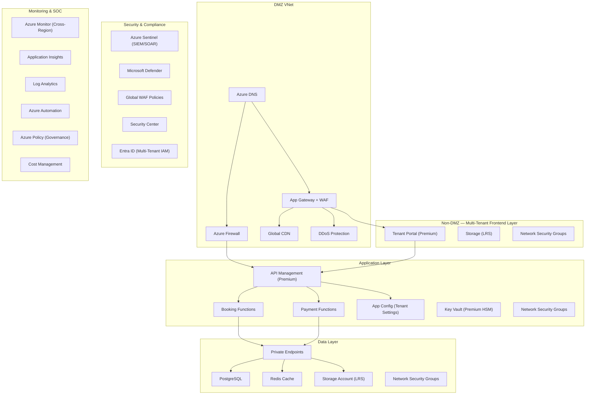

### 2.3 Multi-Region Active-Active Architecture

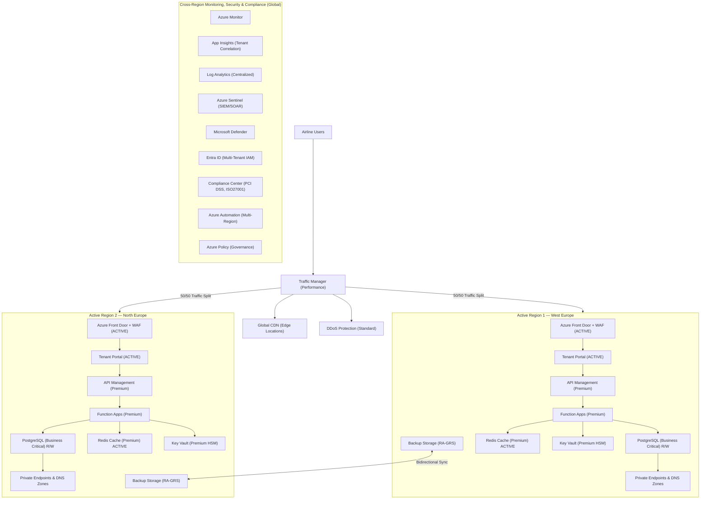

### 2.4 Multi-Tenancy Model — Regional Tier Level

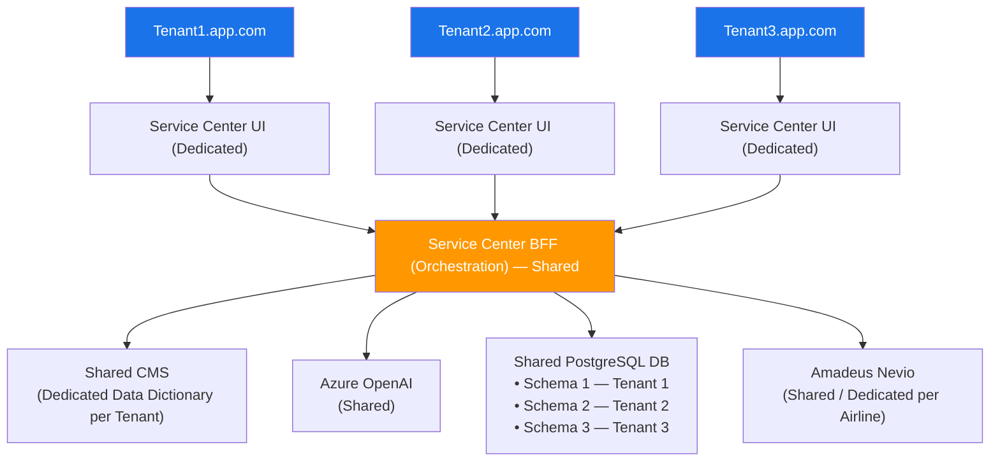

---

## 3. Microsoft Azure Landing Zone — Official Reference Architectures

This section maps Microsoft's official Landing Zone architectures, design areas, and patterns directly to Contoso's contact center SaaS use case. These are the **canonical Microsoft references** that Contoso should follow.

---

### 3.1 Azure Landing Zone Conceptual Architecture

> 📎 **Official Source:** [What is an Azure Landing Zone?](https://learn.microsoft.com/en-us/azure/cloud-adoption-framework/ready/landing-zone/)
> 📎 **Design Areas:** [Azure Landing Zone Design Areas](https://learn.microsoft.com/en-us/azure/cloud-adoption-framework/ready/landing-zone/design-areas)
> 📎 **Download Visio/PDF:** [Conceptual Architecture Diagram](https://learn.microsoft.com/en-us/azure/cloud-adoption-framework/ready/landing-zone/#azure-landing-zone-architecture)

The Azure Landing Zone is a **prescriptive architectural blueprint** from Microsoft's Cloud Adoption Framework (CAF). It defines how to organize subscriptions, management groups, policies, networking, identity, and governance — providing a scalable foundation for any workload, including multi-tenant SaaS.

#### Microsoft's Conceptual Architecture (Mermaid Representation)

```mermaid
graph TD
    Root["🏛️ Tenant Root Group"]

    Root --> Platform["📦 Platform\n(Management Group)"]
    Root --> LandingZones["🚀 Landing Zones\n(Management Group)"]
    Root --> Sandbox["🧪 Sandbox\n(Management Group)"]
    Root --> Decomm["🗑️ Decommissioned\n(Management Group)"]

    %% Platform Landing Zones
    Platform --> Identity["🔐 Identity\n(Subscription)"]
    Platform --> Management["📊 Management\n(Subscription)"]
    Platform --> Connectivity["🌐 Connectivity\n(Subscription)"]

    Identity --> EntraID["Microsoft Entra ID\n(Tenant-wide)"]
    Identity --> CondAccess["Conditional Access\nPolicies"]
    Identity --> PIM["Privileged Identity\nManagement"]

    Management --> MonitorSub["Azure Monitor"]
    Management --> LogAn["Log Analytics\nWorkspace"]
    Management --> Sentinel["Microsoft Sentinel\n(SIEM/SOAR)"]
    Management --> AutoAcct["Automation\nAccounts"]

    Connectivity --> HubVNet["Hub VNet(s)\nper Region"]
    Connectivity --> FW["Azure Firewall\n+ Policies"]
    Connectivity --> DNS["Azure DNS\nPrivate Zones"]
    Connectivity --> ER["ExpressRoute /\nVPN Gateway"]
    Connectivity --> AFD["Azure Front Door\n(Global)"]

    %% Application Landing Zones
    LandingZones --> Corp["🏢 Corp\n(Management Group)"]
    LandingZones --> Online["🌍 Online\n(Management Group)"]

    Corp --> CorpSub1["Internal Apps\n(Subscription)"]

    Online --> ProdSub["Production SaaS\n(Subscription)"]
    Online --> NonProdSub["Non-Prod SaaS\n(Subscription)"]

    ProdSub --> AppRG["Application\nResources"]
    ProdSub --> DataRG["Data\nResources"]

    %% Sandbox
    Sandbox --> SandSub["Sandbox\n(Subscription)"]

    %% Styling
    style Root fill:#0d1b2a,color:#fff
    style Platform fill:#1b3a5c,color:#fff
    style LandingZones fill:#1b5e20,color:#fff
    style Identity fill:#4a148c,color:#fff
    style Management fill:#01579b,color:#fff
    style Connectivity fill:#e65100,color:#fff
    style Corp fill:#2e7d32,color:#fff
    style Online fill:#388e3c,color:#fff
    style Sandbox fill:#6a1b9a,color:#fff
    style Decomm fill:#616161,color:#fff
```

#### How This Applies to Contoso

| Microsoft LZ Component | Contoso Mapping |
|------------------------|-------------|
| **Tenant Root Group** | Contoso organizational root in Azure |
| **Platform → Identity** | Entra ID for multi-tenant IAM (airline SSO + internal) |
| **Platform → Management** | Centralized Sentinel, Monitor, Log Analytics (already exists) |
| **Platform → Connectivity** | Hub VNets in West Europe + North Europe (already exists) |
| **Landing Zones → Online** | Contoso SaaS Contact Center production workloads |
| **Landing Zones → Corp** | Contoso internal/admin tools (Admin Console) |
| **Sandbox** | Dev/test environments for new feature development |

---

### 3.2 The Eight Design Areas of Azure Landing Zones

> 📎 **Official Source:** [Azure Landing Zone Design Areas](https://learn.microsoft.com/en-us/azure/cloud-adoption-framework/ready/landing-zone/design-areas)

Microsoft defines **eight design areas** that every Landing Zone must address. Here's how each maps to Contoso:

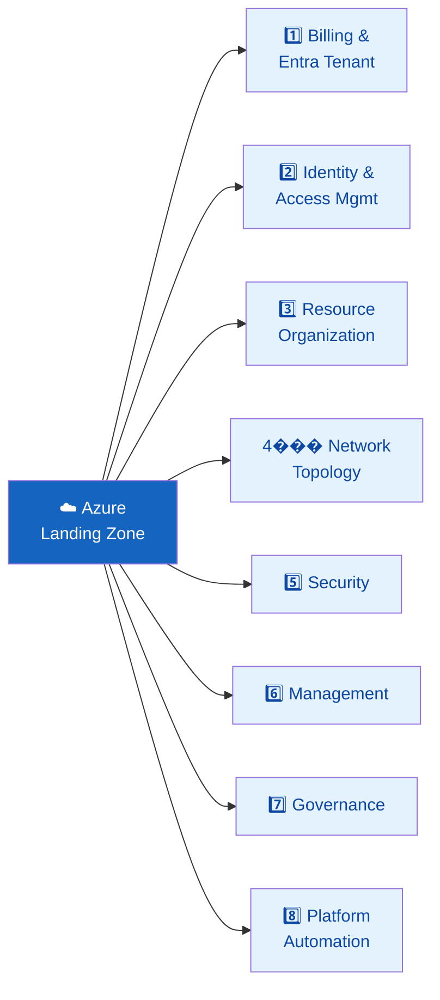

| # | Design Area | Microsoft Guidance | Contoso Implementation | Contoso Status |
|---|------------|-------------------|-------------------|------------|
| 1 | **Billing & Entra Tenant** | Single Entra tenant, Enterprise Agreement, subscription per workload | Single Entra tenant with multi-tenant app registrations; EA or MCA billing | 🟡 Needs formalization |
| 2 | **Identity & Access Management** | Entra ID, Conditional Access, PIM, RBAC, SSO federation | Entra ID for SSO with Salesforce; per-airline Conditional Access policies; PIM for admins | ✅ Partially in place |
| 3 | **Resource Organization** | Management Groups → Subscriptions → Resource Groups; consistent naming & tagging | MG hierarchy (Platform/LZ/Sandbox); per-stamp subscriptions; per-tenant RGs | 🔴 Needs implementation |
| 4 | **Network Topology & Connectivity** | Hub-Spoke or Virtual WAN; Azure Firewall; Private Endpoints; DNS | Hub-Spoke per region; Azure Firewall + WAF; Private Endpoints for PaaS | ✅ In place |
| 5 | **Security** | Defender for Cloud; Sentinel; Key Vault; DDoS; WAF | Sentinel (SIEM/SOAR), Defender, WAF, DDoS Standard, Key Vault HSM | ✅ In place |
| 6 | **Management** | Azure Monitor; Log Analytics; App Insights; Automation | Cross-region Monitor, App Insights (tenant-correlated), Log Analytics | ✅ In place |
| 7 | **Governance** | Azure Policy; Blueprints; Cost Management; tagging | Policy initiatives for GDPR, encryption, allowed locations; per-tenant cost tags | 🟡 Needs expansion |
| 8 | **Platform Automation & DevOps** | IaC (Bicep/Terraform); CI/CD (GitHub Actions/Azure DevOps); GitOps | IaC templates for stamp deployment; automated tenant onboarding pipeline | 🔴 Needs implementation |

---

### 3.3 Platform Landing Zone vs. Application Landing Zone

> 📎 **Official Source:** [Platform vs. Application Landing Zones](https://learn.microsoft.com/en-us/azure/cloud-adoption-framework/ready/landing-zone/)

Microsoft distinguishes two types of landing zones. Here's how they map to Contoso:

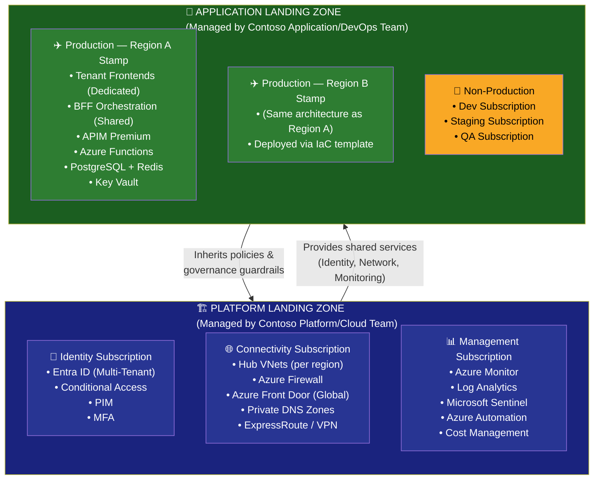

| Aspect | Platform Landing Zone | Application Landing Zone |
|--------|----------------------|-------------------------|
| **Purpose** | Shared services foundation | Workload-specific resources |
| **Managed By** | Contoso Cloud/Platform team | Contoso Application/DevOps team |
| **Scope** | Single, organization-wide | Multiple — per environment/region/stamp |
| **Contains** | Identity, Networking, Monitoring, Security | Tenant UIs, BFF, APIs, Databases, Caches |
| **Policy** | Sets and enforces policies | Inherits and applies policies |
| **Contoso Example** | Entra ID, Hub VNets, Sentinel, Azure Firewall | Contact Center app stamps per region |

---

### 3.4 ISV Considerations for Azure Landing Zones

> 📎 **Official Source:** [ISV Considerations for Azure Landing Zones](https://learn.microsoft.com/en-us/azure/cloud-adoption-framework/ready/landing-zone/isv-landing-zone)

Microsoft provides **specific guidance for ISVs** (Independent Software Vendors) like Contoso who are building SaaS products. Key considerations:

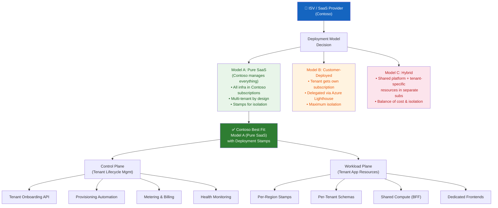

**Why Model A (Pure SaaS) fits Contoso:**
- Contoso owns and operates the infrastructure centrally
- Airlines (tenants) access via subdomain-based routing
- Shared BFF / compute with logical tenant isolation at data layer
- New airlines onboarded via automation, not new Azure tenants
- Aligns with their existing architecture (images 1–4)

---

### 3.5 Azure Multi-Tenant SaaS Architecture Patterns

> 📎 **Official Source:** [Architect Multitenant Solutions on Azure](https://learn.microsoft.com/en-us/azure/architecture/guide/multitenant/overview)
> 📎 **Tenancy Models:** [Tenancy Models for Multitenant Solutions](https://learn.microsoft.com/en-us/azure/architecture/guide/multitenant/considerations/tenancy-models)

Microsoft defines a spectrum of tenancy models from fully shared to fully isolated:

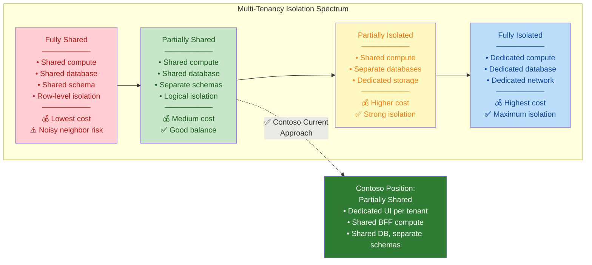

**Contoso sits at "Partially Shared"** — which Microsoft considers the **best balance** for most SaaS ISVs:
- ✅ Cost-efficient (shared compute)
- ✅ Data isolation (separate schemas + RLS)
- ✅ Customizable (per-tenant config via App Config)
- ✅ Scalable (deployment stamps for new regions)

---

### 3.6 Deployment Stamps Pattern

> 📎 **Official Source:** [Deployment Stamps Pattern](https://learn.microsoft.com/en-us/azure/architecture/patterns/deployment-stamp)
> 📎 **Geode Pattern:** [Geode Pattern](https://learn.microsoft.com/en-us/azure/architecture/patterns/geodes)

The **Deployment Stamp** is Microsoft's recommended pattern for scaling multi-tenant SaaS across regions. Each stamp is a self-contained, repeatable infrastructure unit.

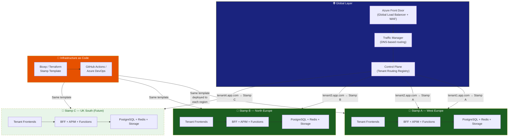

**Key benefits for Contoso:**
- 🔁 **Repeatable:** Same IaC template deploys any new region
- 🌍 **Regional data residency:** Each stamp keeps data in its region (GDPR)
- 📈 **Scalable:** Add stamps as new airlines onboard
- 🛡️ **Blast radius:** Issues in one stamp don't affect others
- 💰 **Cost-optimized:** Share resources within a stamp, isolate between stamps

---

### 3.7 Multinational Landing Zone Considerations

> 📎 **Official Source:** [Modify Landing Zone for Multinational Requirements](https://learn.microsoft.com/en-us/azure/cloud-adoption-framework/ready/landing-zone/landing-zone-multinational)
> 📎 **Landing Zone Regions:** [Landing Zone Regions](https://learn.microsoft.com/en-us/azure/cloud-adoption-framework/ready/considerations/regions)

For Contoso serving airlines across different countries, Microsoft provides specific guidance for multinational scenarios:

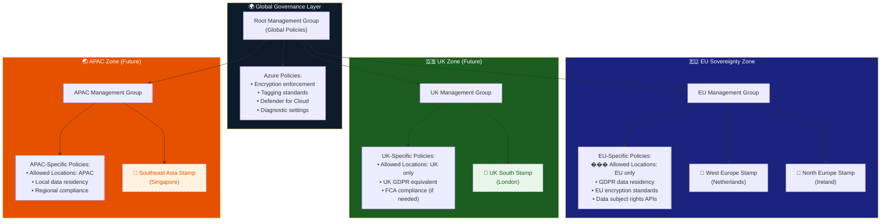

**Contoso takeaway:** As airlines from different regions onboard, Contoso can create **regional management groups** with region-specific policies that inherit from the global governance layer — ensuring GDPR in EU, UK GDPR in UK, PDPA in APAC, etc.

---

### 3.8 Contact Center & AI Agent Architecture on Azure

> 📎 **Contact Center Reference:** [Contact Centers with Azure Communication Services](https://learn.microsoft.com/en-us/azure/communication-services/tutorials/contact-center)
> 📎 **AI in Landing Zone:** [Baseline Microsoft Foundry Chat in Azure Landing Zone](https://learn.microsoft.com/en-us/azure/architecture/ai-ml/architecture/baseline-microsoft-foundry-landing-zone)

For Contoso's AI-powered contact center agents (using Azure OpenAI), Microsoft provides specific guidance:

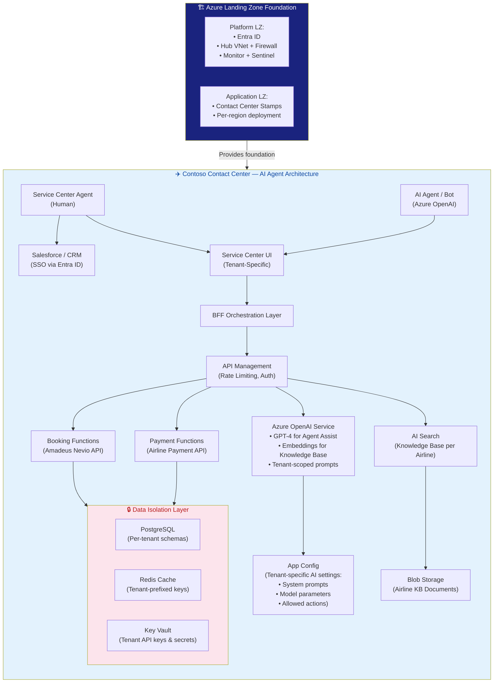

---

### 3.9 Multi-Tenant Landing Zone Automation

> 📎 **Official Source:** [Automate Azure Landing Zones Across Multiple Tenants](https://learn.microsoft.com/en-us/azure/cloud-adoption-framework/ready/landing-zone/design-area/multi-tenant/automation)
> 📎 **Considerations:** [Multi-Tenant Landing Zone Considerations](https://learn.microsoft.com/en-us/azure/cloud-adoption-framework/ready/landing-zone/design-area/multi-tenant/considerations-recommendations)

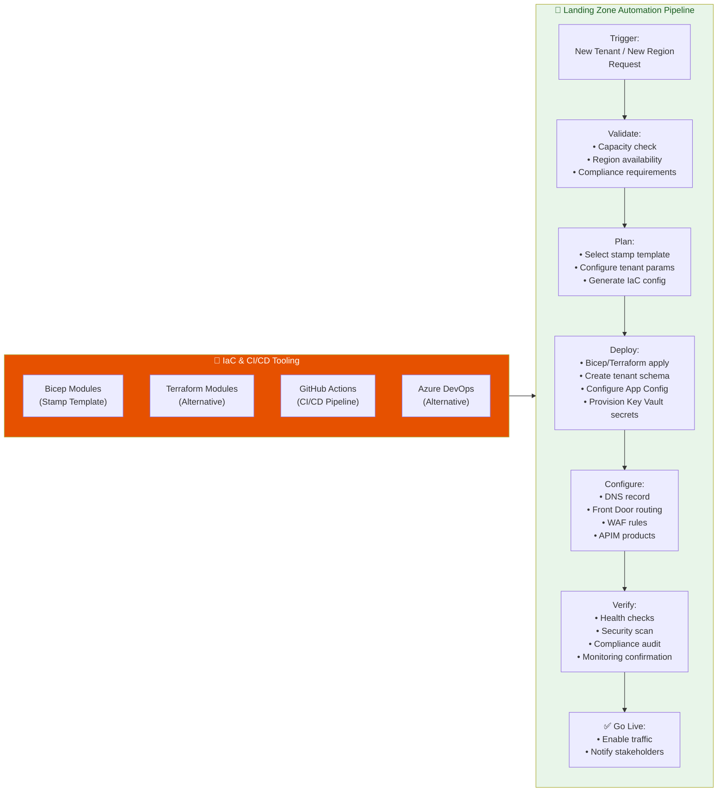

---

### 3.10 Microsoft Landing Zone Accelerators & GitHub Repos

> These are **ready-to-deploy IaC implementations** of the Landing Zone patterns above.

| Accelerator | GitHub Repo | Use for Contoso |
|------------|-------------|-------------|
| **Azure Landing Zones (Enterprise-Scale)** | [Azure/Enterprise-Scale](https://github.com/Azure/Enterprise-Scale) | Core LZ setup: MG hierarchy, policies, connectivity |
| **Azure Landing Zones (Docs & Modules)** | [Azure/Azure-Landing-Zones](https://github.com/Azure/Azure-Landing-Zones) | Documentation, Bicep/Terraform modules |
| **ALZ Bicep Modules** | [Azure/ALZ-Bicep](https://github.com/Azure/ALZ-Bicep) | Bicep-specific LZ deployment modules |
| **ALZ Terraform Modules** | [Azure/terraform-azurerm-caf-enterprise-scale](https://github.com/Azure/terraform-azurerm-caf-enterprise-scale) | Terraform-specific LZ deployment |
| **Multi-Tenant Capacity Mgmt** | [microsoft/azcapman](https://github.com/microsoft/azcapman) | Quota & capacity planning for multi-tenant |
| **ALZ Deployment Guide** | [Deploying ALZ Wiki](https://github.com/Azure/Enterprise-Scale/wiki/Deploying-ALZ) | Step-by-step deployment walkthrough |

---

### 3.11 Complete Microsoft Reference Architecture Map for Contoso

The following diagram shows how **all** of Microsoft's reference architectures layer together for Contoso's use case:

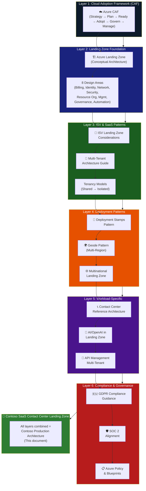

---

## 4. Landing Zone Design Principles

| Principle | Description |
|-----------|-------------|
| **Subscription Democratization** | Separate subscriptions for platform services vs. workloads |
| **Policy-Driven Governance** | Azure Policy at Management Group level — inherited by all children |
| **Single Control & Management Plane** | Centralized identity, monitoring, and security |
| **Application-Centric Migration** | Stamp-based deployment for each region |
| **Align with Azure-Native** | Leverage PaaS-first (Functions, APIM, PostgreSQL Flexible Server) |
| **Repeatable & Automated** | IaC (Bicep/Terraform) for all stamp deployments |

---

## 5. Management Group & Subscription Hierarchy

```mermaid
graph TD
    Root["🏢 Contoso SaaS Platform\n(Root Management Group)"]

    Root --> Platform["📦 Platform"]
    Root --> LandingZones["🚀 Landing Zones"]
    Root --> Sandbox["🧪 Sandbox"]
    Root --> Decommissioned["🗑️ Decommissioned"]

    Platform --> Identity["🔐 Identity & Security\nSubscription"]
    Platform --> Management["📊 Management\nSubscription"]
    Platform --> Connectivity["🌐 Connectivity\nSubscription"]

    Identity --> EntraID["Entra ID\n(Multi-Tenant IAM)"]
    Identity --> KV["Key Vault\n(Premium HSM)"]
    Identity --> CA["Conditional Access\nPolicies"]
    Identity --> PIM["Privileged Identity\nManagement"]

    Management --> Monitor["Azure Monitor\n(Cross-Region)"]
    Management --> LogAn["Log Analytics\nWorkspace"]
    Management --> Sentinel["Azure Sentinel\n(SIEM/SOAR)"]
    Management --> Automation["Azure Automation"]

    Connectivity --> Hub["Hub VNet\n(per Region)"]
    Connectivity --> Firewall["Azure Firewall"]
    Connectivity --> DNS["Azure DNS\nPrivate Zones"]
    Connectivity --> ER["ExpressRoute /\nVPN Gateway"]

    LandingZones --> Prod["🟢 Production"]
    LandingZones --> NonProd["🟡 Non-Production"]

    Prod --> StampA["📍 Region A Stamp\n(West Europe)"]
    Prod --> StampB["📍 Region B Stamp\n(North Europe)"]
    Prod --> StampN["📍 Region N Stamp\n(Future Expansion)"]

    StampA --> SharedA["Shared Services RG\n(APIM, BFF, App Config)"]
    StampA --> Tenant1A["Tenant 1 RG\n(Frontend, Config)"]
    StampA --> Tenant2A["Tenant 2 RG\n(Frontend, Config)"]
    StampA --> DataA["Data RG\n(PostgreSQL, Redis, Storage)"]

    StampB --> SharedB["Shared Services RG"]
    StampB --> Tenant1B["Tenant 1 RG"]
    StampB --> DataB["Data RG"]

    NonProd --> Dev["Dev Subscription"]
    NonProd --> Staging["Staging Subscription"]
    NonProd --> QA["QA Subscription"]

    style Root fill:#1a237e,color:#fff
    style Platform fill:#0d47a1,color:#fff
    style LandingZones fill:#1b5e20,color:#fff
    style Prod fill:#2e7d32,color:#fff
    style NonProd fill:#f9a825,color:#000
    style Sandbox fill:#6a1b9a,color:#fff
    style Decommissioned fill:#616161,color:#fff
```

---

## 6. Network Topology — Hub & Spoke

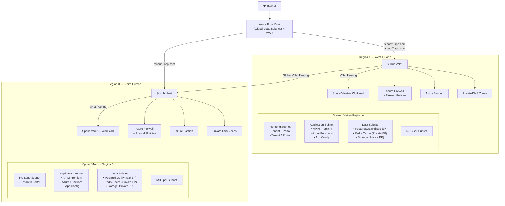

---

## 7. Multi-Tenancy Strategy

### 7.1 Isolation Model

| Layer | Strategy | Isolation Level | Details |
|-------|----------|-----------------|---------|
| **DNS / Routing** | Subdomain-based (`tenant1.app.com`) | Logical | Azure Front Door routing rules + custom domains |
| **Frontend (UI)** | Dedicated per tenant | Dedicated | Separate Azure Static Web Apps or App Service per tenant |
| **BFF / Orchestration** | Shared with tenant context | Shared | Azure Functions Premium; tenant resolved via JWT / subdomain |
| **API Management** | Shared APIM instance | Shared | Per-tenant products, subscriptions, and rate limiting |
| **App Configuration** | Shared instance, tenant-scoped keys | Logical | Feature flags and settings prefixed by tenant ID |
| **Database** | Shared DB, separate schemas | Logical | PostgreSQL with Row-Level Security + per-tenant schemas |
| **Cache** | Shared Redis, key-prefixed | Logical | Tenant-prefixed keys, separate Redis databases optional |
| **AI / OpenAI** | Shared instance | Logical | Tenant-scoped API keys, system prompts per tenant |
| **CMS** | Shared CMS, dedicated data dictionary | Logical | Content tagged and filtered by tenant ID |
| **Key Vault** | Shared or dedicated per compliance | Configurable | Premium HSM; tenant secrets in named vaults or prefixed |
| **External APIs** | Shared or dedicated per airline | Configurable | Amadeus Nevio — per-tenant config in App Config |

### 7.2 Tenant Resolution Flow

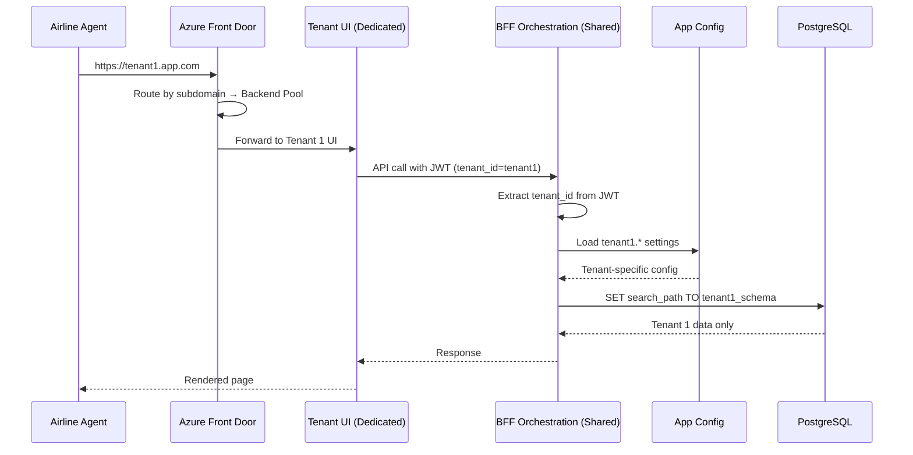

---

## 8. Multi-Region Deployment Stamps

### 8.1 Stamp Architecture

Each region gets an identical **Deployment Stamp** — a self-contained unit of infrastructure deployed via IaC.

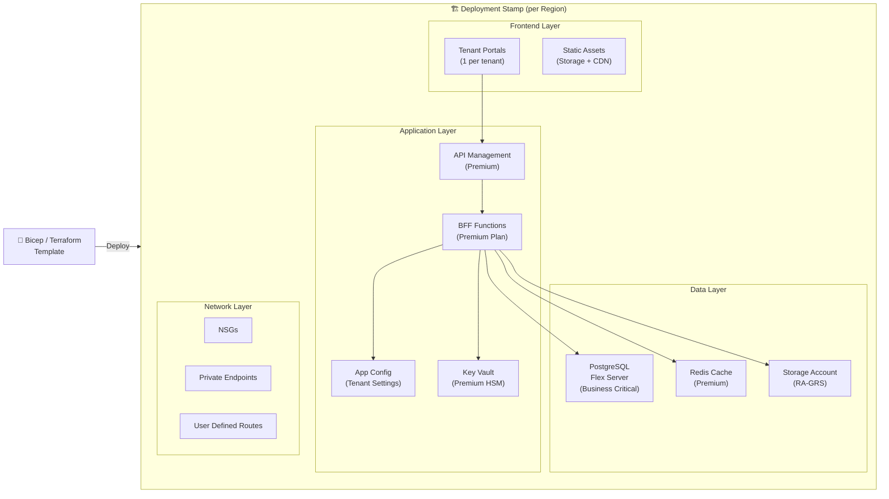

### 8.2 Adding a New Region (Stamp Deployment)

```mermaid
graph LR
    A["1. Trigger\nNew Region Request"] --> B["2. Run IaC Pipeline\n(Bicep/Terraform)"]
    B --> C["3. Deploy Stamp\nto Region N"]
    C --> D["4. Configure\nAzure Front Door\n(Add Backend Pool)"]
    D --> E["5. Provision\nTenant Schema\nin PostgreSQL"]
    E --> F["6. Load Tenant Config\ninto App Config"]
    F --> G["7. Configure DNS\n(subdomain → Front Door)"]
    G --> H["8. Apply Azure Policies\n(Auto-inherited)"]
    H --> I["9. Enable Monitoring\n(Auto-flows to\ncentral Log Analytics)"]
    I --> J["10. ✅ Tenant Live\nin New Region"]

    style A fill:#1565c0,color:#fff
    style J fill:#2e7d32,color:#fff
```

---

## 9. Security, GDPR & Compliance

### 9.1 GDPR Compliance Matrix

| GDPR Article | Requirement | Azure Implementation |
|-------------|-------------|---------------------|
| **Art. 5** | Data minimization & purpose limitation | App-level data handling + Azure Policy for data classification |
| **Art. 17** | Right to Erasure | Automated tenant data deletion APIs per schema |
| **Art. 20** | Data Portability | Export APIs scoped to tenant data (JSON/CSV) |
| **Art. 25** | Data Protection by Design | Encryption at rest (Key Vault HSM), TLS 1.2+ in transit |
| **Art. 28** | Processor obligations | Azure DPA (Data Processing Agreement) |
| **Art. 30** | Records of processing | Azure Activity Logs + Log Analytics |
| **Art. 32** | Security of processing | Defender for Cloud, Sentinel, NSGs, Private Endpoints |
| **Art. 33** | Breach notification (72h) | Sentinel alerts → Logic Apps → automated incident response |
| **Art. 35** | DPIA (Data Protection Impact Assessment) | Compliance Manager in Microsoft Purview |
| **Art. 44-49** | Cross-border data transfers | Azure Policy — restrict resources to EU regions only |

### 9.2 SOC 2 Alignment

| SOC 2 Criteria | Azure Controls |
|----------------|---------------|
| **Security** | Azure Firewall, NSGs, DDoS, WAF, Defender for Cloud |
| **Availability** | Active-Active multi-region, SLA-backed PaaS services |
| **Processing Integrity** | Application Insights, transaction tracing |
| **Confidentiality** | Key Vault (CMK), Private Endpoints, data encryption |
| **Privacy** | Entra ID RBAC, Conditional Access, audit logging |

### 9.3 Security Architecture

```mermaid
graph TB
    subgraph Identity["🔐 Identity & Access"]
        EntraID["Entra ID\n(Multi-Tenant)"]
        CA["Conditional\nAccess"]
        PIM["Privileged Identity\nManagement"]
        MFA["MFA Enforcement"]
    end

    subgraph Network["🌐 Network Security"]
        AFD["Azure Front Door\n+ WAF"]
        FW["Azure Firewall"]
        DDoS["DDoS Protection\nStandard"]
        NSG["Network Security\nGroups"]
        PE["Private Endpoints"]
    end

    subgraph Data["🔒 Data Protection"]
        KV["Key Vault\n(Premium HSM)"]
        TLS["TLS 1.2+\nEnforced"]
        Encrypt["Encryption at Rest\n(AES-256)"]
        RLS["Row-Level Security\n(PostgreSQL)"]
    end

    subgraph Monitoring["🛡️ Threat Detection"]
        Sentinel["Azure Sentinel\n(SIEM/SOAR)"]
        Defender["Microsoft Defender\nfor Cloud"]
        LogAnalytics["Log Analytics\n(Centralized)"]
        Alerts["Alert Rules +\nLogic Apps"]
    end

    subgraph Governance["📋 Governance"]
        Policy["Azure Policy\n(Guardrails)"]
        Blueprints["Azure Blueprints\n(Compliance Baseline)"]
        CostMgmt["Cost Management\n(Per Tenant)"]
        Tags["Resource Tagging\n(Mandatory)"]
    end

    Identity --> Network
    Network --> Data
    Data --> Monitoring
    Monitoring --> Governance
```

---

## 10. Governance via Azure Policy

### 10.1 Policy Initiatives (Applied at Root Management Group)

```mermaid
graph TD
    MG["Root Management Group\n(Contoso SaaS Platform)"]

    MG --> P1["📍 Allowed Locations\nRestrict to EU regions\n(GDPR Art. 44-49)"]
    MG --> P2["🔒 Enforce Encryption\nAll storage & databases\nmust use encryption"]
    MG --> P3["🔗 Require Private Endpoints\nNo public access to\nPaaS services"]
    MG --> P4["🚫 Deny Public IPs\nNo public IPs on\ncompute resources"]
    MG --> P5["🏷️ Require Tagging\nTenant, Environment,\nCostCenter, DataClassification"]
    MG --> P6["📊 Enforce Diagnostics\nAll resources must send\nlogs to Log Analytics"]
    MG --> P7["🔐 Require TLS 1.2+\nAll HTTPS endpoints\nmust use TLS 1.2 minimum"]
    MG --> P8["🗝️ Enforce Key Vault\nAll secrets must be\nstored in Key Vault"]
    MG --> P9["🛡️ Enable Defender\nDefender for Cloud\non all subscriptions"]
    MG --> P10["💰 Budget Alerts\nCost alerts per\nsubscription/tenant"]

    style MG fill:#1a237e,color:#fff
    style P1 fill:#e8eaf6,color:#1a237e
    style P2 fill:#e8eaf6,color:#1a237e
    style P3 fill:#e8eaf6,color:#1a237e
    style P4 fill:#e8eaf6,color:#1a237e
    style P5 fill:#e8eaf6,color:#1a237e
    style P6 fill:#e8eaf6,color:#1a237e
    style P7 fill:#e8eaf6,color:#1a237e
    style P8 fill:#e8eaf6,color:#1a237e
    style P9 fill:#e8eaf6,color:#1a237e
    style P10 fill:#e8eaf6,color:#1a237e
```

### 10.2 Tagging Strategy

| Tag Name | Purpose | Example Values |
|----------|---------|---------------|
| `Tenant` | Identify tenant ownership | `airline-a`, `airline-b` |
| `Environment` | Deployment environment | `prod`, `staging`, `dev` |
| `CostCenter` | Cost allocation | `CC-001`, `CC-002` |
| `DataClassification` | Data sensitivity | `confidential`, `internal`, `public` |
| `Region` | Deployment region | `westeurope`, `northeurope` |
| `ManagedBy` | IaC tool identifier | `terraform`, `bicep` |
| `Application` | Application name | `service-center`, `admin-console` |

---

## 11. Monitoring & Operations

### 11.1 Centralized Monitoring Architecture

```mermaid
graph TB
    subgraph RegionA["Region A Stamp"]
        AppA["App Resources"]
        DiagA["Diagnostic Settings"]
        AppA --> DiagA
    end

    subgraph RegionB["Region B Stamp"]
        AppB["App Resources"]
        DiagB["Diagnostic Settings"]
        AppB --> DiagB
    end

    DiagA --> LAW["📊 Central Log Analytics\nWorkspace"]
    DiagB --> LAW

    LAW --> Monitor["Azure Monitor\n(Dashboards + Alerts)"]
    LAW --> Sentinel["Azure Sentinel\n(Security Analytics)"]
    LAW --> AppInsights["Application Insights\n(Tenant-Correlated\nPerformance)"]

    Monitor --> ActionGroups["Action Groups\n(Email, SMS, Teams,\nPagerDuty)"]
    Sentinel --> Playbooks["Logic App Playbooks\n(Auto-Remediation)"]

    subgraph Dashboards["📈 Dashboards"]
        OpsDash["Operations Dashboard\n(per Region)"]
        TenantDash["Tenant Health Dashboard\n(per Tenant)"]
        SecDash["Security Dashboard\n(Threat Overview)"]
        CostDash["Cost Dashboard\n(per Tenant + Region)"]
    end

    Monitor --> Dashboards
```

### 11.2 Key Metrics to Monitor

| Category | Metric | Alert Threshold |
|----------|--------|----------------|
| **Availability** | Uptime per region/stamp | < 99.9% |
| **Performance** | API response time (P95) | > 500ms |
| **Errors** | HTTP 5xx error rate | > 1% |
| **Database** | PostgreSQL CPU/Memory | > 80% |
| **Cache** | Redis hit/miss ratio | Miss > 20% |
| **Security** | Failed auth attempts | > 50/min per tenant |
| **Cost** | Daily spend per tenant | > budget threshold |
| **Tenant** | Schema size growth | > 80% of allocated quota |

---

## 12. Tenant Onboarding Workflow

```mermaid
sequenceDiagram
    participant PM as Product Manager
    participant CP as Control Plane API
    participant IaC as IaC Pipeline (GitHub Actions)
    participant AFD as Azure Front Door
    participant DNS as Azure DNS
    participant DB as PostgreSQL
    participant AppCfg as App Config
    participant KV as Key Vault
    participant Monitor as Azure Monitor

    PM->>CP: Request: Onboard "Airline-X" in Region B
    CP->>CP: Validate request & check capacity

    CP->>IaC: Trigger stamp deployment (if new region)
    IaC->>IaC: Deploy Bicep/Terraform template
    IaC-->>CP: Stamp ready

    CP->>DB: CREATE SCHEMA airline_x
    CP->>DB: Apply RLS policies
    DB-->>CP: Schema created

    CP->>AppCfg: Add airline-x.* settings
    CP->>KV: Store airline-x secrets

    CP->>DNS: Create airlinex.app.com → Front Door
    CP->>AFD: Add routing rule for airlinex.app.com
    CP->>AFD: Configure backend pool

    CP->>IaC: Deploy tenant frontend (airlinex)
    IaC-->>CP: Frontend deployed

    CP->>Monitor:
