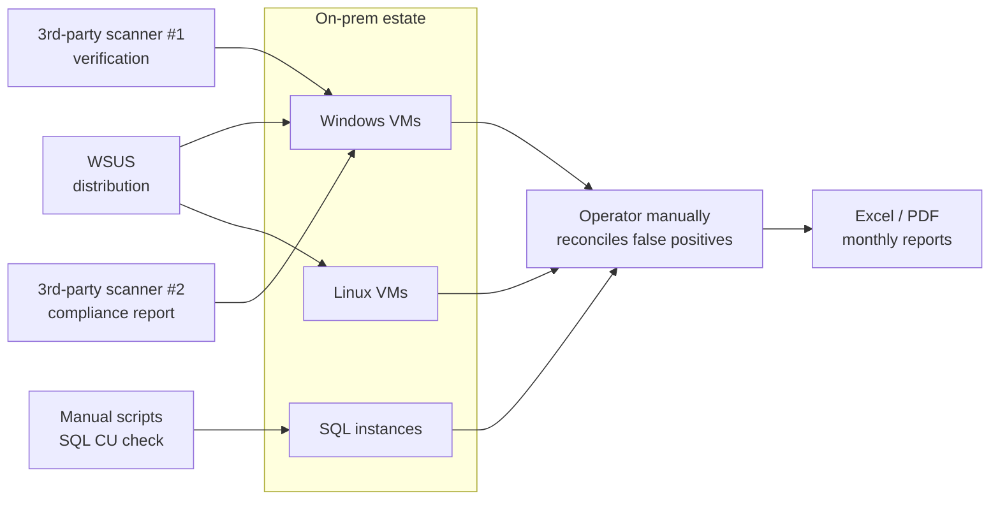
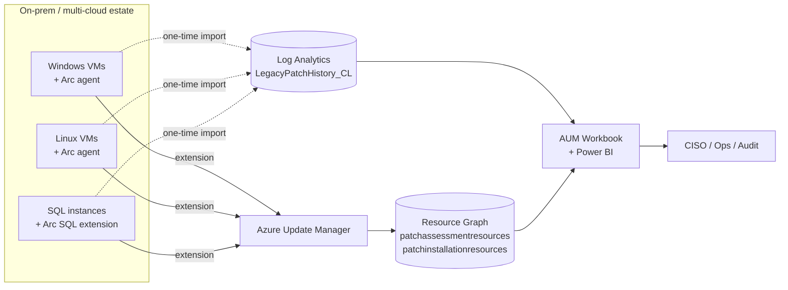
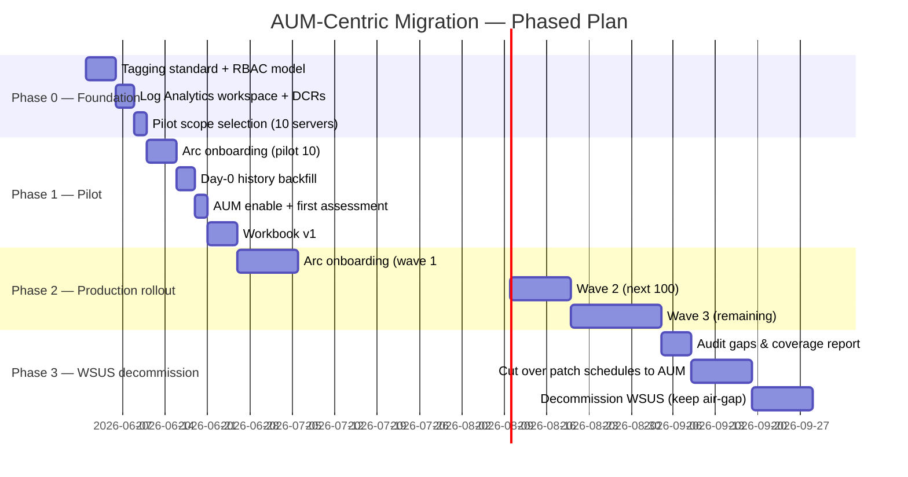
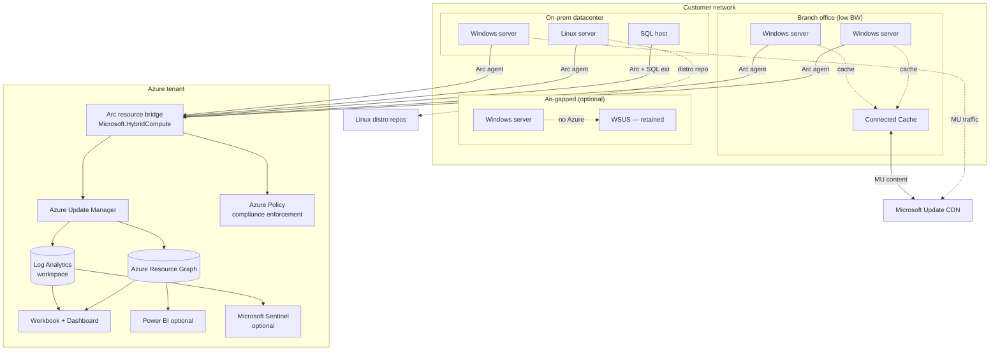

# AUM-Centric Patch Management — Proposal & Solution

> **Prepared for:** Customer post-demo follow-up
> **Date:** 21 May 2026
> **Author:** Microsoft Solutions team
> **Scope:** Replace existing WSUS + multi-tool patch workflow with an Azure Update Manager (AUM)–centric single pane of glass, anchored on Azure Arc for the on-prem estate.

---

## 1. Executive Summary

The customer's current patch management estate is built around **WSUS for distribution**, **multiple secondary tools for verification**, and a **manual reconciliation step for false positives**. The team owns the toolchain, the reports, and the gaps between them.

We propose a **single-console model**: onboard every Windows/Linux server and SQL host to **Azure Arc** (free), and let **Azure Update Manager (AUM)** become the **only place** the customer assesses, schedules, executes, audits, and reports on OS-level patching. WSUS is retired (or retained only for true air-gapped pockets); the secondary verification tools become redundant; false-positive reconciliation collapses because AUM's data source is the OS's own update agent (WU / package manager), not a third-party scanner.

To preserve **historical continuity**, we ingest each server's pre-Arc patch history (`Get-HotFix`, `dpkg/yum/dnf history`, SQL CU registry) **once at onboarding** into a Log Analytics custom table. From Day 1 the customer's Workbook UNIONs that one-time history with AUM's ongoing data — a single timeline per server, per business unit, per estate.

**Outcome promise:** *one console, one report, one schedule engine, one audit trail — across on-prem, Azure, AWS, GCP, Windows, Linux, and SQL.*

---

## 2. Current State (as described by the customer)



### Pain points the customer named
| # | Pain | Operational cost |
|---|---|---|
| 1 | Multiple tools, each with its own UI and dataset | High context-switching; team specialism per tool |
| 2 | False positives between scanners and WSUS | Hours per cycle on manual reconciliation |
| 3 | Reports stitched manually from CSV exports | Slow, error-prone, no real-time view |
| 4 | WSUS is Windows-only | Linux + SQL CUs covered by separate workflows |
| 5 | No single compliance % across the estate | Risk reporting to leadership is approximate |
| 6 | WSUS is deprecated by Microsoft | Strategic dead-end |

---

## 3. Target State — AUM-Centric



### What changes
| Capability | Before | After |
|---|---|---|
| **Distribution** | WSUS server fleet | Microsoft Update + Delivery Optimization (or Connected Cache for branch sites) |
| **Assessment** | WSUS + 3rd-party scanner | AUM (built on the OS's own WU / package manager — single source of truth) |
| **Scheduling** | GPO + WSUS computer groups | AUM maintenance configurations, tag-scoped |
| **Reporting** | Manual CSV stitching | One Workbook unioning Day-0 history + AUM ARG data, refreshed live |
| **False positives** | Cross-tool reconciliation | Eliminated — the assessment source IS the install source |
| **Linux** | Separate workflow | Same console, same scheduler, same reports |
| **SQL CUs** | Manual | SQL Arc extension reports installed CU; AUM tracks OS patches surrounding it |
| **Audit** | Multiple exports | Single ARG query → CSV / Workbook / Power BI |

---

## 4. Customer Asks — Mapped to Solution

### 4.1 "Can I get a report of security patches installed **BEFORE** I onboarded the server?"

**Native AUM answer:** No — AUM begins recording from the moment its extension reports.

**Our solution — one-time Day-0 backfill into Log Analytics:**

1. At onboarding (Arc agent install), automatically invoke a small script via `az connectedmachine run-command invoke` that extracts the OS's full update history.
2. The script writes structured JSON to a Data Collection Rule → custom Log Analytics table `LegacyPatchHistory_CL`.
3. From that point on, **the Workbook unions** `LegacyPatchHistory_CL` with `patchinstallationresources` (AUM ARG) to give an unbroken timeline per machine.

**Scripts (provided in Appendix A):**
- Windows: `Get-HotFix` + `Get-WmiObject Win32_QuickFixEngineering` + `WindowsUpdate.log` parse
- Linux: `dpkg -l` / `rpm -qa` + `/var/log/dpkg.log` + `dnf history list`
- SQL Server: `sys.dm_server_registry` + CU registry keys (per instance)

**What the customer sees:** Workbook with a "Patch History" tab per machine, showing two stacked colors — *Pre-Arc (imported once)* + *Post-Arc (AUM live)*. No gap in the timeline.

> **Caveat — be honest:** the pre-Arc data is only as complete as what the OS retained. If WSUS purged client install logs older than X days, that's what we get. Most Windows hosts have `Get-HotFix` data going back to OS install, so coverage is usually excellent.

---

### 4.2 "Can I get a comprehensive dashboard for ALL servers, before + after?"

**Yes — three layers, customer chooses depth:**

#### Layer 1 — Built-in (zero customization, available Day 1 of onboarding)
- **Update Manager portal** → Overview, Machines, History, Schedules
- Cross-subscription, cross-cloud, cross-tenant
- Filterable by RG, tag, OS, compliance state
- Drill-down per KB / per machine / per deployment run
- **Cost:** included with AUM

#### Layer 2 — Azure Workbook (custom, ~1 day to build)
- Tiles: estate compliance %, top 10 unpatched machines, critical/security backlog by BU (tag), patch velocity (last 30/60/90 days), pre-vs-post-Arc patch timeline per machine
- Unions `LegacyPatchHistory_CL` with `patchassessmentresources` + `patchinstallationresources`
- Pinned to a shared Azure Dashboard
- Exportable to PDF
- **Cost:** Log Analytics ingestion (~$2.76/GB) + Workbook runtime free

#### Layer 3 — Power BI executive view (optional, ~3 days to build)
- Connect Power BI to ARG via Azure Resource Graph connector
- Page 1: Estate health (KPIs, gauges, "machines outside SLA")
- Page 2: Trending — compliance % over time, MTTR for critical patches
- Page 3: Compliance by business unit / cost center (driven by Azure tags)
- Page 4: Audit — every deployment run, every KB, every machine, exportable
- Scheduled refresh hourly or daily
- **Cost:** Power BI Pro licenses for report authors (~$10/user/mo)

**Sample queries** in Appendix B.
**Workbook skeleton** in Appendix C.

> **Single source of truth:** every number on every tile traces back to either `LegacyPatchHistory_CL` (one-time import) or AUM's ARG resources. No third-party scanner means no reconciliation step.

---

### 4.3 "Can AUM replace WSUS — one place to check, act, report?"

**Yes for the vast majority of customers.** This customer's scenario specifically supports a clean replacement.

#### Replacement scorecard
| Capability the customer needs today | WSUS does it | AUM does it | Notes |
|---|:-:|:-:|---|
| Schedule patches by ring (dev → test → prod) | ✅ (computer groups + GPO) | ✅ (maintenance configs + tag-based dynamic scope) | AUM is more flexible — tag-driven |
| Approve / defer specific KBs | ✅ | ✅ (KB exclude/include lists) | Different UX; functional parity |
| Reboot orchestration | ⚠️ (via GPO) | ✅ Native (`IfRequired`, `Never`, `Always`) | AUM wins |
| Pre/post scripts | ❌ | ✅ Native (Azure Automation runbooks) | AUM wins |
| Linux patching | ❌ | ✅ Native | AUM wins |
| Compliance reporting across estate | ⚠️ (manual) | ✅ ARG + Workbooks | AUM wins |
| Cross-cloud (AWS/GCP) patching | ❌ | ✅ (Arc-onboard them) | AUM wins |
| Future-proof / actively invested | ❌ (deprecated 2024) | ✅ Strategic | AUM wins |
| Local-cache for low-bandwidth branch | ✅ | ⚠️ Pair with **Microsoft Connected Cache** | WSUS wins as standalone |
| True air-gapped operation | ✅ | ❌ Needs Azure connectivity (direct/proxy/Private Link) | WSUS wins for air-gap only |

#### Recommendation for this customer

| Estate segment | Recommended tool |
|---|---|
| Corporate Windows + Linux + SQL hosts with normal Azure connectivity | **AUM (replaces WSUS)** |
| Branch offices with bandwidth concerns | **AUM + Microsoft Connected Cache** (local content cache, central control) |
| True air-gapped (if any) | **Keep WSUS** for that pocket only |
| Workstations / laptops (out of scope of this proposal) | **Intune** (separate workstream) |

#### What "one place" looks like operationally

| Action | Where the customer goes |
|---|---|
| Check what's pending on `srvprod-sql-01` | Portal → Update Manager → Machines → `srvprod-sql-01` |
| Schedule the monthly Patch Tuesday rollout | Portal → Update Manager → Maintenance configurations → create/edit |
| See compliance % for "BU=Finance" | Dashboard tile (Workbook) — auto-filtered by tag |
| Export audit evidence for ISO 27001 | Resource Graph Explorer → run shared query → CSV export |
| Verify a specific KB is installed across the estate | ARG query: `patchinstallationresources | where patches contains "KB5..."` |
| Investigate a deployment failure | Update Manager → History → drill into run → see exit code + agent log |

> **One console. One data source. One report. One audit trail.**

---

## 5. Phased Delivery Plan



### Phase 0 — Foundation (1–2 weeks)
- Agree **tagging taxonomy** (e.g., `env={dev,test,prod}`, `bu={finance,retail,...}`, `patchring={ring0,ring1,ring2,ring3}`, `criticality={tier1,tier2,tier3}`)
- Decide **RBAC**: who can edit maintenance configs vs. read-only audit
- Create **Log Analytics workspace** (or reuse existing) + DCRs for AMA + the `LegacyPatchHistory_CL` custom table
- Pick a **pilot set of 10 servers** — mixed Windows, Linux, one SQL host

### Phase 1 — Pilot (2–3 weeks)
- Bulk-onboard the pilot to Arc using **at-scale onboarding script + GPO** (Appendix D)
- Run **Day-0 history backfill** (Appendix A) — one Run Command per machine, output to Log Analytics
- Enable **AUM** on the pilot; let the first scheduled assessment run
- Build **Workbook v1** with the union pattern (Appendix C)
- **Validation gate:** Workbook compliance % for pilot should reconcile to ±2% of WSUS's last report — proving AUM is the trustworthy source

### Phase 2 — Production rollout (4–8 weeks)
- Bulk-onboard in **waves of ~100** to keep risk contained
- Each wave: onboard → Day-0 backfill → enable AUM → confirm in Workbook
- Apply tags via Azure Policy (`Append` effect) so all new machines auto-inherit ring/BU/criticality

### Phase 3 — WSUS decommission (3–6 weeks)
- Run AUM and WSUS **side-by-side** for one full patch cycle on each wave
- Compare assessment results — investigate any deltas
- Cut over schedules from WSUS to AUM **wave by wave**
- Decommission WSUS scope by scope (keep only air-gapped pockets, if any)

---

## 6. Reference Architecture



### Networking notes
- **Outbound only** from each Arc machine to a known set of Microsoft endpoints (full list: `learn.microsoft.com/azure/azure-arc/servers/network-requirements`)
- **Azure Private Link** supported for Arc data plane if customer requires no public egress
- **Connected Cache** at branch sites caches Windows Update content — solves WSUS's distribution role without WSUS infrastructure

---

## 7. Cost Model

### Per-server monthly meters (list price, USD, May 2026 — for proposal sizing only)

| Meter | Rate | Required for AUM solution? |
|---|---|---|
| Arc connection | **$0** | ✅ Yes (free) |
| Azure Update Manager (Arc machine) | ~**$5 / server / mo** | ✅ Yes |
| Log Analytics ingestion | ~**$2.76 / GB** | ✅ Yes — minimal volume for AUM telemetry (~50–200 MB/server/mo typical) |
| Azure Monitor Agent (AMA) | **$0** (agent) | ✅ Yes (free agent; pays via Log Analytics) |
| Defender for Servers Plan 2 | ~$15 / server / mo | ❌ Optional — only if customer wants vuln assessment + threat detection |
| Defender for SQL | ~$15 / vCore / mo | ❌ Optional (customer already evaluated separately) |
| Microsoft Sentinel | ~$2–4 / GB | ❌ Optional |

### Worked example — 500-server estate (typical mid-sized enterprise)

| Line item | Math | Monthly cost |
|---|---|---|
| Arc connections | 500 × $0 | $0 |
| AUM (500 servers) | 500 × $5 | $2,500 |
| Log Analytics ingestion | 500 × 100 MB = 50 GB × $2.76 | $138 |
| **Total AUM-required spend** | | **~$2,640 / mo** |
| Defender for Servers P2 (if added) | 500 × $15 | $7,500 |
| **Total with security add-on** | | **~$10,140 / mo** |

### Cost offsets (what the customer **stops** paying)

| Saving | Typical annual value (500 servers) |
|---|---|
| WSUS infrastructure (2–4 HA servers + SQL + storage + ops) | ~$30K–60K/yr |
| 3rd-party patch verification tool licenses | ~$25K–100K/yr |
| 3rd-party compliance reporting tool | ~$15K–50K/yr |
| FTE time on manual reconciliation (0.3–0.5 FTE) | ~$30K–60K/yr |
| **Conservative annual offset** | **~$100K–270K/yr** |

> **Net effect:** AUM-required spend (~$32K/yr) is typically **3–8× less than the tools and effort it replaces**, even before counting risk reduction from faster, more accurate patching.

---

## 8. Risks & Mitigations

| Risk | Likelihood | Impact | Mitigation |
|---|:-:|:-:|---|
| Branch sites overwhelm WAN with Windows Update traffic | Med | Med | Deploy **Microsoft Connected Cache** or **BranchCache** before cutover |
| Air-gapped systems can't use AUM | High in some industries | High | **Retain WSUS** for those segments only; document scope |
| Pilot Workbook numbers don't reconcile to WSUS | Med | Med | Investigation phase in pilot; usually a missing extension or DCR issue |
| Tag taxonomy not enforced → maintenance configs miss machines | Med | High | Use **Azure Policy `Append` effect** to enforce tags at create-time |
| Operator team unfamiliar with AUM UI | High initially | Low | 2–3 hour enablement workshop; documented runbooks |
| Defender for Servers auto-provisioning surprises finance | Med | Med | Explicitly **scope** Defender enablement; don't enable tenant-wide by default |
| Pre-Arc patch history is incomplete | Low–Med | Low | Honest reporting — show `Source` column in Workbook (Pre-Arc vs AUM); document gap |
| SPN secrets used for onboarding leak | Low | High | **7-day max lifetime** secrets, never write to disk on operator laptop, rotate after rollout |
| AUM extension upgrade fails (file lock — known issue) | Low | Low | Documented remediation: delete + re-trigger assessment, or AV exclusion for `C:\Packages\Plugins\` |

---

## 9. Decision Points for the Customer

Before we kick off Phase 0, the customer needs to commit on:

1. **Tagging taxonomy** — we propose `env / bu / patchring / criticality`. Confirm or amend.
2. **Patch ring strategy** — typical: Ring 0 (canary, 5%) → Ring 1 (early, 15%) → Ring 2 (broad, 50%) → Ring 3 (final, 30%). Cadence: Ring 0 within 24h of Patch Tuesday, Ring 3 within 14 days.
3. **Air-gap scope** — list any segments that must stay on WSUS.
4. **Branch sites** — list any sites needing Connected Cache.
5. **RBAC model** — who owns maintenance configs (platform team), who reads dashboards (security, audit, app owners)?
6. **Subscription strategy** — single sub for all Arc resources vs. per-BU sub. (Per-BU often simplifies cost showback.)
7. **Defender for Servers** — in scope for this project or separate workstream? Recommend separate.
8. **Power BI executive layer** — in or out of Phase 1?

---

## 10. What Microsoft Will Deliver

| Deliverable | Phase | Format |
|---|---|---|
| Tagging + RBAC design doc | 0 | Markdown / Word |
| Log Analytics + DCR Bicep template | 0 | `infra/aum/*.bicep` |
| Bulk Arc onboarding script + GPO | 1 | PowerShell + GPO ADMX guidance |
| Day-0 history backfill scripts (Win/Linux/SQL) | 1 | PowerShell + Bash + T-SQL |
| Custom table `LegacyPatchHistory_CL` schema + ingestion pipeline | 1 | DCR + sample data |
| Maintenance configurations (Bicep) for all rings | 1 | `infra/aum/maintenance-configs.bicep` |
| Azure Policy assignments (tag enforcement + AUM auto-enable) | 1 | `infra/aum/policy.bicep` |
| Workbook v1 (union of pre + post) | 1 | Workbook JSON, importable |
| Wave runbooks for production rollout | 2 | Markdown runbooks |
| WSUS decommission checklist | 3 | Markdown checklist |
| Operator enablement workshop | 3 | 3-hour live session + recording |
| Final architecture + handover doc | 3 | Markdown / Word |

---

## Appendix A — Day-0 History Backfill Scripts

### A.1 Windows — `Get-HotFix` + WU log
```powershell
# Run via: az connectedmachine run-command invoke
#   --resource-group <rg> --machine-name <name>
#   --command-id RunPowerShellScript
#   --scripts @backfill-windows.ps1

$ErrorActionPreference = 'Stop'
$machineName = $env:COMPUTERNAME
$now = (Get-Date).ToUniversalTime()

# Layer 1: WMI QFE — fast, structured, complete back to OS install
$hotfixes = Get-WmiObject -Class Win32_QuickFixEngineering |
    Select-Object @{N='MachineName';E={$machineName}},
                  @{N='KB';E={$_.HotFixID}},
                  @{N='Description';E={$_.Description}},
                  @{N='InstalledOn';E={$_.InstalledOn}},
                  @{N='InstalledBy';E={$_.InstalledBy}},
                  @{N='Source';E={'Pre-Arc-QFE'}},
                  @{N='ExtractedAt';E={$now}}

# Layer 2: WU agent COM (richer metadata — title, severity, category)
$session = New-Object -ComObject Microsoft.Update.Session
$searcher = $session.CreateUpdateSearcher()
$history = $searcher.QueryHistory(0, $searcher.GetTotalHistoryCount())

$wuHistory = $history | Where-Object { $_.ResultCode -eq 2 } |
    Select-Object @{N='MachineName';E={$machineName}},
                  @{N='KB';E={
                      if ($_.Title -match 'KB\d+') { $matches[0] } else { $null }
                  }},
                  @{N='Title';E={$_.Title}},
                  @{N='Date';E={$_.Date}},
                  @{N='Operation';E={
                      switch ($_.Operation) { 1{'Install'} 2{'Uninstall'} default{'Other'} }
                  }},
                  @{N='Source';E={'Pre-Arc-WU'}},
                  @{N='ExtractedAt';E={$now}}

# Emit JSON — DCR will route to LegacyPatchHistory_CL
@($hotfixes + $wuHistory) | ConvertTo-Json -Depth 4
```

### A.2 Linux (Debian/Ubuntu) — `dpkg` + apt history
```bash
#!/usr/bin/env bash
# az connectedmachine run-command invoke ... --command-id RunShellScript --scripts @backfill-deb.sh
set -euo pipefail
machine=$(hostname)
now=$(date -u +"%Y-%m-%dT%H:%M:%SZ")

# Currently installed packages (security relevance via reverse-lookup later)
dpkg-query -W -f='${binary:Package}|${Version}|${Status}\n' |
  awk -F'|' -v m="$machine" -v t="$now" '
    {print "{\"MachineName\":\""m"\",\"Package\":\""$1"\",\"Version\":\""$2"\",\"Status\":\""$3"\",\"Source\":\"Pre-Arc-dpkg\",\"ExtractedAt\":\""t"\"}"}'

# Historical install/upgrade events
zgrep -h "" /var/log/dpkg.log* 2>/dev/null |
  awk -v m="$machine" '
    /\sinstall\s|\supgrade\s/ {
      printf "{\"MachineName\":\"%s\",\"Time\":\"%sT%sZ\",\"Action\":\"%s\",\"Package\":\"%s\",\"Version\":\"%s\",\"Source\":\"Pre-Arc-dpkg-log\"}\n",
        m, $1, $2, $3, $4, $5
    }'
```

### A.3 Linux (RHEL/Rocky/Alma) — `dnf` / `rpm`
```bash
#!/usr/bin/env bash
set -euo pipefail
machine=$(hostname)
now=$(date -u +"%Y-%m-%dT%H:%M:%SZ")

# Installed packages
rpm -qa --qf '{"MachineName":"'"$machine"'","Package":"%{NAME}","Version":"%{VERSION}-%{RELEASE}","InstallTime":"%{INSTALLTIME:date}","Source":"Pre-Arc-rpm","ExtractedAt":"'"$now"'"}\n'

# DNF history (full transactions)
dnf history list --reverse 2>/dev/null | tail -n +3 | while read -r line; do
  id=$(echo "$line" | awk '{print $1}')
  [[ "$id" =~ ^[0-9]+$ ]] || continue
  date=$(echo "$line" | awk '{print $4, $5}')
  action=$(echo "$line" | awk '{print $6}')
  echo "{\"MachineName\":\"$machine\",\"TxId\":$id,\"Time\":\"$date\",\"Action\":\"$action\",\"Source\":\"Pre-Arc-dnf-history\"}"
done
```

### A.4 SQL Server — CU/GDR registry per instance
```sql
-- Run via SQL Arc extension or sqlcmd; emit to JSON for DCR ingest
SET NOCOUNT ON;
DECLARE @machine sysname = CAST(SERVERPROPERTY('MachineName') AS sysname);
DECLARE @instance sysname = CAST(SERVERPROPERTY('InstanceName') AS sysname);
DECLARE @ver sysname = CAST(SERVERPROPERTY('ProductVersion') AS sysname);
DECLARE @level sysname = CAST(SERVERPROPERTY('ProductLevel') AS sysname);
DECLARE @update sysname = CAST(SERVERPROPERTY('ProductUpdateLevel') AS sysname);
DECLARE @ref sysname = CAST(SERVERPROPERTY('ProductUpdateReference') AS sysname);

SELECT
  @machine                  AS MachineName,
  ISNULL(@instance,'DEFAULT') AS InstanceName,
  @ver                      AS Version,
  @level                    AS Level,
  @update                   AS UpdateLevel,
  @ref                      AS KB,
  SYSUTCDATETIME()          AS ExtractedAt,
  'Pre-Arc-SQL'             AS Source
FOR JSON AUTO;
```

### A.5 DCR + custom table for ingestion
Create custom table `LegacyPatchHistory_CL` in the Log Analytics workspace with this schema (Bicep snippet provided separately in `infra/aum/dcr-legacy.bicep`):
```jsonc
{
  "TimeGenerated": "datetime",
  "MachineName":   "string",
  "Source":        "string",  // Pre-Arc-QFE | Pre-Arc-WU | Pre-Arc-dpkg | Pre-Arc-rpm | Pre-Arc-SQL
  "KB":            "string",
  "Package":       "string",
  "Version":       "string",
  "Action":        "string",
  "Description":   "string",
  "Title":         "string",
  "InstalledOn":   "datetime",
  "InstalledBy":   "string",
  "RawPayload":    "dynamic"
}
```

---

## Appendix B — Sample Queries

### B.1 Compliance % across the estate (ARG)
```kql
patchassessmentresources
| where type has "patchassessmentresults"
| extend critical  = toint(properties.availablePatchCountByClassification.critical)
| extend security  = toint(properties.availablePatchCountByClassification.security)
| extend other     = toint(properties.availablePatchCountByClassification.other)
| extend total     = critical + security + other
| extend machineName = tostring(split(id,"/")[8])
| summarize
    Machines       = count(),
    Compliant      = countif(total == 0),
    NonCompliant   = countif(total > 0)
| extend CompliancePct = round(100.0 * Compliant / Machines, 1)
```

### B.2 Top 20 machines with most pending security patches
```kql
patchassessmentresources
| where type has "patchassessmentresults"
| extend machineName = tostring(split(id,"/")[8])
| extend security    = toint(properties.availablePatchCountByClassification.security)
| extend critical    = toint(properties.availablePatchCountByClassification.critical)
| project machineName, critical, security, total = critical + security
| top 20 by total desc
```

### B.3 Pre + Post unified history for a single machine (Log Analytics + ARG join)
```kql
// Run in the Log Analytics workspace
let post = arg("").patchinstallationresources
  | extend machineName = tostring(split(id,"/")[8])
  | mv-expand p = properties.patches
  | project
      TimeGenerated = todatetime(properties.lastModifiedDateTime),
      MachineName   = machineName,
      KB            = tostring(p.kbId),
      Source        = "AUM";
let pre = LegacyPatchHistory_CL
  | where Source startswith "Pre-Arc"
  | project TimeGenerated, MachineName, KB, Source;
union pre, post
| where MachineName == "srvprod-sql-01"
| order by TimeGenerated desc
```

### B.4 Deployment-run success rate over the last 30 days
```kql
patchinstallationresources
| where todatetime(properties.lastModifiedDateTime) > ago(30d)
| extend status = tostring(properties.status)
| summarize Runs = count() by status
| extend SuccessPct = iff(status == "Succeeded", 100.0 * Runs / toscalar(
    patchinstallationresources
    | where todatetime(properties.lastModifiedDateTime) > ago(30d)
    | count
  ), 0.0)
```

### B.5 Has a specific KB landed across the estate?
```kql
patchinstallationresources
| mv-expand p = properties.patches
| where tostring(p.kbId) == "KB5005565"
| extend machineName = tostring(split(id,"/")[8])
| extend status = tostring(p.installationState)
| summarize Machines = make_set(machineName) by status
```

---

## Appendix C — Workbook Structure

```
Workbook: "Patch Estate — AUM-Centric"
├── Tab 1: Estate overview
│   ├── KPI: Compliance %
│   ├── KPI: Critical patches pending
│   ├── KPI: Machines onboarded
│   └── Stacked bar: pending by BU (tag)
├── Tab 2: Machines
│   ├── Grid: machine | OS | last assessed | critical | security | other | last deploy
│   └── Drill-down → Tab 4 for that machine
├── Tab 3: Deployment history
│   ├── Timeline: deployment runs (last 90d)
│   └── Grid: run | maintenance config | machines | success% | duration
├── Tab 4: Per-machine timeline (drill-down)
│   ├── Banner: machine identity, OS, last assessment, compliance state
│   ├── Stacked timeline: Pre-Arc (orange) + AUM (blue)
│   └── Grid: every KB ever installed, sortable by date
└── Tab 5: Audit export
    ├── Parameters: date range, BU, OS
    └── Grid (CSV-exportable): full deployment + install history
```

The Workbook JSON template is delivered as `infra/aum/workbook-patch-estate.json` — importable via Portal → Workbooks → Advanced editor.

---

## Appendix D — Bulk Arc Onboarding Pattern

### D.1 Active Directory GPO (Windows estate)
1. Create SPN `sp-customer-arc-onboard` with role `Azure Connected Machine Onboarding` scoped to the target subscription/RG.
2. Generate **7-day** client secret. Store in secure ops vault (not in GPO).
3. Generate onboarding script from the Azure Arc portal: **Servers → Add → Add at scale → Group Policy**.
4. Place `OnboardingScript.ps1` + the encrypted credentials JSON on a SYSVOL UNC path.
5. Link GPO to OUs containing target servers — scheduled task runs once, then disables.
6. Rotate SPN secret after rollout.

### D.2 Configuration Manager (SCCM)
- Use the Configuration Manager pre-built script package from the Arc portal (Add at scale → Configuration Manager).
- Same SPN pattern.

### D.3 Linux — Ansible / shell
```bash
# /etc/ansible/playbooks/arc-onboard.yml
- hosts: linux_servers
  become: yes
  tasks:
    - name: Install azcmagent
      shell: |
        curl -L -o /tmp/install.sh https://aka.ms/azcmagent-linux
        bash /tmp/install.sh
      args:
        creates: /usr/bin/azcmagent
    - name: Connect to Arc
      shell: |
        azcmagent connect \
          --service-principal-id "{{ arc_spn_id }}" \
          --service-principal-secret "{{ arc_spn_secret }}" \
          --tenant-id "{{ tenant_id }}" \
          --subscription-id "{{ subscription_id }}" \
          --resource-group "{{ arc_rg }}" \
          --location "{{ arc_region }}" \
          --tags "env={{ env }},bu={{ bu }},patchring={{ patchring }}"
      no_log: true
```

### D.4 Post-onboarding — auto-enable AUM via Azure Policy
Use built-in policy initiative **"Configure periodic checking for missing system updates on azure virtual machines and Azure Arc-enabled servers"** scoped to the Arc resources subscription / management group. Effect: `DeployIfNotExists`. New machines automatically get the patch extension + a daily assessment schedule.

---

## Appendix E — Maintenance Configurations

Example Bicep for the four-ring rollout pattern (one per ring). Apply scope dynamically via `tagFilter`.

```bicep
param location string = resourceGroup().location

resource ring0 'Microsoft.Maintenance/maintenanceConfigurations@2023-04-01' = {
  name: 'mc-ring0-canary'
  location: location
  properties: {
    maintenanceScope: 'InGuestPatch'
    extensionProperties: {
      InGuestPatchMode: 'User'
    }
    maintenanceWindow: {
      startDateTime: '2026-06-15 02:00'
      duration: '03:55'
      timeZone: 'India Standard Time'
      recurEvery: '1Month Second Tuesday'
    }
    installPatches: {
      rebootSetting: 'IfRequired'
      windowsParameters: {
        classificationsToInclude: ['Critical', 'Security']
      }
      linuxParameters: {
        classificationsToInclude: ['Critical', 'Security']
      }
    }
  }
}

// Dynamic scope assignment (tag-based)
resource ring0Assign 'Microsoft.Maintenance/configurationAssignments@2023-04-01' = {
  name: 'assign-ring0-canary'
  properties: {
    maintenanceConfigurationId: ring0.id
    filter: {
      resourceTypes: [
        'Microsoft.HybridCompute/machines'
        'Microsoft.Compute/virtualMachines'
      ]
      tagSettings: {
        filterOperator: 'All'
        tags: {
          patchring: ['ring0']
        }
      }
    }
  }
}
```

Replicate for Ring 1 (next day), Ring 2 (T+7), Ring 3 (T+14). One file, four resources.

---

## Appendix F — WSUS Decommission Checklist

Per WSUS server / scope:

- [ ] All managed Windows machines are now Arc-onboarded and report to AUM
- [ ] AUM has shown ≥ 1 successful assessment cycle for all those machines
- [ ] AUM compliance % reconciles to WSUS last report within ±2%
- [ ] At least 1 full patch cycle (Patch Tuesday + deployment) executed via AUM
- [ ] Maintenance configurations cover all rings/BUs of in-scope machines
- [ ] GPO that pointed WU clients to WSUS is unlinked
- [ ] Verify clients are now pulling from MU / Connected Cache (event log: `Windows Update Client`, source `Microsoft-Windows-WindowsUpdateClient`)
- [ ] Audit/compliance team has signed off on AUM Workbook as primary report source
- [ ] WSUS server documented (config, approval rules, computer groups) — for rollback
- [ ] WSUS server placed in **read-only / quiesced** state for 30 days as safety buffer
- [ ] After 30 days uneventful — decommission WSUS server, reclaim SQL + storage

---

## Appendix G — References

- Azure Update Manager docs — `learn.microsoft.com/azure/update-manager/`
- AUM pricing — `azure.microsoft.com/pricing/details/azure-update-manager/`
- Azure Arc-enabled servers — `learn.microsoft.com/azure/azure-arc/servers/`
- WSUS deprecation notice — `learn.microsoft.com/windows-server/get-started/deprecated-features`
- Microsoft Connected Cache — `learn.microsoft.com/windows/deployment/do/`
- Azure Resource Graph `patchassessmentresources` / `patchinstallationresources` reference — `learn.microsoft.com/azure/governance/resource-graph/`

---

> **Next step:** Schedule a 60-min working session with the customer's patch operations + platform team to walk this document, get the **Decision Points** in §9 answered, and kick off Phase 0.
