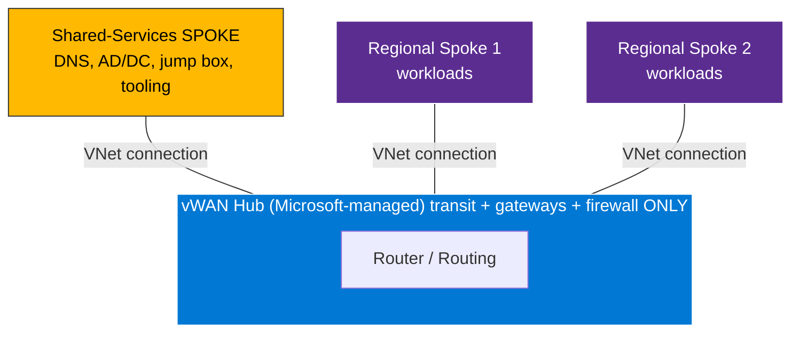
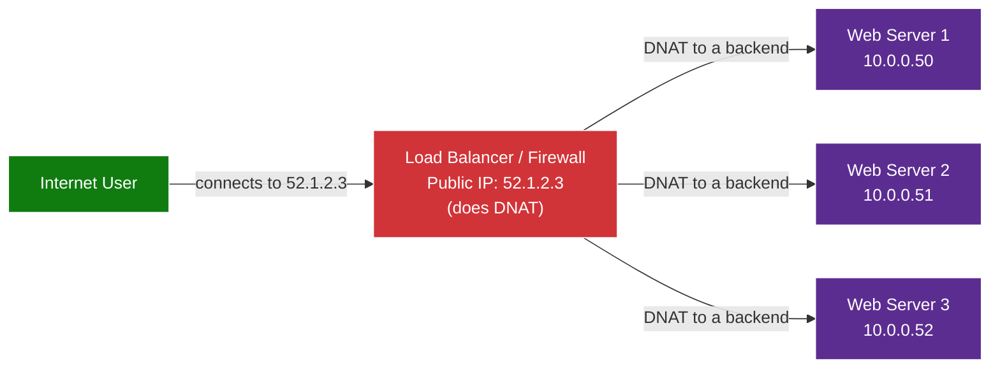
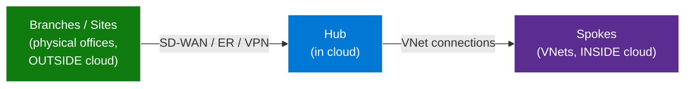

# Azure Networking Foundations & Concepts

> A vendor-neutral knowledge primer covering core networking concepts, how **SD-WAN, Azure Virtual WAN, and firewalls** layer together, and a plain-English glossary of common networking jargon (UDR, BGP, NAT, routes, and more).
>
> This is a **concepts** document — it does **not** cover step-by-step migration. For migration, see the companion migration guide.

---

## Table of Contents

1. [The Big Picture — Three Layers](#1-the-big-picture--three-layers)
2. [Connectivity Layer: SD-WAN, ExpressRoute & VPN](#2-connectivity-layer-sd-wan-expressroute--vpn)
3. [Backbone Layer: Hub-and-Spoke vs Azure Virtual WAN](#3-backbone-layer-hub-and-spoke-vs-azure-virtual-wan)
4. [Security Layer: Firewalls & NGFW](#4-security-layer-firewalls--ngfw)
5. [Where Do Shared Services Go? (Classic vs vWAN)](#5-where-do-shared-services-go-classic-vs-vwan)
6. [How Traffic Actually Flows (End to End)](#6-how-traffic-actually-flows-end-to-end)
7. [Routing 101 — How Devices Decide Where to Send Traffic](#7-routing-101--how-devices-decide-where-to-send-traffic)
8. [NAT Deep Dive — SNAT & DNAT Explained](#8-nat-deep-dive--snat--dnat-explained)
9. [Vendor & Product Landscape (Cisco vs Palo Alto)](#9-vendor--product-landscape-cisco-vs-palo-alto)
10. [Terminology: Branch vs Site vs Spoke](#10-terminology-branch-vs-site-vs-spoke)
11. [Networking Jargon Glossary](#11-networking-jargon-glossary)
12. [Quick Reference Cheat Sheet](#12-quick-reference-cheat-sheet)

---

## 1. The Big Picture — Three Layers

Enterprise cloud networking is best understood as **three distinct layers**, each solving a different problem. Confusing them is the #1 source of design mistakes.

| Layer | Question it answers | Example technologies |
|---|---|---|
| **1. Connectivity** | *How do my offices/users reach the cloud?* | SD-WAN, ExpressRoute, Site-to-Site VPN |
| **2. Backbone** | *How does traffic move around inside the cloud?* | Hub-and-Spoke VNets, Azure Virtual WAN |
| **3. Security** | *Is the traffic safe and allowed?* | Firewalls / NGFW (Palo Alto, Cisco, Azure Firewall) |


> **Key insight:** These layers are **complementary, not competing**. You typically need **all three** — none replaces another. A common misconception is "we're moving to Virtual WAN, so we don't need SD-WAN" — that's false, because they live in *different layers*.

---

## 2. Connectivity Layer: SD-WAN, ExpressRoute & VPN

This layer answers: **"How do my physical offices and users reach the cloud?"**

A large enterprise may have **hundreds of branch offices** worldwide. Each needs a way to reach the cloud. There are three common options:

| Option | What it is | Pros | Cons |
|---|---|---|---|
| **ExpressRoute (ER)** | A dedicated **private circuit** between on-prem and Azure | Private, reliable, high bandwidth, predictable | **Expensive**; impractical to run to *every* small branch |
| **Site-to-Site VPN** | An **encrypted tunnel** over the public internet | Cheap, quick to set up | Basic — single path, no smart routing, limited features |
| **SD-WAN** | Intelligent devices at each site that use **any** internet link with smart path selection | Cost-effective at scale, dynamic path selection, central management, QoS | Adds appliances + licensing to manage |

### Why big enterprises choose SD-WAN

For an enterprise with **many global branches**, SD-WAN wins because it:

- Connects sites over **any transport** (broadband, fiber, LTE) — not just costly private circuits
- **Dynamically selects the best path** (e.g., route cloud traffic over the cheapest healthy link)
- Is **centrally managed** for thousands of sites from one controller
- Provides **QoS, WAN optimization**, and application-aware routing

> **Rule of thumb:** Few sites → ExpressRoute or VPN may suffice. **Many sites → SD-WAN** is usually the most cost-effective and capable choice.

---

## 3. Backbone Layer: Hub-and-Spoke vs Azure Virtual WAN

This layer answers: **"Once traffic is in the cloud, how does it move between networks and services?"**

### Classic Hub-and-Spoke

- A **hub VNet** you build and own, with **spoke VNets** peered to it.
- The hub typically hosts **gateways, a firewall, and shared services**.
- **You** manage all the plumbing: peering, route tables, gateways, high availability.

### Azure Virtual WAN (vWAN)

- A **Microsoft-managed** service with one or more **virtual hubs**.
- Microsoft manages the **hub, routing, gateways, and scaling** for you.
- Spokes connect to the hub via **VNet connections** (not manual peering).
- Provides **automatic any-to-any transit**, **BGP** route propagation, and native **multi-region** interconnect.

| Aspect | Classic Hub-and-Spoke | Azure Virtual WAN |
|---|---|---|
| **Who manages the hub** | You | Microsoft |
| **Spoke connectivity** | Manual VNet peering | VNet connections (auto transit) |
| **Routing** | Manual route tables / UDRs | BGP + Routing Policies (Routing Intent) |
| **Multi-region** | Heavy to build | Native |
| **Can you host your own VMs in the hub?** | ✅ Yes (it's your VNet) | ❌ No (it's Microsoft-managed transit) |

> ⚠️ **Critical difference:** In **classic** hub-and-spoke, the hub is **your VNet** — you can put services in it. In **vWAN**, the hub is **Microsoft-managed transit** — you **cannot** deploy your own workloads into it (see Section 5).

---

## 4. Security Layer: Firewalls & NGFW

This layer answers: **"Is this traffic safe, and is it permitted?"**

A firewall — specifically a **Next-Generation Firewall (NGFW)** — inspects and controls traffic. Modern NGFWs do far more than block ports:

| Capability | What it does |
|---|---|
| **Stateful inspection** | Tracks connection state; allows return traffic for permitted flows |
| **IPS/IDS** | Detects and blocks intrusions/attacks |
| **App-ID / app awareness** | Identifies the *application* (not just port) and applies policy |
| **URL filtering** | Blocks/allows web categories and sites |
| **Threat prevention** | Anti-malware, threat intelligence feeds |
| **TLS/SSL inspection** | Decrypts encrypted traffic to inspect it (where policy allows) |
| **NAT** | Translates addresses (see Section 8) |

### Why a firewall is separate from connectivity

SD-WAN gets traffic *to* the cloud efficiently. The firewall decides if that traffic is **safe and allowed**. Two different jobs:

> **Analogy:** SD-WAN is the **road network** (best route, traffic management). The firewall is the **security checkpoint** (inspects who/what passes). You wouldn't ask a road to inspect cargo.

### Where the firewall physically sits matters

In a cloud backbone, the firewall can be placed in different spots, and **placement changes how traffic is steered to it**:

- **Inside the hub** (e.g., an integrated NVA or a SaaS firewall) → traffic can be steered to it **centrally and automatically**.
- **In a connected (spoke) network** → traffic must be **manually steered** to it using routes/UDRs.

This placement decision is one of the most consequential in any cloud network design.

---

## 5. Where Do Shared Services Go? (Classic vs vWAN)

**Shared services** = things many workloads use centrally: **DNS, Active Directory / domain controllers, jump boxes/bastions, shared tooling, identity, logging collectors.**

A very common misconception is *"shared services go in the hub."* That's **only true for classic hub-and-spoke**:

| | Classic Hub-and-Spoke | Azure Virtual WAN |
|---|---|---|
| **Hub type** | Your own VNet | Microsoft-managed transit |
| **Can host shared services in the hub?** | ✅ Yes | ❌ No |
| **Where shared services actually go** | In the hub VNet | In a **dedicated "shared-services" spoke** |



> **The corrected mental model:**
> - **Classic hub** = a VNet you own → shared services *can* live in it.
> - **vWAN hub** = Microsoft-managed transit → shared services live in a **dedicated shared-services spoke**, **not** in the hub.
>
> The *intent* (separate shared vs regional services) is the same — you just realize it with a **spoke**, while the hub stays purely for **connectivity, routing, and the firewall/NVA**.

---

## 6. How Traffic Actually Flows (End to End)

Putting all three layers together, here's a typical journey from a branch office to a cloud workload:

```mermaid
graph LR
    BRANCH["Branch / Site<br/>(physical office)"]
    SDWAN["SD-WAN edge<br/>(connectivity)"]
    HEADEND["SD-WAN head-end<br/>in cloud hub"]
    HUB["Backbone Hub<br/>(routing/transit)"]
    FW["Firewall / NGFW<br/>(inspection)"]
    SPOKE["Workload<br/>(spoke VNet)"]

    BRANCH -->|best path over<br/>any link| SDWAN
    SDWAN -->|overlay| HEADEND
    HEADEND --> HUB
    HUB -->|steer to firewall| FW
    FW -->|inspected + allowed| SPOKE

    style SDWAN fill:#1BA0D7,stroke:#fff,color:#fff
    style HEADEND fill:#1BA0D7,stroke:#fff,color:#fff
    style HUB fill:#0078D4,stroke:#fff,color:#fff
    style FW fill:#D13438,stroke:#fff,color:#fff
    style BRANCH fill:#107C10,stroke:#fff,color:#fff
    style SPOKE fill:#5C2D91,stroke:#fff,color:#fff
```



1. **Branch → SD-WAN edge:** the local appliance picks the **best/cheapest healthy path**.
2. **SD-WAN overlay → head-end in the cloud hub:** traffic is carried into the cloud.
3. **Hub:** the backbone **routes** the traffic.
4. **Firewall:** traffic is **inspected and policy-enforced**.
5. **Spoke:** traffic reaches the **workload**.

> Note the firewall **inspects** but the **hub still routes** — the firewall is a checkpoint in the path, not the path's owner.

---

## 7. Routing 101 — How Devices Decide Where to Send Traffic

Routing is simply **how a device decides where to send a packet next**. A few core ideas:

### Routes and route tables

- A **route** says: *"To reach destination X, send the packet to next hop Y."*
- A **route table** is a collection of routes a device or subnet uses.
- **Next hop** = the next device/destination a packet is handed to on its way to the final destination.

### Understanding CIDR notation (the `/24`, `/8` part)

An IPv4 address is **32 bits**, written as four 8-bit "octets" (e.g., `10.1.2.3`). The number after the slash — the **prefix length** — tells you **how many bits from the left are "fixed" (the network part)**. The rest are free for hosts.

| CIDR | Fixed (network) bits | Free (host) bits | Approx. addresses |
|---|---|---|---|
| `/8` | 8 | 24 | ~16.7 million |
| `/16` | 16 | 16 | ~65,536 |
| `/24` | 24 | 8 | 256 |
| `/32` | 32 | 0 | 1 (a single host) |

> **Bigger slash number = more fixed bits = smaller, more specific range.**
> `/8` is huge; `/24` is small; `/32` is a single address. And `0.0.0.0/0` fixes **zero** bits — it matches **everything** (the ultimate catch-all).

### How the best route is chosen — Longest Prefix Match

When **multiple routes match** the same destination, the router picks the one with the **longest prefix** (the most fixed bits / biggest slash number). It does **not** care about route order or which was added first — only **specificity**.

**Seeing it in bits.** Both of these routes contain the address `10.1.2.3`:

```
Address:        10 . 1 . 2 . 3   = 00001010.00000001.00000010.00000011

Route A: 10.0.0.0/8   fixes:  00001010 . xxxxxxxx.xxxxxxxx.xxxxxxxx
                              └─ 8 bits ─┘   (only "10." must match  → huge pool)

Route B: 10.1.2.0/24  fixes:  00001010.00000001.00000010 . xxxxxxxx
                              └──────── 24 bits ────────┘   ("10.1.2." must match → small pool)
```

The address falls inside **both**, so the router picks the **more specific** one:

```
Destination: 10.1.2.3
   ✓ 10.0.0.0/8    (8 bits match)   ← less specific
   ✓ 10.1.2.0/24   (24 bits match)  ← MORE specific  ✅ WINNER
```

**Why this rule exists:** a more specific route reflects a more deliberate, targeted intent. If you bothered to define `10.1.2.0/24 → somewhere`, you almost certainly meant *that* network to behave differently from the broad `10.0.0.0/8` catch-all.

### Worked example — how one route table resolves different destinations

Suppose a subnet has these routes:

| Route | Next hop | Meaning |
|---|---|---|
| `0.0.0.0/0` | Firewall | "Send **everything** to the firewall" |
| `10.0.0.0/8` | Hub router | "Internal traffic → hub" |
| `10.1.2.0/24` | Local | "**This specific subnet** stays local" |

| Destination | Routes that match | Winner (longest prefix) | Result |
|---|---|---|---|
| `8.8.8.8` (internet) | only `0.0.0.0/0` | `0.0.0.0/0` | → **Firewall** |
| `10.50.0.5` (other internal) | `0.0.0.0/0`, `10.0.0.0/8` | `10.0.0.0/8` | → **Hub** |
| `10.1.2.7` (same subnet) | `0.0.0.0/0`, `10.0.0.0/8`, `10.1.2.0/24` | `10.1.2.0/24` | → **Local** |

Notice: `0.0.0.0/0` is the **least specific possible**, so it only "wins" when **nothing more specific matches** — which is exactly why it's the perfect **default / catch-all** route.

### The two-UDR example (and the firewall-bypass trap ⚠️)

A key consequence: a more specific route **carves an exception** out of a broad one. Say you have just two UDRs:

| UDR | Destination | Next hop |
|---|---|---|
| 1 | `0.0.0.0/0` | Firewall |
| 2 | `20.1.0.0/16` | Internet (direct) |

Then traffic resolves like this:

| Packet going to... | Inside `20.1.0.0/16`? | Winner | Goes to |
|---|---|---|---|
| `20.1.5.10` | ✅ Yes | `20.1.0.0/16` (more specific) | **Internet (direct)** |
| `20.1.200.7` | ✅ Yes | `20.1.0.0/16` (more specific) | **Internet (direct)** |
| `8.8.8.8` | ❌ No | only `0.0.0.0/0` | **Firewall** |
| `52.96.0.1` | ❌ No | only `0.0.0.0/0` | **Firewall** |

> **Important nuance:** `20.1.0.0/16` beats `0.0.0.0/0` **only for destinations inside `20.1.x.x`** — *not* for all traffic. For every other destination, the `/0` still wins because the `/16` doesn't match.

⚠️ **This is the classic firewall-bypass trap.** Your intent is "inspect *all* traffic" (`0.0.0.0/0 → Firewall`). But if someone adds `20.1.0.0/16 → Internet (direct)`, then all traffic to `20.1.x.x` **silently skips the firewall** — no inspection, no logging — because the more specific route wins. The firewall *looks* like it's catching everything, but that one route quietly punches a hole. **When troubleshooting, always ask: "what is the *most specific* route that matches this destination?"** — that's the one that actually takes effect.

### Route preference — the full decision order

Longest-prefix match is the **first** tiebreaker, applied across *all* matching routes regardless of source. **Only if two matching routes have the *same* prefix length** does the next tiebreaker apply — the route **type/source** (in Azure: **UDR > BGP-learned > system/default**).

```
1. Among all matching routes → pick the LONGEST prefix (most specific)
2. If there is a TIE on prefix length → use route-type preference (UDR > BGP > system)
```

### Static vs dynamic routing

| | Static routing | Dynamic routing |
|---|---|---|
| **How routes are set** | Manually (e.g., UDRs) | Automatically learned via a protocol (e.g., **BGP**) |
| **Pros** | Precise, predictable | Scales, self-updates, handles failover |
| **Cons** | Manual upkeep, error-prone at scale | Requires protocol config; less explicit |

### Two routing "models" you'll hear about

- **Operator-managed routing:** *you* write the routes (UDRs / static routes). Full control, more effort.
- **Platform-managed routing:** the platform programs routes for you (e.g., centralized routing policies that push a default route to all connected networks). Less effort, but follows the platform's rules.

> Mixing the two models in one place can cause **unpredictable behavior** if not carefully planned — a frequent source of "why is my traffic going the wrong way?" issues.

---

## 8. NAT Deep Dive — SNAT & DNAT Explained

NAT (Network Address Translation) = **rewriting the source and/or destination IP** of packets. SNAT and DNAT confuse almost everyone at first, so here's the foundation that makes it click.

### The one rule that resolves all confusion

> **SNAT and DNAT are named after *which IP gets rewritten*, NOT after the *direction* of the traffic.**
> - Rewrite the **Source** field → **S**NAT
> - Rewrite the **Destination** field → **D**NAT

### Every packet carries TWO addresses

| Field | Meaning |
|---|---|
| **Source IP** | Where the packet is coming **FROM** (sender) |
| **Destination IP** | Where the packet is going **TO** (receiver) |

```
[ Source: 10.0.0.5 ]  ───────►  [ Destination: 8.8.8.8 ]
   (your laptop)                      (Google)
```

NAT can rewrite **either** field — and which one it rewrites gives it its name.

### SNAT (Source NAT) — for traffic going OUT

Your laptop has a **private** IP (`10.0.0.5`). Private IPs (RFC 1918) **can't travel on the public internet** — replies could never find their way back. So when you browse out, the NAT device rewrites the **SOURCE** to its own **public** IP:

```
Step 1 — Packet leaves your laptop:
   [ Source: 10.0.0.5 ]  ──►  [ Dest: 8.8.8.8 ]
        (private — unusable on internet!)

Step 2 — NAT device rewrites the SOURCE to its public IP:
   [ Source: 52.1.2.3 ]  ──►  [ Dest: 8.8.8.8 ]
        (public — now valid!)        ↑ destination UNCHANGED

Step 3 — Google replies to the public IP it saw:
   [ Source: 8.8.8.8 ]  ──►  [ Dest: 52.1.2.3 ]

Step 4 — NAT device reverses it (using its mapping table):
   [ Source: 8.8.8.8 ]  ──►  [ Dest: 10.0.0.5 ]
                                    ↑ back to your laptop
```

> **The "aha":** On **outbound** traffic the **destination is already correct** (you *want* `8.8.8.8`). What's broken is the **source** (your private IP). So NAT fixes the **source** → **S**NAT. This is also why **"many private IPs share one public IP"**: every device's source is rewritten to the *same* public IP, and the NAT device's mapping table remembers which reply goes back to which device.

### DNAT (Destination NAT) — for traffic coming IN

DNAT is the mirror image — it's for when **you host a service** that outsiders need to reach. Your server has a **private** IP (`10.0.0.50`), but the internet can't address that. So you publish a **public** IP, and DNAT rewrites the **DESTINATION** to the real server:

```
Step 1 — Internet user connects to your PUBLIC IP:
   [ Source: 203.0.113.9 ]  ──►  [ Dest: 52.1.2.3 : 443 ]
       (the visitor)                 (your public IP)

Step 2 — NAT device applies a DNAT rule, rewrites the DESTINATION:
   [ Source: 203.0.113.9 ]  ──►  [ Dest: 10.0.0.50 : 443 ]
        ↑ source UNCHANGED             (your real web server)

Step 3 — Server replies; device reverses the translation outbound:
   [ Source: 52.1.2.3 ]  ◄──  [ from 10.0.0.50 ]
   (visitor sees the public IP reply — consistent with what they dialed)
```

> **The "aha":** On **inbound** traffic the **source is already correct** (the visitor's real IP — you need it to reply!). What's broken is the **destination** (`52.1.2.3` isn't where the server lives). So NAT fixes the **destination** → **D**NAT.

### Why would anyone need DNAT? (What/who/why)

- **Why people connect in:** because **you're hosting a service** they want to use. They don't see your private IP — they hit your **public** IP, and DNAT bridges public → private behind the scenes.
- **What they're looking for:** whatever you **publish** — examples:

| You host... | Who connects in | What they want |
|---|---|---|
| A **website / web app** | Customers, public | Load your site (`https://yourcompany.com`) |
| An **API** | Partner systems, apps | Call your API endpoints |
| A **VPN gateway** | Remote employees | Connect into the corporate network |
| An **email/SMTP server** | Other mail servers | Deliver email to you |
| A **game/app server** | Players/clients | Connect to the service |
| An **SSH/RDP jump box** | Admins (from outside) | Manage internal servers |

- **Who does it (and how):** the **same border devices** that do SNAT — **firewalls, gateways, load balancers, reverse proxies** — anything sitting at the public/private boundary. They use a **DNAT rule** (a.k.a. port forwarding / publishing rule): *"traffic to **public IP:port** → forward to **private IP:port**,"* rewriting the **destination** and keeping the source intact so the server can reply. SNAT and DNAT frequently run on the **same box**, handling opposite directions.

### You already use DNAT every day (load balancers)

Every website you visit uses DNAT: a public IP (from DNS) is taken by a **load balancer** and **DNAT'd** to one of many backend servers on private IPs:



This does two jobs at once: **bridges public → private** *and* **spreads load** — while the user only ever sees one public IP.

### The envelope analogy (makes it stick)

Think of a letter with a **"From"** (return) address and a **"To"** (forwarding) address:

- **SNAT** = changing the **"From"** (return) address. Mail leaving your company gets the **company's** return address (not each employee's home), so replies come back to the mailroom. *Destination is fine; you're fixing who it appears to come from.*
- **DNAT** = changing the **"To"** (forwarding) address. Mail arrives addressed to "Company HQ, PO Box 123," and the mailroom **re-addresses** it to the right person inside. *Sender is fine; you're fixing where it actually goes.*

### SNAT vs DNAT — side by side

| | **SNAT (Source NAT)** | **DNAT (Destination NAT)** |
|---|---|---|
| **Which field is rewritten** | **Source** IP | **Destination** IP |
| **Typical direction** | **Outbound** (inside → internet) | **Inbound** (internet → inside) |
| **Problem being solved** | Source (private IP) unusable on internet | Destination (public IP) isn't the real server |
| **What stays unchanged** | Destination (already correct) | Source (needed for the reply) |
| **Whose need** | *Your* devices want to **go out** | *Outsiders* want to **come in** |
| **Real-world use** | Devices **consume** internet services | You **provide/host** a service to others |
| **Analogy** | Return address on an envelope | Forwarding address on an envelope |

> **One-liner to lock it in:**
> **SNAT** = *"I'm going out"* → fix my **source** (so replies find their way back).
> **DNAT** = *"Someone's coming in to use what I host"* → fix the **destination** (so their request reaches the real server).

---

## 9. Vendor & Product Landscape (Cisco vs Palo Alto)

A quick map of who does what — useful because product names cause a lot of confusion.

| Capability | **Cisco** | **Palo Alto** |
|---|---|---|
| **SD-WAN** | **Catalyst 8000V** (also a router) | **Prisma SD-WAN** (separate product) |
| **Firewall / NGFW** | **Security features *on* the 8000V** (same appliance) — *no separate cloud-hub firewall product* | **Cloud NGFW** (SaaS) and **VM-Series** (VM) — distinct products |
| **Single box does both SD-WAN + firewall?** | ✅ Yes — the 8000V is **dual-role** | ❌ No — connectivity and security are **separate products** |

### Important naming clarifications

- **There is no standalone product literally called "Cisco NGFW" for the cloud hub.** When people say "Cisco NGFW" in this context, they mean **the 8000V running in its firewall role** — a *feature set*, not a separate product. *(Cisco does have a standalone firewall family — Secure Firewall / Firepower — but that's a different deployment, not the dual-role 8000V story.)*
- **Palo Alto does have SD-WAN (Prisma SD-WAN)** — but it's a **separate product** from its firewalls. Unlike Cisco's 8000V, Palo Alto doesn't combine SD-WAN + firewall into a single appliance.

### Why this matters architecturally

Because the **8000V can do both jobs in one box**, it can serve as a **dual-role** appliance (connectivity *and* security together). Palo Alto can't collapse both into one box — so if you keep Palo Alto for security **and** Cisco for SD-WAN, you're dealing with **two separate appliances**, which affects where each can be placed.

> **Consolidation question worth asking:** *Is the 8000V's built-in security "good enough," or is a dedicated NGFW (e.g., Palo Alto) required?* Deep threat prevention/app-ID on a dedicated NGFW is often stronger — but it's a **security-team decision**, balancing capability vs simplicity.

---

## 10. Terminology: Branch vs Site vs Spoke

These three are easy to mix up. Keep them distinct:

| Term | Where it lives | What it is |
|---|---|---|
| **Branch** / **Site** | **Outside** the cloud | A **physical office location** (datacenter, regional/overseas office). *Branch and Site are interchangeable.* |
| **Spoke** | **Inside** the cloud | A **virtual network (VNet)** connected to the hub, hosting workloads or shared services |



> **Remember:**
> - **Branch = Site** ✅ (a building)
> - **Branch/Site ≠ Spoke** (a Spoke is a *VNet inside the cloud*, not a building)

---

## 11. Networking Jargon Glossary

Plain-English definitions of the terms that come up constantly.

### Core addressing & routing

- **IP address** — A unique numeric label for a device on a network (e.g., `10.1.2.3`).
- **Subnet** — A subdivision of a network's address space (e.g., `10.1.2.0/24`). Groups related devices.
- **CIDR (Classless Inter-Domain Routing)** — Notation for an address range using a prefix length, e.g., `10.0.0.0/16`. The number after `/` says how many bits are "fixed" — **smaller number = bigger range** (`/8` is huge, `/30` is tiny). See Section 7 for a full breakdown.
- **Prefix length** — The `/N` part of CIDR; how many leading bits are fixed (the network portion).
- **RFC 1918 (private IP ranges)** — Address ranges reserved for **private/internal** use, not routable on the public internet:
  - `10.0.0.0/8`
  - `172.16.0.0/12`
  - `192.168.0.0/16`
- **Route** — A rule: *"to reach destination X, send to next hop Y."*
- **Route table** — A collection of routes used by a subnet/device.
- **Next hop** — The **next device/destination** a packet is sent to on its way to the final destination.
- **Default route (`0.0.0.0/0`)** — The "catch-all" route: *"if nothing more specific matches, send the packet here."* The **least specific** possible route. Often used to force **all internet-bound traffic** to a firewall.
- **Longest prefix match** — The rule that the **most specific** route (most fixed bits) wins when several match. The first tiebreaker in route selection (see Section 7).
- **UDR (User-Defined Route)** — A **manually created** route you place on a subnet to **override** default routing — e.g., *"send all traffic (`0.0.0.0/0`) to the firewall."* The classic way to force traffic through an appliance. ⚠️ A more specific UDR can **override** a broad one for its range — a common cause of accidental firewall bypass (see Section 7).

### Routing protocols & dynamic routing

- **BGP (Border Gateway Protocol)** — The standard protocol for **dynamically exchanging routes** between networks. Devices "advertise" the networks they can reach, and "learn" routes from peers. It's how the internet — and most cloud backbones — share routing info automatically (instead of hand-writing every route).
- **ASN (Autonomous System Number)** — A unique number identifying a network in BGP. Two BGP peers each have an ASN. ⚠️ **ASN conflicts** (using the same/reserved ASN on both sides) break peering — a common gotcha.
- **eBGP / iBGP** — BGP **between different** ASNs (external) vs **within the same** ASN (internal).
- **Route propagation** — Automatically **spreading learned routes** to other parts of the network (so you don't configure them manually everywhere).
- **Route advertisement** — A device **announcing** "I can reach these networks" to its BGP peers.

### Address translation & connectivity

- **NAT (Network Address Translation)** — Rewriting the source and/or destination IP of packets (see Section 8 for the full deep dive).
- **SNAT (Source NAT)** — Rewrites the **source** address; typically for **outbound** traffic so internal devices can reach the internet (many private IPs → one public IP).
- **DNAT (Destination NAT)** — Rewrites the **destination** address; typically for **inbound** traffic to **publish** an internal service (public IP → real internal server).
- **VPN (Virtual Private Network)** — An **encrypted tunnel** over a public network (e.g., Site-to-Site VPN connecting an office to the cloud).
- **ExpressRoute (ER)** — A **dedicated private circuit** to Azure (not over the public internet). Private, reliable, higher cost.
- **SD-WAN (Software-Defined WAN)** — Intelligent **WAN-edge** technology that connects branch offices over **any transport** with **dynamic path selection** and central management.
- **Overlay / underlay** — The **underlay** is the physical/transport network (the actual links); the **overlay** is a logical network built **on top** (e.g., SD-WAN tunnels or encrypted overlays).

### Cloud network constructs

- **VNet (Virtual Network)** — A private, isolated network in the cloud where your resources live.
- **VNet peering** — Directly connecting two VNets so they can communicate.
- **Hub** — A central network everything connects to (transit point).
- **Spoke** — A VNet connected to the hub (hosts workloads/shared services).
- **Hub-and-Spoke** — A topology with one central hub and many spokes.
- **Gateway** — A device that connects networks of different types (e.g., **ExpressRoute Gateway**, **VPN Gateway**).
- **NVA (Network Virtual Appliance)** — A **third-party network appliance** (firewall, router, SD-WAN) run as a VM/instance in the cloud (e.g., Palo Alto VM-Series, Cisco 8000V).
- **Transit** — The hub's ability to pass traffic **between** connected networks (e.g., spoke-to-spoke through the hub).

### Security constructs

- **Firewall** — A device that **filters traffic** based on rules.
- **NGFW (Next-Generation Firewall)** — A modern firewall adding **app awareness, IPS, URL filtering, threat prevention, TLS inspection**, etc.
- **Stateful inspection** — Tracking connection **state** so return traffic for an allowed flow is permitted automatically.
- **IPS / IDS (Intrusion Prevention/Detection System)** — Detects (IDS) and blocks (IPS) malicious activity.
- **East-West traffic** — Traffic **between internal networks** (e.g., spoke-to-spoke, server-to-server).
- **North-South traffic** — Traffic **in/out of the environment** (e.g., to the internet or on-prem).
- **Traffic symmetry** — Both directions of a connection taking the **same path** (through the **same firewall**). Firewalls are stateful, so **asymmetric** paths can **drop sessions** or **miss inspection**.
- **Forced tunneling** — Deliberately **forcing all traffic** (often via a default route) through a specific path, usually a firewall, for inspection.
- **Defense in depth** — Layering multiple security controls so no single failure exposes everything.

### Operational & governance terms

- **High Availability (HA)** — Designing so the system **survives a component failure** (e.g., redundant firewalls).
- **Failover** — Automatically switching to a **standby** component when the active one fails.
- **RBAC (Role-Based Access Control)** — Granting permissions based on **roles** (e.g., "Network Contributor"), rather than to individuals ad hoc.
- **Tenant (identity tenant)** — The top-level **identity boundary** (e.g., a Microsoft Entra / Azure AD tenant). Resources/subscriptions under one tenant share an identity directory.
- **Subscription** — A billing/management container for cloud resources. One tenant can contain **many** subscriptions.
- **Hairpinning** — Traffic that **loops back** through a central point unnecessarily (e.g., one region's traffic detouring through another region's firewall) — usually inefficient.
- **Local breakout** — Sending internet-bound traffic out **locally/regionally** rather than backhauling it elsewhere first.

---

## 12. Quick Reference Cheat Sheet

### The three layers
| Layer | Job | Tech |
|---|---|---|
| Connectivity | Reach the cloud | SD-WAN / ExpressRoute / VPN |
| Backbone | Move traffic inside the cloud | vWAN / Hub-and-Spoke |
| Security | Inspect & enforce | Firewall / NGFW |

### Easy-to-confuse pairs
| This | …is NOT… | Difference |
|---|---|---|
| **Branch / Site** | **Spoke** | Physical office vs cloud VNet |
| **SD-WAN** | **Virtual WAN** | Branch connectivity vs cloud backbone |
| **Classic hub** | **vWAN hub** | Your VNet (can host services) vs Microsoft-managed transit (cannot) |
| **UDR (static)** | **BGP (dynamic)** | Manually written vs automatically learned |
| **SNAT** | **DNAT** | Rewrites **source** (outbound) vs **destination** (inbound) |
| **East-West** | **North-South** | Internal traffic vs in/out traffic |

### NAT in one line
- **SNAT** → going **out**, fix the **source** (private → shared public IP).
- **DNAT** → coming **in**, fix the **destination** (public IP → real internal server).

### Route preference (typical)
`Longest prefix match (most specific wins)` → then on a tie → `UDR > BGP > system/default`

> Remember: a more specific route (e.g., `20.1.0.0/16`) beats `0.0.0.0/0` **only for its own range** — and that's how firewalls get **accidentally bypassed**.

### Private IP ranges (RFC 1918)
`10.0.0.0/8` · `172.16.0.0/12` · `192.168.0.0/16`

### Things that commonly break
- **ASN conflicts** (reused/reserved ASNs in BGP)
- **Address overlap** (two networks using the same CIDR)
- **Asymmetric routing** (breaks stateful firewalls)
- **Leftover / more-specific UDRs** overriding intended routing (firewall bypass)
- **Mixing platform-managed and operator-managed routing** without planning

---

> **Remember the one-line summary:**
> **SD-WAN** gets you *to* the cloud, the **backbone (vWAN/Hub-Spoke)** moves you *around inside* it, and the **firewall** decides what's *allowed* — three layers, each essential.
