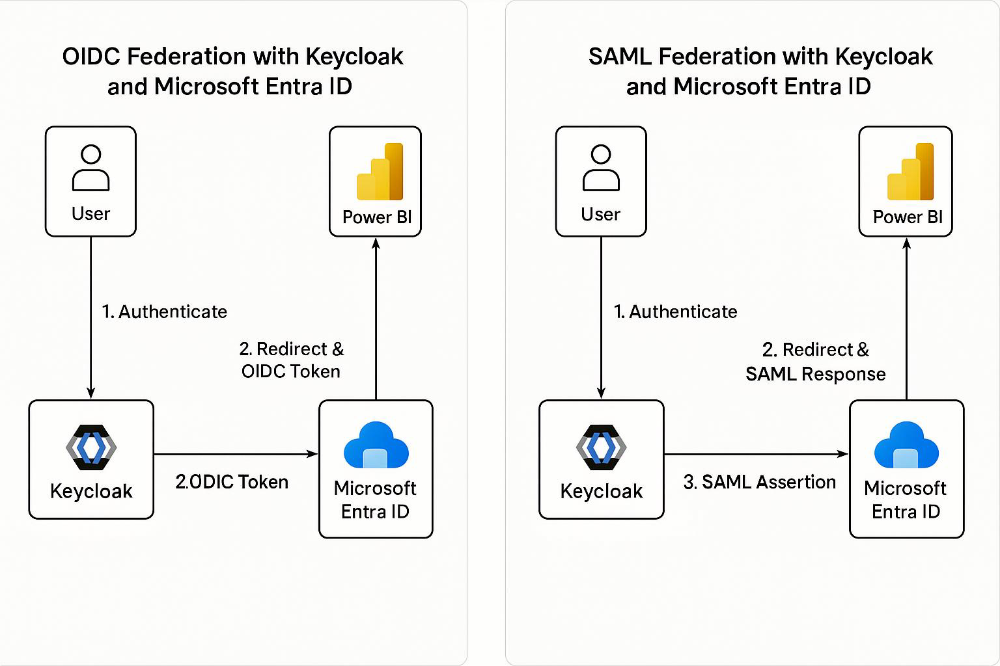

# Keycloak ↔ Microsoft Entra (Azure AD) Federation for Power BI — Security Assertion Markup Language(SAML)

**Purpose:** Step‑by‑step guide to federate a Microsoft Entra tenant (Azure AD) with Keycloak so users authenticated by Keycloak can access Power BI (Microsoft 365). This guide explains why SAML is required, prerequisites, exact configuration steps (PowerShell + Keycloak), mapper examples, testing checklist, troubleshooting, and references.

---

## Table of Contents

1. Purpose & Summary
2. Architecture Diagram
3. Key Concepts: SAML vs OIDC (short)
4. Prerequisites
5. High-level Flow
6. Step-by-step: Configure Keycloak as SAML IdP for Entra
   - Create SAML client in Keycloak
   - Mappers
   - Export metadata / certificate
7. Step-by-step: Configure Entra (Azure AD) to trust Keycloak
   - PowerShell (MSOnline) script
   - Notes for AzureAD / Microsoft Graph variant
8. User provisioning: JIT vs SCIM vs Pre-provision
9. Testing checklist
10. Troubleshooting
11. Security & Operational Notes
12. References & Public Docs

---

## 1. Purpose & Summary

Power BI and the Microsoft 365 ecosystem rely on **Microsoft Entra (Azure AD)** for authentication. You cannot point Power BI directly to Keycloak. Instead, you configure **domain-level federation** in Entra so that when a user signs into Power BI with `user@yourcompany.com`, Entra redirects authentication to Keycloak (SAML). After successful authentication Keycloak returns a SAML assertion to Entra, Entra issues tokens for Power BI.

**Bottom line:** For Power BI → Entra → Keycloak federation, **use SAML** (SAML 2.0). OIDC is not supported for tenant-level Microsoft 365 sign-ins.

---

## 2. Architecture Diagram




---

## 3. Key Concepts: SAML vs OIDC (short)

- **Security Assertion Markup Language (SAML 2.0)**: XML-based assertions, standard for enterprise SSO and federation with Microsoft 365. Suitable for tenant-level federation in Entra.
- **Access OpenID Connect (OIDC)**: JSON/JWT-based, built on OAuth 2.0. Great for modern apps, APIs, SPAs, and for External Identities (B2C/B2B scenarios) but **not** for tenant-level federation used by Microsoft 365 apps.

**Conclusion:** Use **SAML** for the scenario in this guide.

---

## 4. Prerequisites

- Admin access to the **Microsoft Entra** tenant.
- Admin access to **Keycloak** (recommend v20+).
- Verified custom domain in Entra (e.g., `yourcompany.com`).
- Keycloak realm for the tenant and a realm signing certificate (X.509) exported.
- Power BI licenses available/assignable for users.
- PowerShell access to run `Connect-MsolService`/MSOnline (or Microsoft Graph alternative).

---

## 5. High-level Flow

1. User opens Power BI and enters `user@yourcompany.com`.
2. Power BI redirects user to Entra for authentication.
3. Entra recognizes the domain as *federated* and redirects to Keycloak (SAML SSO).
4. User authenticates at Keycloak; Keycloak returns a SAML assertion to Entra.
5. Entra issues a token for Power BI and the user gains access.

---

## 6. Step-by-step: Configure Keycloak as SAML IdP for Entra

> **Option A — Use Keycloak Admin Console** (recommended)

1. **Create a SAML client** in the Keycloak realm.
   - In Keycloak Admin Console → *Realm* → **Clients** → **Create**.
   - **Client ID**: `urn:federation:MicrosoftOnline` (or a name you choose — the important part is consistent with metadata).
   - **Client Protocol**: `saml`
   - **Root URL / Valid Redirect URIs / Assertion Consumer Service (ACS)**: Add Entra ACS
     - `https://login.microsoftonline.com/<TENANT_ID>/saml2`
   - **Name ID Format**: `email`
   - **Sign Assertions**: ON
   - **Force POST Binding**: ON (optional but recommended)

2. **Configure client Settings**
   - Ensure *Sign Assertions* is enabled and Keycloak uses the realm signing key for SAML signing.
   - Set *Signature Algorithm* if required by tenant policies.

3. **Create Protocol Mappers** (important)
   - `email`
     - Mapper Type: **User Property**
     - Property: `email`
     - SAML Attribute Name: `http://schemas.xmlsoap.org/ws/2005/05/identity/claims/emailaddress` (or simply `email`)
   - `givenName`
     - Property: `firstName`
     - SAML Attribute Name: `givenname`
   - `surname`
     - Property: `lastName`
     - SAML Attribute Name: `surname`
   - *(Optional)* `groups` or `roles` if you need group/role claims passed to Entra.

4. **Export Keycloak Metadata & Certificate**
   - Client → *Installation* → select **SAML Metadata IDPSSODescriptor** or **saml20-idp-redirect-binding.xml** and download.
   - Export the realm signing public certificate (X.509) and save as `.cer` — Entra needs the certificate to validate signatures.

> **Option B — Import SAML metadata XML**

You can craft an `EntityDescriptor` XML with correct endpoints and X.509 certificate. Example snippet is provided later in the doc.

---

## 7. Step-by-step: Configure Entra (Azure AD) to trust Keycloak

> **Approach 1 — MSOnline PowerShell (classic) — ready to run**

> **Important:** Replace placeholders (`<...>`) before running. This example uses the **MSOnline** module and `Set-MsolDomainAuthentication`.

```powershell
# Install & connect (run as admin)
Install-Module -Name MSOnline -Force
Connect-MsolService

# Variables - REPLACE these
$domainName      = "yourcompany.com"
$keycloakHost    = "auth.kc.example.com"          # no trailing slash
$realm           = "yourrealm"
$federationName  = "KeycloakFederation"
$signingCertPath = "C:\temp\keycloak-signing.cer" # Exported X.509 public cert

# Read certificate into Base64 string
$certBytes = [System.IO.File]::ReadAllBytes($signingCertPath)
$base64Cert = [System.Convert]::ToBase64String($certBytes)

# Passive / Active login URIs (SAML endpoints in Keycloak)
$passiveLogOnUri = "https://$keycloakHost/realms/$realm/protocol/saml"
$activeLogOnUri  = "https://$keycloakHost/realms/$realm/protocol/saml"
$issuerUri       = "https://$keycloakHost/realms/$realm"
$logOffUri       = "https://$keycloakHost/realms/$realm/protocol/saml/logout"

# Apply federation to domain
Set-MsolDomainAuthentication `
  -DomainName $domainName `
  -FederationBrandName $federationName `
  -Authentication Federated `
  -PassiveLogOnUri $passiveLogOnUri `
  -ActiveLogOnUri $activeLogOnUri `
  -IssuerUri $issuerUri `
  -LogOffUri $logOffUri `
  -SigningCertificate $base64Cert

# Verify
Get-MsolDomainFederationSettings -DomainName $domainName | Format-List
```

**Notes:**
- If your tenant blocks `Set-MsolDomainAuthentication`, or your organization prefers modern modules, use the **Microsoft Graph PowerShell** or the **AzureAD** module. I can provide an equivalent script on request.
- `PassiveLogOnUri` and `ActiveLogOnUri` are typically the same Keycloak SAML endpoint.

> **Approach 2 — Entra Admin Center (UI)**

1. Go to **Entra Admin Center** → **Identity** → **External Identities** → **All identity providers** → **+ New SAML/WS-Fed IdP**.
2. Use the **Metadata file** exported from Keycloak or provide the **Metadata URL** (Keycloak realm metadata URL is `https://<KEYCLOAK_HOST>/realms/<REALM_NAME>/protocol/saml/descriptor`).
3. Fill in display name, branding and upload the Keycloak signing certificate if required.

---

## 8. User provisioning: JIT vs SCIM vs Pre-provision

- **Just‑in‑Time (JIT)**: Entra External Identities can create user accounts at first successful federation login (subject to your tenant settings). Good for minimal setup.
- **SCIM**: For long-term managed identities in Entra (if you want users to exist centrally), implement a SCIM connector to push users from Keycloak to Entra. This requires additional implementation.
- **Pre-provision**: Create users in Entra (bulk or script) with matching UPN/email prior to federation.

Choose based on lifecycle management and compliance requirements.

---

## 9. Testing checklist

1. Verify Keycloak realm signing certificate is valid and exported.
2. Verify DNS + domain ownership is validated in Entra for `yourcompany.com`.
3. Run `Set-MsolDomainAuthentication` and verify with `Get-MsolDomainFederationSettings`.
4. Attempt login at `https://login.microsoftonline.com` with `user@yourcompany.com` — expect redirect to Keycloak.
5. Confirm SAML response contains expected attributes: `email`, `givenname`, `surname`.
6. Ensure the user is assigned a Power BI license in Entra.
7. Test accessing `https://app.powerbi.com` and confirm successful sign-in and access.
8. Test sign-out and Single Logout (SLO) if required.

---

## 10. Troubleshooting

- **Assertion rejected**: Check clock sync (NTP), `NotBefore`/`NotOnOrAfter` windows, and correct `Audience`/`Issuer` values.
- **NameID mismatch**: Ensure Keycloak NameID format = `email` and the value matches the Entra UPN.
- **Signature validation fails**: The public certificate in Entra must match Keycloak's signing cert. Re-export the public cert from Keycloak and re-upload.
- **Redirect loops**: Misconfigured ACS or issuer URIs. Verify `Issuer` in SAML equals the value Entra expects.
- **Set-MsolDomainAuthentication errors**: Use Microsoft Graph PowerShell equivalent or ensure you have sufficient tenant permissions.

---

## 11. Security & Operational Notes

- Protect the Keycloak realm signing private key; rotate certificates on a planned schedule.
- Monitor SAML login failures and user provisioning events.
- Consider conditional access policies in Entra (MFA, device compliance). Note: applying conditional access may affect federated flows; test carefully.
- Log and audit SSO events in both Entra (Sign-in logs) and Keycloak.

---

## 12. Example Keycloak SAML IdP Metadata (snippet)

> Replace placeholders and insert your base64 X.509 certificate in the `<X509Certificate>` node.

```xml
<EntityDescriptor entityID="https://auth.kc.example.com/realms/yourrealm" xmlns="urn:oasis:names:tc:SAML:2.0:metadata">
  <IDPSSODescriptor protocolSupportEnumeration="urn:oasis:names:tc:SAML:2.0:protocol">
    <KeyDescriptor use="signing">
      <KeyInfo xmlns="http://www.w3.org/2000/09/xmldsig#">
        <X509Data>
          <X509Certificate>
            MIID...base64 certificate...
          </X509Certificate>
        </X509Data>
      </KeyInfo>
    </KeyDescriptor>

    <SingleSignOnService Binding="urn:oasis:names:tc:SAML:2.0:bindings:HTTP-Redirect"
                         Location="https://auth.kc.example.com/realms/yourrealm/protocol/saml"/>
    <SingleSignOnService Binding="urn:oasis:names:tc:SAML:2.0:bindings:HTTP-POST"
                         Location="https://auth.kc.example.com/realms/yourrealm/protocol/saml"/>

    <SingleLogoutService Binding="urn:oasis:names:tc:SAML:2.0:bindings:HTTP-Redirect"
                         Location="https://auth.kc.example.com/realms/yourrealm/protocol/saml/logout"/>

    <NameIDFormat>urn:oasis:names:tc:SAML:1.1:nameid-format:emailAddress</NameIDFormat>
  </IDPSSODescriptor>
</EntityDescriptor>
```

---

## 13. References & Public Documents

- Microsoft: *Direct federation with SAML/WS‑Fed identity providers* (https://learn.microsoft.com/en-us/entra/external-id/direct-federation)
- Microsoft: *SAML authentication with Microsoft Entra ID* (https://learn.microsoft.com/en-us/entra/architecture/auth-saml)
- Keycloak: *Server Administration Guide* — Identity brokering, mappers (https://www.keycloak.org/docs/latest/server_admin/index.html)
- Example blog: *Azure AD Federation with Keycloak as SAML IdP* (community walkthrough https://medium.com/@manoj.bhagat/microsoft-azure-ad-with-saml-integration-using-keycloak-as-an-identity-provider-8a2cf66e1c57)

(Use the official Microsoft Learn pages and Keycloak docs as the authoritative source.)

---


*End of document.*

