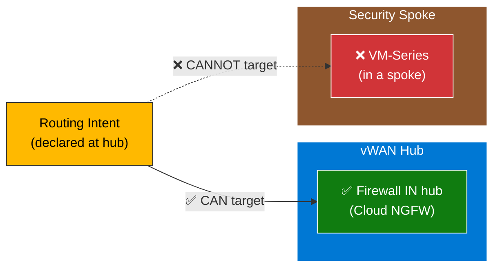
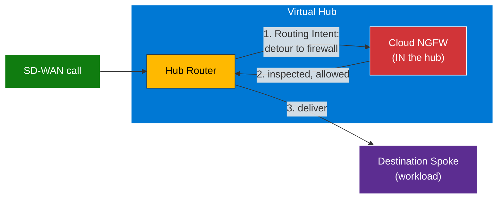
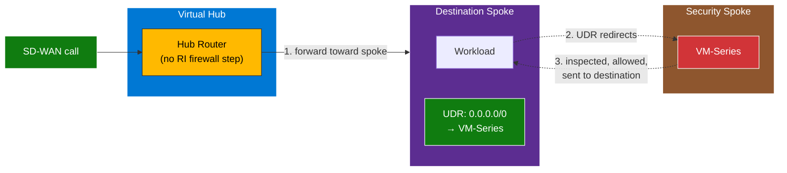
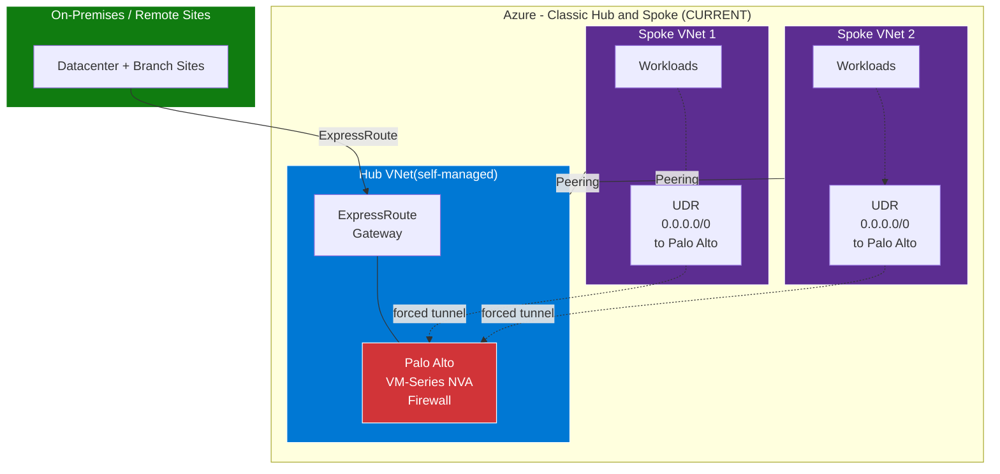
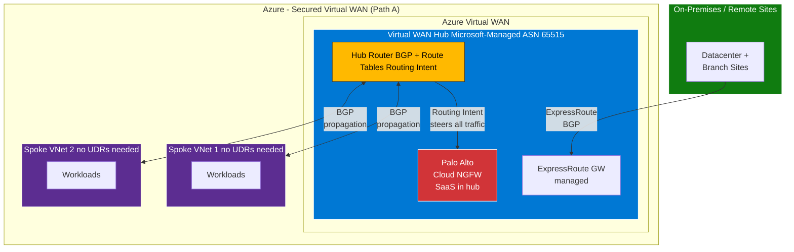
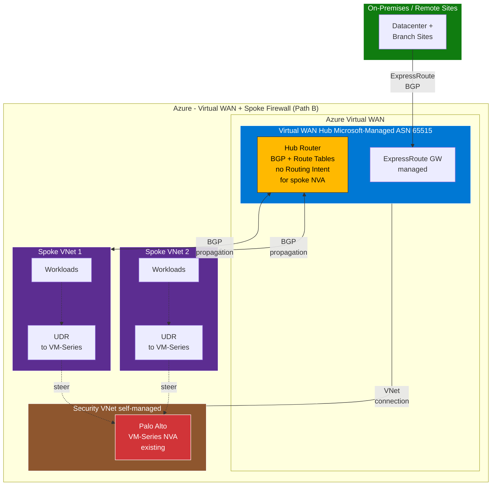
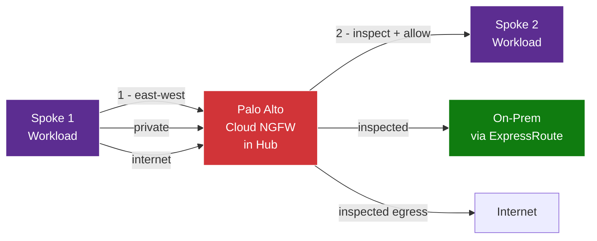
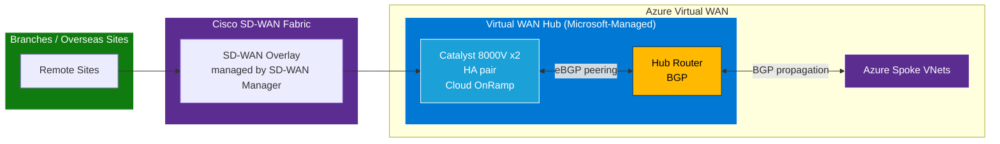

# Migrating a Classic Hub-and-Spoke VNet Architecture to Azure Virtual WAN

> A practical guide for migrating an existing Azure **classic Hub-and-Spoke** topology (with a **Palo Alto NVA firewall**, **ExpressRoute**, **Cisco SD-WAN**, and **UDR-based forced tunneling**) to a **Secured Azure Virtual WAN**.

---

## Table of Contents

1. [Overview & Goal](#1-overview--goal)
2. [Key Concepts (Quick Refresher)](#2-key-concepts-quick-refresher)
3. [The Firewall Decision — Supported Paths](#3-the-firewall-decision--supported-paths)
4. [How Routing Intent Behaves (and Why UDRs Disappear)](#4-how-routing-intent-behaves-and-why-udrs-disappear)
5. [Path Comparison: What's Possible, What's Not, and Why](#5-path-comparison-whats-possible-whats-not-and-why)
6. [Architecture Diagrams](#6-architecture-diagrams)
7. [Cisco SD-WAN (Catalyst 8000V) in the Virtual WAN Hub](#7-cisco-sd-wan-catalyst-8000v-in-the-virtual-wan-hub)
8. [Migration Steps (Phased Approach)](#8-migration-steps-phased-approach)
9. [Precautions & Gotchas](#9-precautions--gotchas)
10. [Pre-Migration Checklist](#10-pre-migration-checklist)
11. [Reference Documentation](#11-reference-documentation)

---

## 1. Overview & Goal

**Current state (typical classic topology):**

- Hub-and-Spoke VNets connected via **VNet peering**
- **Hub VNet hosting a Palo Alto NVA** (firewall) — typically **VM-Series**
- **ExpressRoute Gateway** for on-premises connectivity
- **Cisco SD-WAN** for branch/overseas-site connectivity (where applicable)
- All spoke → on-premises / internet traffic **forced through the Hub NVA**
- **User-Defined Routes (UDRs)** on spoke VNets/subnets to steer traffic

**Target state:**

- **Azure Virtual WAN** with one or more **Microsoft-managed Virtual Hubs**
- Firewall inspection retained, but repositioned per supported Virtual WAN options
- **Cisco SD-WAN (Catalyst 8000V)** integrated with the hub (see Section 7)
- **Routing Intent** replaces per-spoke UDRs for centralized traffic steering *(only when the firewall is a valid hub next hop — see Section 3)*
- **BGP-driven dynamic route propagation** replaces manual peering/UDR plumbing

**The transformation at a glance:**

```
Classic:        Spoke  ->  UDR  ->  Firewall (in hub)
vWAN Path A:    Spoke  ->  Hub  ->  Routing Intent  ->  Cloud NGFW  ->  Hub  ->  Destination
vWAN Path B:    Spoke  ->  Hub  ->  (UDR/route table)  ->  VM-Series (spoke)  ->  Hub  ->  Destination
```

**Why migrate?**

| Classic Hub-and-Spoke | Azure Virtual WAN |
|---|---|
| You build & maintain the hub VNet, gateways, and HA | Microsoft-managed hub, gateways, and routing |
| Manual VNet peering for every spoke | VNet connections to the hub (any-to-any transit) |
| UDRs on every spoke/subnet | Centralized **Routing Intent** at the hub *(Path A)* |
| Manual route management | **BGP** dynamic propagation |
| Scaling across regions is operationally heavy | Native multi-hub, multi-region interconnect |

---

## 2. Key Concepts (Quick Refresher)

| Concept | What it is | Who manages it |
|---|---|---|
| **Virtual Hub** | A Microsoft-managed VNet at the center of Virtual WAN; contains a built-in router | **Microsoft** |
| **Hub Router** | Runs **BGP** + route tables; propagates routes automatically; **ASN 65515** | **Microsoft** (auto) |
| **Default / None route tables** | Auto-created route tables in the hub | **Microsoft** (auto) |
| **Custom route tables** | Optional tables for advanced segmentation | **You** (optional) |
| **Secured Virtual Hub** | A Virtual WAN hub with an attached security solution (Azure Firewall, an integrated NVA, or a SaaS firewall such as Cloud NGFW) | **You** (enable) |
| **Routing Intent / Routing Policies** | Centralized policy to send Private and/or Internet traffic through a security appliance **inside the hub** | **You** (explicit config) |
| **UDRs** | Per-subnet route overrides | **You** (still required when steering to a spoke NVA) |

> **What is a "Secured Virtual Hub"?**
> A **Secured Virtual Hub** is simply a Virtual WAN hub that has a security solution attached to it — **Azure Firewall**, an **integrated partner NVA**, or a **SaaS firewall** (e.g., Palo Alto **Cloud NGFW**). **Routing Intent** steers traffic to that in-hub security solution. Because the next hop must live in the hub, Routing Intent is effectively used **together with** a Secured Hub.

> **Critical ownership distinction:**
> Azure **automatically** builds the *plumbing* (route tables + BGP engine).
> **You** explicitly declare the *policy* (**Routing Intent**).
> Configuring Routing Intent is what makes the per-spoke UDRs unnecessary — but it is **not** created automatically, **and it only works when the next hop is inside the hub** (see Section 3).

---

## 3. The Firewall Decision — Supported Paths

> ⚠️ **One of the two most important constraints in this migration** (the other is SD-WAN coexistence — see Section 7).

Two rules drive the firewall design:

1. A **Palo Alto VM-Series** firewall **cannot** be deployed as a **native, hub-integrated NVA** *inside* a Virtual WAN hub. It must run in a **connected VNet** (Path B).
2. **Routing Intent's next hop must be inside the hub.** It **cannot** target an NVA that lives in a spoke/connected VNet, for either Private or Internet traffic.

Together these produce **two supported paths**:

### Path A — Palo Alto Cloud NGFW (SaaS) integrated in the Virtual WAN hub ✅ *(cleanest "Secured Hub")*

- Fully **managed SaaS** firewall, **natively integrated** into the Virtual Hub as a "bump-in-the-wire."
- **Plugs directly into Routing Intent** (it is a valid hub next hop).
- Availability-Zone resilient; lifecycle managed by the service.
- Policy managed via **Azure** or **Panorama**.
- Billed **pay-as-you-go**.
- ✅ **Achieves the "remove spoke UDRs / use Routing Intent" goal.**

### Path B — Keep Palo Alto VM-Series in a dedicated "security" VNet attached to the hub ✅ *(reuse existing investment)*

- Existing **VM-Series** firewalls live in a dedicated VNet **connected to** (not inside) the hub.
- ❌ **Routing Intent CANNOT target this VM-Series** (it's not in the hub). Traffic is steered to it using **UDRs, hub route tables (static routes), or BGP advertisement from the NVA** — the classic, operator-managed approach (see Section 5).
- Preserves existing **licenses, configuration, and Panorama** setup.
- **You** own more of the routing, HA, and scaling design.
- ⚠️ **Does NOT remove UDRs/static routes** for firewall steering — the operator-managed model is retained for the firewall path.
- ❌ **Internet traffic inspection via the spoke VM-Series cannot be driven by Routing Intent's Internet policy** (it can still be achieved with manual UDRs/route tables).

> **Decision rule:** If adopting **Routing Intent** and eliminating UDRs is a primary goal, **only Path A delivers it.** Path B preserves the existing VM-Series investment but keeps the **operator-managed (UDR/route-table/BGP)** steering model.

> **Note on other vendors:** This guide focuses on Palo Alto, where the **hub-integrated** option is **Cloud NGFW (SaaS)** and the classic **VM-Series** falls under the connected-VNet (Path B) scenario. Other vendors (e.g., **Fortinet**, **Check Point**, **Cisco**, **Barracuda**) offer their own **hub-integrated NVAs** for Virtual WAN. If you are open to alternatives, validate each vendor's current integrated-NVA support against the Azure Marketplace and Microsoft documentation.

---

## 4. How Routing Intent Behaves (and Why UDRs Disappear)

### 4.0 First — Hub Routing vs Routing Intent (they are NOT the same thing)

A very common point of confusion: *"The vWAN hub already has a router — so why do I need Routing Intent?"* The answer is that **the hub's built-in routing and Routing Intent solve two different problems.**

| | **The hub's built-in routing** | **Routing Intent** |
|---|---|---|
| **What it does** | Knows how to get packets **from A to B** (reachability) | Forces packets to **detour through a firewall** for inspection |
| **Default behavior** | "Spoke 1 wants Spoke 2? Here's the path" → sends it **directly** | "Before Spoke 1 reaches Spoke 2, send it through the firewall first" |
| **Goal** | **Connectivity** | **Security / inspection** |
| **On by default?** | ✅ Yes — automatic | ❌ No — **you must declare it** |
| **Analogy** | The road map (knows all roads) | A mandatory checkpoint inserted on the road |

> **Key point:** The hub **already gives you connectivity** (any-to-any transit, automatically). What it does **NOT** do by default is **force traffic through a firewall**. That is the job Routing Intent adds.

**Why the hub's default routing isn't enough for security.** By default the hub connects everything to everything — spokes reach each other and the internet **directly**, with **no inspection**:

```
WITHOUT Routing Intent (hub default):
   Spoke 1  ─────────────────────►  Spoke 2        ❌ no inspection
   Spoke 1  ─────────────────────►  Internet       ❌ no inspection

WITH Routing Intent:
   Spoke 1  ──►  Firewall  ──►  Spoke 2            ✅ inspected
   Spoke 1  ──►  Firewall  ──►  Internet           ✅ inspected
```

So **Routing Intent is how you tell the hub: "stop sending traffic directly — force it through the firewall first."** The hub's router *executes* this, but only because you *declared the intent*.

**Routing Intent is the modern replacement for per-spoke UDRs.** In classic hub-and-spoke you forced traffic to the firewall by hand-writing `0.0.0.0/0 → firewall` **UDRs on every spoke** (tedious, error-prone, bypass-prone). Routing Intent replaces all of that: you declare **once** at the hub ("send Private and/or Internet traffic through this firewall"), and the hub **automatically propagates** it to every spoke via BGP.

> **The one-line summary:**
> **Hub routing = connectivity (automatic).** **Routing Intent = inspection enforcement (opt-in).** Routing Intent *steers* the connectivity the hub already provides.

> ⚠️ **And the critical catch (ties to Section 3):** Routing Intent's firewall **must live inside the hub**. So you only get this benefit in **Path A** (Cloud NGFW in the hub). With **Path B** (VM-Series in a spoke), Routing Intent **cannot reach the firewall**, and you fall back to manual **UDRs / route tables** — the old method. See 4.1 below and Section 3.

---

### 4.1 What Routing Intent Advertises (and Why UDRs Disappear)

Understanding *what* Routing Intent advertises makes it clear why per-spoke UDRs are no longer needed in Path A.

When you enable Routing Intent on a hub:

| Policy | What it does | Effect on spokes |
|---|---|---|
| **Internet Traffic policy** | Injects a **`0.0.0.0/0`** default route pointing at the in-hub security solution | All internet-bound traffic from connected VNets/branches is forced to the firewall |
| **Private Traffic policy** | Forces all **RFC1918** ranges (`10/8`, `172.16/12`, `192.168/16`) through the in-hub security solution | All east-west (VNet-to-VNet, branch-to-VNet, inter-hub) traffic is inspected |

**Why UDRs disappear (Path A):** Because the hub now advertises the `0.0.0.0/0` and RFC1918 routes (pointing at the firewall) to every connected spoke **via BGP**, the spokes already know to send that traffic to the hub firewall — so you no longer hand-write `0.0.0.0/0 → firewall` UDRs on each spoke subnet.

**Key forwarding reality:** The firewall (Cloud NGFW / NVA) performs **inspection**, not routing ownership. The **hub router still forwards** the packets. The true path is always:

```
Spoke  ->  Hub  ->  Firewall (inspect)  ->  Hub  ->  Destination
```

**Traffic symmetry requirement:** Firewalls are stateful, so traffic must be **symmetric** — both directions of a flow must traverse the **same** firewall. Misconfigured routes can cause **asymmetric flows**, **dropped sessions**, or **firewall bypass**. This is automatically handled in Path A (Routing Intent), but is a **critical manual responsibility in Path B** (see Section 9).

---

### 4.2 Why VM-Series Can't Use Routing Intent (Statements 1 & 2 Explained)

Section 3 states two rules that together create the central design constraint. Here's *why* they combine into a hard limitation.

**Statement 1 — VM-Series can't go *inside* the hub.**
The vWAN hub is **Microsoft-managed**, so you can't drop arbitrary VMs into it. Microsoft made a **special exception** for a *specific list* of **pre-integrated partner appliances** (and Cloud NGFW SaaS / Azure Firewall) that can be deployed *into* the hub via the Marketplace. The Palo Alto **VM-Series is NOT on that list** — it's a regular VM appliance. So it must run in a **separate "security" VNet** that you **connect to** the hub like a spoke (**Path B**).

**Statement 2 — Routing Intent can only point *inside* the hub.**
Routing Intent steers traffic to a firewall, but that firewall **must physically live inside the hub**. It **cannot** point to a firewall sitting in a spoke/connected VNet.

**Combine them → the killer constraint:**



- **Statement 1:** VM-Series can't be inside the hub → it lives in a spoke.
- **Statement 2:** Routing Intent only targets things inside the hub.
- **Therefore:** Routing Intent **cannot target your VM-Series**. ❌

**Practical consequence:** If you keep VM-Series (**Path B**), you **lose Routing Intent for the firewall** and must steer traffic the **old way** — hand-written **UDRs / route tables** on the spokes (the manual, bypass-prone approach Routing Intent was designed to replace).

| | **Path A — Cloud NGFW (in hub)** | **Path B — VM-Series (in spoke)** |
|---|---|---|
| Firewall location | Inside hub ✅ | In a spoke ❌ |
| Can use Routing Intent? | ✅ Yes | ❌ No |
| How traffic is steered | **Routing Intent** (centralized, automatic) | **UDRs / route tables** (manual, per-spoke) |
| Removes UDRs? | ✅ Yes | ❌ No — you keep them |

> **This is the single reason the firewall-placement decision (Path A vs Path B) is so consequential** — it directly determines whether you get centralized, automatic, Routing-Intent-based steering, or fall back to the classic UDR model.

---

### 4.3 End-to-End Flow: Path A vs Path B (Side by Side)

A frequent point of confusion is *how* traffic actually reaches the firewall in each path — and people often accidentally **combine** the two (e.g., "Routing Intent sends it to the spoke, then a UDR sends it to the VM-Series"). That's a mix-up: **the two paths are mutually exclusive.** You pick **one firewall, in one place, reached one way.**

> **The golden rule:**
> - Firewall **inside the hub** → reached via **Routing Intent** (Path A). **No spoke UDRs.**
> - Firewall **in a spoke** → reached via **UDRs on the spokes** (Path B). **No Routing Intent for the firewall.**
> You never use **both** Routing Intent *and* spoke-UDRs to reach the firewall for the same traffic.

#### Quick mental model

```
Path A:  SD-WAN → Hub → (Routing Intent) → Cloud NGFW in hub → pass/fail → destination spoke
                         └─ inspected BEFORE it ever reaches a spoke ─┘

Path B:  SD-WAN → Hub → destination spoke → (spoke UDR) → VM-Series spoke → pass/fail → destination
                         └─ inspected AFTER reaching the spoke, via a detour ─┘
```

#### Path A — Cloud NGFW (firewall IN the hub)

1. SD-WAN traffic arrives at the **Virtual Hub**.
2. **Routing Intent** forces it to the **in-hub firewall (Cloud NGFW)** — the inspection **detour happens at the hub**.
3. Cloud NGFW inspects → **pass** (hand back to hub) or **fail** (drop).
4. The hub **delivers** the (allowed) traffic to the destination spoke.

> Inspection happens **at the hub, before the traffic ever reaches a spoke**. **No per-spoke UDRs.**



#### Path B — VM-Series (firewall IN a spoke)

1. SD-WAN traffic arrives at the **Virtual Hub**.
2. The hub **delivers it toward the destination spoke on its own** (built-in connectivity — **no hub UDRs, no Routing Intent firewall step**).
3. A **UDR on the spoke** (`0.0.0.0/0 → VM-Series`) **redirects** the traffic to the **secured (VM-Series) spoke**.
4. The **VM-Series inspects** → **pass** (forward to the final destination) or **fail** (drop).

> Inspection happens **after reaching the spoke**, via a **UDR detour** to the security spoke. A **UDR is required on every spoke** (current *and* future — the "1 or 50" burden).



#### The two flows at a glance

| Step | **Path A (Cloud NGFW)** | **Path B (VM-Series)** |
|---|---|---|
| Who steers to the firewall? | **Routing Intent** (at the hub) | **UDRs** (on the spokes) |
| Where's the firewall? | **In the hub** | **In a spoke** |
| When does inspection happen? | **At the hub, before the spoke** | **After reaching the spoke, redirected out** |
| UDRs on spokes? | ❌ None | ✅ On every spoke (current + future) |
| Routing Intent used? | ✅ Yes | ❌ No |
| "Pass" means... | Hub delivers to destination | VM-Series forwards to final destination (same spoke, another spoke, internet, or on-prem) |

> **Clarifications worth remembering:**
> 1. In Path B, the **UDR isn't gone** — it's **on the spokes** (the mechanism), just **never on the hub** (which is Microsoft-managed).


---

## 5. Path Comparison: What's Possible, What's Not, and Why

| Capability / Factor | Path A — Cloud NGFW (SaaS in hub) | Path B — VM-Series (attached VNet) |
|---|---|---|
| **Natively integrated inside vWAN hub** | ✅ Yes | ❌ No (runs in an attached VNet) |
| **Usable as Routing Intent next hop** | ✅ Yes | ❌ No (next hop must be in the hub) |
| **Removes spoke UDRs for firewall steering** | ✅ Yes | ❌ No (UDRs / static routes retained) |
| **Internet traffic inspection via Routing Intent** | ✅ Yes | ❌ Not via Routing Intent (manual steering only) |
| **Private (east-west) inspection** | ✅ Via Routing Intent | ⚠️ Possible, but via UDRs / route tables / BGP (not Routing Intent) |
| **Lifecycle / patching managed by service** | ✅ Yes | ❌ No — you manage it |
| **Built-in AZ high availability** | ✅ Yes (platform-provided) | ⚠️ You design HA |
| **Reuse existing VM-Series config/licenses** | ❌ No — different product | ✅ Yes |
| **Panorama management** | ✅ Supported | ✅ Supported |
| **Billing model** | PAYG (SaaS) | Existing VM-Series licensing (BYOL/PAYG) |
| **Operational overhead** | Low | Higher |
| **Regional availability** | ⚠️ Verify per region | ✅ Anywhere VM-Series runs |
| **Best for** | Clean, managed, Routing-Intent-based secured hub | Preserving existing investment & config |

### Path B steering mechanisms

In Path B, steering traffic to the spoke-based VM-Series can be implemented using more than just UDRs:

- **UDRs** on spoke subnets (most common)
- **Hub route tables** (static routes pointing at the NVA)
- **BGP route advertisement** from the NVA into the hub

> UDRs are the most common mechanism, but **not the only one**. Whichever you choose, ensure **complete prefix coverage** and **symmetry** (see Section 9).

### What is **possible**

- Retaining Palo Alto inspection for **east-west (private)** and **north-south (internet)** traffic in Virtual WAN.
- **Removing per-spoke UDRs** via Routing Intent — **only in Path A** (Cloud NGFW in the hub).
- **Two policy types per hub**: one **Private Traffic** policy + one **Internet Traffic** policy.
- **Next-hop options for Routing Intent**: **Azure Firewall**, an **NVA in the hub**, or **Security SaaS** (e.g., Cloud NGFW) — **all inside the hub**.
- **Mixing** next hops — e.g., Azure Firewall for private traffic, a SaaS firewall for internet (or both to the same Palo Alto), as long as each is in the hub.
- **Multi-region**: multiple hubs auto-interconnected; each hub's Routing Intent is respected, **including inter-hub** flows.

### What is **NOT supported via Routing Intent** (and why)

> These scenarios are **not natively handled by Routing Intent** given current capabilities. Several remain achievable with **manual UDRs / static routes** — they are not physically impossible, just not driven by Routing Intent.

| Scenario | Status | Why / Workaround |
|---|---|---|
| Lift-and-shift **VM-Series into the vWAN hub** as a native NVA | ❌ Not possible | VM-Series is not an integrated Virtual WAN hub NVA offer; only specific partner NVAs / Cloud NGFW SaaS are natively integrated. Run it in a connected VNet instead |
| Use a **spoke-based NVA (VM-Series) as a Routing Intent next hop** | ❌ Not via Routing Intent | Routing Intent's next hop **must be inside the hub**; steer with **UDRs / static routes / BGP** instead |
| Drive **Internet traffic inspection** through a **spoke VM-Series** via Routing Intent | ❌ Not via Routing Intent | Internet traffic policy requires a hub next hop. **Workaround:** manual UDRs/static routes |
| More than **one next-hop resource per policy type per hub** | ❌ Not possible | Routing Intent allows a single next hop per Private and per Internet policy per hub |
| Assume **all NVAs/SaaS are available in every region/SKU** | ⚠️ Varies | Availability differs — must be validated per region and Virtual WAN configuration |
| Rely on UDRs being "automatically gone" | ⚠️ Conditional | Routing Intent is **admin-configured** and **hub-next-hop only**; in Path B the operator-managed model is retained |

---

## 6. Architecture Diagrams

### Diagram A — Current State (Classic Hub & Spoke)



**Pain points:** manual UDRs per spoke, manual peering, self-managed hub/gateways/HA, heavy multi-region scaling.

---

### Diagram B — Target State, Path A (Cloud NGFW SaaS integrated in hub)



---

### Diagram C — Target State, Path B (VM-Series in attached VNet)



> **Note the difference:** In Path B, **Routing Intent does not steer to the VM-Series** (it's in a spoke, not the hub). You **retain UDRs/route tables** to send traffic to the firewall. **Internet traffic inspection via this spoke VM-Series is not handled by Routing Intent** (achievable only with manual UDRs). ⚠️ **Cover all relevant prefixes** with custom routes to avoid the hub's default routing bypassing the firewall (see asymmetric routing in Section 7).

---

### Diagram D — Traffic Flow with Routing Intent (Path A inspection path)



> With **Routing Intent = Internet + Private** (Path A), even **spoke-to-spoke** traffic is forced through the firewall — something that required complex UDRs in the classic model.

---

### Diagram E — Cisco SD-WAN (Catalyst 8000V) with the Virtual WAN Hub



> Confirm the exact **8000V deployment model** (in-hub vs attached NVA VNet) with the customer — see Section 7.1.

---

## 7. Cisco SD-WAN (Catalyst 8000V) in the Virtual WAN Hub

> This section addresses **Cisco SD-WAN** integration, which is often a co-headline requirement alongside the firewall decision. It interacts directly with the firewall-placement choice (Section 3).

### 7.1 How Cisco Catalyst 8000V integrates with Virtual WAN

- Deployment is automated via **Cisco SD-WAN Manager (vManage) — Cloud OnRamp for Multicloud**.
- Cloud OnRamp **automatically provisions two Catalyst 8000V instances** (an HA pair) for resiliency.
- Each 8000V establishes an **eBGP peering with the Virtual WAN hub router**, enabling dynamic route exchange.
- Routing flow:

```
On-Prem / Branches  ->  SD-WAN Fabric  ->  Catalyst 8000V (x2)  ->  vWAN Hub Router (BGP)  ->  Azure Spoke VNets
```

- Routes from the enterprise SD-WAN fabric are advertised into Azure via the 8000V; Azure routes (spokes, other branches) are advertised back into the SD-WAN fabric.

> ⚠️ **Confirm the deployment model with the customer.** Microsoft's integrated model places the NVA **inside the hub**; some Cisco/older designs describe an **NVA VNet attached to the hub**. The exact model affects routing, HA, and the firewall-coexistence rules below. Validate against the current Cisco Cloud OnRamp + Microsoft documentation for the target IOS XE release.

### 7.2 The critical constraint: one NVA per hub (but it can be dual-role)

Virtual WAN supports **one NVA per hub**. That single NVA **can perform multiple roles** if the appliance supports them:

| Configuration in the **same** hub | Supported? |
|---|---|
| **Single dual-role NVA** (e.g., Catalyst 8000V doing **SD-WAN + NGFW**) | ✅ Yes |
| **Separate** SD-WAN NVA **+** a separate Firewall NVA (e.g., 8000V + Palo Alto) | ❌ No |
| Third-party NVA **+** Azure Firewall | ❌ No |
| SD-WAN NVA in **one** hub **+** firewall in a **different** hub (chained via routing) | ✅ Yes |

> This is why **SD-WAN and firewall placement must be decided together**. See the [Routing Policies known limitations](https://learn.microsoft.com/en-us/azure/virtual-wan/how-to-routing-policies#known-limitations) and [About NVAs in the Virtual WAN hub](https://learn.microsoft.com/en-us/azure/virtual-wan/about-nva-hub).

### 7.3 SD-WAN + Firewall design options (decision matrix)

| Design | SD-WAN | Firewall | When to choose |
|---|---|---|---|
| **A. Dual-role 8000V** (SD-WAN + NGFW in one hub) | Hub | Hub (same 8000V) | Cisco firewalling is acceptable; simplest single-vendor hub |
| **B. 8000V (SD-WAN) in hub + Palo Alto VM-Series in spoke** | Hub | Spoke (UDR / route-table steered) | Must keep existing Palo Alto VM-Series; accept operator-managed routing |
| **C. 8000V in hub-1 + Cloud NGFW in hub-2** | Split (hub-1) | Hub-2 | Want both Cisco SD-WAN *and* Palo Alto Cloud NGFW with vendor separation |
| **D. 8000V + Palo Alto in the same hub** | Hub | Hub | ❌ Not supported — do not propose |

> **Note on Routing Intent:** Routing Intent steers traffic to an **in-hub** security solution. In **Design B**, the Palo Alto firewall is in a **spoke**, so Routing Intent **cannot** target it — steering relies on **UDRs / route tables / BGP** (see Sections 3–5).

### 7.4 Cross-subscription VNet connectivity

Both "VNet↔VNet (same subscription)" and "VNet↔VNet (different subscription)" are natively supported by Virtual WAN:

- **Spokes in different subscriptions** can connect to the **same hub**, provided they are in the **same Microsoft Entra (Azure AD) tenant**.
- The hub provides **automatic full-mesh transit** between connected spokes — **no manual spoke-to-spoke peering** is required, even across subscriptions.
- You attach a spoke by its **resource ID**; the operator needs appropriate **RBAC** (e.g., **Network Contributor**) on **both** the hub's and the spoke's subscriptions.
- Routing/segmentation between cross-subscription spokes is controlled with **hub route tables** (and Routing Intent for inspection, in Path A).

> **Limitation:** Spokes from subscriptions in **different tenants** cannot connect to the same hub.

### 7.5 What to confirm with the customer

- [ ] Is **Cisco firewalling on the 8000V** acceptable (enables Design A), or is **Palo Alto** mandatory (Design B or C)?
- [ ] Exact **8000V deployment model** (in-hub vs attached NVA VNet) per the current Cloud OnRamp release.
- [ ] **One hub or two per region** — and whether vendor separation (Design C) is needed.
- [ ] **Tenant/subscription layout** — confirm all spokes share one Entra tenant; map RBAC for cross-subscription attachment.
- [ ] **Existing SD-WAN overlay** details (SD-WAN Manager/vManage version, IOS XE release, HA expectations).

---

## 8. Migration Steps (Phased Approach)

### Phase 0 — Discovery, the Firewall Fork & SD-WAN Placement

1. **Confirm current firewall** = Palo Alto **VM-Series** (vs Cloud NGFW).
2. **Confirm SD-WAN scope** — is **Cisco SD-WAN (Catalyst 8000V)** in the hub required? Resolve the **SD-WAN + firewall placement** decision (Section 7.3) **first**, since one NVA per hub constrains everything else.
3. **Decide the firewall path:**
   - **Path A →** Palo Alto **Cloud NGFW (SaaS)** integrated in the hub (✅ Routing Intent, removes UDRs), or
   - **Path B →** Keep **VM-Series** in an attached security VNet (⚠️ retains UDR/static-route steering; ❌ no Routing Intent for the firewall; ❌ no Internet inspection via Routing Intent).
4. Confirm **Panorama** usage (eases policy migration in both paths).
5. If leaning **Path A**, verify **Cloud NGFW regional availability** for the target region(s) — see Section 11.
6. **Inventory** all spoke VNets, address spaces, UDRs, ExpressRoute circuit(s), peering, subscriptions/tenant, and the firewall rule base.
7. **ASN check** — ensure on-premises and SD-WAN ASNs do **not** clash with **65515** or other Azure-reserved ASNs.

### Phase 1 — Build the Virtual WAN Foundation *(non-disruptive, runs in parallel)*

8. Create the **Virtual WAN** resource.
9. Create the **Virtual Hub(s)** — one per region — with a **non-overlapping** address space (e.g., `/23` or larger).
10. Connect the **ExpressRoute** circuit to the hub's **ExpressRoute Gateway** (can run in parallel with the existing circuit during cutover).

### Phase 2 — Deploy the NVAs (SD-WAN and/or Firewall) *(per chosen design)*

11. **SD-WAN:** Provision **Catalyst 8000V** via **Cloud OnRamp** into the hub (HA pair, eBGP to the hub router) per the confirmed deployment model.
12. **Firewall — Path A:** Provision **Palo Alto Cloud NGFW** from Azure Marketplace into the hub; attach Panorama / import policy.
    **Firewall — Path B:** Deploy/keep **VM-Series** in a dedicated **security VNet**; connect that VNet to the hub. Plan the **UDRs / hub route tables / BGP advertisement** that will steer traffic to it (ensure **all prefixes** are covered and paths are **symmetric**).
    *(Remember: SD-WAN NVA + a separate firewall NVA cannot share one hub — use Design A, B, or C from Section 7.3.)*

### Phase 3 — Configure Routing

13. Connect **spoke VNets** to the hub (VNet connections replace hub VNet peering), including **cross-subscription** spokes (same tenant; correct RBAC).
14. **Path A — Configure Routing Intent** on each hub *(you create this)*:
    - **Private Traffic → Cloud NGFW** (forces RFC1918 through the firewall)
    - **Internet Traffic → Cloud NGFW** (injects `0.0.0.0/0` to all spokes)
    - BGP propagates this to all spokes → **now remove the spoke UDRs**.
    **Path B — Configure UDRs / route tables / BGP** to steer traffic to the spoke VM-Series. **Routing Intent is not used for the firewall**; operator-managed routing remains part of the design.

### Phase 4 — Staged Cutover & Validation

15. Migrate **one spoke at a time** (non-prod first):
    - **Path A:** connect spoke to hub → validate routes learned via **BGP** → remove old **UDR** and old hub peering.
    - **Path B:** connect spoke to hub → apply the new **UDRs/route tables** pointing at the VM-Series → validate.
16. **Test all traffic flows:** spoke↔spoke (same and different subscription), spoke↔on-prem, spoke↔internet, branch↔Azure (SD-WAN) — confirm each is **inspected by the firewall** (check firewall logs), paths are **symmetric**, and **nothing bypasses** the NVA.
17. Validate **ExpressRoute** and **SD-WAN** paths and on-premises/branch reachability.

### Phase 5 — Decommission & Second Region

18. After all spokes are cut over and validated, **decommission** the old Hub VNet, old ExpressRoute Gateway, and leftover peerings/UDRs *(Path A; in Path B, retain only the routing that is still required)*.
19. Repeat for the **second region** hub; confirm **inter-hub** connectivity and that each hub's Routing Intent (Path A) is respected. Ensure **each region's hub performs its own local inspection / internet breakout** (see Section 9).
20. **Document** final state: ASNs, route tables, Routing Intent policies / UDRs, SD-WAN integration, and firewall rules.

---

## 9. Precautions & Gotchas

### Routing & BGP

- **ASN conflict:** Never use **65515** (Azure hub ASN) or other Azure-reserved ASNs (e.g., `65515`, `65517`–`65520`) for on-premises or SD-WAN devices.
- **Address overlap:** Hub address space must **not overlap** any existing VNet or on-prem range.
- **Route priority:** After longest-prefix match, Azure prefers **UDR > BGP > system routes** — watch for leftover UDRs overriding intended behavior during cutover.
- **Routing Intent is not automatic:** It must be **explicitly configured**, and its **next hop must be inside the hub**.
- **Spoke NVA ≠ Routing Intent next hop:** A firewall in a spoke/connected VNet (Path B) **cannot** be a Routing Intent next hop. Use **UDRs / static routes / BGP** instead.
- **Routing Intent vs. custom routing — two different models:** Routing Intent is **platform-managed** routing (recommended); UDRs/static routes are **operator-managed** routing. Routing Intent takes over the hub's `defaultRouteTable` associations/propagation for the traffic it manages. **Mixing the two models in the same hub is not recommended** and can lead to unpredictable routing if not carefully designed. If you do need additional custom routes alongside Routing Intent, **review the current Microsoft documentation** and validate the resulting effective routes before and after.

### Firewall-specific

- **VM-Series ≠ hub-native:** You **cannot** deploy VM-Series as a native, hub-integrated NVA. It must run in a **connected VNet** (Path B) or be replaced by Cloud NGFW (Path A).
- **No Internet inspection via spoke VM-Series + Routing Intent:** The "Private-only Routing Intent + VM-Series in spoke for Internet" pattern is **not supported via Routing Intent**. Internet inspection via the spoke firewall must be handled with **manual UDRs/static routes**, or move to Path A.
- **Traffic symmetry is mandatory:** Firewalls are stateful — **both directions of a flow must traverse the same firewall**. Asymmetric routing causes **dropped sessions** and **inconsistent inspection**. Automatic in Path A; a **manual responsibility in Path B**.
- **Asymmetric routing / firewall bypass (Path B):** With a spoke firewall, if routes don't cover **all** relevant prefixes, the hub's default routing can send some flows **directly**, **bypassing the NVA** — a security gap. **Ensure every relevant prefix is steered to the NVA** and validate both directions.
- **Product change (Path A):** Cloud NGFW is a **different product** from VM-Series — expect a new licensing/billing model and a policy migration (Panorama helps).
- **HA ownership (Path B):** With VM-Series in an attached VNet, **you** own high availability and scaling design.
- **One next hop per policy:** Only **one** next-hop resource per Private and per Internet policy **per hub**.

### SD-WAN / Multi-NVA coexistence

- **One NVA per hub:** A Virtual WAN hub supports **one NVA**. It can be **dual-role** (SD-WAN + NGFW) if the appliance supports both — e.g., Catalyst 8000V.
- **SD-WAN + separate firewall in the same hub is not supported:** You **cannot** run a **separate** SD-WAN NVA **and** a **separate** firewall NVA (or Azure Firewall) in the **same** hub. Use a **dual-role NVA**, **separate hubs**, or place the firewall in a **connected VNet**. See the [Routing Policies known limitations](https://learn.microsoft.com/en-us/azure/virtual-wan/how-to-routing-policies#known-limitations).
- **Decide SD-WAN + firewall together:** Because of the one-NVA-per-hub rule, the SD-WAN and firewall decisions are effectively a **single design decision** (Section 7.3).
- **Confirm the 8000V deployment model:** In-hub vs attached NVA VNet differs by Cloud OnRamp/IOS XE release — validate before designing routing/HA.

### Multi-Region / Inter-Hub

- **Internet egress must be local to each hub:** The **default route (`0.0.0.0/0`) does NOT propagate across hubs.** Therefore **each hub requires its own security solution** for internet breakout — you cannot rely on one region's firewall to provide internet egress for another region.
- **Each hub inspects locally:** In multi-hub deployments, **each hub should perform its own traffic inspection** with a firewall **in that hub**. Plan a firewall per hub.
- **Avoid cross-hub hairpinning:** Don't route one region's egress through another region's firewall — it causes hairpinning and suboptimal paths. Keep **local breakout per region**.
- **Inter-hub private traffic** is inspected per each hub's Routing Intent (Path A) — size firewall capacity in **each** hub accordingly.

### Cross-Subscription / Tenant

- **Same tenant required:** Cross-subscription spokes can attach to one hub **only within the same Microsoft Entra tenant**. Different tenants are **not** supported on the same hub.
- **RBAC:** Ensure the operator has **Network Contributor** (or equivalent) on **both** the hub's and the spoke's subscriptions; attach by **resource ID**.

### Operational

- **Parallel run:** Keep the classic environment live and migrate **per spoke** to minimize downtime.
- **Regional availability:** Validate **Cloud NGFW** (and any NVA/SaaS) availability in **each** target region before committing to Path A — see Section 11.
- **Gateway SKU / limits:** Be mindful of route advertisement/learning limits and gateway capabilities; size hubs for expected scale.
- **Validate before decommission:** Never remove old peerings, gateways, or UDRs until the corresponding spoke is fully validated on Virtual WAN.

---

## 10. Pre-Migration Checklist

- [ ] Current firewall product confirmed (VM-Series vs Cloud NGFW)
- [ ] SD-WAN scope confirmed (Catalyst 8000V in hub?) and **SD-WAN + firewall placement decided together** (Section 7.3)
- [ ] Firewall path chosen (A: Cloud NGFW SaaS / B: VM-Series attached VNet)
- [ ] Understood: Path B retains operator-managed routing and cannot use Routing Intent for the firewall
- [ ] Understood: one NVA per hub (dual-role allowed; separate SD-WAN + firewall in one hub is not)
- [ ] 8000V deployment model confirmed (in-hub vs attached NVA VNet)
- [ ] Panorama usage confirmed
- [ ] Cloud NGFW regional availability verified (if Path A)
- [ ] Full inventory: spokes, address spaces, UDRs, ExpressRoute, peerings, subscriptions/tenant
- [ ] Firewall rule base exported
- [ ] On-premises & SD-WAN ASNs verified (no conflict with 65515 / reserved ASNs)
- [ ] Hub address space planned (non-overlapping)
- [ ] Cross-subscription spokes confirmed same Entra tenant; RBAC mapped
- [ ] Traffic symmetry & asymmetric-routing review done (Path B — all prefixes steered to NVA)
- [ ] Multi-region / inter-hub design defined (local internet breakout per hub; default route does not cross hubs)
- [ ] HA design defined (especially Path B)
- [ ] Cutover plan: per-spoke, non-prod first, with rollback
- [ ] Validation plan: spoke↔spoke (same + diff subscription), spoke↔on-prem, spoke↔internet, branch↔Azure + firewall logs + symmetry + bypass check

---

## 11. Reference Documentation

### Azure Virtual WAN — Core

- [Configure Palo Alto Networks Cloud NGFW in Virtual WAN — Microsoft Learn](https://learn.microsoft.com/en-us/azure/virtual-wan/how-to-palo-alto-cloud-ngfw)
- [How to configure Virtual WAN Hub routing policies (Routing Intent) — Microsoft Learn](https://learn.microsoft.com/en-us/azure/virtual-wan/how-to-routing-policies)
- [Routing Policies — Known Limitations (SD-WAN + Firewall coexistence) — Microsoft Learn](https://learn.microsoft.com/en-us/azure/virtual-wan/how-to-routing-policies#known-limitations)
- [About Network Virtual Appliances in a Virtual WAN hub — Microsoft Learn](https://learn.microsoft.com/en-us/azure/virtual-wan/about-nva-hub)
- [About virtual hub routing — Microsoft Learn](https://learn.microsoft.com/en-us/azure/virtual-wan/about-virtual-hub-routing)
- [About Third Party Integrations — Virtual WAN hub — Microsoft Learn](https://learn.microsoft.com/en-us/azure/virtual-wan/third-party-integrations)
- [Connect an NVA to a Virtual WAN hub (route between NVA and hub) — Microsoft Learn](https://learn.microsoft.com/en-us/azure/virtual-wan/scenario-route-between-nva-hub)
- [Palo Alto VM-Series firewall with Azure Virtual WAN (Microsoft Q&A)](https://learn.microsoft.com/en-us/answers/questions/451120/palo-alto-vm-series-firewall-with-azure-virtual-wa)

### Cisco SD-WAN (Catalyst 8000V) — Cloud OnRamp for Azure Virtual WAN

- [Cisco Catalyst SD-WAN Cloud OnRamp — Microsoft Azure Virtual WAN Integration (IOS XE 17.x)](https://www.cisco.com/c/en/us/td/docs/routers/sdwan/configuration/cloudonramp/ios-xe-17/cloud-onramp-book-xe/cloud-onramp-multi-cloud-azure.html)
- [Cisco SD-WAN Cloud OnRamp for Multicloud — Configuration Guide](https://www.cisco.com/c/en/us/td/docs/routers/sdwan/configuration/cloud-onramp-for-multicloud/ios-xe-17/cloud-onramp-cloud/sdwan-cloud-onramp-multicloud-cloud.html)

### Palo Alto Networks — Cloud NGFW for Azure Virtual WAN

- [Cloud NGFW for Azure Virtual WAN — Palo Alto Networks](https://docs.paloaltonetworks.com/cloud-ngfw-azure/deployment/cloud-ngfw-for-azure-deployment-architectures/cloud-ngfw-for-azure-virtual-wan)
- [Deploy the Cloud NGFW in a vWAN — Palo Alto Networks](https://docs.paloaltonetworks.com/cloud-ngfw-azure/administration/cloud-ngfw-for-azure-deployment-resources/deploy-the-cloud-ngfw-for-azure-in-a-vwan)
- [Cloud NGFW for Azure — Supported Regions and Zones — Palo Alto Networks](https://docs.paloaltonetworks.com/cloud-ngfw-azure/reference/cloud-ngfw-for-azure-supported-regions-and-zones)
- [Securing vWAN (Terraform) — Palo Alto Networks](https://pan.dev/terraform/docs/cloudngfw/azure/tutorials/intro/)

### Community / Practical Guides

- [Azure Virtual WAN: What's Actually Supported — Routing Intent, Azure Firewall & NVA Integration](https://www.tsls.co.uk/index.php/2026/05/15/azure-virtual-wan-whats-actually-supported-a-practical-guide-to-routing-intent-azure-firewall-and-nva-integration/)
- [Azure vWAN route tables, route intent and policies, route maps](https://blog.roninking.me/azure-vwan-route-tables-route-intent-and-policies-route-maps-c4a84ea9ba3d)

> **Note:** Virtual WAN capabilities and NVA/SaaS support evolve over time. Always confirm current support, regional availability, and limits against the official Microsoft Learn, Cisco, and Palo Alto Networks documentation before finalizing a design.
