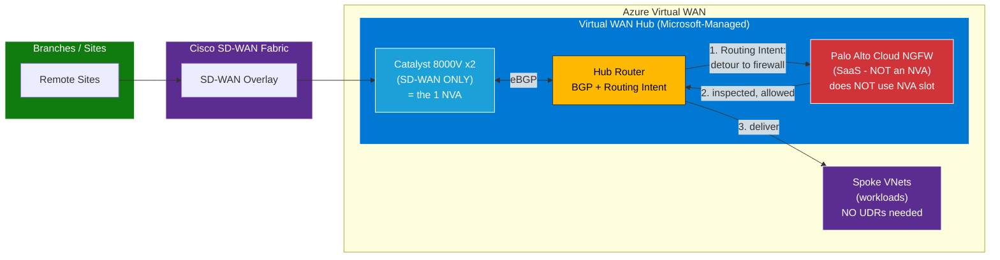
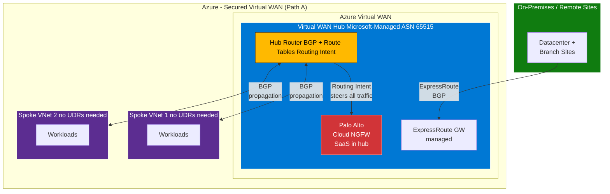
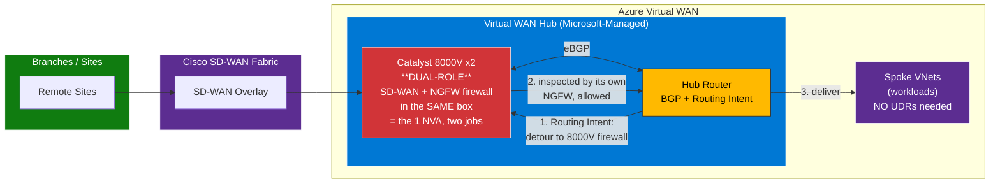
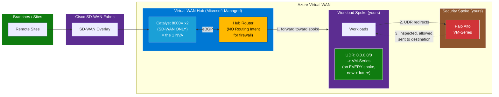
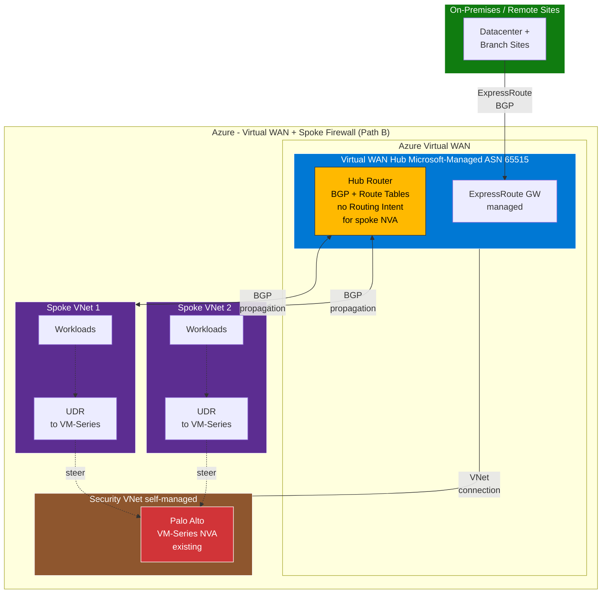
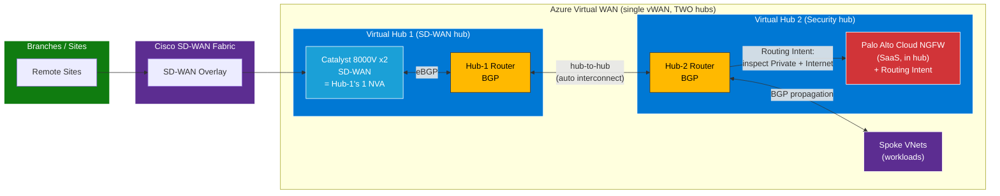

**Diagram 1 — Path A: Cisco 8000V (SD-WAN) + Cloud NGFW (SaaS) in the hub**

>Why it works: Cloud NGFW is SaaS, not an NVA — so it doesn't consume the hub's single NVA slot, leaving it free for the 8000V. Routing Intent steers traffic to Cloud NGFW inside the hub → no spoke UDRs.

***Target State, Path A (Cloud NGFW SaaS integrated in hub)***

---

**Diagram 2 — Path A: Cisco 8000V with its OWN firewall capability (dual-role)**

>Why it works: The same 8000V does both SD-WAN and firewalling (its own NGFW capability) — one NVA, two roles — so it satisfies the one-NVA-per-hub rule. Routing Intent steers traffic to the 8000V's firewall role inside the hub → no spoke UDRs. (No Palo Alto here — Cisco does the firewalling.)

---
**Diagram 3 — Path B: Cisco 8000V (SD-WAN) in hub + Palo Alto VM-Series in its own spoke**

>Why it works: The 8000V (SD-WAN) takes the hub's single NVA slot; the VM-Series lives in a separate spoke, so there's no second-NVA conflict. But Routing Intent can't reach a spoke firewall, so traffic is steered via UDRs on every spoke → the "1 or 50" maintenance burden.

***Target State, Path B (VM-Series in attached VNet)***

---

# Cisco SD-WAN (Catalyst 8000V) + Firewall — Quick Comparison of the 3 Options

## Comparison Table

| | **Diagram 1** | **Diagram 2** | **Diagram 3** |
|---|---|---|---|
| **Design** | Path A | Path A | Path B |
| **The 1 NVA in hub** | 8000V (SD-WAN only) | 8000V (**dual-role**) | 8000V (SD-WAN only) |
| **Firewall** | Cloud NGFW (SaaS, in hub) | 8000V's own NGFW (in hub) | VM-Series (in a spoke) |
| **Steering** | Routing Intent | Routing Intent | UDRs on spokes |
| **Spoke UDRs?** | ❌ None | ❌ None | ✅ Every spoke |
| **Keeps Palo Alto?** | ✅ (Cloud NGFW) | ❌ (Cisco firewalling) | ✅ (exact VM-Series) |
| **Why no NVA conflict** | SaaS ≠ NVA slot | One NVA, two roles | Firewall is in a spoke |

---

## Diagram 1 — Path A: 8000V (SD-WAN) + Cloud NGFW (SaaS in hub)

**In one line:** Keep Palo Alto (as a managed SaaS firewall) *and* get clean, automatic Routing Intent.

### ✅ Pros
- **Routing Intent works** → centralized, automatic steering; **no per-spoke UDRs**.
- **New spokes auto-inspected** → zero manual routing per new spoke (no "1 or 50" burden).
- **Keeps Palo Alto** (security team stays on a Palo Alto product).
- **SaaS = less to manage** → no firewall VM patching, scaling, or HA to own (Palo Alto/Microsoft manage it).
- **Cleanest hub model** → traffic inspected **at the hub, before spokes**.
- **Traffic symmetry handled automatically** by Routing Intent.

### ❌ Cons
- **Different Palo Alto product** than today's VM-Series → new licensing/procurement and config migration.
- **Less low-level control** vs a self-managed VM-Series (SaaS abstracts some knobs).
- **Co-existence caveat** → 8000V (NVA) + Cloud NGFW + Routing Intent in the same hub must be **validated** against current vWAN/Cisco/PA docs.
- **Cost model differs** (SaaS consumption-based) → re-baseline cost vs existing VM-Series.

---

## Diagram 2 — Path A: 8000V Dual-Role (SD-WAN + its own NGFW)

**In one line:** Simplest single-vendor hub — one Cisco box does both jobs — *if* Cisco firewalling is acceptable.

### ✅ Pros
- **Simplest architecture** → one NVA, one vendor, fewest moving parts.
- **Routing Intent works** → no per-spoke UDRs; new spokes auto-inspected.
- **No extra firewall product** to buy/deploy → potentially lowest cost & complexity.
- **Single vendor (Cisco)** → one support contract, one skill set, unified ops.
- **Traffic symmetry handled automatically** by Routing Intent.

### ❌ Cons
- **Drops Palo Alto entirely** → security team must accept **Cisco firewalling**.
- **Cisco NGFW depth may be < Palo Alto** → threat prevention/app-ID/URL filtering typically less mature than a dedicated NGFW.
- **Resource contention** → the same 8000V now does **routing + inspection**; size/scale carefully (CPU/throughput).
- **Concentrated blast radius** → one appliance is both connectivity *and* security (a failure hits both).
- **Governance shift** → networking + security collapse onto one team/box (may not fit org separation-of-duties).

---

## Diagram 3 — Path B: 8000V (SD-WAN) + Palo Alto VM-Series in its own spoke

**In one line:** Reuse the exact existing VM-Series — but you inherit the manual UDR model and its risks.

### ✅ Pros
- **Reuses the exact VM-Series** → no firewall product change; existing config/policies/licensing carry over.
- **Full control** over the firewall VM (all knobs, versions, tuning).
- **No NVA conflict** → VM-Series in a spoke leaves the hub's NVA slot free for the 8000V.
- **Familiar to the security team** → same product, same operations as today.
- **Strong vendor separation** → Cisco = connectivity, Palo Alto = security (clean ownership split).

### ❌ Cons
- **No Routing Intent for the firewall** → back to **manual UDRs on every spoke**.
- **The "1 or 50" burden** → every **new** spoke needs UDRs configured manually (ongoing tax).
- **Firewall-bypass risk** ⚠️ → a missing/more-specific route silently skips inspection.
- **Traffic symmetry is YOUR job** → asymmetric routing can drop sessions / miss inspection.
- **You own HA & scaling** → load balancing, failover, patching, sizing all self-managed.
- **More operational overhead** → most moving parts of the three options.

---

## 30-Second Decision Cheat

- **Want Palo Alto + simplest ops + no UDRs?** → **Diagram 1 (Cloud NGFW)**.
- **OK dropping Palo Alto for simplest single-vendor hub?** → **Diagram 2 (Dual-role 8000V)**.
- **Must reuse the exact existing VM-Series?** → **Diagram 3 (Path B)** — accept the UDR burden & symmetry risk.

---

### What to confirm?

- [ ] Is **Cisco firewalling on the 8000V** acceptable (enables Design A), or is **Palo Alto** mandatory (Design B or C)?
- [ ] Exact **8000V deployment model** (in-hub vs attached NVA VNet) per the current Cloud OnRamp release.
- [ ] **One hub or two per region** — and whether vendor separation (Design C) is needed.
- [ ] **Tenant/subscription layout** — confirm all spokes share one Entra tenant; map RBAC for cross-subscription attachment.
- [ ] **Existing SD-WAN overlay** details (SD-WAN Manager/vManage version, IOS XE release, HA expectations).

---

**Optional/additional aproach**
***Two-Hub Architecture (8000V in Hub-1 + Cloud NGFW in Hub-2)***

### Design C (Two-Hub) — Trade-offs to Flag for the Call

| Consideration | Note |
|---|---|
| **Cost** | Two hubs = **more cost** than one (each hub bills separately) |
| **Hub-to-hub bandwidth** | There's a **bandwidth ceiling** (~50 Gbps) and **inter-hub egress charges** between hubs |
| **Complexity** | More moving parts than a single dual-role hub (Design A) |
| **When it's worth it** | Only when **vendor separation** + **both vendors hub-integrated** is a hard requirement |

> **In one line:** Design C is the "have your cake and eat it too" option — both Cisco SD-WAN *and* Palo Alto Cloud NGFW, each hub-integrated — but you pay for it with **two hubs** (extra cost + inter-hub bandwidth/latency considerations).

---
