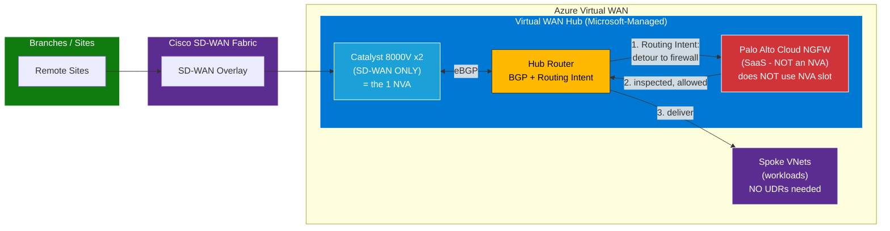
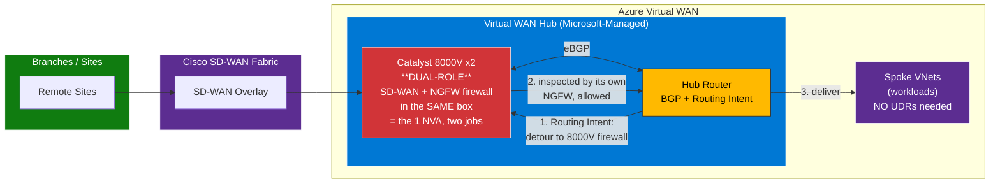
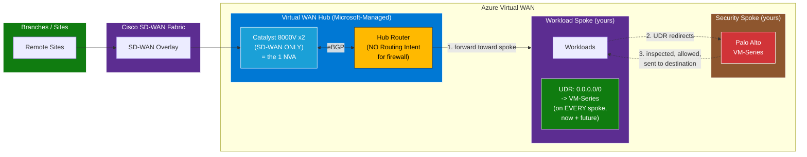

***Diagram 1 — Path A: Cisco 8000V (SD-WAN) + Cloud NGFW (SaaS) in the hub***

>Why it works: Cloud NGFW is SaaS, not an NVA — so it doesn't consume the hub's single NVA slot, leaving it free for the 8000V. Routing Intent steers traffic to Cloud NGFW inside the hub → no spoke UDRs.

---

***Diagram 2 — Path A: Cisco 8000V with its OWN firewall capability (dual-role)***

>Why it works: The same 8000V does both SD-WAN and firewalling (its own NGFW capability) — one NVA, two roles — so it satisfies the one-NVA-per-hub rule. Routing Intent steers traffic to the 8000V's firewall role inside the hub → no spoke UDRs. (No Palo Alto here — Cisco does the firewalling.)

---
***Diagram 3 — Path B: Cisco 8000V (SD-WAN) in hub + Palo Alto VM-Series in its own spoke***

>Why it works: The 8000V (SD-WAN) takes the hub's single NVA slot; the VM-Series lives in a separate spoke, so there's no second-NVA conflict. But Routing Intent can't reach a spoke firewall, so traffic is steered via UDRs on every spoke → the "1 or 50" maintenance burden.
---

# Cisco SD-WAN (Catalyst 8000V) + Firewall — Quick Comparison of the 3 Options

| | **Diagram 1** | **Diagram 2** | **Diagram 3** |
|---|---|---|---|
| **Design** | Path A | Path A | Path B |
| **The 1 NVA in hub** | 8000V (SD-WAN only) | 8000V (**dual-role**) | 8000V (SD-WAN only) |
| **Firewall** | Cloud NGFW (SaaS, in hub) | 8000V's own NGFW (in hub) | VM-Series (in a spoke) |
| **Steering** | Routing Intent | Routing Intent | UDRs on spokes |
| **Spoke UDRs?** | ❌ None | ❌ None | ✅ Every spoke |
| **Keeps Palo Alto?** | ✅ (Cloud NGFW) | ❌ (Cisco firewalling) | ✅ (exact VM-Series) |
| **Why no NVA conflict** | SaaS ≠ NVA slot | One NVA, two roles | Firewall is in a spoke |

---
